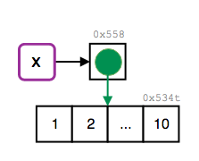
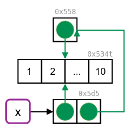
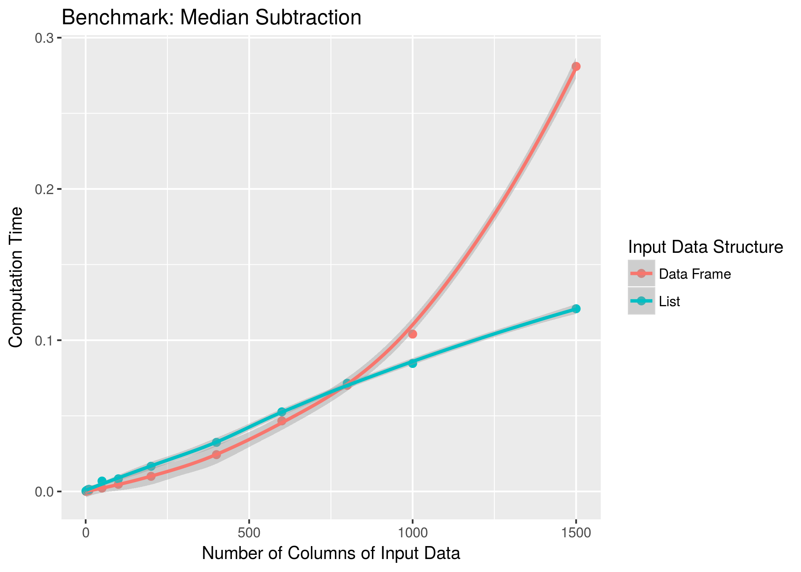

A companion to [Advanced R](https://adv-r.hadley.nz/rcpp.html#acknowledgments) and supplement to [Advanced R Solutions](https://advanced-r-solutions.rbind.io/names-and-values.html#copy-on-modify). 

Writing up solutions for those missing or incomplete within the solutions manual. __Maybe with time and collaboration we can even [submit our answers as a PR](https://github.com/Tazinho/Advanced-R-Solutions)!__

:::question
Solutions in a question box are solved in the manual and copied over here in an effort to edit and clarify.

Otherwise we've copied over questions from the solutions manual that have been marked as `started` __[and have an orange A]{.started}__ in an effort to complete them, and we will be attempting ot answer questions that have been unanswered entirely.
:::

```{r, echo=FALSE}
htmltools::img(src = knitr::image_uri("r4ds.png"), 
               alt = 'logo', 
               style = 'position:absolute; top:0; 
                        right:0;
                        padding:0;
                        width: 15%;
               height 15%')
```

# Names and Values

## Copy-on-modify

:::question
Either I'm not understanding or I think the numbers on the pictures and arrows may be wrong - can we go over this either way? 

4. __[Q]{.Q}__: What happens when you run this code:

    ```{r}
    x <- list(1:10)
    x[[2]] <- x
    ```
    
    <!-- I think I actually meant to say `x[[2]] <- x[[1]]` to make the problem slightly less complicated -->
    
   Draw a picture.

   __[A]{.solved}__: The initial reference tree of `x` shows, that the name `x` binds to a list object. This object contains a reference to the integer vector `1:10`.

    ```{r, eval=FALSE}
    x <- list(1:10)
    ref(x)
    #> █ [1:0x55853b74ff40] <list> 
    #> └─[2:0x534t3abffad8] <int> 
    ```

    ```{r, echo = FALSE}
    
    ```

   When `x` is assigned to an element of itself copy-on-modify takes place and the list is copied to a new address in memory.

    ```{r, eval=FALSE}
    tracemem(x)
    x[[2]] <- x
    #> tracemem[0x55853b74ff40 -> 0x5d553bacdcd8]:
    ```

   The list object previously bound to `x` is now referenced in the newly created list object. It is no longer bound to a name. The integer vector is referenced twice.

    ```{r, eval=FALSE}
    ref(x)
    #> █ [1:0x5d553bacdcd8] <list> 
    #> ├─[2:0x534t3abffad8] <int> 
    #> └─█ [3:0x55853b74ff40] <list> 
    #>   └─[2:0x534t3abffad8] 
    ```

    ```{r, echo = FALSE}
    
    ```

    <!-- The image size doesn't look right -->    
    <!-- The arrow pointing to 0x558 is pointing upwards instead of leftwards -->
:::


## Modify-in-place

:::question
2. __[Q]{.Q}__: Wrap the two methods for subtracting medians into two functions, then use the bench package to carefully compare their speeds. How does performance change as the number of columns increase?
    
   __[A]{.solved}__: First, let's define a function to create some random data and a function to subtract the median from each column.

    ```{r}
    create_random_df <- function(nrow, ncol) {
      random_matrix <- matrix(runif(nrow * ncol), nrow = nrow)
      as.data.frame(random_matrix)
    }
    
    subtract_medians <- function(x, medians){
      for (i in seq_along(medians)) {
        x[[i]] <- x[[i]] - medians[[i]]
      }
      x
    }
    
    subtract_medians_l <- function(x, medians){
      x <- as.list(x)
      x <- subtract_medians(x, medians)
      as.data.frame(x)
    }
    ```

    <!-- Need to update text and code to use subtract_medians_2 -->
  
   We can then profile the performance, by benchmarking `subtact_medians()` on data frame- and list-input for a specified number of columns. The functions should both input and output a data frame, so one is going to do a bit more work.

    ```{r}
    compare_speed <- function(ncol){
      df_input   <- create_random_df(nrow = 1e4, ncol = ncol)
      medians <- vapply(df_input, median, numeric(1))
      
      bench::mark(`Data Frame` = subtract_medians(df_input,   medians),
                  List = as.data.frame(subtract_medians(as.list(df_input), medians)))
    }
    ```

   Then bench package allows us to run our benchmark across a grid of parameters easily. We will use it to slowly increase the number of columns containing random data.

    ```{r, warning=FALSE, message=FALSE, eval=FALSE}
    results <- bench::press(
      ncol = c(1, 5, 10, 50, 100, 200, 400, 600, 800, 1000, 1500),
      compare_speed(ncol)
    )
    
    library(ggplot2)
    ggplot(results, aes(ncol, median, col = expression)) +
      geom_point(size = 2) + 
      geom_smooth() +
      labs(x = "Number of Columns of Input Data", y = "Computation Time",
           color = "Input Data Structure",
           title = "Benchmark: Median Subtraction")
    ```

    ```{r, echo = FALSE}
    
    ```

   When working directly with the data frame, the execution time grows quadratically with the number of columns in the input data. This is because (e.g.) the first column must be copied `n` times, the second column `n-1` times, and so on. When working with a list, the execution time increases only linearly.
   
   Obviously in the long run, linear growth creates shorter run-times, but there is some cost to this strategy - we have to convert between data structures with `as.list()` and `as.data.frame()`. This means that the improved approach doesn't pay off until we get to a data frame that's ~800 columns wide.

:::

# Functions

## Function fundamentals
  
1. __[Q]{.Q}__: Given a name, like `"mean"`, `match.fun()` lets you find a function. Given a function, can you find its name? Why doesn't that make sense in R?

    __[A]{.started}__: A name can only point to a single object, but an object can be pointed to by 0, 1, or many names. What are names of the functions in the following block?

    ```{r}
  function(x) sd(x) / mean(x)
    
  f1 <- function(x) (x - min(x)) / (max(x) - min(x))
  f2 <- f1
  f3 <- f1
    ```


## `...`  (dot-dot-dot)

3. __[Q]{.Q}__: How does the `chdir` parameter of `source()` compare to `in_dir()`? Why might you prefer one approach to the other?

    The `in_dir()` approach was given in the book as
    ```{r, eval = FALSE}
    in_dir <- function(dir, code) {
      old <- setwd(dir)
      on.exit(setwd(old))
      
      force(code)
    }
    ```
    
   __[A]{.started}__:`in_dir()` takes a path to a working directory as an argument. First the working directory is changed accordingly. `on.exit()` ensures that the modification to the working directory are reset to the initial value when the function exits.
    
   In `source()` the `chdir` argument specifies if the working directory should be changed during the evaluation of the `file` argument (which in this case has to be a pathname). 
   
<!-- HW: I think I'm more intersted in supplying a path vs. a logical value here -->

## Function forms

3. __[Q]{.Q}__: Explain why the following code fails:
    ```{r, eval = FALSE}
    modify(get("x"), 1) <- 10
    #> Error: target of assignment expands to non-language object
    ```
    
   __[A]{.started}__: First, let's define `x` and recall the definition of `modify()` from the textbook:
    
    ```{r}
    x <- 1:3
    
    `modify<-` <- function(x, position, value) {
      x[position] <- value
      x
    }
    ```

