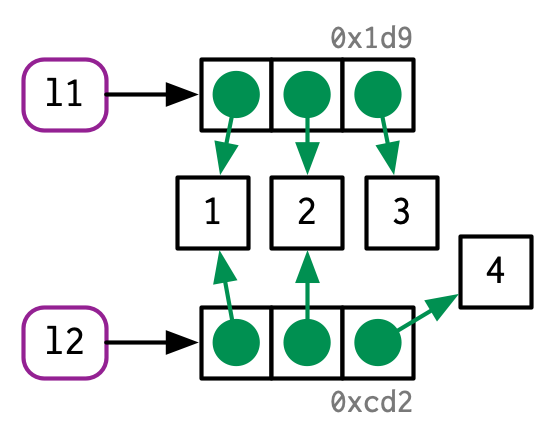
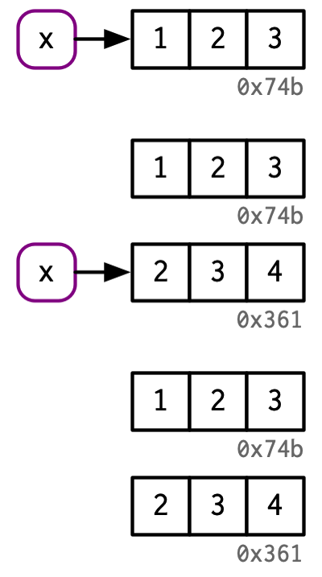

```{r xaringan-themer, include = FALSE}
library(xaringanthemer)
style_mono_light(
  base_color = "#3092FF",
  header_font_google = google_font("Josefin Sans"),
  text_font_google   = google_font("Montserrat", "300", "300i"),
  code_font_google   = google_font("Droid Mono"),
)
```


# Outline

- The distinction between names and values

- When R makes a copy, and how to track them

- How much memory an object **actually** occupies

- Exceptions to copy-on-modify

- The garbage collector

**Prerequisites**

The **lobstr** package is used to understand the internal representation of R objects.

```{r eval=TRUE, tidy=FALSE}
library(lobstr)
```

---


## Binding basics 


Consider this simple example, what is happening?

```{r}
x <- c(1, 2, 3)
```

Are we creating x and it has values 1,2,3?


--

Not really, it’s more accurate to say that this code is:

- Creating an object, a vector of values, c(1, 2, 3)
- **binding that object to a name, x**

```{r echo = F, fig.retina = 3}
knitr::include_graphics("binding-1.png")
```

---

## Binding basics cont.

In fact, you can think of a name as a reference to a value. 

For example, in the following code, we don't copy of the vector c(1, 2, 3), we get another binding to the existing object:

```{r}
y <- x
```

We can use `lobstr::obj_addr()` to see these object's identifiers:

.pull-left[
```{r}
obj_addr(x)
obj_addr(y)
```
]
.pull-right[
```{r echo = F, fig.retina = 3 }
knitr::include_graphics("binding-2.png")
```
]

---

## Copy-on-modify

What happens to `x` when we modify `y` ?

```{r}
y[[3]] <- 4
```


--


```{r}
x
```

Changing `y` did not modify `x`.

This is due to a behavior called **copy-on-modify**. 

.pull-left[
```{r}
obj_addr(x)
obj_addr(y)
```
]
.pull-right[
```{r echo = F, fig.retina = 3 }
knitr::include_graphics("binding-3.png")
```
]
---
## Copy-on-modify cont.

We can use `tracemem()` to track when an object gets copied. It does so by printing the address of the object every time it is copied.

```{r}
x <- c(1, 2, 3)
cat(tracemem(x), "\n")
```

```{r}
y <- x
y[[3]] <- 4L
```

If we modify `y` again, we will not make another copy. That’s because the new object now only has a single name bound to it, `y`, so R applies modify-in-place optimisation.
```{r}
y[[3]] <- 5L

untracemem(x)
```

`untracemem()` is the opposite of tracemem(); it turns tracing off.
---
## Copy-on-modify: Lists

It’s not just names that point to values; **elements** of lists do too. 

Consider this list, which is appears similar to the vector above. 

```{r}
l1 <- list(1, 2, 3)
```

This list is more complex because instead of storing the values itself, it stores references to them.

```{r echo = F, fig.retina = 3 }
knitr::include_graphics("list.png")
```

--

This is particularly important when we modify a list:
.pull-left[
```{r}
l2 <- l1
```
]
.pull-right[
```{r echo = F, fig.retina = 4 }
knitr::include_graphics("l-modify-1.png")
```
]
---
## Copy-on-modify: Lists cont.

When modifications are made, the list object and its bindings are copied, but **the values pointed to by the bindings are not**.
.pull-left[
```{r}
l2[[3]] <- 4
```
]
.pull-right[
```{r echo = F, fig.retina = 5 }

```
]


To see values' addresses that are shared across lists, use lobstr::ref().
```{r}
ref(l1, l2)
```


---
## Copy-on-modify: Data Frames
Data frames are lists of vectors, so copy-on-modify has important consequences.

```{r}
d1 <- data.frame(x = c(1, 5, 6),
                 y = c(2, 4, 3))
```


```{r echo = F, fig.retina = 3 }
knitr::include_graphics("dataframe.png")
```


---
## Copy-on-modify: Data Frames

Data frames are lists of vectors, so copy-on-modify has important consequences.

If we modify a column, only that column needs to be modified; the others will still point to their original references:

.pull-left[
```{r, eval=FALSE}
d2 <- d1
d2[, 2] <- d2[, 2] * 2
```
]
.pull-right[
```{r echo = F, fig.retina = 3 }
knitr::include_graphics("d-modify-c.png")
```
]


---

## Copy-on-modify: Data Frames

Data frames are lists of vectors, so copy-on-modify has important consequences.

If we modify a row, every column is modified, which means every column must be copied:

.pull-left[
```{r, eval=FALSE}
d3 <- d1
d3[1, ] <- d3[1, ] * 3
```
]
.pull-right[
```{r echo = F, fig.retina = 3 }
knitr::include_graphics("d-modify-r.png")
```
]


---


## Copy-on-modify: Character Vectors

R actually uses a **global string pool** where each element of a character vector is a pointer to a *unique string* in the pool:
```{r}
x <- c("a", "a", "abc", "d")
ref(x, character = T)
```

This has implications for how much memory a character vector uses. To find out, we use `lobstr::obj_size()`.

.pull-left[
```{r}
obj_size(x)
obj_size("d")
```
]
.pull-right[
```{r}
x<-c(x,"d")
obj_size(x)
```
]

---
# obj_size $\neq$ object.size

When checking object size, `lobstr::obj_size()` will provide a more accurate result.

This is commented on in the documentation for `utils::object.size()`

> "...it should be reasonably accurate for atomic vectors, 
> but does not detect if elements of a list are shared."
>
> `r tufte::quote_footer('--- ?object.size')`

```{r}
y <- rep(list(runif(1e4)), 100)

```

.pull-left[
```{r}
obj_size(y)
```
]
.pull-right[
```{r}
object.size(y)
```
]

---
## Modify-in-place

Modyfing an R object **usually** creates a copy. The exceptions are:


- objects with a **single** binding (as shown earlier)


- **Environments**, a special type of object, are **always** modified in place

Implication: we can create functions that “remember” their previous state.

.left-code-wide[
```{r, eval=FALSE}
e1 <- rlang::env(a = 1, b = 2, c = 3)
e2 <- e1
```
```{r echo = F, fig.retina = 3 }
knitr::include_graphics("e-modify-1.png")
```
]
.right-code-thin[
```{r, eval=FALSE}
e1$c <- 4
```
```{r echo = F, fig.retina = 3 }
knitr::include_graphics("e-modify-2.png")
```
]


---
## Unbinding and the garbage collector

.pull-left[
```{r}
x <- 1:3
```
```{r}
x <- 2:4
```
```{r}
rm(x)
```
]
.pull-right[
```{r echo = F, fig.retina = 4 }

```
]

Objects get deleted thanks to the **garbage collector (GC)** . GC frees up memory by deleting R objects that are no longer used.
GC runs automatically whenever R needs more memory to create a new object. 

There is no reason to call `gc()` yourself  unless you *want* to:
  - ask R to return memory to your operating system so other programs can use it, or
  - to know how much memory is currently being used (use `lobstr::mem_used()`)


