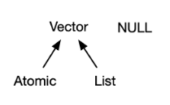
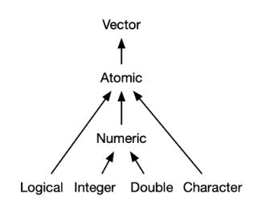
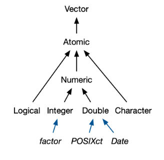
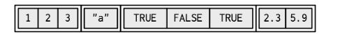
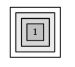
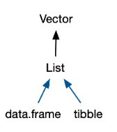

```{r xaringan-themer, include = FALSE}
library(xaringanthemer)
library(tibble)
style_mono_light(
  base_color = "#3092FF",
  header_font_google = google_font("Josefin Sans"),
  text_font_google   = google_font("Montserrat", "300", "300i"),
  code_font_google   = google_font("Droid Mono")
)
```


# Introduction

- Vectors are the most important family of data types in base R

- Vectors come in two (delicious) flavours:

.pull-left[

<center>
<b> Atomic Vectors </b>

<br/>

All elements must have the same type
</center>
]


.pull-right[

<center>
<b> Lists </b>

<br/>

elements can have different types
</center>


]


- `NULL`? - Not a vector (but closely related - serves role of generic zero length vector, but we will get to that)

```{r echo=F, include=T, eval=T, out.width='25%', fig.align="center"}

```


- Attributes (named list of arbitrary metadata). Two particularly important attributes:
  - dimension (turns vectors into matrices and arrays)
  - class (powers S3)
- factors, dates, times, data frames and tibbles are all S3 objects!


---

# Outline

- 3.2 Atomic Vectors

- 3.3 Attributes

- 3.4 S3 Atomic Vectors

- 3.5 Lists

- 3.6 Data Frames and Tibbles

- 3.7 `NULL`

---

# Atomic Vectors


.pull-left[

- Four primary types of atomic vectors:
    - logical
    - integer 
    - double
    - character

]

.pull-right[

- Two rares:
    - complex
    - raw
    
]


```{r echo=F, include=T, eval=T, out.width='25%', fig.align="center"}

```

```{r eval=F}
lgl_var <- c(TRUE, FALSE)
int_var <- c(1L, 6L, 10L)
dbl_var <- c(1, 2.5, 4.5)
chr_var <- c('these are', "some strings")
```

- 4 Atomics: all elements have the same types. `typeof()` to determine type... of.

---

# NA's, Testing and Coercion

- NA's (which R uses for missing values) are infectious.
- Test vectors of given type by using `is.*()` - for example, `is.integer()`
- For atomic vectors, need same type across the entire vector.
    - So, when combining different types, coerced in a fixed order: character -> double -> integer -> logical
    
```{r}
c(TRUE)
c(TRUE, 42L)
c(TRUE, 42L, 3.14)
c(TRUE, 42L, 3.14, "elephant")
```

---


# NA vs NULL?

- `NULL`
    - Has unique type (`NULL`)
    - Length 0
    - Can't have attributes
    - Used for representing empty vector
    - Represent absent vector (such as in a function argument)
    
- `NA`
    - `NA` indicated <i>element</i> of vector is absent
    - Confusingly, SQL `NULL` is equivalent R's `NA`

---

# Attributes

- Name-value pairs that attach metadata to an object
- Get/Set individual attributes with `attr()`, thusly:

```{r}
a <- 1:3
attr(a, "x") <- "abcdef"
attr(a, "x")
```

- Get/Set en masse with `attributes()`/`structure()`, respectively:

```{r}
a <- structure(
  1:3, 
  x = "abcdef",
  y = "why?"
)
attributes(a)
```

---

# Attributes (Generally) Ephemeral (1)

- Using the variables `a` defined in the last slide..

```{r}
attributes(a)

attributes(a[1])

attributes(sum(a))

```

---

# Attributes (Generally) Ephemeral (2)

- Only 2 attributesd routinely preserved:
    - <b>names</b>, which is itself a character vector giving each element a name
    - <b>dim</b>, which is itself an integer vector, used to turn vectors into matrices/arrays.
- To preserve other attributes, need to create your own S3 class
    
    
---

# names()

- 3 ways to name a vector:

```{r}
# When creating it: 
x <- c(a = 1, b = 2, c = 3)

# By assigning a character vector to names()
x <- 1:3
names(x) <- c("a", "b", "c")

# Inline, with setNames():
x <- setNames(1:3, c("a", "b", "c"))
```


---


# dim()

- Adding a `dim` attribute to a vector allows it to behave like a 2-dimensional <b>matrix</b> or a multi-dimensional <b>array</b>.

```{r}
# Two scalar arguments specify row and column sizes
a <- matrix(1:6, nrow = 2, ncol = 3)
dim(a)

b <- array(1:12, c(2, 3, 2))
dim(b)

c <- 1:6
dim(c) <- c(3,2)
```

- A vector without a `dim` attribute set is often thought of as 1-dimensional, but actually has `NULL` dimensions.
- You also can have matrices with a single row or single column, or arrays with a single dimension.

---

# S3 Atomic Vectors

- Having a class attribute turns an object into an S3 object
- Means it will behave differently from regular vector when passed into <b>generic</b> function
- 4 important S3 vectors in base R
    - factor
    - Date
    - POSIXct
    - difftime
    
    
```{r echo=F, include=T, eval=T, out.width='25%', fig.align="center"}

```    
    

---

# Factors (1)

- Used to store categorical data
- Can only contained predefined values
- built on top of integer vector, with two attributes: `class` = "factor" and `levels` which define allowed values.


```{r}
x <- factor(c("a", "b", "b", "a"))
x

typeof(x)
attributes(x)
```

---

# Factors (2)

- Ordered factors - order is meaningful

```{r}
grade <- ordered(c("b", "b", "a", "c"), levels = c("c", "b", "a"))
grade
```

---

# Dates

- Built on top of double vectors
- Have `class` = "Date". No other attributes.

```{r}
the_day_this_slide_was_rendered <- Sys.Date()
the_day_this_slide_was_rendered
typeof(the_day_this_slide_was_rendered)

attributes(the_day_this_slide_was_rendered)

unclass(the_day_this_slide_was_rendered) # Days since 1970-01-01
```


---

# Date-times (1)

- Like dates, also built on double vectors
    - 2 ways: POSIXct vs POSIClt
    - We'll focus on POSIXct

```{r}
then_ct <- as.POSIXct("2018-08-01 22:00", tz = "UTC")
then_ct

typeof(then_ct) # Let's not forget, it was built on a double vector
attributes(then_ct)
```

---

# Date-timess (2)


- tzone attribute controls how date-time is formatted
- why multiple classes? 

---

# Durations

- Represent amount of time between dates/date-times
- Built on top of doubles
- Have `units` attribute to determine how integer should be interpreted


```{r}
one_week_1 <- as.difftime(1, units = "weeks")
one_week_1
attributes(one_week_1)


one_week_2 <- as.difftime(7, units = "days")
one_week_2
attributes(one_week_2)
```


---

# Lists (1)

- Each element can be any type

```{r echo=F, include=T, eval=T, out.width='50%', fig.align="center"}

```    

- Although technically, each element is the same type, because it's just a reference (Section 2.3.3)
- Because made up of references, total size may be smaller than you expect:

```{r}
lobstr::obj_size(mtcars)
l2 <- list(mtcars, mtcars, mtcars, mtcars)
lobstr::obj_size(l2)
```

---

# Lists (2)

- Recursive

```{r}
l3 <- list(list(list(1)))
```

```{r echo=F, include=T, eval=T, out.width='20%', fig.align="center"}

```    

```{r}
l4 <- list(list(1, 2), c(3, 4))
str(l4)
```


---

# Lists (3)

```{r}
l5 <- c(list(1, 2), c(3, 4)) # If given a combination of atomic vector and list, c() will coerce vectors to lists before comibining them
str(l5) #NB, it's a list, even though we called c()
l6 <- c(c(1, 2), c(3, 4))
str(l6) # Still an atomic vector...
```

- `typeof()` list is `list`.
- `is.list()` - test for list
- coerce to list with `as.list()`
- list-matrices and list-arrays exist. (Remember, we previously created arrays/matrices from atomic vectors)

---

# Data frames and tibbles

- Data frames and tibbles are lists of vectors
- They are S3 vectors (see the "class" attribute)

```{r echo=F, include=T, eval=T, out.width='20%', fig.align="center"}

```    

```{r}
df1 <- data.frame(x = 1:3, y = letters[1:3])
attributes(df1)
```


---

### Tibbles (1)

- Frustration with data frames led to tibbles
```{r}
df2 <- tibble(x = 1:3, y = letters[1:3]) # still a list of vectors
attributes(df2)
```

---

### Tibbles (2)

- Lazy and surly
- Lazy
    - Don't coerce input (which is why you need stringsAsFactors = FALSE for data frames)
    - Don't automatically convert non-syntactic names:

```{r}
names(data.frame(`1` = 1))
names(tibble(`1` = 1))
```

- tibbles do not support row names
- tibbles have a nicer print method
- subsetting: `[` always returns tibble & `$` doesn't do partial matching

---


### List Columns (1)

- Data frames support list columns, but need `I()`:

```{r}
df <- data.frame(x = 1:3)
df$y <- list(1:2, 1:3, 1:4)

data.frame(
  x = 1:3, 
  y = I(list(1:2, 1:3, 1:4))
)
```

---

### List Columns (2)

- Easier with tibbles:

```{r}
tibble(
  x = 1:3, 
  y = list(1:2, 1:3, 1:4)
)
```

- Can also have matrix / array / data frame columns


---
