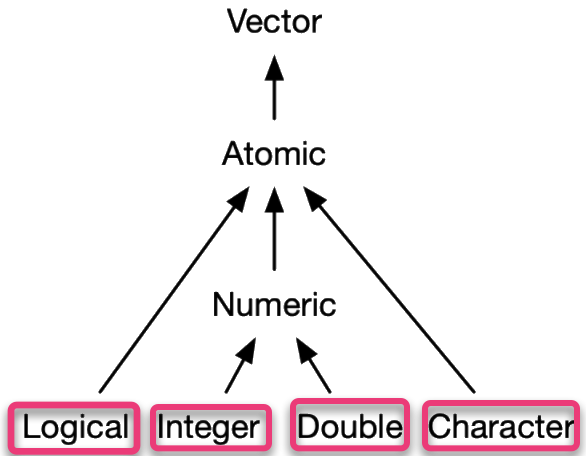
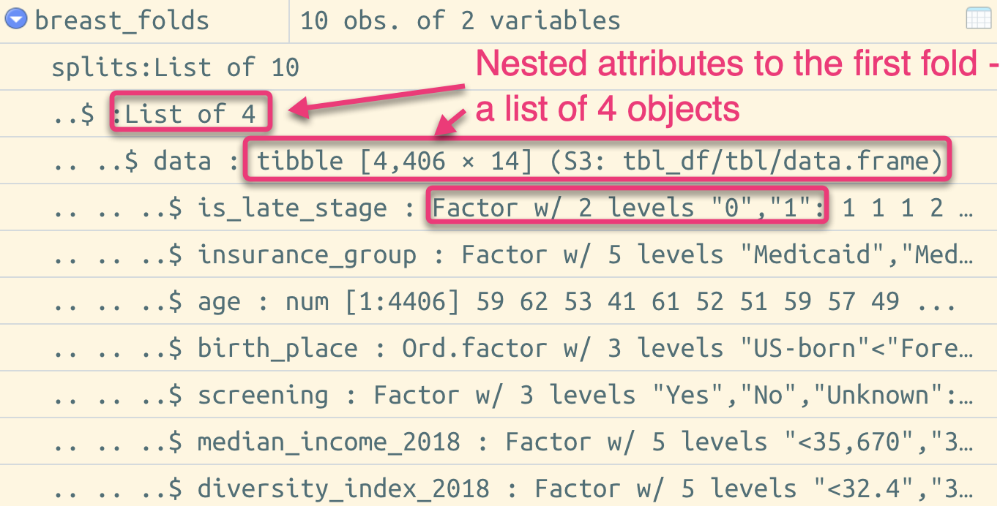

```{r setup, include=FALSE}
knitr::opts_chunk$set(echo = TRUE, eval = FALSE)
```

## Vectors

**The most important family of data types in R**


## Words to know

- *attributes*: named list of metadata
- *dimension*: an attribute that allows for vectors to be converted to matrices or arrays
- *class*: an attribute that powers the S3 object system
  - factors
  - date/times
  - data frames
  - tibbles

## Objectives

1. To understand what an atomic vector is and the main types of atomic vector
2. To understand the importance of attributes
3. To understand, at a high-level, S3 and the important vector types made by combining attributes with atomic vectors
4. To understand the difference between lists and atomic vectors
5. To understand the structure of data frames and tibbles

## Atomic Vectors
```{r, out.width="20%", eval=TRUE, echo=FALSE}

```

**What is a scalar?**

*special syntax to create a value*

* Logical - `TRUE/FALSE `
* Doubles - `0.1234` or `1.23e4` or `0xcafe`(51966) BUT also `Inf`, `-Inf` and `NaN`
* Integers - written like doubles but followed with an `L` and cannot contain fractional values, i.e. `1234L`
  * `L` notation is because 1) `i` already taken by complex numbers and 2) R's integers are 32-bit long thus the `L` shorthand makes sense (anything longer will be stored as a double).
* Strings - anything surround by `"` or `'`

## `c()`

* Used to make longer vectors
* Always creates another atomic vector

```{r c, echo = TRUE}
alphabet <- c("a", "b", "c")
one_to_five <- c(1,2,3,4,5)
lgl_vec <- c(TRUE, FALSE, TRUE)

# c() flattens
# this will also coerce types
new_vec <- c(alphabet, one_to_five)

# use typeof() to determine type of vector and length() to get its length

typeof(new_vec) # character
length(new_vec) # 8
```

## Missing values

`NA` = "Not Applicable" = how R represents missing or unknown values

⚠️ Missing values are *infectious*

```{r missing, eval= FALSE, echo=TRUE}
NA > 5 # NA
!NA
# operations with NA
10 * NA
my_vec <- c(1,5,2,7,NA,9)
mean(my_vec) # NA

```

Exceptions:

```{r, eval= FALSE, echo=TRUE}
# when NA is used with an object that already holds and identity

NA^0 # anything raised to 0 with produce 1
# logical operators trump NA
NA | TRUE

NA & FALSE
```

Detecting a missing value:

```{r}
is.na(my_vec) # returns a logical vector
# FALSE FALSE FALSE FALSE  TRUE FALSE
# to get the count of NAs
sum(is.na(my_vec))
# 1
```

## Testing & Coercion

Test to see an object's type by using `is.*` functions:  
- `is.logical()`   
- `is.integer()`  
- `is.double()`  
- `is.character()`  

Coercion = an object of one type is forced into another type by a fixed order and happens automatically


```{r}
# numeric gets coerced into char
c(5, "d")

#> [1] "5" "d"

# Useful when you have logicals: FALSE = 0, TRUE = 1

x <- c(TRUE, FALSE, TRUE, FALSE)
# count of TRUE
sum(x) # 2
# proportion of TRUE
mean(x) # 0.5
```

## Exercies

1. How do you create raw and complex scalars? (See ?raw and ?complex.)  
2. Test your knowledge of the vector coercion rules by predicting the output of the following uses of c():

```{r}
c(1, FALSE)
c("a", 1)
c(TRUE, 1L)
```

3. Why is `1 == "1"` true? Why is `-1 < FALSE` true? Why is `"one" < 2` false?  

4. Why is the default missing value, NA, a logical vector? What’s special about logical vectors? (Hint: think about `c(FALSE, NA_character_)`.)

5. Precisely what do `is.atomic()`, `is.numeric()`, and `is.vector()` test for?

## Exercies (solns)

1. How do you create raw and complex scalars? (See ?raw and ?complex.)  

> `raw()` or `as.raw()` or `charToRaw()` 
> `complex()` or `as.complex()`

2. Test your knowledge of the vector coercion rules by predicting the output of the following uses of c():

```{r}
c(1, FALSE) # c(1,0)
c("a", 1) # c("a", "1")
c(TRUE, 1L) # c(1, 1)
```

3. Why is `1 == "1"` true? Why is `-1 < FALSE` true? Why is `"one" < 2` false?  

> Because FALSE evaluates to 0 and 0>-1. Also, `char` trumps numeric in the coercion hierarchy so a string > integer. 

4. Why is the default missing value, NA, a logical vector? What’s special about logical vectors? (Hint: think about `c(FALSE, NA_character_)`.)

5. Precisely what do `is.atomic()`, `is.numeric()`, and `is.vector()` test for?

> test if x is of an atomic type


## Attributes

*Attributes* are like key-value pairs. They are the metadata to an object. For example, `$ x: int [1:3]`

```{r, out.width="30%", eval=TRUE, echo=FALSE}

```

* You can view or set the attributes of an object by using `attr()` or `attributes()`(en masse)

```r
attr(x, which, exact = FALSE)
attr(x, which) <- value
```

* They are usually lost by most operations 👻
  * Except for *names* and *dimensions*

```{r}
attr(a, "blah") <- c("one", "five", "three", "two")
str(attributes(a))
#> List of 1
#>  $ blah: chr [1:4] "one" "five" "three" "two"

a
#> [1] 1 5 3 2
#> attr(,"blah")
#> [1] "one"   "five"  "three" "two"

sum(a) # 11
attributes(sum(a)) # NULL
```

## Names

Three ways to name a vector

```{r}
#when creating it
about_me <- c(first = "layla", last = "bouzoubaa", height = 160)

#by using names() after assigning a vector
about_me <- c("layla", "bouzoubaa", 160)
names(about_me) <- c("first", "last", "height")

#with setNames()
about_me <- setNames(c("layla", "bouzoubaa", 160), c("first", "last", "height"))

# To get the names attribute
names(about_me)

# to remove names
unname(about_me) # OR
names(about_me) <- NULL
```

## Dimensions

Dimensions allow a vector to behave like a 2-dimensional matrix or multi-dimensional array.

*What is a matrix?*

>a collection of elements of the same data type (numeric, character, or logical) arranged into a fixed number of rows and columns. Since you are only working with rows and columns, a matrix is called two-dimensional. You can construct a matrix in R with the matrix() function.

*What is an array?*

>Arrays are the R data objects which can store data in more than two dimensions. For example − If we create an array of dimension (2, 3, 4) then it creates 4 rectangular matrices each with 2 rows and 3 columns. Arrays can store only similar data type.

```{r}
# Two scalar arguments specify row and column sizes
x <- matrix(1:6, nrow = 2, ncol = 3)
x
#>      [,1] [,2] [,3]
#> [1,]    1    3    5
#> [2,]    2    4    6

y <- array(1:11, c(2, 3, 2))
y
#> , , 1
#> 
#>      [,1] [,2] [,3]
#> [1,]    1    3    5
#> [2,]    2    4    6
#> 
#> , , 2
#> 
#>      [,1] [,2] [,3]
#> [1,]    7    9   11
#> [2,]    8   10   12

# You can also modify an object in place by setting dim()
dim(a) <- c(2,2)
a
#>     [,1] [,2]
#> [1,]    1    3
#> [2,]    5    2
#> attr(,"blah")
#> [1] "one"   "five"  "three" "two"  
```

## Exercises

1. How is `setNames()` implemented? How is `unname()` implemented? Read the source code.

2. What does `dim()` return when applied to a 1-dimensional vector? When might you use `NROW()` or `NCOL()`?

3. How would you describe the following three objects? What makes them different from 1:5?
```
x1 <- array(1:5, c(1, 1, 5))
x2 <- array(1:5, c(1, 5, 1))
x3 <- array(1:5, c(5, 1, 1))
```
4. An early draft used this code to illustrate structure():
```
structure(1:5, comment = "my attribute")
#> [1] 1 2 3 4 5
```
But when you print that object you don’t see the comment attribute. Why? Is the attribute missing, or is there something else special about it? (Hint: try using help.)

## Exercises (solns)

1. How is `setNames()` implemented? How is `unname()` implemented? Read the source code.  

> In both functions names() is engaged to assign the second arg to the first in the case for `setNames()` and `names(obj) <- NULL` in the case of `unname()`. 

2. What does `dim()` return when applied to a 1-dimensional vector? When might you use `NROW()` or `NCOL()`?  

> 1-dimensional vectors return NULL 
> Both are used to determine the number of rows and columns for a mattrix/df or array

3. How would you describe the following three objects? What makes them different from 1:5?  
```
x1 <- array(1:5, c(1, 1, 5)) # 1 x 1, 5 times
x2 <- array(1:5, c(1, 5, 1)) # 1, 1 x 5 matrix
x3 <- array(1:5, c(5, 1, 1)) # 1, 5 x 1 matrix
```
4. An early draft used this code to illustrate structure():
```
structure(1:5, comment = "my attribute")
#> [1] 1 2 3 4 5
```
But when you print that object you don’t see the comment attribute. Why? Is the attribute missing, or is there something else special about it? (Hint: try using help.)

## S3 Atomic Vectors

- having a *class* attribute makes an S3 object
  - these S3 objects will behave differently than regular vectors when passed to generic functions  
- Types:
  - **Factor** = leveled categorical data
  - **Date** = Dates with days
  - **Date-Times** = Dates with days and second or sub-seconds -> stored in *POSIXct* vectors  
  - **Difftimes** = Durations
  
## Factors

- Vectors that can only contain pre-defined values.  
- Useful when you know the set of possible values but they’re not all present in a given dataset

```{r}
#define a factor vector
insurance_types <- c("Married", "Single", "Unknown", "Separated", "Divorced", "Widowed", "Unmarried or Domestic Partnership")
insurance <- factor(c("Married", "Single", "Married",
                      "Divorced", "Single", "Separated"), levels = insurance_types)

attributes(insurance)
# $levels
# [1] "Married"                          
# [2] "Single"                           
# [3] "Unknown"                          
# [4] "Separated"                        
# [5] "Divorced"                         
# [6] "Widowed"                          
# [7] "Unmarried or Domestic Partnership"
# 
# $class
# [1] "factor"

# ordered factors - like regular factors but the order of levels are meaningful
age_groups <- c("less_18", "18-34", "35-65", "65+")
age <- ordered(c("18-34", "18-34", "35-65", "35-65", 
                 "less_18", "65+"), levels = age_groups)
age
# [1] 18-34   18-34   35-65   35-65   less_18 65+    
# Levels: less_18 < 18-34 < 35-65 < 65+

```

- NOTE: Many base R functions automatically convert character vectors into factors.Use `stringsAsFactors = FALSE` to supress this behavior.
- Recommended Reading:  
  - [stringAsFactors: An unauthorized biography ](http://simplystatistics.org/2015/07/24/stringsasfactors-an-unauthorized-biography/)
  - [stringsAsFactors =\<sigh>/](http://notstatschat.tumblr.com/post/124987394001/stringsasfactors-sigh)
  
## Dates/Date-times/Durations

### Dates
- Dates are built on *double* vectors and have class = "Date". No other attribute  
- The *double* is the number of days since 1970-01-01

```{r}
today <- Sys.Date()
today # "2021-03-30"

unclass(today) #18716


```
### Date-times

Two ways of storing date-time info:  

- POSIXct = calendar time  
- POSIXlt = local time  

```{r}
right_now <- as.POSIXct("2021-03-30 10:38", tz = "America/New_York")
right_now
# "2021-03-30 10:38:00 EDT"

typeof(right_now)
# [1] "double"
attributes(right_now)
# $class
# [1] "POSIXct" "POSIXt" 
# 
# $tzone
# [1] "America/New_York"
```

### Durations

- The amount of time between pairs of dates.  
- Stored as class `difftime`  

```{r}
one_week_1 <- as.difftime(1, units = "weeks")
one_week_1
#> Time difference of 1 weeks
typeof(one_week_1)
#> [1] "double"
attributes(one_week_1)
#> $class
#> [1] "difftime"
#> 
#> $units
#> [1] "weeks"
```

## Exercises

1. What sort of object does `table()` return? What is its type? What attributes does it have? How does the dimensionality change as you tabulate more variables?

2. What happens to a factor when you modify its levels?
```
f1 <- factor(letters)
levels(f1) <- rev(levels(f1))
```

3. What does this code do? How do `f2` and `f3` differ from `f1`?
```
f2 <- rev(factor(letters))

f3 <- factor(letters, levels = rev(letters))
```

## Exercises (solns)

1. What sort of object does `table()` return? What is its type? What attributes does it have? How does the dimensionality change as you tabulate more variables?

```{r}
class(table(my_vec)) # table
attributes(table(my_vec))
# $dim
# [1] 5
# 
# $dimnames
# $dimnames$my_vec
# [1] "1" "2" "5" "7" "9"
# 
# 
# $class
# [1] "table"

```


2. What happens to a factor when you modify its levels?
```
f1 <- factor(letters)
levels(f1) <- rev(levels(f1)) 
```
> reverses the factor order

3. What does this code do? How do `f2` and `f3` differ from `f1`?
```
f2 <- rev(factor(letters)) 

f3 <- factor(letters, levels = rev(letters))
```
> f2: makes the letters of the alphabet a factor in reverse order but the levels are in the right order  

> f3: the alphabet is in the right order but the levels are reversed

## Lists

- Can contain any atomic type or even other lists  
- Elements of a list are references - it does not copy

```{r}
my_list <- list(1, TRUE, 1.5, "garbage", list(2, 4, 6))
str(my_list)
# List of 5
#  $ : num 1
#  $ : logi TRUE
#  $ : num 1.5
#  $ : chr "garbage"
#  $ :List of 3
#   ..$ : num 2
#   ..$ : num 4
#   ..$ : num 6


# can contain nesting and the use of c()
my_list2 <- list(list(1, 2), c(3, 4))
str(my_list2)

# List of 2
#  $ :List of 2
#   ..$ : num 1
#   ..$ : num 2
#  $ : num [1:2] 3 4

typeof(my_list2) # list

lobstr::obj_size(my_list2) # 304 B
lobstr::obj_size(rep(my_list2, 3L)) # 336 B
```


## Data Frames & Tibbles

- S3 vectors that are built on top of lists.

> A data frame is a named list of vectors with attributes for (column) names, row.names29, and its class, “data.frame”

- CONSTRAINT: the length of each of its vectors must be the same  
- A data frame has `rownames()` and `colnames()`. The `names()` of a data frame are the column names. 
- A data frame has `nrow()` rows and `ncol()` columns. The `length()` of a data frame gives the number of columns.

```{r}
data(mtcars)
typeof(mtcars) # list

attributes(mtcars)
# $names
#  [1] "mpg"  "cyl"  "disp" "hp"   "drat" "wt"   "qsec"
#  [8] "vs"   "am"   "gear" "carb"
# 
# $row.names
#  [1] "Mazda RX4"           "Mazda RX4 Wag"      
#  [3] "Datsun 710"          "Hornet 4 Drive"     
#  [5] "Hornet Sportabout"   "Valiant"            
#  [7] "Duster 360"          "Merc 240D"          
#  [9] "Merc 230"            "Merc 280"           
# [11] "Merc 280C"           "Merc 450SE"         
# [13] "Merc 450SL"          "Merc 450SLC"        
# [15] "Cadillac Fleetwood"  "Lincoln Continental"
# [17] "Chrysler Imperial"   "Fiat 128"           
# [19] "Honda Civic"         "Toyota Corolla"     
# [21] "Toyota Corona"       "Dodge Challenger"   
# [23] "AMC Javelin"         "Camaro Z28"         
# [25] "Pontiac Firebird"    "Fiat X1-9"          
# [27] "Porsche 914-2"       "Lotus Europa"       
# [29] "Ford Pantera L"      "Ferrari Dino"       
# [31] "Maserati Bora"       "Volvo 142E"         
# 
# $class
# [1] "data.frame"

nrow(mtcars) # 32
ncol(mtcars) # 11
```
- *tibbles* were created out of frustration on how people used/designed data frames  
  - do less and complain more  
  - share the same structure as dataframes but includes an additional class: `tbl_df`  
  - default behavior: `stringsAsFactors = FALSE`  
  - discourages rownames (use `rownames_to_column()`)  
    - metadata is data  
    - poor abstraction for labelling rows  
    - row names must be unique  
  - prints prettier  
    - only show the first 10 rows and the number of cols that will fit on the screen  
    - each col is labelled with its type  
    - wide cols are truncated 
    - colors are used to highlight important information in the console  
    
## Exercises

1. Can you have a data frame with zero rows? What about zero columns?

2. What happens if you attempt to set rownames that are not unique?

3. If df is a data frame, what can you say about `t(df)`, and `t(t(df))`? Perform some experiments, making sure to try different column types.

4. What does `as.matrix()` do when applied to a data frame with columns of different types? How does it differ from `data.matrix()`?


    
## NULL
  
- Always length 0 and cannot have any attributes

```{r}
typeof(NULL)
#> [1] "NULL"

length(NULL)
#> [1] 0

x <- NULL
attr(x, "y") <- 1
#> Error in attr(x, "y") <- 1: attempt to set an attribute on NULL

#test for NULL

is.null(x) # TRUE
```

### Use Cases:

- represent an empty vector: `c()`  
- represent an absent vector  
  - NULL is often used as a default argument to a function

  

  