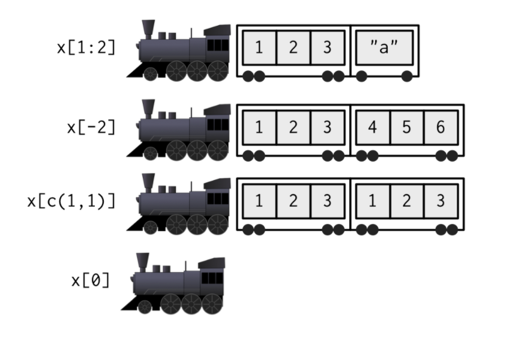

```{r setup, include=FALSE}
knitr::opts_chunk$set(include = TRUE)
```

```{r xaringan-themer, include = FALSE}
library(xaringanthemer)
library(xaringan)
library(tibble)
style_mono_light(
  base_color = "#2e78c9",  #"#3092FF",
  header_font_google = google_font("Josefin Sans"),
  text_font_google   = google_font("Montserrat", "300", "300i"),
  code_font_google   = google_font("Droid Mono")
)
```

class: middle
# Outline
  
- Section 4.1: Introduction 

- Section 4.2: Selecting multiple elements

- Section 4.3: Selecting a single element
--

- Section 4.4: Subsetting and assignment

- Section 4.5: Applications (Using subsetting to solve problems)

---
class: middle  
# Introduction 
- Interrelated concepts to internalise:
  + There are 3 subsetting operators:  `[[`, `[`, and `$`
  
  + Subsetting operators interact differently with various vector types (e.g. atomic vectors, lists, factors, matrices, and data frames)
  
  + Subsetting and assignment can be combined ("subsassignment")
  
> Subsetting complements structure, or `str()`, which shows you *all* the pieces of an object, but subsetting lets you pull out only the pieces you are interested in.
  
> Often useful to use RStudio Viewer, with `View(my_object)` to know which pieces you want to subset

---
class: center, middle, inverse
# 4.2: Selecting multiple elements

---
class: middle
# Subsetting atomic vectors
> Use `[` to select any number of elements from a vector.

--

Assume we have a simple vector: `x <- c(2.1, 4.2, 3.3, 5.4)`

```{r message=FALSE, warning=FALSE, include=FALSE}
x <- c(2.1, 4.2, 3.3, 5.4)
```

+  Positive integers return elements at the specified positions:
```{r eval=T, warning=F, message=F}
x[c(3, 1)]
```
+  Negative integers exclude elements at the specified positions:
```{r eval=T, warning=F, message=F}
x[-c(3, 1)]
```
---
class: middle
# Subsetting atomic vectors

+  Logical vectors select elements where the corresponding logical value is `TRUE`
```{r eval=T, warning=F, message=F}
x[c(TRUE, TRUE, FALSE, FALSE)]
x[x > 3]
```
>  `x[c(TRUE, FALSE)]` is equivalent to `x[c(TRUE, FALSE, TRUE, FALSE)]`

+  Nothing returns the original vector.
```{r eval=T, warning=F, message=F}
x[]
```
---
class: middle
+  Zero returns a zero-length vector.
```{r eval=T, warning=F, message=F}
x[0]
```
+ Named vector
```{r eval=T, warning=F, message=F}
(y <- setNames(x, letters[1:4]))
y[c("d", "c", "a")]
```
---
class: middle

# Subsetting lists

* Subsetting a list works in the same way as subsetting an atomic vector.
* Using `[` always returns a list

* `[[` and `$`, as described in *Section 4.3*, let you pull out elements of a list.
---
class: middle
#  Subsetting matrices and arrays

> The most common way of subsetting matrices (2D) and arrays (>2D) is a simple generalisation of 1D subsetting 

#### Subset with multiple vectors.
```{r eval=T, warning=F, message=F}
a <- matrix(1:9, nrow = 3)
colnames(a) <- c("A", "B", "C")
```
.pull-left[
```{r eval=T, warning=F, message=F}
a[1:2, ]
```
]

.pull-right[
```{r eval=T, warning=F, message=F}
a[c(TRUE, FALSE, TRUE), 
  c("B", "A")]
```
]
---
#  Subsetting matrices and arrays
Consider the matrix below:
```{r eval=T, warning=F, message=F}
(vals = matrix(1:25, ncol = 5, byrow = TRUE))
```

.pull-left[
####*Subset with a single vector*
```{r eval=T, warning=F, message=F}
vals[c(4, 15)]
```
]

.pull-right[
#### *Subset with a matrix*
```{r eval=T, warning=F, message=F}
select <- matrix(ncol = 2, byrow = TRUE, c(
  1, 1,
  3, 1,
  2, 4
))
vals[select]
```
]
---
class: middle
# Subsetting data frames and tibbles
+ Data frames have the characteristics of both lists and matrices.

+ When subsetting with a single index, they behave like lists and index the columns, so `df[1:2]` selects the first two columns.

+ When subsetting with two indices, they behave like matrices, so `df[1:3, ]` selects the first three rows (and all the columns

> Given `df <- data.frame(x = 1:3, y = 3:1, z = letters[1:3])` what is the output for:<br> 
`df[df$x == 2, ]`,<br> `df[c("x", "z")]`, <br> `df[, c("x", "z")]`,<br>  `str(df["x"])`, and <br>`str(df[, "x"])`?

---
# Preserving dimensionality

> By default, subsetting a matrix or data frame with a single number, **a single name**, or **a logical vector** containing a single `TRUE`, will simplify the returned output, i.e. it will return an object with lower dimensionality.

> To preserve the original dimensionality, you must use `drop = FALSE`

.pull-left[
####*For matrices and arrays, any <br> dimensions with length 1 will <br>be dropped:*
```{r eval=T, warning=F, message=F}
a <- matrix(1:4, nrow = 2)
str(a[1, ])
str(a[1, , drop = FALSE])
```
]

.pull-right[
####*Data frames with a single column <br> will return just that column*
```{r eval=T, warning=F, message=F}
df <- data.frame(a = 1:2, b = 1:2)
str(df[, "a"])
str(df[, "a", drop = FALSE])
```
]

---
class: middle
# 4.3: Selecting a single element
> There are two other subsetting operators: `[[` and `$`.<br> `[[` is used for extracting single items, while `x$y` is a useful shorthand for `x[["y"]]`

---
class: middle
# Use of `[[`

+ Primary use case for `[[` is when working with lists, as you get a list back.
  
  > If list x is a train carrying objects, then `x[[5]]` is the object in car `5`; `x[4:6]` is a train of cars `4-6`.— @RLangTip
  
```{r eval=T}
x <- list(1:3, "a", 4:6)
```

---
# Use of `[[`
<center>
```{r echo=F, include=T, eval=T, out.width='60%'}
knitr::include_graphics('img/train.png')
```

```{r echo=F, include=T, eval=T, out.width='60%'}
knitr::include_graphics('img/train-single.png')
```
</center>

---
# Use of `[[`
<center>
```{r echo=F, include=T, eval=T, out.width='60%'}
knitr::include_graphics('img/train.png')
```

```{r echo=F, include=T, eval=T, out.width='60%'}

```
</center>

+ If you use a vector with `[[`, it will subset recursively, i.e. `x[[c(1, 2)]]` is equivalent to `x[[1]][[2]]`.
---
class: middle
# Use of `$`

+ `$` is a shorthand operator: `x$y` is roughly equivalent to `x[["y"]]`. 
+ Often used to access variables in a data frame, as in mtcars$cyl or diamonds$carat. 
+ One common mistake with `$` is to use it when you have the name of a column stored in a variable:
> If `var <- "cyl"`, `mtcars$var` doesn't work because it is translated to `mtcars[["var"]]`. Instead use `mtcars[[var]]`

---
# Use of `$`

+ The one important difference between `$` and `[[` is that `$` does (left-to-right) partial matching.

```{r eval=T, warning=F, message=F}
x <- list(abc = 1)
x$a
x[["a"]]
```

+ You can avoid this behaviour:

```{r eval=T, warning=F, message=F}
options(warnPartialMatchDollar = TRUE)
x$a
```

> **Remember:** For data frames, you can also avoid this problem by using tibbles, which never do partial matching.

---
class: middle
# Using @ and slot()

+ Two additional subsetting operators, which are needed for S4 objects: 
  1. `@` (equivalent to `$`)
  2. `slot()` (equivalent to `[[`). 
  
> `@` is more restrictive than `$` in that it will return an error if the slot does not exist.

---
class: center
background-image:url("img/exercises.jpg")
# Exercises
<br>
# .
<br>
# .
<br>
# .
---

# 4.4: Subsetting and assignment

Subassignment: Combining subsetting operators with assignments to modify selected values in an input vector.

The basic form is `x[i] <- value`

Ensure that:

- `length(value)` == `length(x[i])`

```{r}
# wafanyikazi$new_var <- 1:10000

# Error in `$<-.data.frame`(`*tmp*`, new_var, value = 1:10000) : 
  #replacement has 10000 rows, data has 500
```

- `i` is unique

---

To remove a component, use `x[[i]] <- NULL`

```{r}
departments <- list("data", "operations", "finance")
departments

departments[[3]] <- NULL
departments
```


To add a literal NULL, use `x[i] <- list(NULL)`

```{r}
departments[3] <- list(NULL)
departments
```

---
# 4.5: Applications (Using subsetting to solve problems)

- Lookup tables (character subsetting)
--


- Matching and merging by hand (integer subsetting)
--


- Random samples and bootstraps (integer subsetting)
--


- Ordering (integer subsetting)
--


- Expanding aggregated counts (integer subsetting)
--


- Removing columns from data frames (character )
--


- Selecting rows based on a condition (logical subsetting)
--


- Boolean algebra versus sets (logical and integer )

---
##4.5.1 Lookup tables (character subsetting)
Character matching

```{r}
x <- c("m", "f", "u", "f", "f", "m", "m")

lookup <- c(m = "Male", f = "Female", u = NA)

lookup[x] ## Is this the same as saying look for x in the vector lookup? Is it also the same as using an ifelse function? 
```

We can exclude names in the results using:

```{r}
unname(lookup[x])
```

---
##4.5.2 Matching and merging by hand (integer subsetting)

```{r}
grades <- c(1, 2, 2, 3, 1)

info <- data.frame(
  grade = 3:1,
  desc = c("Excellent", "Good", "Poor"),
  fail = c(F, F, T)
)

head(info)
```

Assuming we want to duplicate the info table so that we have a row for each value in grades. 

`match(needles, haystack)` // look for (needles, haystack)
---

What is the position of the needles [grades elements : (1,2,2,3,1)] in the haystack [info$grade: (3,2,1)]


```{r}
id <- match(grades, info$grade)
id

info[id, ]
```

When matching on multiple columns, you will need to first collapse them into a single column (with e.g `interaction()`). 

```{r}
## insert intersection code here
```

But dplyr{} `*_join()` functions would be your best friends at this point
---
##4.5.3 Random samples and bootstraps (integer subsetting)

Using integer indices to randomly sample or bootstrap a vector or data frame.

Use `sample(n)` to generate a random permutation of `1:n`, and then use the results to subset the values

Simulate a dataframe

```{r}
df = data.frame(names = c("John", "Teresa", "Shel", "Christine", "Brenda"),
                gender = c("M", "F", "F", "F", "F"),
                rshp = c("Father", "Mother", "Self", "Sister", "Sister"))
df
```

---

Reorder the dataframe randomly

```{r}
df[sample(nrow(df)), ]
```

Select two random rows

```{r}
df[sample(nrow(df), 2), ]
```

Select 7 bootstrap replicates

```{r}
df[sample(nrow(df), 7, replace = T), ]
```

---
##4.5.4 Ordering (integer subsetting)

`order()` takes a vector as its input and returns an integer vector describing how to order the subsetted vector

```{r}
fam <- c("John", "Teresa", "Shel", "Christine", "Brenda")

order(fam) ## orders alphabetically (in ascending order by default)

fam[order(fam)]

## We can also order the vector in ascending order

fam[order(fam, decreasing = T)]
```

_NB: By default, any missing values will be put at the end of the vector; however, you can remove them with `na.last = NA` or put them at the front with `na.last = FALSE`._

```{r}

# us <- c("Me", "You", NA)
# us[order(us)]
# us[order(us, na.last = FALSE)]

```

---

Using `order()` to order values in a variable, or variables themselves, in a dataframe

```{r}
# Randomly reorder df
df2 <- df[sample(nrow(df)), 3:1]
df2

# Order by one variable
df[order(df$gender), ]
```
---

```{r}
# Order the variables themselves
df[, order(names(df))]
```

_You can sort vectors directly with `sort()`, or similarly `dplyr::arrange()`, to sort a data frame._
---
##4.5.5 Expanding aggregated counts (integer subsetting)

```{r}
df <- data.frame(x = c(2, 4, 1), y = c(9, 11, 6), n = c(3, 5, 1))
df
rep(1:nrow(df), df$n)
df[rep(1:nrow(df), df$n), ]
```

---
##4.5.6 Removing columns from data frames (character )

Method 1: Set individual columns to NULL

```{r}
df = data.frame(names = c("John", "Teresa", "Shel", "Christine", "Brenda"),
                gender = c("M", "F", "F", "F", "F"),
                rshp = c("Father", "Mother", "Self", "Sister", "Sister"))
df

## create a copy of the dataframe
df2 <- df

## drop a column
df2$gender <- NULL
df2
```

---

Method 2: Subset to return only the columns you want

```{r}
df[c("names", "rshp")]
```

Method 3: Use set operations to work out which columns to keep. This is useful when you only know the columns that you don't want. 

```{r}
to_keep <- setdiff(names(df), "gender")
to_keep
df[to_keep]
```

---
##4.5.7 Selecting rows based on a condition (logical subsetting)

```{r, warning=F, message=F}
library(rChambua)
head(wafanyikazi, n=3)
```
Select all juniors

```{r}
df1 <- wafanyikazi[wafanyikazi$Role == "Junior",]
head(df1, 3)
```

---

Select females who come from Nyeri county
```{r}
df2 <- wafanyikazi[wafanyikazi$Gender == "Female" & 
                     wafanyikazi$County == "Nyeri",]
head(df2, 3)
```

**De Morgan’s laws:**

- `!(X & Y)` is the same as `!X | !Y`

- `!(X | Y)` is the same as `!X & !Y`
---

##4.5.8 Boolean algebra versus sets (logical and integer )

Two types of subsetting.

- integer subsetting: (set operations)
  - Effective when you want to find the first (or last) TRUE and
  
  - You have very few TRUEs and very many FALSEs; a set representation may be faster and require less storage.

- logical subsetting: (Boolean algebra)

`which()` allows you to convert a Boolean representation to an integer representation.

```{r}
which(df$names %in% "John")
```

---

You can create a function that does the reverse i.e. converts an integer representation to a Boolean representation.

Do we really need to do this?

```{r}
unwhich <- function(x, n) {
  out <- rep_len(FALSE, n)
  out[x] <- TRUE
  out
}
unwhich(which(df$names %in% "John"), length(df$names))
```

When we can just do this?

```{r}
df$names %in% "John"
```

---

## Relationship between Boolean and set operations.

Create two logical vectors (x1 , y1) and their integer equivalents (x2, y2)
```{r}
(x1 <- 1:10 %% 2 == 0)
(x2 <- which(x1))
(y1 <- 1:10 %% 5 == 0)
(y2 <- which(y1))
```

---

### X & Y <-> intersect(x, y)
```{r}
x1 & y1
intersect(x2, y2)

```

--
### X | Y <-> union(x, y)

```{r}
x1 | y1
union(x2, y2)

```

---
### X & !Y <-> setdiff(x, y)

```{r}
x1 & !y1
setdiff(x2, y2)
```

--

### xor(X, Y) <-> setdiff(union(x, y), intersect(x, y))


```{r}
xor(x1, y1)
setdiff(union(x2, y2), intersect(x2, y2))

```

---
# Exercises

* How would you randomly permute the columns of a data frame? (This is an important technique in random forests.) Can you simultaneously permute the rows and columns in one step?

--

```{r}
# Read in the data
df <- rChambua::wafanyikazi
head(df1, n=3)
```

---

```{r}
# Permutate columns
df1 <- df[,sample(names(df))]
head(df1, n=3)
```

--
```{r}
# Permutate rows and columns
df2 <- df[sample(nrow(df)),sample(names(df))]
head(df2, n=3)
```

---

* How would you select a random sample of m rows from a data frame? What if the sample had to be contiguous (i.e., with an initial row, a final row, and every row in between)?

--

```{r}
# Generate a vector of the first and last row ids
first_last_ids <- c(1,nrow(df))
first_last_ids
```

--
```{r}
# Sample m (2) rows from the dataframe, excluding the first and last rows
original_ids <- 1:nrow(df)

other_ids <- sample(original_ids[!original_ids %in% first_last_ids] , 2)
other_ids
```

--
```{r}
# Combine the first, last and the rows in between
final_ids <- c(first_last_ids[1], other_ids, first_last_ids[2])
final_ids
```

---
```{r}
# Call the data, with only these specific rows
df3 <- df[final_ids,]
df3
```

---

* How could you put the columns in a data frame in alphabetical order?

--

```{r}
df4 <- df[,order(names(df))]
head(df4)
  
```

---

# Discussion

```{r, out.width='70%', fig.align='center', fig.cap='...', echo=FALSE}

```
