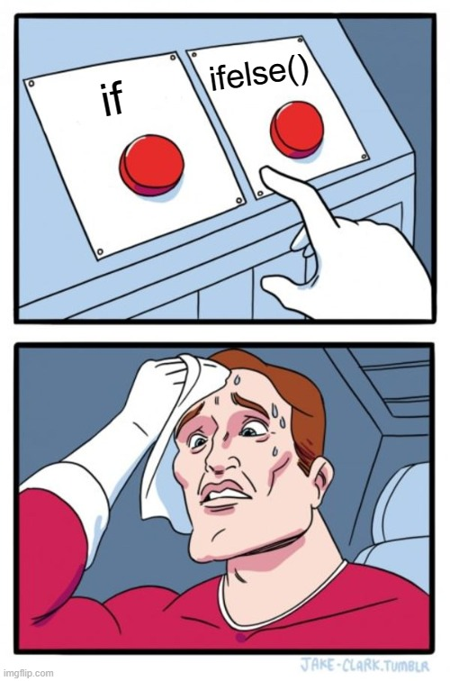
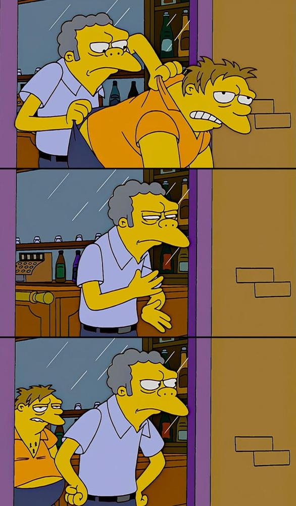

class: inverse, center, middle

# Overview

*"I came to acquaint you with a matter."* (As You Like It)

---
# What is control flow?

This chapter is about creating paths in your code so it will run, stop, repeat or use relevant values based on the key commands and structure. 

The primary tools
* CHOICES: Different code is run depending on input (`if`, `ifelse`, `switch`)
* LOOPS: Code is run repeatedly, often with changing options (`for`, `while`)

---
class: inverse, center, middle

# Choices
## if, ifelse, switch

*"All things are ready, if our minds be so."* (Henry V)

---
```{r, eval=TRUE, echo=FALSE, out.width = "400px", fig.align="center"}

```

---
# if statements

```{r, eval=FALSE}
if (condition) true_action

if (condition) true_action else false_action

if (condition_a) {
  true_action_a 
  } else if (condition_b) {
  true_action_b
  } else {false_action}
```
---
# Working example

```{r}
what_is_music <- function(music) {
  if (music == "the food of love") {
    "Play on!"
  } else {
    "That's enough actually."
  }
}

music <- "the drink of love"

what_is_music(music)
 
```
---
# Things worth knowing

* You can assign the results of `if`

--

* `NULL` is returned if the condition is false and there is no `else` statement. That avoids errors when using things like `c()` or `paste()` with `if` outputs. 

--

* The condition must evaluate to `TRUE` or `FALSE`. Mainly errors will be returned if this is not the case. 

--

* A logical vector of length greater than 1 generates a warning, which is often not expected practice and means you can miss errors. Change to an error with this:

```{r, eval=FALSE}
Sys.setenv("_R_CHECK_LENGTH_1_CONDITION_" = "true")
```
---
# ifelse()

`if` only works with a single `TRUE` or `FALSE` value being returned, so use `ifelse()` for vectors!

```{r, eval=FALSE}
ifelse(condition, value_if_true, value_if_false)

```

---
# Working example

```{r}
plays <- c("King John", "King Lear", "The Tempest")

is_it_about_a_king <- function(plays) {
  ifelse(grepl("King", plays), 
         paste0(plays, " is about a king"), # if condition is true
         paste0(plays, " is not about a king")) # if condition is false
}

is_it_about_a_king(plays)

```
---
# Things worth knowing

* Missing values will be passed into the output. 

--

* Best used if the true/false outputs will be the same type, otherwise the type is hard to predict. 

--

* Another vectorised option is `dplyr::case_when()`, with similar option `data.table::fcase()` in development. These allow multiple condition-vector pairs. 

---
# switch()

This is a special type of if statement where you can be more succinct if you have values to match. 

```{r, eval=FALSE}
  switch(x,
    a = "option 1",
    b = "option 2",
    c = "option 3",
    stop("Invalid `x` value")
  )
```
---
# Working example

```{r}
play_type <- function(play) {
  switch(play,
         hamlet = "Tragedy", 
         comedy_of_errors = "Comedy", 
         henry_viii = "History",
         stop("Unknown play")
    
  )
}

play_type("comedy_of_errors")
```

---
# Things worth knowing

* The last component should always throw an error or `NULL` will be returned invisibly. 

--

* Easiest to use with character inputs - numeric is harder to use and has some undesirable behaviour when failing.
---
# Things worth knowing (ctd.)

* Outputs can fall through to the next value if it is missing, so good if you have multiple of the same value. 

```{r}
play_type <- function(play) {
  switch(play,
         macbeth = , 
         romeo_and_juliet = ,
         hamlet = "Tragedy", 
         twelfth_night = ,
         comedy_of_errors = "Comedy", 
         henry_vi_part_i = ,
         henry_viii = "History",
         stop("Unknown play")
  )
}

play_type("macbeth")
```
 
---
class: inverse, center, middle

# Loops
## for, while

*"Look you for any other issue?"* (Much Ado About Nothing)

---
```{r, eval=TRUE, echo=FALSE, out.width = "350px", fig.align="center"}

```
---
# for loops

```{r, eval=FALSE}
for (item in vector) perform_action
```
--
###Working example: 

```{r}
for (play in plays) print(play)
```
---
# Things worth knowing

* `for` assigns the item to the current environment, overwriting any existing variable with the same name.

--

* Terminate a loop early with `next` (to move straight to the next iteration) or `break` (to exit the for loop entirely).

--

* Preallocate the output container if you're generating data to avoid unnecessary slowness. 

---
# Things worth knowing (ctd.)

* Iterating over `1:length(x)` will fail strangely if `length(x) == 0` because `:` can relate to decreasing sequences. Use `seq_along(x)` instead. It always returns a value the same length as `x`.

--

* Loops strip attributes so be careful with s3 vectors (e.g. dates, factors, durations) - call the element you want with `[[`. 

```{r}
xs <- as.Date(c("2020-01-01", "2010-01-01"))
for (x in xs) {
  print(x)
}

for (i in seq_along(xs)) {
  print(xs[[i]])
}

```

---
# Other loop tools

* `while(condition) action`: performs action while condition is TRUE.

* `repeat(action)`: repeats action forever (i.e. until it encounters break).

These are more flexible than for loops, but it is good practice to use the least flexible tool for your use case. 

We will cover `map()` and `apply()` in Chapter 9, which are good alternatives to writing for loops. 
---
class: inverse, center, middle

# Exercises

*"The rich advantage of good exercise."* (King John)

---
# Introduction quiz

What is the difference between `if` and `ifelse()`?

---
# Introduction quiz

In the following code, what will the value of `y` be if `x` is `TRUE`? What if `x` is `FALSE`? What if `x` is `NA`?

```{r eval=FALSE, tidy=FALSE}
y <- if (x) 3
```

---
# Introduction quiz

What does `switch("x", x = , y = 2, z = 3)` return?

---
# Choices exercises

What type of vector does each of the following calls to ifelse() return?

```{r, eval=FALSE}
ifelse(TRUE, 1, "no")
ifelse(FALSE, 1, "no")
ifelse(NA, 1, "no")
```
Read the documentation and write down the rules in your own words.

---
# Choices exercises

Why does the following code work?

```{r}
x <- 1:10
if (length(x)) "not empty" else "empty"

x <- numeric()
if (length(x)) "not empty" else "empty"
```
---
# Loops exercises

Why does this code succeed without errors or warnings?

```{r}
x <- numeric()
out <- vector("list", length(x))
for (i in 1:length(x)) {
  out[i] <- x[i] ^ 2
}
out
```
---
# Loops exercises

When the following code is evaluated, what can you say about the vector being iterated?
```{r}
xs <- c(1, 2, 3)
for (x in xs) {
  xs <- c(xs, x * 2)
}
xs
```

---
# Loops exercises
What does the following code tell you about when the index is updated?
```{r}
for (i in 1:3) {
  i <- i * 2
  print(i) 
}
```
---
class: inverse, center, middle

# General discussion

*"Go hence, to have more talk of these sad things."* (Romeo and Juliet)