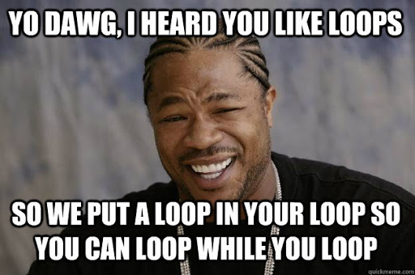
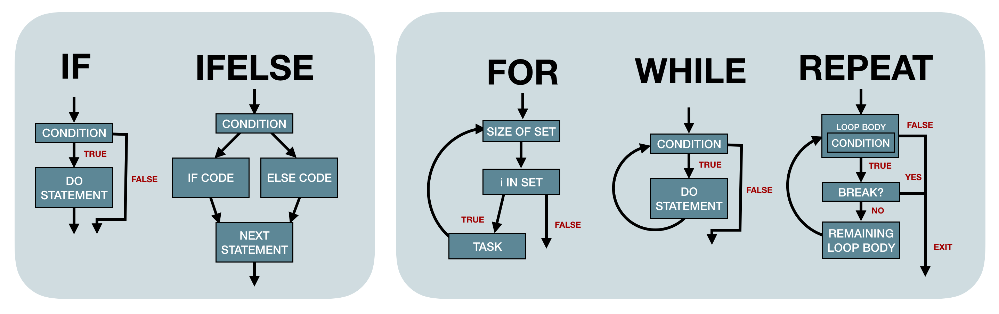

```{r xaringan-themer, include = FALSE}
# library(xaringanthemer)
xaringanthemer::style_mono_light(
  base_color = "#3092FF",
  header_font_google = xaringanthemer::google_font("Josefin Sans"),
  text_font_google   = xaringanthemer::google_font("Montserrat", "300", "300i"),
  code_font_google   = xaringanthemer::google_font("Droid Mono")
)
# library(tidyverse)
`%>%` <- dplyr::`%>%`

knitr::opts_chunk$set(
  eval = FALSE
)
```

## Overview

<!-- 5.1 Introduction -->

5.2 Choices

- `if` ... `else`
- `if` ... `else if` ... `else`
- `ifelse`
- `switch`

5.3 Loops

- `for`
- `while`
- `repeat`

<!-- --- -->

<!-- # 5.1 Introduction -->

---

## 5.2 Choices
.center[

]

```{r}
if (condition) true_action
if (contition) true_action else false_action
```

---
## 5.2 Choices (2)
.pull-left[
__Test for `N` conditions__

__(Efficient way)__
```{r}
if (condition1) {
  true_action1 
} else if(condition2) {
  true_action2 
} 
# ...
else if(conditionN) {
  true_actionN 
} else { 
  false_action
}
```
]
.pull-right[
__Test for `N` conditions__

__(don't do this, please)__
```{r}
if (condition1) {
  true_action1 
} 

if(condition2) {
  true_action2
}
# ...
if(conditionN) {
  true_actionN 
}
```
]
---
## 5.2 Choices (3)
### Example: Grades
```{r, eval = TRUE}
grade <- function(x) {
  if (x >= 90) {
    "A"
  } else if (x >= 80) {
    "B"
  } else if (x >= 70) {
    "C"
  } else {
    "F"
  }
}

grade(99)
grade(50)
```
---

## 5.2 Choices (4)

### 5.2.1 Invalid inputs
"The condition should evaluate to a **single** `TRUE` or `FALSE`".

```{r}
if ("x") 1
if (logical()) 1
if (NA) 1
```

Except, logical vectors of length > 1:
```{r}
if (c(TRUE, TRUE, FALSE)) 1
```
---

## 5.2 Choices (5)
### 5.2.2 Vectorised `if` (aka `ifelse`)

```{r, eval = TRUE}
x <- 1:5
ifelse(x %% 2 == 0, "even", "odd")
```

--
### Bonus: `dplyr::case_when`
```{r, eval = TRUE}
dplyr::case_when(
  x %% 2 == 0 ~ "even",
  x %% 2 != 0 ~ "odd"
)
```
---

## 5.2 Choices (6)
### 5.2.3 Fancy "`if`-chain" (aka `switch`)
.pull-left[
```{r}
x_option <- function(x) {
  if (x == "a") {
    "option 1"
  } else if (x == "b") {
    "option 2"
  } else if (x == "c") {
    "option 3"
  } else {
    stop("Invalid value")
  }
}
```
]

.pull-right[
```{r}
x_option <- function(x) {
  switch(x, 
         a = "option 1",
         b = "option 2",
         c = "option 3",
         stop("Invalid value"))
}
```
]

.footnote[
If multiple inputs have the same output, the RHS can be empty.
]
---

## 5.2 Choices (7)
### 5.2.4 Exercises

* What type of vector does each of the following calls to `ifelse` return?
```{r}
ifelse(TRUE, "yes", "no")
ifelse(FALSE, "yes", "no")
ifelse(NA, "yes", "no")
```

* Why does the following code work?
```{r, eval = TRUE}
x <- 1:10
if (length(x)) "not empty" else "empty"
```
--
```{r, eval = TRUE}
x <- numeric()
if (length(x)) "not empty" else "empty"
```
---

## 5.3 Loops
.center[

]

```{r}
for (item in vector) perform_action
while(condition) action
repeat(action)
```
---

## 5.3 Loops (2)
### `for` loops
```{r}
for (i in 1:3) {
  print(i)
}
```

Terminate loop:
- `next` exists current iteration
```{r}
for (i in 1:10) {
  if (i %% 2 == 0)
    next
  print(i)
}
```
--
```{r, eval = TRUE, echo = FALSE}
for (i in 1:10) {
  if (i %% 2 == 0)
    next
  print(i)
}
```
---

## 5.3 Loops (3)
Terminate loop (cont.):
- `break` exits the entire loop
```{r}
for (i in 1:10) {
  if (i %% 5 == 0)
    break
  print(i)
}
```
--
```{r, eval = TRUE, echo = FALSE}
for (i in 1:10) {
  if (i %% 5 == 0)
    break
  print(i)
}
```

---

## 5.3 Loops (4)
### 5.3.1 Common pitfalls

- Preallocate the output container (_performance_)
```{r}
means <- c(1, 50, 20)
out <- vector("list", length(means))
```

- Instead of iterating over `1:length(x)`, use `seq_along(x)`
```{r, eval = TRUE}
means <- c()
1:length(means)
seq_along(means)
```
---

## 5.3 Loops (5)
### 5.3.2 Related tools

Flexibility: `for < while < repeat`

.pull-left[
```{r, eval = T}
i <- 0
while (i < 10) {
  i <- i + 1
  if (i %% 2 == 0)
    next
  print(i)
}
```
]

.pull-right[
```{r, eval = T}
i <- 0
repeat({
  i <- i + 1
  if (i > 10) break
  if (i %% 2 == 0) next
  print(i)
})
```
]
---

## 5.3 Loops (6)
### 5.3.3 Exercises

* Why does this code succeed without errors or warnings?
```{r}
x <- numeric()
out <- vector("list", length(x))
for (i in 1:length(x)) {
  out[i] <- x[i] ^ 2
}
out
```

* When the following code is evaluated, what can you say about the vector being iterated?
```{r}
xs <- c(1, 2, 3)
for (x in xs) {
  xs <- c(xs, x * 2)
}
xs
```

---

## 5.3 Loops (7)
### 5.3.3 Exercises
* What does the following code tell you about when the index is updated?
```{r}
for (i in 1:3) {
  i <- i * 2
  print(i)
}
```
---
## Summary
.center[

]
---

## Quiz

* What is the difference between `if` and `ifelse()`?

* In the following code, what will the value of `y` be if `x` is `TRUE`? What 
if `x` is `FALSE`? What if `x` is `NA`?

```{r}
y <- if (x) 3
```

`x = TRUE`
```{r, eval = TRUE}
if (TRUE) 3
```

--

`x = FALSE`
```{r, eval = TRUE}
if (FALSE) 3
```

--

`x = NA`
```{r}
if (NA) 3
```

---
* What does `switch("x", x =, y = 2, z = 3)` return?
--
```{r, eval = TRUE}
switch("x", x =, y = 2, z = 3)
```