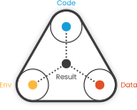

```{r xaringan-themer, include = FALSE}
library(xaringanthemer)
style_mono_light(
  base_color = "#053F61",
  header_font_google = google_font("Josefin Sans"),
  text_font_google   = google_font("Montserrat", "300", "300i"),
  code_font_family = "Fira Code",
  code_font_url = "https://cdn.jsdelivr.net/gh/tonsky/FiraCode@2/distr/fira_code.css"
)

# Add extra css styles
style_extra_css(
  css = list(
    ".small" = list("font-size" = "90%"),
    ".large" = list("font-size" = "130%"),
    ".full-width" = list(
      display = "flex",
      width = "100%",
      flex = "1 1 auto"
    )
  )
)
```

# Fundamentals

* Functions can be broken down into three components: arguments, body, and environment.

* Functions are objects, just as vectors are objects.

In R, you'll often see functions called __closures__. This name reflects the fact that R functions capture, or enclose, their environments. 

Key for understanding the dreaded:

.center[.large[`Object of type ‘closure’ is not subsettable`]]


---

# Parts of a function
.pull-left[
* `formals()` - list of arguments passed to a function
* `body()` - code of a function 
* `environment()` - the "space(s)" where a function can find values associated with names
]

.pull-right[
```{r, echo=FALSE, fig.align='center', out.height='400px'}

```

.right[https://codeocean.com/]
]

---

# Primitive functions

Primitive functions call C code directly and have `NULL` `formals()`, `body()`, and `environment()`. Only found in {base} package.

`sum()` and `[` are examples.

They have either type `builtin` or type `special`.

```{r}
typeof(sum)
typeof(`[`)
```

---

# Creating functions

* Functions are objects, like all "things" in R. 
* Name by assignment while creating, just like any other object.

```{r}
hello_bob <- function(name = "Bob") {
        paste("Hello", name)
}
```

or 

```{r}
f01 <- function(x) sin(1 / x ^ 2)
```

---

# Anonymous functions

Just don't bind it!

Most often used as a helper in functional programming. Rule of thumb: is it hard to read? if so, write a named function instead.

```{r, eval = FALSE}
lapply(mtcars, function(x) length(unique(x)))
Filter(function(x) !is.numeric(x), mtcars)
integrate(function(x) sin(x) ^ 2, 0, pi)
```

You can put functions in a list! Woah!

```{r, eval = FALSE}
funs <- list(
  half = function(x) x / 2,
  double = function(x) x * 2
)

funs$double(10)
```

---

# Calling functions

Typically: 

```{r eval = FALSE}
function(arguments) 
```

We'll talk about other forms (infix operators, etc.) later...

Functions can also be invoked using `do.call()`:

```{r}
args <- list(1:10, na.rm = TRUE)

do.call(mean, args)
```

---

# Function Composition - Base R

### Nesting

```{r, eval = FALSE}
sqrt(mean(1:100))
```

### Intermediate variables

```{r, eval = FALSE}
out <- mean(1:100)
out <- sqrt(out)
out
```

---

# The Pipe!

.pull-left[
Reads left to right.

Puts focus on what's happening (functions (_verbs_)) rather than on the objects being operated on (_nouns_).

```{r, eval = FALSE}
library(magrittr)

1:100 %>%
  mean() %>%
  sqrt()
```
]

.pull-right[
```{r, echo=FALSE, fig.align='center', out.height='200px'}
knitr::include_graphics("MagrittePipe.jpg")
```

.right[René Magritte]
]

### Composition comparison

* **Nesting** is concise, but hard for humans to read.
* **Naming** is useful when having the intermediates is useful, but wasteful if not.
* **Piping** is readable, but only works for linear transformation chains. Also requires a package.

---

# Lexical scoping

**Scoping**: where a function can look to find named objects. What _environment_ can code use to find names?

**Lexical scoping**: look up the values of names based on how a function is _defined_, not how it is _called_

```{r}
x <- 10
g01 <- function() {
  x <- 20
  x
}
g01()
```

---

# Scoping rules

1. Name masking
2. Functions vs. variables
3. Fresh start
4. Dynamic lookup

---

# Name masking

1. Use names defined inside a function first
2. Look one level (environment) up if missing

```{r}
x <- 1
z <- 0
g03 <- function() {
  y <- 2 #< Not assigned in global environment
  z <- 3 # Assigned in both function and global context
  c(x, y, z) # x isn't in func. so look up a level
}
g03()
```

---

# Object type

## (Functions vs variables)

R will use the context a name is used in to filter available names.

```{r}
g09 <- function(x) x + 100  # defined as function outside
g10 <- function() {
  g09 <- 10                 # defined as non-function inside
  g09(g09) 
}
g10()
```

* The numeric g09 can't be used as a function, so R looks a level up.
* The numeric g09 can be used as an argument, so the definition inside takes precedence

---

# Fresh start

Every function call produces a new environment for the function to run in.

```{r}
g11 <- function() {
  if (!exists("a")) {
    a <- 1
  } else {
    a <- a + 1
  }
  a
}
g11()
```

```{r}
exists("a")
```

```{r}
g11()
```

---

# Dynamic lookup

R won't look for names/values until the function is run.

Combined with the name masking rule, this can lead to some unexpected behavior.

```{r}
g12 <- function() x + 1
x <- 15
g12()
```

```{r}
x <- 20
g12()
```

---

# Lazy evaluation

R doesn't evaluate arguments unless/until they are needed.

R evaluates arguments when they are **accessed** within the function.

```{r}
h01 <- function(x) {
  10
}
h01(stop("This is an error!"))
```

R doesn't evaluate x (the stop function) because it isn't used in the function body.

---

# Promises

A promise is the data structure that powers lazy eval.

Promises have three components:

- An expression `x + y`
- An environment to evaluate the expression in
- A value which is computed and cached when a promise is accessed

---

# Default arguments

Lazy evaluation enables default values for parameters to be defined in terms of other arguments or objects defined later in the function body.


```{r}
h04 <- function(x = 1, y = x * 2, z = a + b) {
  a <- 10
  b <- 100
  c(x, y, z)
}
h04()
```

`x * 2` and `a + b` in the formals are not evaluated until `c(x, y, z)` needs them.

This is cool, but it's confusing when reading code, so better not to use it.

---

# Missing arguments

The `missing()` function will tell you whether the user supplied a parameter, or whether the default was used.

```{r}
h06 <- function(x = 10) {
  missing(x)
}

h06()
```


```{r}
h06(10)
```

---

# Missing arguments (ctd.)

This can be a little hard to read, so better to use a `NULL` default and test for it.

```{r}
args(sample)
```

This more clearly defines required arguments:

```{r}
sample <- function(x, size = NULL, replace = FALSE, prob = NULL) {
  if (is.null(size)) {
    size <- length(x)
  }
  
  x[sample.int(length(x), size, replace = replace, prob = prob)]
}
```

---

# Lazy booleans

Booleans are also only evaluated as needed. 

- If the LHS of an `AND` comparison is `FALSE`, `FALSE` is returned without evaluating the RHS. 
- If LHS of `OR` is `TRUE`, `TRUE` is returned.

```{r}
FALSE && "who cares?"
```

```{r}
TRUE || "whatevs."
```

---

# ... (dot-dot-dot)

`...` allows any number of arguments to be passed, and can pass these to another function.

#### Passing many arguments:

`sum()` uses this<sup>*</sup> to take objects to add together.

```{r}
sum(1, 2, 3) == sum(c(1, 2, 3))
```

.footnote[*not really, since sum is a primitive, but you get the idea.]
---

# ...... (dot-dot-dot, ctd.)

#### Pass extra arguments to another function.

```{r fig.height = 3}
red.plot <- function(x, y, ...) {
  plot(x, y, col="red", ...)
}
red.plot(1:10, 1:10, xlab="My x axis", ylab="My y axis")
```

Axis labels are passed through to `plot` without being defined as parameters in `red.plot`.

---

# Exiting a function

Functions return a value if successful, an error if not

```{r, error = TRUE}
f <- function(x) x^2
f(2)
```


```{r, error = TRUE}
f("nope")
```

---

# Explicit/implicit returns

The reason why I invariably forget the return statement in other languages (Thanks R).

### Implicit

```{r}
f <- function(x) x^2
```

### Explicit

```{r}
f <- function(x) return(x^2)
```

* Use implicit when return is clear and at end of function.
* Use explicit when it may not be clear where return comes from.

---

# Return visibility

Function return values are **visible**, ie. printed automatically, by default.

Prevent automatic printing by making return **invisible**

```{r}
f <- function(x) invisible(x^2)
f(2)
```

```{r}
x <- f(2)
x
```

In general, any function called primarily for a side effect (like `<-`, `print()`, or `plot()`) should return an invisible value (typically the value of the first argument).

Functional-style programming should almost always have a visible return.

---

# Returning an error

If a function can't work as expected, throw an error!

```{r, error = TRUE}
f <- function(x) {
        if (!is.numeric(x)) stop("You can't square a brick!")
        x^2
}

f("brick")
```

---

# Exit handlers

`on.exit` executes when the function finishes, whether or not there's an error.

```{r}
hello_goodbye <- function(x) {
  on.exit(cat("hello!\n"), add = TRUE)
  if (!x) stop("Hello?")
  cat("You say goodbye and I say \n")
}
```

```{r}
hello_goodbye(TRUE)
```

```{r, error = TRUE}
hello_goodbye(FALSE)
```

Always set `add = TRUE` when using `on.exit()`. If you don't, each call to `on.exit()` will overwrite the previous exit handler.

---

# Exit handlers

* Functions can change the global environment. 
* Unless that's the function of the function (looking at you, `options()`), change it back when exiting.
* Avoid environment-altering function when coding in functional style.

---

# Function Forms

> To understand computations in R, two slogans are helpful:
> 
> * Everything that exists is an object.
> * Everything that happens is a function call.
>
> — John Chambers


### Four ways of calling a function

- **prefix** functions _precede_ arguments

- **infix** functions come _between_ arguments

- **replacement** functions _replace_ values by assignment

- **special** functions - e.g., `[[`, `if`, `for`

---

# Re-writing to prefix form

All functions in R can be re-written in **prefix** form!

#### infix:

```{r, eval = FALSE}
x + y
`+`(x, y)
```

#### replacement:

```{r, eval = FALSE}
names(df) <- c("x", "y", "z")
`names<-`(df, c("x", "y", "z"))
```

#### special:

```{r, eval = FALSE}
for(i in 1:10) print(i)
`for`(i, 1:10, print(i))
```

---

# Prefix form arguments

### Specify arguments in three ways:
* By position, like `help(mean)`.
* Using partial matching, like `help(top = mean)`.
* By name, like `help(topic = mean)`

### Best practices

* Limit position matching to first few arguments
* Avoid partial matching

`help(top = mean)`
I didn't know `help` had an option named `top`!

---

# Infix functions

### Backticks are your friend for special forms!

``help(`+`)``

### Create infix function with backticks and `%`

```{r}
`%+%` <- function(a, b) paste0(a, b)
"new " %+% "string"
```

`

---


# Replacement functions

### Define replacement functions with backticks and end name with `<-`

```{r}
`second<-` <- function(x, value) {
  x[2] <- value
  x
}
```

### Use by placing function call on left side of assignment

```{r}
x <- 1:10
second(x) <- 5L
x
```

---

# Special forms

Since everything is an object, things we don't usually think of as functions are still just functions at heart. Even `function()`!

```{r eval = FALSE}
function(arg1, arg2) {body} (`function`(alist(arg1, arg2), body, env))
```

