```{r xaringan-themer, include = FALSE}
library(xaringanthemer)
style_mono_light(
  base_color = "#3092FF",
  header_font_google = google_font("Josefin Sans"),
  text_font_google   = google_font("Montserrat", "300", "300i"),
  code_font_google   = google_font("Droid Mono"),
)
```

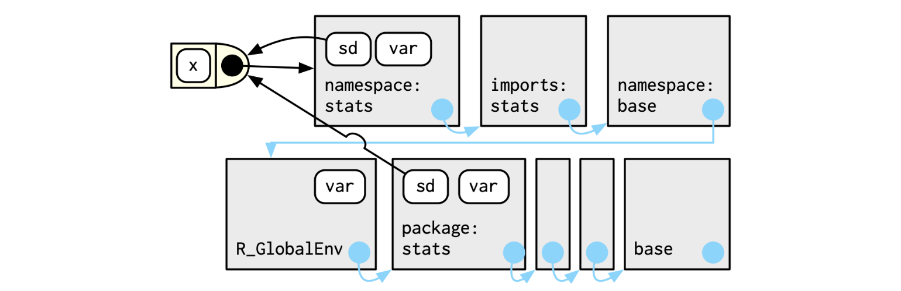 

"f() binds the environment that binds the name f to the function. But that’s not always the case: in the following example g is bound in a new environment e, but g() binds the global environment."

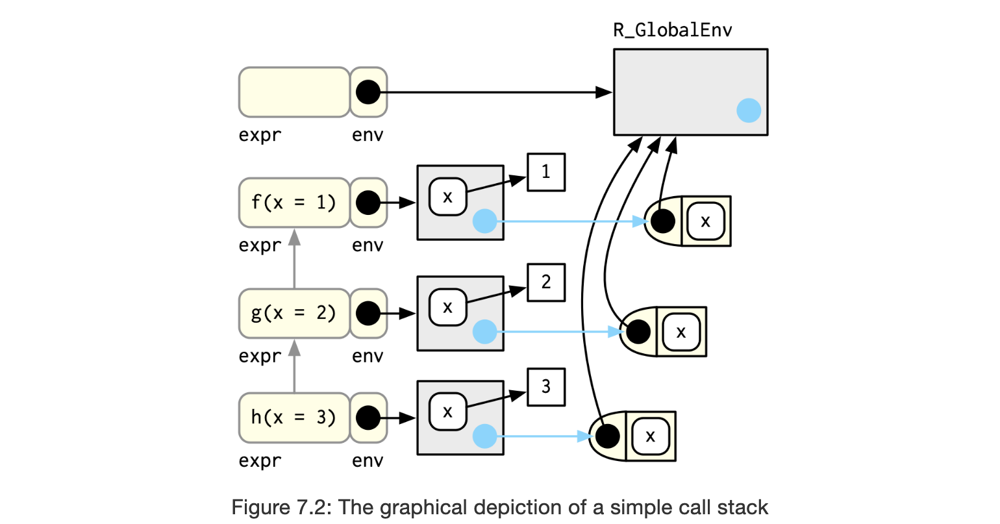 

---
### ??????

 

---

# Quick Recap - Chapter 6 
## Environments power lexical scooping

Lexical scooping 
- Name masking
- Functions versus variables
- A fresh start
- Dynamic lookup


.pull-left[
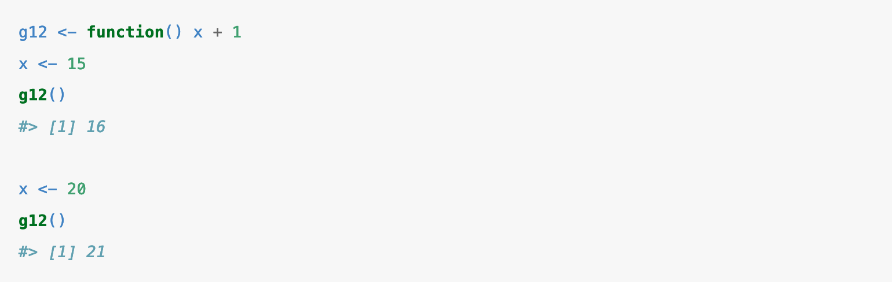
]

.pull-right[
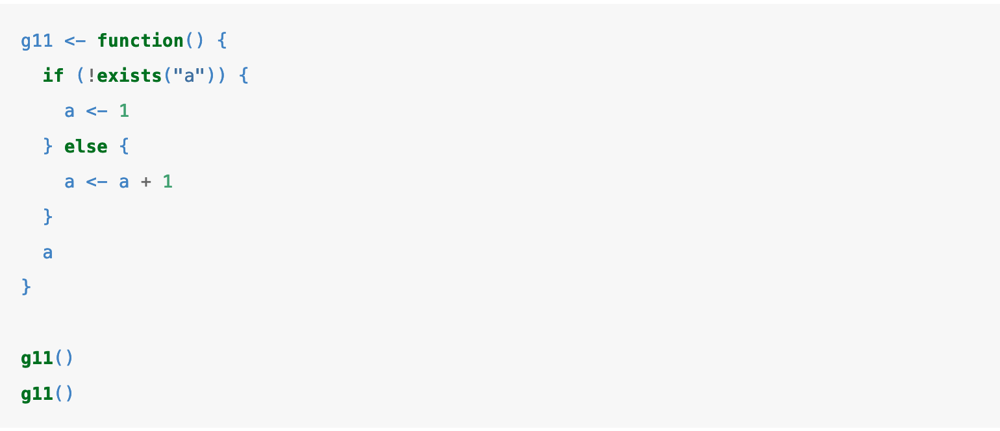
]


---

# What is an R environment?

"The job of an environment is to associate, or bind, a set of names to a set of values." 

- A data structure similar to a named list, except:
  - Every name must be unique.
  - The names in an environment are not ordered.
  - An environment has a parent.
  - Environments are not copied when modified.
- R uses environments to find the objects and packages you call
- They are hierarchical (parents and children)
- Environments can contain themselves

.pull-left[

```{R}
library(rlang)

e1 <- env(
  a = FALSE,
  b = "a",
  c = 2.3,
  d = 1:3,
)
```

]

.pull-right[

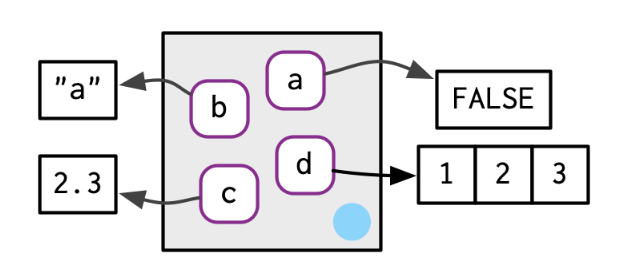


]

---
# Types of Environments

- Current Environment
- Global
- Special types
 - Package
 - Function
 - Namespaces
 - Execution
 

---


# Environments are hierarhical 

## Every environment has a parent (almost)

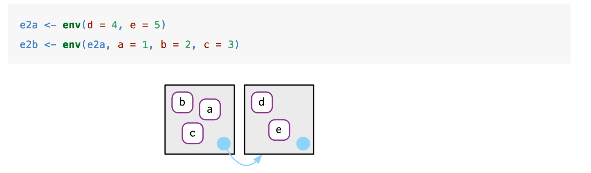 


---

# Environments are hierarhical 

## Every environment has a parent (almost)

.pull-left[

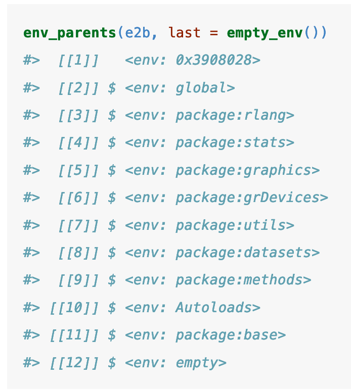 

]

.pull-right[

 

]

---

# Looking for objects

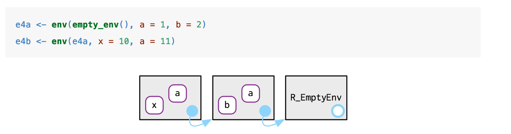 

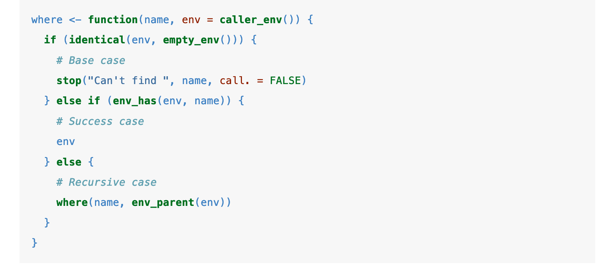 

---

# Iteracting with Environments

## Getting and Setting

```{r}

e3 <- env(x = 1, y = 2)

e3$z <- 3
e3[["z"]]

## Binding with Poke

env_poke(e3, "a", 100)

## Multiple bindings

env_bind(e3, a = 10, b = 20)

```


---

# Special Environments

- Package
- Function
- Namespaces
- Execution
 
---

# Special Environments 
## Package

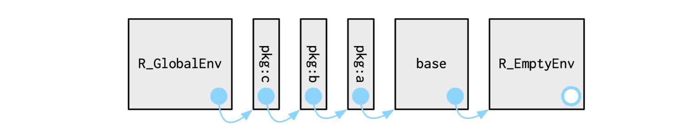 
```{r}

search()


```
---

# Special Environments 
## Function

"A function binds the current environment when it is created. This is called the function environment, and is used for lexical scoping. Across computer languages, functions that capture (or enclose) their environments are called closures, which is why this term is often used interchangeably with function in R’s documentation."


---


# Special Environments 
## Namespaces

"The goal of namespaces is to make sure that...every package works the same way regardless of what packages are attached by the user."


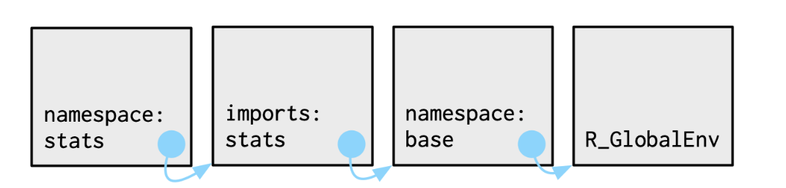 


---

# Special Environments 
## Namespaces

 
---

# Special Environments 
## Execution 

- Each time a function is called, an execution environment is created
- Parent is the function environment 
- Cleaned up by garbage collector after execution is completed (unless execution environment is explicitly returned)


---


# Special Environments 
## Execution 


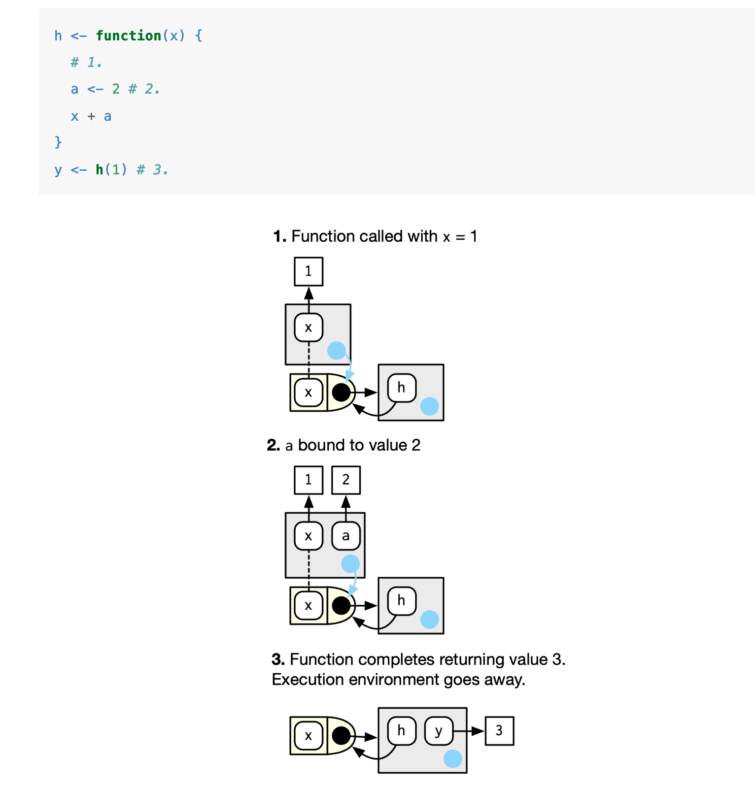 


---

# Call stacks 

A call stack is a record of the functions that were executed in a particular order. Each element of a call stack (or step), is a frame. 

```{r}

f <- function(x) {
  g(x = 2)
}
g <- function(x) {
  h(x = 3)
}
h <- function(x) {
  stop()
}

```

```{r}

# f(x = 1)
# #> Error:
# traceback()
# #> 4: stop()
# #> 3: h(x = 3) 
# #> 2: g(x = 2)
# #> 1: f(x = 1)

```

---


# Call stacks 


```{r}
h <- function(x) {
  lobstr::cst()
}
f(x = 1)

```


---

## Questions? 


---

