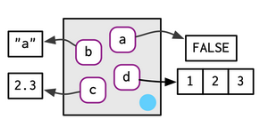
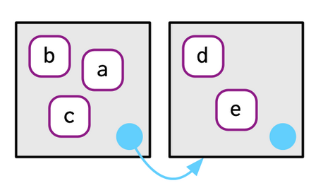
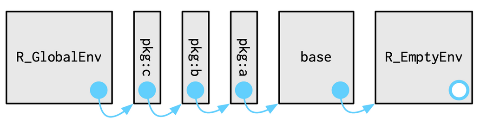
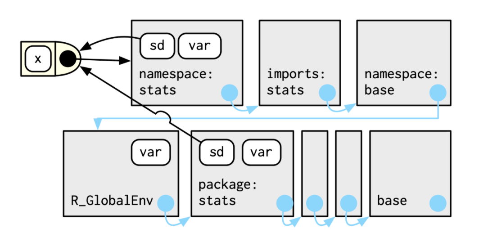

```{r setup, include=FALSE}
library(learnr)
library(rlang)
knitr::opts_chunk$set(echo = FALSE)
```


## Why should I care about environments?

###  


Environments power a lot useful things R:

  * R6 version of object-oriented programming (we'll get there chapter 16 -- patience)
  
  * environments power dplyr and ggplot2 (apparently)

  * lexical scoping (x as a value in our workspace vs x as a thing inside a function)
  
```{r toyfunction,echo=TRUE}


x = 10

toy_function = function(x, y){
    print(glue::glue("Hi, I think x is {x}"))
    new_value = x + y
    print(glue::glue("So {x} plus {y} is {new_value}"))
          
}

toy_function2 = function(y){
    print(glue::glue("However since I don't have an x, I look to the global and think x is {x}"))
    new_value = x + y
    print(glue::glue("So {x} plus {y} is {new_value}"))
}

toy_function(x = 2,y = 3)
toy_function2(y = 3)

```


## So what is an environment?

  * an unordered bag of bindings between names and values 
  


## How is it different from just using a named list?

  * Every name must be unique. Every item must have a name

  * No ordering to the names (we can't retrieve things with env[[1]])

  * Environments have a parent.

  * Environments are modified in place

```{r makeenv,echo=TRUE}
library(rlang)
e1 <- rlang::env(
  a = FALSE,
  b = "a",
  c = 2.3,
  d = 1:3,
)

e1$z <- "FISH"
env_print(e1)
env_names(e1)
```

Will the following code chunk run? 
```{r makeenv2,exercise=TRUE}
e2 <- rlang::env(
  a = FALSE,
  a = "a",
  c = 2.3,
  d = 1:3,
)

env_print(e2)

e2[[1]]
e1[["z"]]
```

## What kind of environments does R have? 

There are 2 important ones you've been working with your whole time in R.

  * First there's the global environment or your workspace.
  * Then there's the current env where code is executing


```{r environment, exercise=TRUE}


x = 10

toy_function = function(x, y){
    print(current_env())
    print(glue::glue("Hi, I think x is {x}"))
    new_value = x + y
    print(glue::glue("So {x} plus {y} is {new_value}"))
          
}

toy_function2 = function(y){
    print(current_env())
    print(env_parents(current_env()))
    print(glue::glue("However since I don't have an x, I look to the global and think x is {x}"))
    new_value = x + y
    print(glue::glue("So {x} plus {y} is {new_value}"))
}

toy_function(2,3)
toy_function2(3)

print(current_env())


```

How did toy_function2() know to look for the `x` in the current_env() where x was defined?

Parents

## Wait, now what's a parent? 

Every environment has a parent, which is another environment

  * If you don't set the parent, R uses the current environment
  * How do we make the following relationship? 

  
  



We can make the above relationship like so
```{r how_make, exercise=TRUE}


mummy_env <- env(d = 4, 
           e = 5)
baby_env <- env(mummy_env, 
           a = 1, 
           b = 2, 
           c = 3)


env_parent(baby_env)
```

## How many ancestors are there? 

Everything ends in the empty environment, but when you
print the ancestors of an environment R will stop at the global, we can override that if we want though

```{r sodeep, exercise=TRUE}

mummy_env <- env(d = 4, 
           e = 5)
baby_env <- env(mummy_env, 
           a = 1, 
           b = 2, 
           c = 3)
env_parents(baby_env)
env_parents(baby_env, last = empty_env())

```   
## Special skillz 

There is a special assignment tool with `<<-` It's called super assignment and 
rather than creating a variable in the current environment it will modify an existing variable in a parent environment

```{r superduper,echo=TRUE}

x <- 0
f <- function() {
  x <<- 1
}
f()
x

```   

I thought we could use it on environments as well but this gives errors?
```{r mummy, exercise=TRUE}

mummy_env <- env(d = 4, 
           e = 5)

mummy_env$e

baby_env <- env(mummy_env, 
           a = 1, 
           b = 2, 
           e <<- 3)


mummy_env$e

```

## How can I change the items in my bag of bindings?
```{r modify, exercise=TRUE}

e3 <- env(x = 1, 
          y = 2)
e3$z <- 3

# Asking for an unassigned value returns NULL 
e3$xyz
#if you want an error for debugging purposes you use env_get
# env_get(e3, "xyz")

env_poke(e3, "a", 100)
env_bind(e3, a = 10, b = 20)

env_has(e3, "a")
#What do you think happens when we do this? 
e3$a <- NULL
##
#
##
##
##
##
env_has(e3, "a")

env_unbind(e3, "a")
```  


## What about if I want to put something in there...but fancy 

There are 2 fancy bindings, `env_bind_lazy()` and `env_bind_active()`

  * `env_bind_lazy()` won't bind until the first time the thing is accessed
  * `env_bind_active()` will re-compute every time they're accessed (we'll use this later in R6)

## Quiz Break

1. How do we make the pair of environments as illustrated by this picture.


```{r loopdedoop, exercise=TRUE}


```  

2.  Why don't e[[1]] and e[c("a", "b")] don’t make sense when e is an environment?

```{r makesense, exercise=TRUE}

e <- env(
  a = FALSE,
  b = "a",
  c = 2.3,
  d = 1:3,
)

```  

## How do packages work anyway?

Why does this fail? 
```{r test2, exercise = TRUE, echo=TRUE}

ggplot(mtcars) + geom_point(aes(x = disp , y = hp))
```  
And this doesn't?


```{r test3, echo=TRUE}
library(ggplot2)
ggplot(mtcars) + geom_point(aes(x = disp , y = hp))
```  

Everytime we add a package with `library()` or `require()` we're adding to the 
search path


What will happen to the `seach_envs()` and the `parent_env()` of the global environment
after I load `cowplot`?

```{r searhy, excercise = TRUE, echo=TRUE}
search_envs()
env_parents(current_env())
library(cowplot)
search_envs()
env_parents(current_env())
```  


## Special Environments

the `sd()` function from the stats pack uses `var()` function, so what might happen to `sd()` if I define a new function `var()`
```{r test, echo = TRUE}

sd
```

```{r sdexample, exercise=TRUE}
x <- sample(3,30,T)
print(sd(x))

var <- function(q,w){
  #var now returns a sample of q and w
  return(sample(c(q,w),1))
}
var(1,2)
print(sd(x))

```  

`sd()` still calls to the correct `var()` function because every function from a package not only 
comes with the package environment, but also a namespace environment

Functions use the names defined in the namespace environment.




## Function environments

What is the environment of `toy_function`?

```{r environmen4t, exercise=TRUE}


x = 10

toy_function = function(x, y){
    print(current_env())
    print(glue::glue("Hi, I think x is {x}"))
    new_value = x + y
    print(glue::glue("So {x} plus {y} is {new_value}"))
          
}


print(fn_env(toy_function))
##
##
##
##
# print(current_env())

```

##  The call stack

 We're used to looking at the call stack when errors occur using `traceback()`
```
f <- function(x) {
  g(x = 2)
}
g <- function(x) {
  h(x = 3)
}
h <- function(x) {
  stop()
}

f(x = 1)
#> Error:
traceback()
#> 4: stop()
#> 3: h(x = 3) 
#> 2: g(x = 2)
#> 1: f(x = 1)
```
We can use  `lobstr::cst()` to explore the callstack
```
f <- function(x) {
  g(x = 2)
}
g <- function(x) {
  h(x = 3)
}
h <- function(x) {
  lobstr::cst()
}

f(x = 1)
#> █
#> └─f(x = 1)
#>   └─g(x = 2)
#>     └─h(x = 3)
#>       └─lobstr::cst()
```


P.S. this looks wild in the shiny app

```{r envimen4t, exercise=TRUE}
f <- function(x) {
  g(x = 2)
}
g <- function(x) {
  h(x = 3)
}
h <- function(x) {
  lobstr::cst()
}

f(x = 1)
```

Things can get more complicated with lazy evaluation

```
a <- function(x) b(x)
b <- function(x) c(x)
c <- function(x) x

a(f())

#> █
#> ├─a(f())
#> │ └─b(x)
#> │   └─c(x)
#> └─f()
#>   └─g(x = 2)
#>     └─h(x = 3)
#>       └─lobstr::cst()
```
##  What are some useful ways we can use environments? 

    * Avoid making copies of large data sets

    * Manage state within a package

    * as a hashmap(or like a python dictionary)
    

##  Quiz Questions!!!

    * List at least three ways that an environment differs from a list.

    * What is the parent of the global environment?

    * What is the only environment that doesn’t have a parent?

    * What is the enclosing environment of a function? Why is it important?

    * How do you determine the environment from which a function was called?

    * How are <- and <<- different?

##  Quiz Answers!!!

    * List at least three ways that an environment differs from a list.
        every object in an environment must have a name 
        order doesn’t matter 
        environments have parents 
        environments have reference semantics.

    * What is the parent of the global environment?
      The parent of the global environment is the last package that you loaded. 

    * What is the only environment that doesn’t have a parent?
      The only environment that doesn’t have a parent is the empty environment.

    * What is the enclosing environment of a function? Why is it important?
    
      The enclosing environment of a function is the environment where it was created. 
      It determines where a function looks for variables.

    * How do you determine the environment from which a function was called?
      `caller_env()` or `parent.frame()`

    * How are <- and <<- different?
      <- always creates a binding in the current environment; <<- rebinds an existing name in a parent of the current environment.
