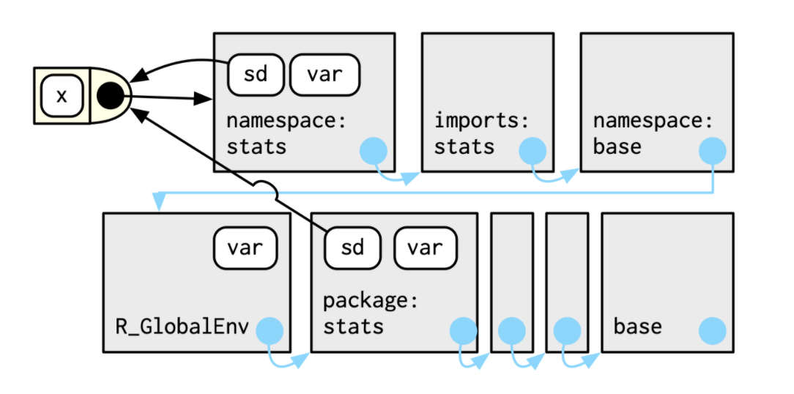

```{r setup, include=FALSE}
options(htmltools.dir.version = FALSE)
knitr::opts_chunk$set(fig.align="center", fig.width=5, fig.height=5, warning = FALSE, message = TRUE)
library(rlang)
```

```{r xaringan-themer, include = FALSE}
xaringanthemer::style_duo_accent(
  primary_color = "#bada90",
  secondary_color = "#bada55",
  header_font_google = xaringanthemer::google_font("Roboto", "400"),
  header_background_content_padding_top = "3.5rem",
  text_font_google   = xaringanthemer::google_font("Lato", "300"),
  header_color = "skyblue",
  title_slide_text_color = "#c9d6de",
  padding = "12px 32px 12px 32px",
  code_font_google = xaringanthemer::google_font("Oxygen Mono", "200"),
  code_highlight_color = "rgba(232,239,250, 0.3)",
  code_font_size = "0.75rem",
  code_inline_font_size = "0.9rem",
  title_slide_background_image = "images/amazon.jpg"
  
)
xaringanthemer::style_extra_css(
  list(
    pre = list( 
    display = "block",
    `font-family` = "monospace",
    `white-space` = "pre-wrap",
    margin = "0px"
    ),
    `h1,h2,h3,h4,h5` = list(
      `padding-top` = ".25rem",
      `padding-bottom` = ".25rem",
      `margin-top` = ".25rem",
      `margin-bottom` = ".25rem"
    ),
    `.title-slide > h1, h2, h3` = list(
      `background-color` = "rgba(255,255,240, .5);",
      `text-shadow` = "2px 2px rgba(0,0,0,.4);"
      )
    )
, append = TRUE)
```


## Recall from Chapter 6: R has 4 primary scoping rules
  
  * **Name masking**
    * names defined inside a function mask names outside the function
    
    * if the name can't be found, R looks one level up


  * **Functions versus variables**
  
    * if you use a name in a function call, objects that are not functions get ignored in the search
  

  * **A fresh start**
  
    * every time a function is called, a new **environment** gets created. 
  

  * **Dynamic lookup**
  
    * R looks for values only when it needs them (when the function is run) 
  

---
## Key Takeaways


### **An environment binds a set of names to a set of values**


#### Environments are different from lists in the following ways

  1. Every name must be unique.

  2. The names in an environment are not ordered.

  3. An environment has a parent.

  4. Environments are not copied when modified i.e. environments use reference semantics


---
## 7.2.1 Basics
### Create a new environment
  
* `rlang::env(...)`
      
  - variables to be bound in the environment can be supplied via `...`
      
      
```{r 'rlang env'}
e <- rlang::env(a = 1, b = 2)
ls(e)
```
    
* `base::new.env()`
    
  - variables supplied after creation via normal assignment `$<-`
      
```{r 'new.env'}
e <- new.env()
e$a <- 1
e$b <- 2
ls(e)
```

---
## 7.2.1 Basics
### View an environment

* `rlang::env_print`: descriptive info about environment elements 


```{r 'env_print'}
rlang::env_print(e)
```
    
* `rlang::env_names` or `base::names`: to give list of bindings 


```{r 'env_names'}
rlang::env_names(e)
names(e)
```

---
## 7.2.2 Important Environments

  * current environment: where code will execute 
```{r 'current_env'}
x <- 1
ls(rlang::current_env())
ls(environment())
```

  * global environment 
```{r '.Globalenv'}
ls(.GlobalEnv)
ls(base::globalenv())
ls(rlang::global_env())
```

---
### 7.2.2 Important Environments

  * empty environment
```{r 'emptyenv'}
ls(base::emptyenv())
ls(rlang::empty_env())
```

---
### 7.2.2 Important Environments

  * function environment
```{r 'Fn env'}
x <- 1
envs <- function(pe = rlang::caller_env()) {
  message("This env:")
  print(environment())
  message("Parent env:")
  print(pe)
}
envs()
```

---
### 7.2.2 Important Environments

  * package environment
```{r 'ns env'}
library(rlang)
search()
head(ls(pos = 2), 10)
```

---
### 7.2.2 Important Environments
  * Bonus: Why does `caller_env` return two different environments and where is the Internal/Argument Environment coming from?
```{r 'Bonus'}
purrr::walk(x, function(x, ce, ace = rlang::caller_env()) {
  .ce <- rlang::caller_env()
  message("Internal: ")
  print(.ce)
  message("Argument: ")
  print(ace)
  message("External: ")
  print(ce)
  message("Internal: ",paste0(ls(.ce), collapse = "\n"))
  message("Argument: ",paste0(ls(ace), collapse = "\n"))
  message("External: ",paste0(ls(ce), collapse = "\n"))
}, ce = rlang::caller_env())
```
  


---
## 7.2.3 Parents 

Every environment has a parent:


  
---
### 7.2.3 Parents   
  * The parent environment can be specified. The calling environment will be used otherwise.  Call a parent environment using `rlang::env_parent` or `parent.env`.
```{r 'rlang parent'}
f <- rlang::env(e)
identical(rlang::env_parent(f), e)
ls(f)
f <- rlang::new_environment(list(y = x), parent = e)
identical(rlang::env_parent(f), e)
ls(f)
```

---
### 7.2.3 Parents   
With base:
```{r 'base parent'}
f <- new.env()
print(parent.env(f))
parent.env(f) <- e
print(parent.env(f))
```

---
### 7.2.3 Parents   
  * R searches the parent environment and all ancestors sequentially until the empty environment.
  
  * The sequence of environments ends with the <b>empty environment</b>


  * Retrieve all ancestors using `rlang::env_parents` - *default ends with global*.
```{r 'all parents'}
rlang::env_parents(f)
```


---
### 7.2.3 Parents   
#### The Empty environment

  * Empty because it has no names/bindings
  
  * Has no parent(s)
  
  * Always the last environment on the search path

---
### 7.2.3 Parents   

  * Empty comes after all environments & namespaces
```{r 'empty parents'}
rlang::env_parents(f, last = emptyenv())
```

---
## 7.2.4 Super-assignment 


 * <b><<-</b> overwrites existing variable with same name in a parent, or assigns a new variable in the global environment.


```{r superassignment}
f <- function() {
  z <<- 1
}
f()
e <- environment()
print(e)
ls(e)
```

---
### 7.2.4 Super-assignment 
 * Generally to be avoided, but there are some modify-in-place use cases.
Example: Iteration over many items with an expensive "needle-in-the-haystack" search operation.
```{r 'search op'}
long_list <- stats::setNames(as.list(1:26), letters)
results <- NULL
purrr::iwalk(long_list, ~{
  if (.y == "w") {
    results <<- paste0("Number: ", .x)
  } 
})
if (!is.null(results)) {
  message(results)
}
```


---
## 7.2.5 Getting and setting 


  * `$`, `[[` can be used with named entries but not numeric indices
```{r 'assign env'}
e[["long_list"]] <- long_list
try(e[[1]] <- long_list)
```


---
### 7.2.5 Getting and setting 
  
  * `[` does not work with environments
  
  * `$` and `[[` return NULL if the binding does not exist
  
  * binding a name to NULL does not remove it 
  

---
### 7.2.5 Getting and setting 
#### Other functions 

* Assignment:

  * `base::assign`: adds a binding using a string (`x`), `value` , and `envir`onment
  
  * `rlang::env_poke`: adds a binding using an `env`ironment, string (`nm`) and a `value` (similar to above except for argument order). Option to `create` a new binding, or error if no existing binding found.
  
  * `rlang::env_bind`: takes a specified environment (`.env`) and binds multiple values (`...`)
  
  * `rlang::env_has`: determines if an environment (`.env`) contains variables by names (`nms`) (character vector) 
  
  * `rlang::env_unbind`: unbinds from an environment (`.env`) variables by name (`nms`) 

---
### 7.2.5 Getting and setting 
🤫🤫🤫 Very untidy hacks ahead.
  
  - **`{magrittr}` tricks & mid-pipe intermediate assignments**
  
  - `[` is equivalent to `magrittr::inset` but `inset` is usable in a pipe
  
  - `[[` is equivalent to `magrittr::inset2` but `inset2` is usable in a pipe
  
  - `%T>%` allows you to pass the results of a step in a pipe "around" the next step
  
  - `{` allows you to create an expression along a pipe where you can place the result from the previous step in multiple places with `.`
  
---
### 7.2.5 Getting and setting 
#### Putting it all together
```{r 'magrittr assignment'}
suppressPackageStartupMessages(library(magrittr))
long_list <- long_list %>% 
  magrittr::inset2("a", "letter a") %T>% 
  {assign("new", .[[2]] * .[[10]], envir = e)} %>% 
  magrittr::inset(length(.) + 1, "aa")
long_list[["a"]]
long_list[[27]]
e$new

```
    
---
## 7.2.6 Advanced bindings


Two binding types:

  1. **Delayed bindings**: evaluated the first time they are accessed
  
  2. **Active bindings**: recomputed each time they are accessed


---
### 7.2.6 Advanced bindings
#### Delayed binding example 

```{r lazybind}
rlang::env_bind_lazy(current_env(), b = {Sys.sleep(1); 1})

system.time(print(b))

system.time(print(b))
```


Both calls give the same output though executed at different times 


---
### 7.2.6 Advanced bindings
#### Active binding example


```{r activebind}
rlang::env_bind_active(rlang::current_env(), z = rlang::as_function(~{runif(1)}))
z
z
```

Each output triggers a call to `runif`


---
## 7.3 Recursing Over Environments


How do we find which environment contains a name?

**A recursive function**
```{r}
where <- function(name, env = caller_env()) {
  if (identical(env, empty_env())) {
    # Base case
    stop("Can't find ", name, call. = FALSE)
  } else if (env_has(env, name)) {
    # Success case
    env
  } else {
    # Recursive case
    where(name, env_parent(env))
  }
}
```


---
### 7.3 Recursing Over Environments

How do we find which environment contains a name?
**Using a while loop**
```{r iterativewhere, message = FALSE}
where2 <- function(in_name, env = caller_env()) {
  while (!identical(env, empty_env())) {
    if (env_has(env, in_name)) {
      return(env)
    }
    # inspect parent
    env <- env_parent(env)
  }

  return (env)
}
```


---
## 7.4 Special Environments
### 7.4.1 Package environments and the search path

  * Every attached package becomes a parent of the global environment
  
  * The most recently-attached package becomes the immediate parent of the global environment and links to the previous parent as its own parent


---
### 7.4.1 Package environments and the search path
  * The **search path** is the sequence of environments containing all attached packages and continuing to the empty environment
```{r 'searchpaths'}
purrr::map(list(
base::search,
base::searchpaths,
rlang::search_envs
), ~{tail(rlang::invoke(.x),5)})
```

---
### 7.4.1 Package environments and the search path
* The last two packages on the search path are always the `Autoloads` and `base` environments
  
```{r 'autoload and base'}
.AutoloadEnv;.BaseNamespaceEnv
identical(base::baseenv(), rlang::base_env())

```
 - See `?base::autoload`

---
## 7.4.2 The function environment

  * A function binds the current environment when it is created i.e. this becomes the parent environment of the function environment.

    - Remember the bonus?

  * A name is typically bound to a function on function creation (unless the function is anonymous and passed as an argument)

  * The environment in which a name is bound to a function is not necessarily the environment that the function binds.

---
### 7.4.2 The function environment
**Bonus**: revisited
```{r 'Bonus revisited'}
purrr::walk(x, function(x, ce, ace = rlang::caller_env()) {
  .ce <- rlang::caller_env()
  message("Internal: ")
  print(.ce)
  message("Argument: ")
  print(ace)
  message("External: ")
  print(ce)
  message("Internal: ",paste0(ls(.ce), collapse = "\n"))
  message("Argument: ",paste0(ls(ace), collapse = "\n"))
  message("External: ",paste0(ls(ce), collapse = "\n"))
  browser(expr = interactive())
}, ce = rlang::caller_env())
```

* Why does the bonus show `env`, `enclos`, `expr` for "External"?
  - hint: `?eval`

---
### 7.4.2 The function environment
**Example**: A function binds the global environment even if bound to another environment.

```{r 'binding global'}
e$g <- function() {
  message("This environment:")
  print(environment())
  message("The caller environment:")
  print(rlang::caller_env())
  message("Is the caller and the parent the same?:")
  print(identical(rlang::caller_env(), parent.env(environment())))
  message("Does `x` exist?:")
  print(exists("x", inherits = FALSE))
  x
}
e$g()

```

---
### 7.4.2 The function environment
#### Accessing the environment of a function

Use `rlang::fn_env` or `environment` to access the environment of a function: 

```{r functionenv, exercise = TRUE}
identical(rlang::fn_env(e$g), environment(e$g))
```


---
## 7.4.3 Namespaces

  1. The *package* environment: accessible on the search path
  
    * only exported functions will be shown in the environment explorer or with `ls`
    
  2. The *namespace* environment: internal to the package 
  
    * all bindings in the package environment are found here 
    
    * access internal functions with `package:::`

  3. names are bound to the package function in both the package and namespace environments but the function environment specifically sees the namespace environment
  
   - The bonus references `i` in the parent environment within the `namespace` environment.
    


---
### 7.4.3 Namespaces
#### Detailed example of namespaces and parents of namespaces 
Consider `sd`: The user calls the function via the name in the package environment but the function uses the names defined in the namespace environment.



---
### 7.4.3 Namespaces
#### What are the parents of the namespace environment? 


  * an `imports` environment: all the function dependencies from other packages defined in the *NAMESPACE* file
    
  * the `base` environment
  
  * the global environment
  


  
    
---
## 7.4.4 Execution environments


  * Created fresh when the function is called 
  
  * Not the same as the **function** environment
  
  * The parent is the function environment
  
  * The environment is ephemeral and will disappear unless explicitly saved

The following function will return the same result all the time even if called repeatedly: 

```{r 'execution environments'}
g <- function(x) {
  if (!env_has(current_env(), "a")) {
    message("Defining a")
    a <- 1
  } else {
    a <- a + 1
  }
  a
}
g()
g()
```


---
### 7.4.4 Execution environments
#### Preserving the execution environment

A few ways to preserve the execution environment

  * return it from the function


```{r 'Preserving execution environment'}
h2 <- function(x) {
  a <- x * 2
  current_env()
}
.env <- h2(10)
rlang::env_print(.env)
```

---
### 7.4.4 Execution environments
#### Preserving the execution environment

  * return an object with the environment bound to it e.g. a function created in the function will have the execution environment as its own function environment
  
 

```{r 'return function with environment'}
plus <- function(x) {
  function(y) x + y
}

plus_one <- plus(1)
plus_one
```


---
## 7.5 Call Stacks


The **caller environment**: 
  
  * The environment the function was called from 
  
  * The environment where function values will be returned to


```{r 'caller env'}
f <- rlang::as_function(~{identical(parent.frame(), rlang::caller_env())})
f()
```
The **call stack**

As functions can call each other, there can be multiple functions evaluating simultaneously. 

Thus call stacks can be:
  
  * simple (linear)  
  
  * nested (branched)


---
## 7.5.1 Simple Call Stacks


**An example of a simple call stack** 

```{r 'simple call stack'}
f1 <- function(x, flag) {
  f2(x = 2)
}
f2 <- function(x) {
  f3(x = 3)
}
f3 <- function(x) {
  stop()
}
```

```{r 'call stack', error = TRUE}
f1(x = 1)
```

---
### 7.5.1 Simple Call Stacks
#### Using `lobstr::cst`

```{r 'lobstr cst'}
f3 <- function(x) {
  lobstr::cst()
}
f1(x = 1)
```

---
### 7.5.1 Simple Call Stacks
#### Searching the call stack

```{r 'find flag', error = TRUE}
f3 <- function(x) {
  invisible(list(try(get("flag", inherits = TRUE)), try(rlang::env_get(nm = "flag", inherit = TRUE))))
}
f1(1, flag = FALSE)
```

---
### 7.5.1 Simple Call Stacks
**Call Stack Use Case**: Searching the call stack for a variable

```{r 'find flag 2'}
f3 <- function(x) {
  .frames <- sys.frames()
  .calls <- sys.calls()
  message("First elements of calls: ", paste0(sapply(.calls, `[[`, 1), collapse = ", "))
  message("Find f1: ")
  .f1 <- purrr::map_lgl(.calls, ~{
    .fn <- .x[[1]]
     stringr::str_detect(deparse(.fn), "^f1")
  })
  get("flag", envir = .frames[.f1][[1]], inherits = FALSE)
}
f1(1, flag = FALSE)
```

- Remember the bonus?

---
## 7.5.2 Lazy Evaluation 

Lazy evaluation can lead to multiple branches of the call stack


Example:

```{r}
a <- function(x) b(x)
b <- function(x) c(x)
c <- function(x) x
f3 <- function(x) {
  lobstr::cst()
}
a(f1())
```

We can see from the traceback that

  * the function calls avoided evaluating `f1()` until `c` called `x` explicitly, which contained the call to `f1`
  


---
## 7.5.3 Frames

Each tier of the call stack is called a frame i.e. each function in progress corresponds to a frame of the stack.

Each frame is characterized by:
  
  1. An expression, <i>expr</i> describing the function call
  
  2. An environment, <i>env</i>
    
    * usually the execution environment
    
    * the environment of the global frame is the global environment
    
    * using `eval` generates frames where the environment is a wildcard

  3. A parent, the previous call in the stack

---
### 7.5.3 Frames
#### eval expression
```{r 'eval frames'}
fn <- function(.x) {
  exp <- rlang::call2(mean, .x)
  print(exp)
  rlang::eval_bare(exp)
}
ex <- rlang::expr(fn(5))
eval(ex)

```


---
## 7.5.4 Dynamic Scope 

  * R does not use dynamic scoping 
  
  * More on dynamic scoping in Chapter 20


---
## 7.6 As Data Structure

Uses for environments:

  1. **Avoiding copies of large data**: environments have reference semantics, you’ll never accidentally create a copy. See R6 objects in Chapter 14.

  2. **Managing state within a package.** Explicit environments are useful in packages because they allow you to maintain state across function calls.


  3. **As a hashmap**: A hashmap is a data structure that takes $O(1)$ time to access and object guaranteed.


---
## Quiz Questions


  * List at least three ways that an environment differs from a list.
  
  * What is the parent of the global environment? 
  
  * What is the only environment that doesn't have a parent?

  * What is the enclosing environment of a function? Why is it important?

  * How do you determine the environment from which a function was called?

  * How are `<-` and `<<-` different?


