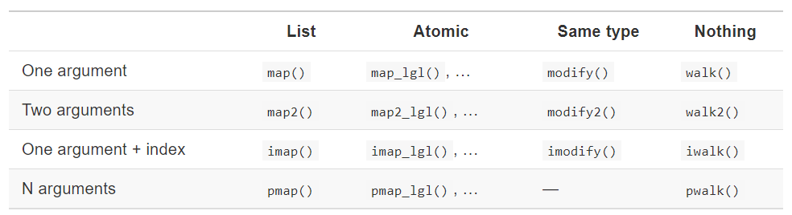

```{css, echo=FALSE}
.remark-code, .remark-inline-code {
    background: #F0F0F0;
}

.remark-code {
    font-size: 12px;
}

.remark-slide-content h1 {
    font-size: 35px;
}
```


```{r setup, include=FALSE}
knitr::opts_chunk$set(
  echo = TRUE,
  warning = FALSE,
  message = FALSE
)
```


# Contents

- 9.2 `map()`

- 9.3 `purrr` style

- 9.4 `map_*` variants

- 9.5 `reduce()` family

- Some functions that weren't covered

- Example application

- Well be using our old friend:

```{r}
library(tidyverse) # focus on purrr
```

---

# What are functionals

- alternatives to loops

- a functional is better than a `for` loop is better than `while` is better than `repeat`

- don't shoehorn it in if a loop is the easiest answer
  - ex: iterating over `eval()`


### Benefits

- encourages function logic to be separated from iteration logic

- can collapse into vectors/data frames easily


---

# 9.2 `map()`

- `purrr::map()` is equivalent to `lapply()`

- returns a list and is the most general

- the length of the input == the length of the output

```r
map(
  .x, # list/vector to iterate over
  .f, # function to use
  ... # arguments passed to .f
)
```

```{r}
triple <- function(x) x * 3
map(1:3, triple)
```

---

# 9.2.1 Atomic vectors

- has 4 variants to return atomic vectors
    - `map_chr()`
    - `map_dbl()`
    - `map_int()`
    - `map_lgl()`

```{r}
triple <- function(x) x * 3
map(1:3, triple)

map_dbl(1:3, triple)

map_lgl(c(1, NA, 3), is.na)
```

---

# 9.2.2 Anonymous functions and shortcuts

- anonymous functions
```{r}
map_dbl(mtcars, function(x) mean(x, na.rm = TRUE)) %>% 
  head()
```

- the "twiddle" uses a tilda `~` to set a formula
    - can use `.x` to reference the input `map(.x = ..., .f = )`
```{r, eval=FALSE}
map_dbl(mtcars, ~ mean(.x, na.rm = TRUE))
```

- can be simplified further as
```{r, eval=FALSE}
map_dbl(mtcars, mean, na.rm = TRUE)
```

---

# 9.3 `purrr` style

```{r}
mtcars %>% 
  map(head, 20) %>% # pull first 20 of each column
  map_dbl(mean) %>% # mean of each vector
  head()
```

An example from `tidytuesday`
```{r, eval=FALSE}
tt <- tidytuesdayR::tt_load("2020-06-30")

# filter data & exclude columns with lost of nulls
list_df <- 
  map(
    .x = tt[1:3], 
    .f = 
      ~ .x %>% 
      filter(issue <= 152 | issue > 200) %>% 
      mutate(timeframe = ifelse(issue <= 152, "first 5 years", "last 5 years")) %>% 
      select_if(~mean(is.na(.)) < 0.2) 
  )

# write to global environment
iwalk(
  .x = list_df,
  .f = ~ assign(x = .y, value = .x, envir = globalenv())
)
```


---

# 9.4 `map_*()` variants

There are many variants

```{r echo=FALSE}

```

---


# 9.4.2 `map2_*()`

- raise each value `.x` by 2

```{r}
map_dbl(
  .x = 1:5, 
  .f = function(x) x ^ 2
)
```

- raise each value `.x` by another value `.y`

```{r}
map2_dbl(
  .x = 1:5, 
  .y = 2:6, 
  .f = ~ (.x ^ .y)
)
```

---

# 9.4.3 `walk()`


- for steps that don't require "captured results" like generating plots, `write.csv()` or `ggsave()`, `map()` will print more info than you may want

```{r}
map(1:3, ~cat(.x, "\n"))
```

- for these cases, use `walk()` instead
```{r}
walk(1:3, ~cat(.x, "\n"))
```


---

# 9.4.4 `imap()`

- `imap()` is like `map2()`except that `.y` is derived from `names(.x)` if named or `seq_along(.x)` if not

- These two produce the same result

```{r, eval=FALSE}
map2_chr(.x = mtcars, .y = names(mtcars), .f = ~ paste(.y, "has a mean of", round(mean(.x), 1)))
```

```{r}
imap_chr(.x = mtcars, .f = ~ paste(.y, "has a mean of", round(mean(.x), 1))) %>% 
  head()

```

---

# 9.4.4 `imap()`

- When .x isn't named, the index will be used
```{r}
set.seed(1234)

x <- map(1:3, ~ sample(100, 3))

imap_chr(
  .x = x, 
  .f = ~ paste("The highest value in set", .y, "is", max(.x))
)
```

---

# 9.4.5 `pmap()`

- you can pass a named list or dataframe as arguments to a function

- for example `runif()` has the parameters `n`, `min` and `max`

```{r, eval=FALSE}
params <- tibble::tribble(
  ~ n, ~ min, ~ max,
   1L,     1,    10,
   2L,    10,   100,
   3L,   100,  1000
)

pmap(params, runif)
```

- could also be

```{r}
list(
  n = 1:3, 
  min = 10 ^ (0:2), 
  max = 10 ^ (1:3)
) %>% 
  pmap(runif)
```


---
# 9.5 `reduce()` family

- you can use `reduce()` when the result should keep updating

```{r}
set.seed(1234)

map(1:4, ~ sample(1:10, 15, replace = TRUE)) %>%
  reduce(intersect)
```

- to see all intermediate steps, use `accumulate()`
```{r}
set.seed(1234)

map(1:4, ~ sample(1:10, 15, replace = TRUE)) %>%
  accumulate(intersect)

```

---

# Not covered: `map_df*()` variants

- `map_dfr()` = row bind the results

- `map_dfc()` = column bind the results

```{r}
col_stats <- function(n) {
  head(mtcars, n) %>% 
    summarise_all(mean) %>% 
    mutate_all(floor) %>% 
    mutate(n = paste("N =", n))
}

map((1:2) * 10, col_stats)

map_dfr((1:2) * 10, col_stats)
```

---

# Not covered: `pluck()`

- `pluck()` will pull a single element from a list

```{r}
my_list <- list(
  1:3, 
  10 + (1:5), 
  20 + (1:10)
)

pluck(my_list, 1)

map(my_list, pluck, 1)

map_dbl(my_list, pluck, 1)
```

---

# Not covered: `flatten()`

- `flatten()` will turn a list of lists into a simpler vector

```{r}
my_list <-
  list(
    a = 1:3,
    b = list(1:3)
  )

map_if(my_list, is.list, pluck)
  
map_if(my_list, is.list, flatten_int)

map_if(my_list, is.list, flatten_int) %>% 
  flatten_int()
```

 
---

# Application

- parsing JSON or XML

```{r}
library(repurrrsive)

repos <- 
  repurrrsive::gh_repos %>% 
  purrr::flatten()


str(repos[[1]], list.len = 10)
```

---
# Application
```{r}
tibble(
  repo_id = map_int(repos, pluck, "id"),
  repo_name = map_chr(repos, pluck, "name"),
  owner_name = 
    map(repos, pluck, "owner") %>% 
    map_chr(pluck, "login"),
  size = map_int(repos, pluck, "size"),
  issues = map_int(repos, pluck, "open_issues_count"),
  watchers = map_int(repos, pluck, "watchers_count"),
  forks = map_int(repos, pluck, "forks_count"),
  created_at = map_chr(repos, pluck, "created_at")
) %>% 
  arrange(desc(watchers))


```

