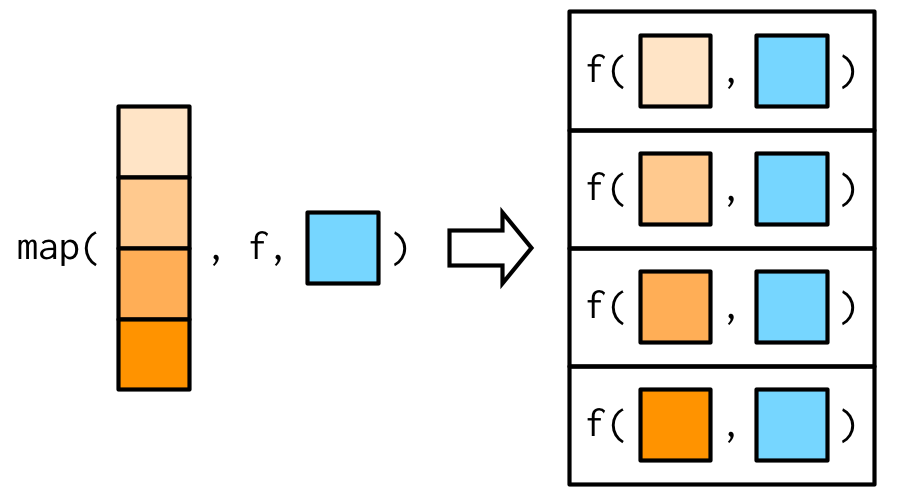

```{r setup, include=FALSE}
library(learnr)
knitr::opts_chunk$set(echo = TRUE)
```

# 9 Functionals {-}
## 9.1 Introduction {-}

>To become significantly more reliable, code must become more transparent. In particular, nested conditions and loops must be viewed with great suspicion. Complicated control flows confuse programmers. Messy code often hides bugs.
— Bjarne Stroustrup

__Functionals__ are functions that take function as input and return a vector as output. Functionals that you probably have used before are: `apply()`, `lapply()` or `tapply()`. They are commonly used to replace for loops. 


```{r, include=FALSE}
library(purrr)
library(dplyr)
```

## 9.2 My first functional: `map()`

`map()` has two arguments, a vector and a function. It performs the function on each element of the vector and returns a list. 


Theoretically `map()` just allocates a list with the necessary length and fill it with a for loop.

```{r}
simple_map <- function(x, f, ...) { 
  out <- vector("list", length(x)) 
  for (i in seq_along(x)) {
    out[[i]] <- f(x[[i]], ...) 
  }
  out
}
```

___

__Note:__
The base R equivalent to `map()` is `lapply()`

___

### 9.2.1 Producing atomic vectors {-}

Sometimes it is not really necessary to have a list as an output, so you can use `map_lgl()`, `map_int()`, `map_dbl()`, and `map_chr()` to return vectors of a specified type. 

### 9.2.2 Anonymous functions and shortcuts

```{r}
map_dbl(mtcars, function(x) length(unique(x)))
```

Instead of typing `function(x)` for anonymous functions, you can use a shortcut: 

```{r}
map_dbl(mtcars, ~ length(unique(.x)))
```

In this case ~ is pronounced "twiddle"

In the following example the argument to `runif()` is always 2, but with `map()` the function is executed 3 times and the output captured in a list. 

```{r}
x <- map(1:3, ~ runif(2)) 
str(x)
```

You can also use the map function to select elements (useful for working with deeply nested lists):


```
x <- list(
  list(-1, x = 1, y = c(2), z = "a"),
  list(-2, x = 4, y = c(5, 6), z = "b"),
  list(-3, x = 8, y = c(9, 10, 11))
)
```

```{r prepare-maps, echo=TRUE}
x <- list(
  list(-1, x = 1, y = c(2), z = "a"),
  list(-2, x = 4, y = c(5, 6), z = "b"),
  list(-3, x = 8, y = c(9, 10, 11))
)
```


```{r map-select-name, exercise=TRUE, exercise.setup="prepare-maps"}
# Select by name all elements called "x"
map_dbl()
```

```{r map-select-name-solution}
map_dbl(x, "x")
```

```{r map-select-pos, exercise=TRUE, exercise.setup="prepare-maps"}
# Or by position all elements in the 1st position
map_dbl()
```

```{r map-select-pos-solution}
map_dbl(x, 1)
```

```{r map-select-both, exercise=TRUE, exercise.setup="prepare-maps"}
# Or by both the first element in "y"
map_dbl()
```

```{r map-select-both-solution}
map_dbl(x, list("y", 1))
```

```{r map-select-na-error, error=TRUE}
# You'll get an error if a component doesn't exist:
map_chr(x, "z")
```

```{r map-select-na}
# Unless you supply a .default value
map_chr(x, "z", .default = NA)
```

### 9.2.3 Passing arguments with `...`




You can either add additional arguments by creating a function within `map()`


```{r}
plus <- function(x, y) x + y
x <- c(0, 0, 0, 0)
map_dbl(x, ~ plus(.x, runif(1)))
```

Or call the additional arguments from within `map()` with `...`

```{r}
map_dbl(x, plus, runif(1))
```

The fine difference is, that when passing them as `...` they will only be evaluated once, and not every time the funciton is called. 

### 9.2.4 Argument names 

To avoid mixing up of the function arguments of `map()` and the function that is called with `map()` the arguments of `map()` look a bit odd (`.x` and `.f` instead of `x` and `f`).

Hadley recommends when using `map()`, to use the argument names of the called function.

### 9.2.5 Varying another argument

- no direct way
- anonymous function: 

```{r}
trims <- c(0, 0.1, 0.2, 0.5)
x <- rcauchy(1000)
map_dbl(trims, function(trim) mean(x, trim = trim))
```

### 9.2.6 Exercises

1. Use `as_mapper()` to explore how purrr generates anonymous functions for the integer, character, and list helpers. What helper allows you to extract attributes? Read the documentation to find out.

```{r as-map-num, exercise=TRUE}
as_mapper(1)
```

```{r as-map-char, exercise=TRUE}
as_mapper(c("a", "b", "c"))
```

```{r as-map-list, exercise=TRUE}
as_mapper(list(1, "b", 3))
```

```{r}
as_mapper(list(1, attr_getter("a")))
pluck(mtcars, attr_getter("class"))
```

2. `map(1:3, ~ runif(2))` is a useful pattern for generating random numbers, but `map(1:3, runif(2))` is not. Why not? Can you explain why it returns the result that it does?

```{r map-runif, exercise=TRUE}
map(1:3, ~ runif(2))
as_mapper(~runif(2))

map(1:3, runif(2))
as_mapper(runif(2))
```

3. Use the appropriate `map()` function to:
  a. Compute the standard deviation of every column in a numeric data frame.
  
```{r sd-df-map, exercise=TRUE}
df <- data.frame(a=runif(10), b=1:10, c=c(rep(100, 10)))
```

```{r sd-df-map-solution}
map(df, sd)
```

  b. Compute the standard deviation of every numeric column in a mixed data frame. (Hint: you’ll need to do it in two steps.)
  
```{r sd-mixed-df-map, exercise=TRUE}
df <- data.frame(num1=runif(10), num2=1:10, char1=letters[1:10])

```

```{r sd-mixed-df-map-solution}
df[map_lgl(df,is.numeric)] %>% map(sd)
```

  c. Compute the number of levels for every factor in a data frame.

```{r lev-in-factor, exercise=TRUE}
df <- data.frame(a=as.factor(sample(letters, size = 12, replace=TRUE)), b=as.factor(sample(letters, size = 12, replace=TRUE)), c=as.factor(sample(letters, size = 12, replace=TRUE)))

```

```{r lev-in-factor-solution}
map(df, levels) %>% map(length)
```

4. The following code simulates the performance of a t-test for non-normal data. Extract the p-value from each test, then visualise.

```{r 9-2-6-4, exercise=TRUE}
trials <- map(1:100, ~ t.test(rpois(10, 10), rpois(7, 10)))

```

```{r 9-2-6-4-solution}
map_dbl(trials, "p.value") %>% hist()
```

5. The following code uses a map nested inside another map to apply a function to every element of a nested list. Why does it fail, and what do you need to do to make it work?

```{r map-in-map, exercise=TRUE, error=TRUE}
x <- list(
  list(1, c(3, 9)),
  list(c(3, 6), 7, c(4, 7, 6))
)

triple <- function(x) x * 3
map(x, map, .f = triple)
```


```{r map-in-map-solution}
map(x, .f = map, triple)
```

The second `map` here would be one of the `...` arguments of the first `map`, so passed on as an argument to `.f` (`triple`). 

6. Use `map()` to fit linear models to the `mtcars` dataset using the formulas stored in this list:

```{r 9-2-6-6, exercise=TRUE}
formulas <- list(
  mpg ~ disp,
  mpg ~ I(1 / disp),
  mpg ~ disp + wt,
  mpg ~ I(1 / disp) + wt
)
```

```{r 9-2-6-6-solution}
map(formulas, lm, data=mtcars)
```

7. Fit the model `mpg ~ disp` to each of the bootstrap replicates of `mtcars` in the list below, then extract the $R^2$ of the model fit (Hint: you can compute the $R^2$ with `summary()`.)

```{r 9-2-6-7, exercise=TRUE}
bootstrap <- function(df) {
  df[sample(nrow(df), replace = TRUE), , drop = FALSE]
}

bootstraps <- map(1:10, ~ bootstrap(mtcars))
```

```{r 9-2-6-7-solution}
map(bootstraps, ~lm(mpg~disp, data=.x))
```

## 9.4 Map variants

In total there are 23 `map()` variants.

- Output same type as input with `modify()`
- Iterate over two inputs with `map2()`
- Iterate with an index using `imap()`
- Return nothing with `walk()`
- Iterate over any number of inputs with `pmap()`

___
|                    |List    |Atomic        |Same type  |Nothing  |
|--------------------|--------|--------------|-----------|---------|
|One argument        |	map() |	map_lgl(), … |	modify() |	walk() |
|Two arguments       |	map2()|	map2_lgl(), …|	modify2()|	walk2()|
|One argument + index|	imap()|	imap_lgl(), …|	imodify()|	iwalk()|
|N arguments         |	pmap()|	pmap_lgl(), …|	—        |	pwalk()|
___

### 9.4.1 Same type of output as input: `modify()`

```{r}
df <- data.frame(
  x = 1:3,
  y = 6:4
)
```

With `map()`:

```{r}
map(df, ~ .x * 2)
```

... returns a list. 

`modify()`

```{r}
modify(df, ~ .x * 2)
```

... returns the same type of output as input.

### 9.4.2 Two inputs: `map2()` and friends

The main difference between `map()` and `map2()`is that `map2()` is vectorised over two arguments: 


### 9.4.3 No outputs: `walk()` and friends

Mainly for functions that are called because of their side-effects

```{r}
welcome <- function(x) {
  cat("Welcome ", x, "!\n", sep = "")
}
names <- c("Hadley", "Jenny")
```

`map()` also returns the `NULL` values:

```{r}
map(names, welcome)
```

`walk()` functions ignore the value of the function:

```{r}
walk(names, welcome)
```

### 9.4.4 Iterating over values and indices

The `imap()` family let's you iterate over indices or names. 

```{r}
legs <- c(8,6,4,2,1)
names(legs) <- c("Spider", "Ant", "Cat", "Human", "Pirate")
```

```{r}
imap_chr(legs, ~ paste0("A ", .y, " has ", .x, " legs"))
```

```{r}
legs <- unname(legs)
imap_chr(legs, ~paste0("Nr. ", .y, " has ", .x, " legs"))
```

Useful for: 

- constructing labels
- work with the values along with their positions

### 9.4.5 Any number of inputs: `pmap()` and friends

With the `pmap()` family functions you can iterate over `n` vectorised inputs that are stored in a list (best: named):


```{r}
params <- tibble::tribble(
  ~ n, ~ min, ~ max,
   1L,     0,     1,
   2L,    10,   100,
   3L,   100,  1000
)

pmap(params, runif)
```

### 9.4.6 Exercises

1. Explain the results of `modify(mtcars, 1)`.

```{r 9-4-6-1, exercise=TRUE}
head(modify(mtcars, 1))
map(mtcars, 1)
```

Modify has to return the same structure as `.x`, in this case a data frame with dimensions `r dim(mtcars)`. In this case the first row is plucked from the data frame (as with `map()`) and returned in the same format as the input

2. Rewrite the following code to use `iwalk()` instead of `walk2()`. What are the advantages and disadvantages?

```{r 9-4-6-2, exercise=TRUE}
temp <- tempfile()
dir.create(temp)

cyls <- split(mtcars, mtcars$cyl)
paths <- file.path(temp, paste0("cyl-", names(cyls), ".csv"))
walk2(cyls, paths, write.csv)
dir(temp)
```

```{r 9-4-6-2-solution,}
names(cyls) <- file.path(temp, paste0("cyl-", names(cyls), ".csv"))
iwalk(cyls, write.csv)
dir(temp)
```


3. Explain how the following code transforms a data frame using functions stored in a list.

```{r 9-4-6-3, exercise=TRUE}
trans <- list(
  disp = function(x) x * 0.0163871,
  am = function(x) factor(x, labels = c("auto", "manual"))
)

nm <- names(trans)
mtcars[nm] <- map2(trans, mtcars[nm], function(f, var) f(var))
```

4. Compare and contrast the `map2()` approach to this `map()` approach:

```{r 9-4-6-4, exercise=TRUE}
mtcars[vars] <- map(vars, ~ trans[[.x]](mtcars[[.x]]))
```

5. What does `write.csv()` return? i.e. what happens if you use it with `map2()` instead of `walk2()`?

```{r 9-4-6-5, exercise=TRUE}

```


## 9.5 Reduce family
### 9.5.1 Basics

```{r}
genes <- c("MKI67", "SOX2", "HES1", "HES5", "NES", "PAX6", "TUBB3", "STMN1", "FAT3", "DCX")
l <- map(1:4, ~ sample(genes, 15, replace = T))
```

```{r}
out <- l[[1]]
out <- intersect(out, l[[2]])
out <- intersect(out, l[[3]])
out <- intersect(out, l[[4]])
out
```


```{r}
reduce(l, intersect)
```

```{r}
reduce(l, union)
```

### 9.5.2 Accumulate

```{r}
accumulate(l, intersect)
```

### 9.5.3 Output types

If the `x` provided is of length 1 or zero the reduce function either returns the input value or asks for an `.init` value


> If you’re using reduce() in a function, you should always supply .init. Think carefully about what your function should return when you pass a vector of length 0 or 1, and make sure to test your implementation.

## 9.6 Predicate functionals

> A __predicate__ is a function that returns a single `TRUE` or `FALSE`, like `is.character()`, `is.null()`, or `all()`, and we say a predicate __matches__ a vector if it returns `TRUE`.

### 9.6.1 Basics

`purrr` has six predicate functions:

```{r}
df <- data.frame(a=c(1.2, 2.3, 4.5), b=c(8,3.4,2.6))

trans <- list(
  disp = function(x) x * 0.0163871,
  am = function(x) factor(x, labels = c("auto", "manual"))
)

nm <- names(trans)
mtcars[nm] <- map2(trans, mtcars[nm], function(f, var) f(var))
```


```{r 9-6-1-1, exercise=TRUE}
some(mtcars, is.double)
some(mtcars, is.logical)
```

```{r 9-6-1-2, exercise=TRUE}
every(mtcars, is.double)
every(df, is.double)
```

```{r 9-6-1-3, exercise=TRUE}
detect(mtcars, is.factor)
detect_index(mtcars, is.factor)
```

```{r 9-6-1-4, exercise=TRUE}
keep(mtcars, is.factor)
discard(mtcars, is.double)
```

### 9.6.2 Map variants

```{r 9-6-2-1, exercise=TRUE}
df <- data.frame(
  num1 = c(0, 10, 20),
  num2 = c(5, 6, 7),
  chr1 = c("a", "b", "c"),
  stringsAsFactors = FALSE
)

str(map_if(df, is.numeric, mean))

str(modify_if(df, is.numeric, mean))

str(map(keep(df, is.numeric), mean))
```

### 9.6.3 Exercises

1. Why isn’t `is.na()` a predicate function? What base R function is closest to being a predicate version of `is.na()`?

```{r 9-6-3-1, exercise=TRUE}
my_vector <- c(0, 10, 20, NA)

is.na(my_vector)
is.na(my_vector)
```

```{r 9-6-3-1-solution}
any(is.na(my_vector))
```

2. `simple_reduce()` has a problem when `x` is length 0 or length 1. Describe the source of the problem and how you might go about fixing it.

```{r}
simple_reduce <- function(x, f) {
  out <- x[[1]]
  for (i in seq(2, length(x))) {
    out <- f(out, x[[i]])
  }
  out
}
```

```{r 9-6-3-2, exercise=TRUE, exercise.eval=FALSE}
simple_reduce(1, `+`)
```

3. Implement the `span()` function from Haskell: given a list `x` and a predicate function `f`, `span(x, f)` returns the location of the longest sequential run of elements where the predicate is true. (Hint: you might find `rle()` helpful.)

```{r 9-6-3-3, exercise=TRUE}
# Just some example df to work with
df <- data.frame(
  num1 = c(0, 10, 20),
  num2 = c(5, 6, 7),
  chr1 = c("a", "b", "c"),
  stringsAsFactors = FALSE
)
df2 <- sample(df, 20, replace=TRUE)
```


```{r 9-6-3-3-solution}
span <- function(x,f){
  out <- map_lgl(x, f) %>% as.numeric() %>% rle()
  out.true <- out$lengths==max(out$length[which(out$values==1)])
  a <- 0
  out.span <- for(i in seq_along(out.true))
    if(!out.true[i]){
    a <- a+ out$lengths[i]
    }else{
      a <- a+1
    b <- a + out$lengths[i]
    break
  }
  out.span <- a:b
  out.span
}
span(df2, is.double)
```

4. Implement `arg_max()`. It should take a function and a vector of inputs, and return the elements of the input where the function returns the highest value. For example, `arg_max(-10:5, function(x) x ^ 2)` should return -10. `arg_max(-5:5, function(x) x ^ 2)` should return `c(-5, 5)`. Also implement the matching `arg_min()` function.

```{r 9-6-3-4, exercise= TRUE}

```

```{r 9-6-3-4-solution}
x <- -10:5
y <- -5:5

arg_max <- function(x, f){
  out <- f(x)
  out <- which(out==max(out))
  x[out]
}
arg_max(x, function(x) x^2)
arg_max(y, function(x) x^2)

arg_min <- function(x, f){
  out <- f(x)
  out <- which(out==min(out))
  x[out]
}

arg_min(x, function(x) x/2)
arg_min(y, function(x) x/2)

```

5. The function below scales a vector so it falls in the range [0, 1]. How would you apply it to every column of a data frame? How would you apply it to every numeric column in a data frame?

```{r 9-6-3-5, exercise=TRUE}
scale01 <- function(x) {
  rng <- range(x, na.rm = TRUE)
  (x - rng[1]) / (rng[2] - rng[1])
}
```

```{r 9-6-3-5-solution}
# modify(df, scale01)
modify_if(df, is.numeric, scale01)
```

## 9.7 Base functionals

- functionals without equivalent in the `purrr` package
- more useful in mathematica/statistics
- not so useful in data analysis


