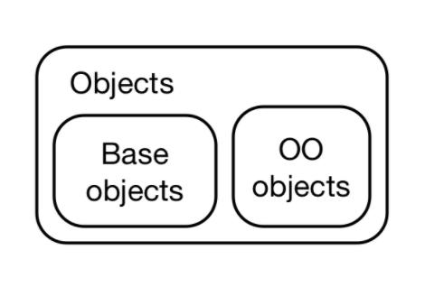
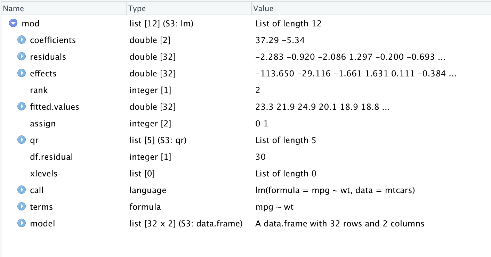

```{r setup, include=FALSE}
knitr::opts_chunk$set(echo = TRUE,
                      comment = "")
```

## Object-Oriented Programming


**Tautology**:
--
  Object-oriented programming is a programming paradigm centered around objects


--
**What's an object?**


--
Objects are collections of data and methods 

  * every object has a type (class)
  
  * the class of the object determines:
    
    * its attributes
    
    * how you can interact with the object 


--
**The key idea**: the nature of the object tells you how you can interact with the object i.e. what functions you can use 


---
### What makes OOP useful?

The main reason: 
--

**Polymorphism**

--

Polymorphism allows developer to think about a function's interface separately.


---
### What's the deal with OOP in R?


--

It's complicated. Mostly because there's a lot of different ways to do it.
  
--

Different OOP systems in R include:
  
  * S3
  
  * R6
  
  * S4  
  
--

**What's meant by an OOP system?**

--

  - a collection of language features that allow one to program in an object-oriented fashion. 
  

---
## Why is Chapter 12 necessary?


In R the term *object* gets used in two different ways:

  1. Everything is an object 
  
  2. R has object-oriented systems: S3, R6, S4
 

 
--
**Main thing**: not every object is object-oriented
  
  



---
## Do base types constitute an OOP system?

--

**No**: 

--


  * functions that act differently on different types are handled in switch statements in C 

--


  * new types are:
  
    * impossible for application developers to create
    
    * rarely created by R-core
  
  
---
## The difference between base and OOP types

OO objects have a *class* attribute

Telling the difference between base 
  


---
## The different base types

23 base types listed in Chapter 12:

  * **Vectors**: `NULL` (NILSXP), `logical` (LGLSXP), `integer` (INTSXP), `double` (REALSXP), `complex` (CPLXSXP), `character` (STRSXP), `list` (VECSXP), `raw` (RAWSXP)
  
  * **Functions**: `closure` (regular R functions, CLOSXP), `special` (internal functions, SPECIALSXP), `builtin` (primitive functions, BUILTINSXP)

  * **Environments**: `environment` (ENVSXP)
  * **S4**: `S4`  (S4SXP)
  
  * **Language Components**: `symbol` (aka name, SYMSXP), `language` (usually called calls, LANGSXP), `pairlist` (used for function arguments, LISTSXP), `expression` (EXPRSXP) 
    
  * **Esoteric**: `externalptr` (EXTPTRSXP), `weakref` (WEAKREFSXP), `bytecode` (BCODESXP), `promise` (PROMSXP), `...` (DOTSXP), `any` (ANYSXP).
    
---
## Other base types:

CRAN's [*R Internals Guide*](https://cran.r-project.org/doc/manuals/r-release/R-ints.html#SEXPTYPEs) also lists:

  * 2 previously used base types for internal factors and ordered factors have been withdrawn
  
  * R internally uses a type CHARSXP to represent strings
  

 

---
## The `numeric` base type

  1. Sometimes used to mean the `double` type
  
  2. In S3 and S4, can be used to mean either `integer` or `double`
  
  3. `is.numeric` is used to identify objects that behave like numbers. (As opposed to whether or not their type is integer.)
  
  
  

    

    
  
  
---
## Chapter 13: S3


S3 is R's oldest OO system:

  * minimalist 
  
  * very flexible 
  
  * most-commonly used system in CRAN packages 
  
  * the only OOP system used in `base` and `stats` packages
  
  * a lot different to most object-oriented systems in widely-used languages

  
  
---
## S3 objects: the basics 

What do you need for an S3 object?

--

  * a base type with a *class* attribute
  
--

  * that's it
  

--

There are no checks for correctness in S3
  
  
---
### Looking at the factor class


```{r}
f <- factor(c("a", "b", "c"))
typeof(f)
```

```{r}
attributes(f)
```

---
### Using `unclass`

You can get the base type of an S3 object using `unclass` 

```{r}
unclass(f)
```  


---
### Can I create my own class?


---
## Object styles

In the wild S3 objects can be said to be of different styles:

  1. **Vector style** objects
    - based on an underlying vector
    - may have other attributes
    - have key property that `length(x)` represents the number of observations in the vector
    
  2. **Record style** objects
    - based on vectors of equal length
  
  3. **data frames**
    - based on vectors of equal length
    - conceptually 2-dimensional
    - number of observations is the number of rows not the length
    
  4. **scalar** objects: use a list to represent a single thing
  

Chapter places emphasis on illustrating concepts using vector styled objects. 
    
  
---
## A record style object: POSIXlt

A `POSIXlt` object consists of 11 vectors: *sec*, *min*, *hour*, *mday*, *mon*, *year*, *wday*, *yday*, *isdst*, *zone*, *gmtoff*

```{r}
x <- as.POSIXlt(ISOdatetime(2020, 1, 1, 0, 0, 1:3))
unclass(x)[1:6]
```

---
## A record style object: POSIXlt

```{r}
unclass(x)[7:11]
```

---
## A record style object: POSIXlt

The attributes of a `POSIXlt` object

```{r}
attributes(x)
```


---
## A scalar object type: `lm`


```{r}
mod <- lm(mpg ~ wt, data = mtcars)
```

  
  

---
## Recommended framework for creating S3 objects

Advanced R recommends a 3-level structure for defining S3 classes:

  * **constructor**, `new_myclass()`: efficiently creates new objects with the correct structure.

  * **validator**, `validate_myclass()`: performs more computationally expensive checks to ensure that the object has correct values.

  * **helper**, `myclass()`: provides a convenient way for others to create objects of your class.
  
  
---
## Constructor guidelines

  * one argument for the object type, one argument for each attribute
    * types of each should be checked in the constructor
    


---
### Example: constructor for a factor class

```{r}
new_factor <- function(x = integer(), levels = character()) {
  stopifnot(is.integer(x))
  stopifnot(is.character(levels))

  structure(
    x,
    levels = levels,
    class = "factor"
  )
}
```


---
### Example: validator for factor class 


```{r}
validate_factor <- function(x) {
  values <- unclass(x)
  levels <- attr(x, "levels")

  if (!all(!is.na(values) & values > 0)) {
    stop(
      "All `x` values must be non-missing and greater than zero",
      call. = FALSE
    )
  }

  if (length(levels) < max(values)) {
    stop(
      "There must be at least as many `levels` as possible values in `x`",
      call. = FALSE
    )
  }

  x
}
```


---
### Example: helper for a factor class

```{r}
factor <- function(x = character(), levels = unique(x)) {
  ind <- match(x, levels)
  validate_factor(new_factor(ind, levels))
}
```


    


---
## Interacting with S3 objects: 

To interact with an S3 object, you have to use functions. There are two types of functions involved:

  1. **generic** functions: 
    * have well-defined interfaces 
    * serve as intermediaries
    * choose which specific **method** is called based on the class of the input  
  
  2. **methods**:
    * are written to be used with a specific class 

  

---
## Example of a generic function: `print`


We can use `sloop::s3_methods_generic` to see the methods associated with a generic function.


```{r eval = FALSE}
sloop::s3_methods_generic("print")
```
```{r echo = FALSE}
rmarkdown::paged_table(sloop::s3_methods_generic("print"), 
                       options = list(rows.print = 8))
```

We can see that there are many methods defined that can potentially be called when the generic `print` function is called. 


---
## Determining which method was used


`sloop::s3_dispatch` 

```{r}
library(sloop)
x <- matrix(1:10, nrow = 2)
s3_dispatch(mean(x))
```

```{r}
s3_dispatch(print(ordered("x")))
```

```{r}
s3_dispatch(print(Sys.time()))
```


---
### Writing your own methods 


If you want to write your own method, there are 2 cases:

  1. There's a pre-existing generic function
    
    *  create a new method `generic.class`
  
  2. There is not a pre-existing generic function.
    
    1. Create a new generic
    
    2. Create a method 
    


---
## Creating your own method for a pre-existing generic 


---
### Creating your own generic 


```{r}
my_new_generic <- function(x) {
  UseMethod("my_new_generic")
}
```

 
 
---
## How `UseMethod` works

`UseMethod` :
  1. creates a vector of method names, `paste0("generic", ".", c(class(x), "default"))`
  
  2. looks for each member of the vector in turn 

Example: 

```{r}
x <- Sys.time()
class(x)
```

```{r}
s3_dispatch(sum(Sys.time()))
```
  


---
## Inheritance in S3


  * the *class* attribute can be a vector
  
  * if a method is not found in the first item in the *class* vector, R will look for a method for the second and so on ...
  
  * a method can delegate work by calling `NextMethod`. `s3_dispatch` reports delegation with `->`
  
  
---
### Example of S3 inheritance 

First, create a vector of the class *ordered*
  
```{r}
my_vector <- ordered(c("x", "y"))
class(my_vector)
```

*ordered* is a subclass of *factor*


--

Now subset the created vector
--
```{r}
s3_dispatch(my_vector[1])
```

`[.ordered` was not available, so R moved on to `[.factor` which then delegated to `[`

---
### On subclasses and superclasses

  * S3 imposes no constraints on the relationship between sub and superclasses
  
  * Recommended practice
  
    * The base type of the subclass should be that same as the superclass.

    * The attributes of the subclass should be a superset of the attributes of the superclass.
  
---
## Dispatch Details

There are a few situations where method dispatch gets weird:
  
  * internal generics
  
  * group generics 
  
  * double dispatch

---
### S3 dispatch with base objects


The *class* attribute of a base object does not uniquely determine the method called 

```{r}
x1 <- 1:5
class(x1)
s3_dispatch(mean(x1))
```
```{r}
x2 <- structure(x1, class = "integer")
class(x2)
s3_dispatch(mean(x2))
```

---
### What actually happened?


Dispatch is actually done using the implicit object.

The implicit object is based on:
  
  1. The string “array” or “matrix” if the object has dimensions
  
  2. The result of `typeof()` with a few minor tweaks
  
  3. The string “numeric” if object is “integer” or “double”
  
We can use `sloop::s3_class` to get the implicit object type 

```{r}
s3_class(x1)
```

```{r}
s3_class(x2)
```


---
### Internal Generics

Some base functions, like `[`, `sum()`, and `cbind()`, are called internal generics 

  * they don’t call `UseMethod()` 
  
  * instead call the C functions `DispatchGroup()` or `DispatchOrEval()`

```{r}
s3_dispatch(Sys.time()[1])
```


---
### Group Generics

There are 4 group generics:

  * **Math**: `abs`, `sign`, `sqrt`, `floor`, `cos`, `sin`, `log`, etc 

  * **Ops**: `+`, `-`, `*`, `/`, `^`, `%%`, `%/%`, `&`, `|`, `!`, `==`, `!=`, `<`, `<=`, `>=`, and `>`.

  * **Summary**: `all`, `any`, `sum`, `prod`, `min`, `max`, and `range`.

  * **Complex**: `Arg`, `Conj`, `Im`, `Mod`, `Re`
  
--

My understanding: you write `Math.class` (or `Ops.class`, `Summary.class`, or `Complex.class`) and it becomes a candidate if any of the group members gets called on your class.
  
---
### Some facts about Group Generics

  * Defining a single group generic for your class overrides the default behaviour for all of the members of the group.
  
  * Most group generics involve a call to NextMethod()
  
```{r}
Math.difftime <- function(x, ...) {
  new_difftime(NextMethod(), units = attr(x, "units"))
}
```
  

---
### Double dispatch

**double dispatch**: a special dispatch procedure required by members of the Ops group because:

  * Many of the functions in the Ops groups are binary operators 
    
    * the method called should make sense considering both operands
    
    * many operators should be commutative

Example:

```{r}
date <- as.Date("2017-01-01")
integer <- 1L
```

```{r}
date + integer
```

```{r}
integer + date
```


---
### Double dispatch details

Look up the methods for each operator. There are 3 cases:

  1. The methods are the same: use that method

  2. The methods are different: use the internal method with a warning.

  3. One method is internal: use the other method.
  

---
## The End

