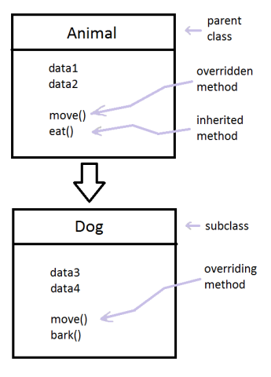

class: left, top

```{r setup, include=FALSE, warnings=FALSE}
options(htmltools.dir.version = FALSE)
options(crayon.enabled = TRUE)
library(tidyverse)
```

## OOP - Intro

Three types to choose in R:

- **S3** (base)
  - base R, use it if possible! solving simple problems
  - *S4* more strict rewrite of S3
  - *RC* special case of S4, objects are mutable (can be modified in place)
- **R6**
  - model objects independently of R (web API)
  - similar to RC, will be discussed in R6 Section
- **S4**
  - planning a big project? go for S4
  - used by Bioconductor (https://www.bioconductor.org/developers/package-guidelines/)

---
class: left, top

### Two main paradigms

- **encapsulated OOP**
  - method belongs to objects or classes `object.method(arg1, arg2)`, eg. R6
- **functional OOP**
  - method belong to generic function `generic(object, arg2, arg3)`

--

*functional OOP* in my opinion should be called *multiple dispatch*:

> A method no longer “belongs” to a class. Methods belong primarily to the generic function for which they are defined.


<small>
How S4 Methods Work, John Chambers, August 30, 2006
https://developer.r-project.org/howMethodsWork.pdf
</small>

---
class: left, top

### Multiple Dispatch Example

```{r}
mde <- function(data, signature) {
  switch(signature,
    char = str_count(data),
    number = sum(data)
  )
}
```

```{r}
mde("test", "char")
mde(c(10, 20), "number")
```


> The process of finding the correct method given a class is called **method dispatch**

> *functional OOP*: This is called functional because from the outside it looks like a regular function call, and internally the components are also functions..

---

class: left, top

## OOP - Glossary

- **polymorphism** - The Main Reason to use OOP
  - use the same function form for different types of input

--
```{r}
dplyr::glimpse(ggplot2::diamonds$cut)
base::summary(ggplot2::diamonds$cut)
```
--
```{r}
dplyr::glimpse(diamonds$carat)
base::summary(diamonds$carat)
```

---
class:center, middle

> Conceptually, a generic function extends the idea of a function in R by allowing different methods to be selected corresponding to the classes of the objects supplied as arguments in a call to the function. 


---

class: left, top

## OOP - Glossary

> OOP allows us to extent to class to also add new summary functions for new types (which would not be possible for with if_else from the outside)

--

- **encapsulation**
  - user don't worry about the object details, they are hidden
--

- **class**
  - describes object
  - defined **fields** contained in every instance
- **method**
  - describes what the object of class can do

--

> Classes are hierarchy, if one method does not exist it will use the parent method. The child **inherits** its parents methods and traits. (method dispatch == process to find the correct method given a class)

---
class: center, middle

```{r, echo=FALSE, out.width="", fig.cap="By User:Crashed greek - User:Crashed greek, CC BY 4.0, https://commons.wikimedia.org/w/index.php?curid=64193508"}

```

---
class: left, top

## Inheritance

Example:

- ordered factor *inherits* from a regular factor
- generalized linear model *inherits* from a linear model.

---
class: left, middle

## sloop  - sail the seas of OOP

```{r}
library(sloop)
sloop::otype(1:10)

sloop::otype(mtcars)

mle_obj <- stats4::mle(function(x = 1) (x - 2) ^ 2)
sloop::otype(mle_obj)
```

---
class: center, middle

## Base versus OO objects


---
class: left, middle

## Base versus OO objects

Base Objects do not have a class attribute to access

```{r}
attributes(1337L)$class
# class can be misleading with base objects
class(1337L)
# we can show class vector with sloop
# returns the implicit class that the S3 and S4 systems will use
sloop::s3_class(1337L)
```
> Note: `numeric` in S3 and S4 can mean either integer or double

---
class: left, middle

## Base versus OO objects 2

Only OO has a class attribute, but every object has a base type:

```{r}
typeof(1337L)
typeof(trees)
attr(trees, "class")
```

Base types are mostly written in C and use switch statements --> we cannot simply add new base types without manipulating source code.

---
class: left, middle

```{r}
# INTSXP, Vectors Chapter 3
typeof(1L)
# CLOSXP, Functions Chapter 6
typeof(mean)
# ENVSXP, Environments Chapter 7
typeof(globalenv())
# S4 Chapter 15 (don't inherit from any base type)
mle_obj <- stats4::mle(function(x = 1) (x - 2)^2)
typeof(mle_obj)
```

---
class: left, top

## Primitive function

```{r}
getGeneric("+")
showMethods("+")
```


