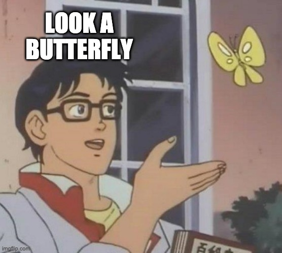

class: left, middle
```{r setup, include=FALSE, warnings=FALSE}
options(htmltools.dir.version = FALSE)
options(crayon.enabled = TRUE)
library(tidyverse)
library(sloop)
```
# S3

- Base
- `class` Attribute

```{r}
f <- factor(c("a", "b", "c"))
typeof(f)
attributes(f)
```

---
class: left, middle

## Generic and Class

If you pass S3 to generic it will behave differently, accordance to their implementation. 

> ... extended function objects, containing information used in creating and dispatching methods for this function ...

Generic is a middleman with interface and looks for the correct method for specific class (**method dispatch**).

---
class:left, top

```{r}
sloop::ftype(str)
time <- strptime(c("2017-01-01"), "%Y-%m-%d")

str(time)

str(unclass(time))

```

---
class:left, top

## Method Dispatch

```{r}
sloop::s3_dispatch(str(time))
```

We could call this generic method manually, but its hidden from us and thats good.

```{r}
utils:::str.POSIXt(time)
```

- `sloop::ftype()` check if method or class
- `s3_get_method()` source code of methods, which are not exported

---
class:left, top

## S3 Classes

```{r}
animal <- structure(list(), class = "animal")
class(animal)
inherits(animal, "animal")
```

We could also change classes of base objects crazy aren't?

```{r}
class(f)
class(f) <- "Date"
f
```

---
class:left, middle

## Good Pratice

- A low-level **constructor** - `new_myclass()`
  - creates new objects
- A **validator**, `validate_myclass()`
  - checks to ensure that the object has correct values
- A user-friendly **helper**, `myclass()`
  - help others create objects of your class
  
---
class:left, top
### Constructor

```{r}
new_Taxa <- function(taxon = character(), kingdom = "Animalia") {
  stopifnot(is.character(taxon))
  kingdom <- match.arg(kingdom, c("Animalia", "Plantae", "Fungi"))
  structure(
    taxon, 
    class = "Taxa",
    kingdom = kingdom
  )
}
new_Taxa("Dog")
```

> The constructor is a developer function: it will be called in many places, by an experienced user. That means it’s OK to trade a little safety in return for performance, and you should avoid potentially time-consuming checks in the constructor.

---
class:left, top

### Validator

- for performance reason we should create a own function

```{r}
validate_Taxa <- function(x) {
  values <- unclass(x)
  if (length(values) != length(unique(values))) {
    warning(
      "All Taxa must be unique.",
      call. = FALSE
    )
    return(FALSE)
  }
  x
}

validate_Taxa(new_Taxa(c("Dog", "Dog")))
```

---
class: left, top

### Helpers

- Have the **same name as the class**, e.g. `Taxa()`
- **Finish** 
  - calling the constructor
  - and the validator
- **error messages** for end-user
- **user interface**
  - default values
  - useful conversions

---
class: left, top

### Helpers

```{r}
Taxa <- function(
    taxon_name = character(),
    kingdom = "Animalia"
  ) {
  taxon_name <- trimws(taxon_name)
  kingdom <- trimws(kingdom)
  
  validate_Taxa(
    new_Taxa(taxon_name, kingdom)
    )
}

pets <- Taxa(c("Dog", "Cat"), "Animalia")
attributes(pets)
```

---
class:left, top

### Why Classes, Complex Example - "Class: lm"

```{r}
(mod <- lm(cyl ~ ., data = mtcars))
typeof(mod)
```
---
class:left, top

### Why Classes, Complex Example - "Class: lm"

```{r}
attributes(mod)
map_chr(mod, typeof)
```

---
class:left, top

```{r}
new_lm <- function(
  coefficients, residuals, effects, rank, fitted.values, assign,
  qr, df.residual, xlevels, call, terms, model
) {
  
  stopifnot(
    is.double(coeficients) # check inputs ............ 
  )
  
  structure(
    list(
      coefficients = coefficients,
      residuals = residuals,
      effects = effects,
      rank = rank, 
      fitted.values = fitted.values,
      assign = assign,
      qr = qr,
      df.residual = df.residual,
      xlevels = xlevels,
      call = call,
      terms = terms, 
      model = model
    ),
    class = "lm"
  )
}
```


---
class: left, top

### Generic (Method) Functions

> S3 generic is to perform method dispatch, i.e. find the specific implementation for a class

```{r}
print
```

```{r}
sloop::s3_dispatch(print(Sys.Date()))
```

---
class: left, top

### Generic (Method) Functions

Find all available methods:

```{r}
sloop::s3_methods_generic("print")
```

---
class: left, top
### Writing your own

If you want to write your own method, there are 2 cases:

1. There's a pre-existing generic function
  - create a new method generic.class
2. There is not a pre-existing generic function
  - create a new generic
  - create a method
  
---
class: left, top
### Writing your own
  
```{r}
print_animal <- function(x) { # Generic Function
  UseMethod("print_animal")
}
print_animal.default <- function(x, ...){ # Default Method
  print("No specific method defined")
}
print_animal.Taxa <- function(x, ...){ # Method for Class = Taxa
  cat(x)
}
print_animal(pets)
print_animal(1)
sloop::s3_dispatch(print_animal(1))
```

---
class: left, top
### Inheritance

```{r}
class(ordered("x"))
```

- `ordered` is a subclass of factor
- `factor` is a superclass of ordered

No subclass lets use the inherited superclass:
```{r}
s3_dispatch(print(ordered("x")))
```

---
class: left, top
### Inheritance - NextMethod()

```{r}
print.Taxa <- function(x, ...) {
  print(glue::glue("Your Taxa **{stringr::str_c(x, collapse = ', ')}** belongs to Kingdom of **{attr(x, 'kingdom')}**"))
  invisible(x)
}
sloop::s3_dispatch(print(pets))
print(pets)
```

---
class: left, top
### Inheritance - NextMethod()

If we subset the class attributes get lost:

```{r}
print(pets[1])
sloop::s3_dispatch(print(pets[1]))
```

Workaround create dispatch for subsetting and create a new Taxa Class Object:

```{r}
`[.Taxa` <- function(x, i) {
  new_Taxa(NextMethod())
}
print(pets[1])
```

---
class: left, top
### Subclass

- add `...`
- add `class` argument

```{r}
new_TaxaSimple <- function(
  taxon = character(), 
  kingdom = "Animalia", 
  ..., 
  class = character()
  ) {
  stopifnot(is.character(taxon))
  kingdom <- match.arg(kingdom, c("Animalia", "Plantae", "Fungi"))
  structure(
    taxon,
    kingdom = kingdom,
    ...,
    class = c(class, "Taxa")
  )
}

```

---
class: left, top
### Subclass

```{r}

new_Science <- function(
  taxon = character(), kingdom = "Animalia", latin = ""
  ) {
  new_TaxaSimple(taxon, kingdom, latin = latin, class = "Science")
}

dogScience <- new_Science(taxon = "Dog", kingdom = "Animalia", latin = "Canis lupus")

sloop::s3_dispatch(print(dogScience))

class(dogScience)

dogScience

```

---
class: left, top
### Subclass

```{r, results='asis'}

print.Science <- function(x, ...) {
  print(
    glue::glue(
      "
      **Name**: <span style='color:green!important'>{x}</span></br> 
      **Species**: *{attr(x, 'latin')}*;
      <br/> **Kingdom:** {attr(x, 'kingdom')}
      "
      )
    )
  invisible(x)
}

print(dogScience)

```

---
class: middle, top
### Subclass

> If you build your class using the tools provided by the vctrs package, [ will gain this behaviour automatically. You will only need to provide your own [ method if you use attributes that depend on the data or want non-standard subsetting behaviour. See ?vctrs::new_vctr for details.

---
class: middle, center
### Skipping Dispatch Details



