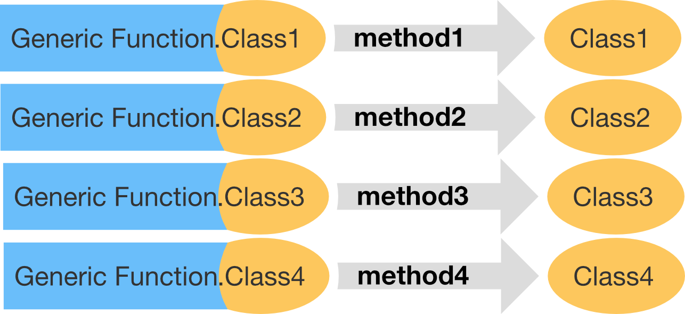

```{r setup, include=FALSE}
library(learnr)
library(purrr)
knitr::opts_chunk$set(echo = TRUE)
```

# Chapter 13 - S3 part1
## 13.1 Introduction

Some S3 __fun facts__: 

- R's first and simplest OO system
- the only OO system used in the base and stats
- most commonly used system in CRAN packages
- very flexible

__Outline__

- __Section 13.2__: rapid overview of all the main components of S3
- __Section 13.3__: details of creating a new S3 class
- __Section 13.4__: S3 generics and methods


For interactive helper functions we use:

```{r, include=TRUE}
library(sloop)
```

## 13.2 Basics

S3 object = base type + `class` attribute (+ `...`)

An S3 object behaves differently from its underlying base type whenever it’s passed to a __generic__ (short for generic function). 

What is a __generic__?

Depending on the class of an argument to the __generic__ it uses a different implementation.

You can use `sloop::ftype()` to find out if a function is generic: 

```{r ftype, exercise=TRUE}
ftype(print)
ftype(str)
ftype(summary)
```

```{r}
time <- strptime(c("2017-01-01", "2020-05-04 03:21"), "%Y-%m-%d")
str(time) # generic `str()` hides the fact that `POSIXlt` is built on top of a list
attributes(time) # attributes shows that it has a class, and several names
str(unclass(time)) # using `str()` on unclassed time shows the list structure
```


You can use `sloop::s3_dispatch()` for details on the method dispatch

```{r}
f <- factor(c("a", "b", "c"))
s3_dispatch(print(f))
```

```{r}
df <- data.frame(names=c("a", "b", "c"), age=c(20, 30, 66), income=factor(c("low", "middle", "high")))
summary(df)
s3_dispatch(summary(df$names))
s3_dispatch(summary(df$age))
s3_dispatch(summary(df$income))
```

Under the hood the generic is calling class specific functions with a special naming scheme (you should never use them manually):




With `sloop::s3_get_method` you can see the source code for most S3 __methods__

```{r, error=TRUE}
weighted.mean.Date

s3_get_method(weighted.mean.Date)

```


## 13.2.1 Exercises

1. Describe the difference between `t.test()` and `t.data.frame()`. When is each function called?

##

1. Describe the difference between `t.test()` and `t.data.frame()`. When is each function called?

`t.test()`:

```{r}
ftype(t.test)
```

`t.test()` is a generic. `t.test()` has a `.` in its name, even though it doesn't call a specific class. In this case it is just to separate the two words "t" and "test". 


`t.data.frame()`:

`t(x)`

```{r}
ftype(t.data.frame)
```

`t.data.frame()` is actually the function `t()` which is called with a specific method for the class `data.frame`. It is called when you pass a `data.frame` to `t()`. 

## 

2. Make a list of commonly used base R functions that contain `.` in their name but are not S3 methods.

##

2. Make a list of commonly used base R functions that contain `.` in their name but are not S3 methods.

```{r}
ftype(data.frame)
ftype(is.data.frame)
ftype(Sys.Date)

ftype(as.character)
ftype(is.na)

ftype(is.logical)

ftype(new.env)
ftype(set.seed)

ftype(as.data.frame)
```

Go to packages -> base for a list of base functions. 

## 

3. What does the `as.data.frame.data.frame()` method do? Why is it confusing? How could you avoid this confusion in your own code?

## 

3. What does the `as.data.frame.data.frame()` method do? Why is it confusing? How could you avoid this confusion in your own code?

`as.data.frame.data.frame()` is called when you pass a `data.frame` to `as.data.frame()`:

```{r}
s3_dispatch(as.data.frame(df))
```

You can avoid confusion by just calling `as.data.frame()`.


## 13.3 Classes

S3 has no formal definition of a class: to make an object an instance of a class, you simply set the class attribute.

```{r}
# Create and assign class in one step
x <- structure(list(), class = "my_class")

# Create, then set class
x <- list()
class(x) <- "my_class"
```

__Determine the class__ of an object: 

```{r}
class(x)

inherits(x, "my_class")

inherits(x, "your_class")

```

__S3 has no checks for correctness__:

```{r, error=TRUE}
# Create a linear model
mod <- lm(log(mpg) ~ log(disp), data = mtcars)
class(mod)
print(mod)
class(mod) <- "Date"

# Unsurprisingly this doesn't work very well
print(mod)
```

For creating your own class, you should provide: 

- A low-level __constructor__, `new_myclass()`, that efficiently creates new objects with the correct structure.

- A __validator__, `validate_myclass()`, that performs more computationally expensive checks to ensure that the object has correct values.

- A user-friendly __helper__, `myclass()`, that provides a convenient way for others to create objects of your class.

## Constructors

The constructor should follow three principles:

- Be called `new_myclass()`
- Have one argument for the base object, and one for each attribute
- Check the type of the base object and the types of each attribute

A constructor for `difftime`: 

```{r}
new_difftime <- function(x = double(), units = "secs") {
  stopifnot(is.double(x))
  units <- match.arg(units, c("secs", "mins", "hours", "days", "weeks"))

  structure(x,
    class = "difftime",
    units = units
  )
}

new_difftime(c(1, 10, 3600), "secs")

new_difftime(52, "weeks")
```

## Validators

A constructor only checks that types are correct --> Validators for more complex classes

For the constructor of an object with class factor...

```{r, error=TRUE}
new_factor <- function(x = integer(), levels = character()) {
  stopifnot(is.integer(x))
  stopifnot(is.character(levels))

  structure(
    x,
    levels = levels,
    class = "factor"
  )
}

new_factor(1:5, "a")

new_factor(0:1, "a")
```

... we could build this validator: 

```{r, error=TRUE}
validate_factor <- function(x) { # the argument of this function, is the output of the constructor function
  values <- unclass(x)
  levels <- attr(x, "levels")

  if (!all(!is.na(values) & values > 0)) {
    stop(
      "All `x` values must be non-missing and greater than zero",
      call. = FALSE
    )
  }

  if (length(levels) < max(values)) {
    stop(
      "There must be at least as many `levels` as possible values in `x`",
      call. = FALSE
    )
  }

  x
}

validate_factor(new_factor(1:5, "a"))

validate_factor(new_factor(0:1, "a"))
```

```{r prepare-validator}
new_factor <- function(x = integer(), levels = character()) {
  stopifnot(is.integer(x))
  stopifnot(is.character(levels))

  structure(
    x,
    levels = levels,
    class = "factor"
  )
}
```

```{r validator, exercise=TRUE, exercise.setup="prepare-validator"}
x <- new_factor(1:5, "a")
unclass(x)
attr(x, "levels")
```

## Helpers

A helper should always: 

- Have the same name as the class, e.g. `myclass()`
- Finish by calling the constructor, and the validator, if it exists
- Create carefully crafted error messages tailored towards an end-user
- Have a thoughtfully crafted user interface with carefully chosen default values and useful conversions

__Sometime the helper just needs to coerce__ 

```{r, error=TRUE}
new_difftime(1:10)
```

Problem: integer is passed as argument, where double is expexted. 

__Helper:__

```{r}
difftime <- function(x = double(), units = "secs") {
  x <- as.double(x) # coerces input to double
  new_difftime(x, units = units) # calls the constructor, to create an object with class attribute
}

difftime(1:10)
```

## 13.3.4 Exercises

1. Write a constructor for data.frame objects. What base type is a data frame built on? What attributes does it use? What are the restrictions placed on the individual elements? What about the names?

## 

1. Write a constructor for data.frame objects. What base type is a data frame built on? What attributes does it use? What are the restrictions placed on the individual elements? What about the names?

```{r}
new_data.frame <- function(x= list(), names=character(), row.names){
  stopifnot(is.list(x))
  stopifnot(is.character(names))
  structure(x, 
            class="data.frame", 
            names=names, 
            row.names=row.names)
}
new_data.frame(list(c("a", "b", "c"), 1:3), names=c("letters", "numbers"), row.names=1:3)
```

A data frame is built on a list. It uses the attributes "names", and "row.names". 

Restrictions? Names?

```{r 13-3-4-1, exercise=TRUE}
# space for more
```

## 

5. Read the documentation for utils::as.roman(). How would you write a constructor for this class? Does it need a validator? What might a helper do?

## 

5. Read the documentation for utils::as.roman(). How would you write a constructor for this class? Does it need a validator? What might a helper do?

```{r 13-3-4-5, exercise=TRUE}
# space to play
validate_as.roman <- function(x){
  values <- unclass(x)
  if (!all(!is.na(values) & values > 0 & values < 3899)) { # I guess it would also work with only the !is.na()-part. Any numbers outside the range 0:3899 will be coerced to NA by the constructor
    stop(
      "All `x` values must be non-missing and between 1 and 3899",
      call. = FALSE
    )
  }
  x
}

r1 <- as.roman(2020)
r2 <- as.roman(4000)

validate_as.roman(r1)
validate_as.roman(r2)
```

## 13.4 Generics and methods

Job of S3 generic --> find the right implementation for a class. 


```{r}
mean
```

Creating your own generic: 

```{r}
my_new_generic <- function(x) {
  UseMethod("my_new_generic")
}
```

## Method dispatch 

What does the `UseMethod()` do? 

`paste0("generic", ".", c(class(x), "default"))`

```{r}
x <- Sys.Date()
s3_dispatch(print(x))
```


```{r}
x <- matrix(1:10, nrow = 2)
s3_dispatch(mean(x))
s3_dispatch(sum(Sys.time()))
```

## Finding methods

- `sloop::s3_methods_generic()`: Let's you find all possible methods defined for a generic
- `sloop::s3_methods_class()`: Let's you find all possible methods defined for a class

```{r}
s3_methods_generic("mean")
s3_methods_class("ordered")
```

## Creating methods

- First, you should only ever write a method if you own the generic or the class. R will allow you to define a method even if you don’t, but it is exceedingly bad manners. Instead, work with the author of either the generic or the class to add the method in their code.
- A method must have the same arguments as its generic. This is enforced in packages by R CMD check, but it’s good practice even if you’re not creating a package.

## 13.4.4 Exercises

1. Read the source code for `t()` and `t.test()` and confirm that `t.test()` is an S3 generic and not an S3 method. What happens if you create an object with class `test` and call `t()` with it? Why?

```
x <- structure(1:10, class = "test")
t(x)
```

##

1. Read the source code for `t()` and `t.test()` and confirm that `t.test()` is an S3 generic and not an S3 method. What happens if you create an object with class `test` and call `t()` with it? Why?

```{r}
x <- structure(1:10, class = "test")
t(x)
```

```{r 13-4-4-1, exercise=TRUE}
ftype(t)
ftype(t.test)
s3_dispatch(t(x))
```

##

2. What generics does the `table` class have methods for?

##

2. What generics does the `table` class have methods for?

```{r 13-4-4-2, exercise=TRUE}
s3_methods_class("table")
```

##

3. What generics does the `ecdf` class have methods for?

##

3. What generics does the `ecdf` class have methods for?

```{r 13-4-4-3, exercise=TRUE}
s3_methods_class("ecdf")
```

##

4. Which base generic has the greatest number of defined methods?

##

4. Which base generic has the greatest number of defined methods?

```{r}
generic_names <- Filter(isGeneric,ls(all.names=TRUE, env = baseenv())) # Finding all function names of base generics
generic_methods <- map(generic_names, s3_methods_generic) # Finding all associated methods
no_methods <- map_int(generic_methods, nrow) # Create a numeric vector of the number of methods per generic
generic_names[which.max(no_methods)] # get the name of the generic with the most methods
```

##

5. Carefully read the documentation for `UseMethod()` and explain why the following code returns the results that it does. What two usual rules of function evaluation does `UseMethod()` violate?

```
g <- function(x) {
  x <- 10
  y <- 10
  UseMethod("g")
}
g.default <- function(x) c(x = x, y = y)

x <- 1
y <- 1
g(x)
```

##

5. Carefully read the documentation for `UseMethod()` and explain why the following code returns the results that it does. What two usual rules of function evaluation does `UseMethod()` violate?

```{r}
g <- function(x) {
  x <- 10
  y <- 10
  UseMethod("g")
}
g.default <- function(x) c(x = x, y = y)

x <- 1
y <- 1
g(x)
```

It violates __name masking__ (see [6.4.1](https://adv-r.hadley.nz/functions.html#name-masking)).

```{r 13-4-4-5, exercise=TRUE}
# space to play
```

##

6. What are the arguments to `[`? Why is this a hard question to answer?

##

6. What are the arguments to `[`? Why is this a hard question to answer?

```{r 13-4-4-6, exercise=TRUE}
args(`[`)
```


## More exercises

13.2.1 - 4. Describe the difference in behaviour in these two calls.

```
set.seed(1014)
some_days <- as.Date("2017-01-31") + sample(10, 5)

mean(some_days)

mean(unclass(some_days))
```

## 

13.2.1 - 4. Describe the difference in behaviour in these two calls.

```{r}
set.seed(1014)
some_days <- as.Date("2017-01-31") + sample(10, 5)

mean(some_days)

mean(unclass(some_days))
```

Dates are represented as the number of days since 1970-01-01. 

So when we unclass `some_days` it is becoming simply a double:

```{r 13-2-1-4, exercise=TRUE}
typeof(unclass(some_days))
```

and the mean of `unclass(some_days)` becomes the mean of days since 1970-01-01 for these Dates.

##

13.2.1 - 5. What class of object does the following code return? What base type is it built on? What attributes does it use?

```
x <- ecdf(rpois(100, 10))
x
```

##

13.2.1 - 5. What class of object does the following code return? What base type is it built on? What attributes does it use?

```{r}
x <- ecdf(rpois(100, 10))
x
```

```{r 13-2-1-5, exercise=TRUE}
class(x)
str(unclass(x))
attributes(x)
```

##

13.2.1 - 6. What class of object does the following code return? What base type is it built on? What attributes does it use?

```
x <- table(rpois(100, 5))
x
```

## 

13.2.1 - 6. What class of object does the following code return? What base type is it built on? What attributes does it use?

```{r}
x <- table(rpois(100, 5))
x
```

```{r 13-2-1-6, exercise=TRUE}
class(x)
str(unclass(x))
attributes(x)
```

## 

13-3-4 - 2. Enhance my `factor()` helper to have better behaviour when one or more values is not found in levels. What does `base::factor()` do in this situation?

##

13-3-4 - 2. Enhance my `factor()` helper to have better behaviour when one or more values is not found in levels. What does `base::factor()` do in this situation?

```{r prepare-13-3-4-2}
factor <- function(x = character(), levels = unique(x)) {
  ind <- match(x, levels)
  validate_factor(new_factor(ind, levels))
}

factor(c("a", "a", "b"))
```

```{r 13-3-4-2, exercise=TRUE, exercise.setup="prepare-13-3-4-2"}

```

```{r map-select-name, exercise=TRUE, exercise.setup="prepare-maps"}

```

## 

13-3-4 - 3. Carefully read the source code of `factor()`. What does it do that my constructor does not?

##

13-3-4 - 3. Carefully read the source code of `factor()`. What does it do that my constructor does not?

Hadley's `nes_factor()`

```
function(x = integer(), levels = character()) {
  stopifnot(is.integer(x))
  stopifnot(is.character(levels))

  structure(
    x,
    levels = levels,
    class = "factor"
  )
}
```

`base::factor()`

```
function (x = character(), levels, labels = levels, exclude = NA, 
    ordered = is.ordered(x), nmax = NA) 
{
    if (is.null(x)) 
        x <- character()
    nx <- names(x)
    if (missing(levels)) {
        y <- unique(x, nmax = nmax)
        ind <- order(y)
        levels <- unique(as.character(y)[ind])
    }
    force(ordered)
    if (!is.character(x)) 
        x <- as.character(x)
    levels <- levels[is.na(match(levels, exclude))]
    f <- match(x, levels)
    if (!is.null(nx)) 
        names(f) <- nx
    if (missing(labels)) {
        levels(f) <- as.character(levels)
    }
    else {
        nlab <- length(labels)
        if (nlab == length(levels)) {
            nlevs <- unique(xlevs <- as.character(labels))
            at <- attributes(f)
            at$levels <- nlevs
            f <- match(xlevs, nlevs)[f]
            attributes(f) <- at
        }
        else if (nlab == 1L) 
            levels(f) <- paste0(labels, seq_along(levels))
        else stop(gettextf("invalid 'labels'; length %d should be 1 or %d", 
            nlab, length(levels)), domain = NA)
    }
    class(f) <- c(if (ordered) "ordered", "factor")
    f
}
```

base `factor()` gives a class either "ordered" or "factor". 

## 

13-3-4 - 4. Factors have an optional “contrasts” attribute. Read the help for C(), and briefly describe the purpose of the attribute. What type should it have? Rewrite the new_factor() constructor to include this attribute.

```{r 13-3-4-4, exercise=TRUE}
# space to play

```

## 


