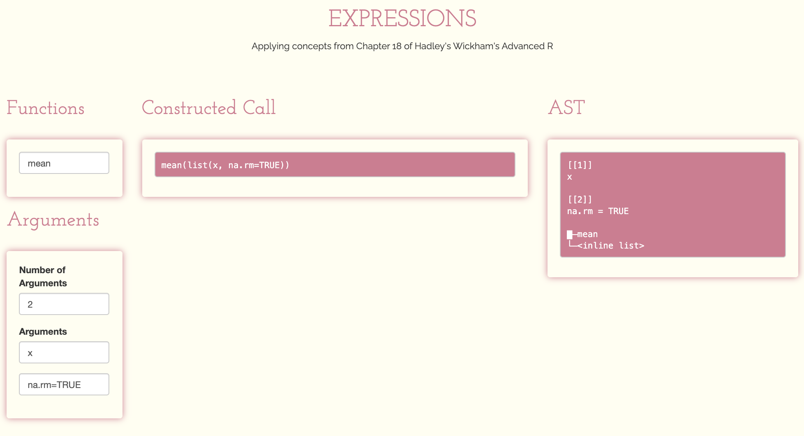

```{r xaringan-themer, include = FALSE}
library(xaringanthemer)
library(rlang)
library(lobstr)
library(tidyverse)
library(gt)
mono_light(
  base_color = "#3092FF",
  header_font_google = google_font("Josefin Sans"),
  text_font_google   = google_font("Montserrat", "300", "300i"),
  code_font_google   = google_font("Droid Mono"), 
)
beer_reviews <- readr::read_csv(here::here('data/beer_reviews.csv.gz'))
```

<style>
.parsing {
  width: 50%;
  padding: 30px;
  margin: 130px;
}

.remark-code-line {
  font-size: 0.7em !important;
}

.footnote {
  font-size: 0.5em;
}

.blue {
  border: solid 2px steelblue;
  padding: 10px;
}

table.gt_table {
  font-size: 10px;
  width: 100%;
}

.padding {
  margin: 10px;
}

.space {
  margin-top: 150px;
}
</style>

# A note on vocabulary

- Expression
- Parsing
- Deparsing
- Evaluating


```{r, eval=FALSE}
ggplot(x = "other_color")
```

### *Here's a stab:* 

An **expression** is a list of calls, which can be created through **parsing** text. These expressions can become text again via **deparsing**

---

# Parsing vs Parser ...?

> Parsing is the process of analyzing text made of a sequence of tokens to determine its grammatical structure with respect to a given (more or less) formal grammar. The parser then builds a data structure based on the tokens.


.space[
...but we use the parse function to... convert type character to expression?

```{r}
x2 <- parse(text = "2 * a")
class(x2)
```
]

.footnote[
We can `parse` expressions, simulating how the *parser* creates expressions before compiling code? Is that right? 
]

---

# The Shiny App

```{r, echo=FALSE}

```


---

# Abstract Syntax Trees

.pull-left[
```{r}
lobstr::ast(
  round(
    mean(beer_reviews$review_overall)
  , 2)
)
```
]

.pull-right[
```{r}
lobstr::ast(
if (x == TRUE) {
  y <- yes
} else {
  y <- no
}
)
```
]

.footnote[
*Abstract* because `(` are implicit, and comments aren't included 
]

---

class: inverse, hide-logo
# Expressions

* Constants
* Symbols
* Calls

---

# Constants

```{r}
rlang::is_syntactic_literal("beer_review")
```


.footnote[ **Constants are self quoting** ]

---

# Symbols

Represent the name of an object. This is not the same as a string! 

.pull-left[

### Using a String 

```{r}
beer_reviews %>%
  dplyr::filter(!!"review_overall" >= 5) %>%
  dplyr::pull(review_overall) %>%
  head()
```
]

.pull-right[

### Using a sym

```{r}
beer_reviews %>%
  dplyr::filter(!!sym("review_overall") >= 5) %>%
  dplyr::pull(review_overall) %>%
  head()
```
]

---

# Calls

.blue[
```{r}
x <- expr(dplyr::filter(beer_reviews, review_overall >= 5))

typeof(x)
is.call(x)
```
]

.pull-left[
Look at arguments in list form

```{r}
as.list(x[-1])
```
]


.pull-right[
Why isn't `review_overall >= 5` broken into its sub-components

```{r}
ast(
  dplyr::filter(beer_reviews, review_overall >= 5)
)
```
]

---

class: inverse, hide-logo
# Parsing and Grammar

---

# Operator precedence

```{r, echo=FALSE}
gt(
  tibble(
    operator = c(":: :::","$ @", "[ [[","^",
                 "- +",":","%any%","* /","+ -",
                 "< > <= >= == !=	", "!","& &&","| ||",
                 "~","-> ->>","<- <<-","=","?"
                 ),
    meaning = c(
      "access variables in a namespace",
      "component / slot extraction",
      "indexing",
      "exponentiation (right to left)",
      "unary minus and plus",
      "sequence operator",
      "special operators (including %% and %/%",
      "multiply, divide",
      "(binary) add, subtract",
      "ordering and comparison",
      "negation",
      "and",
      "or",
      "as in formulae",
      "rightwards assignment",
      "assignment (right to left)",
      "assignment (right to left)",
      "help (unary and binary)"
    ),
    associativity = c(
      "left-associative","left-associative","left-associative",
      "right-associative",
      "left-associative","left-associative","left-associative",
      "left-associative","left-associative","left-associative",
      "left-associative","left-associative","left-associative",
      "left-associative",
      "right-associative","right-associative","right-associative",
      "left-associative"
    )
  )
) %>%
    tab_style(
    style = list(
      cell_fill(color = "gold")
      ),
    locations = cells_body(
      rows = operator == "%any%")
  ) %>%
  tab_style(
    style = list(
      cell_text(weight = "bold")
      ),
    locations = cells_body(
      columns = vars(associativity),
      rows = associativity == "right-associative")
    )
```

---

# Parsing

_turn inputs from text into expressions_

```{r}
inputs <- list(
  arg_1 = "x",
  arg2 = "na.rm = TRUE"
)

map(inputs, parse_exprs)
```

---

# Deparsing

Maybe use this for..... warning messages to alert the user their code is trash? 

```{r, eval=FALSE}
mayas_mean_function <- function(x, y, z) {
  stop(paste("lol you seriously tried to ", 
             expr_label(quote(x + y + z))))
}

mayas_mean_function(1, 3, 2)
```

```
Error in mayas_mean_function(1, 3, 2) : lol you seriously tried to `x + y + z`
```

How would we build on this to actually return the users specified values?

---

# Walking AST with Recursion

...But can we use recursion to BUILD an AST? 

Once the application is working I figured that THIS is theoretically the way we could create and allow the user to nest functions, creating more complicated trees than `mean(x, na.rm = TRUE)`? 

```{r}
func_1 <- "mean"
arg1_1 <- expr("x")
arg1_2 <- expr("na.rm = TRUE")

func_2 <- "round"
arg2_1 <- expr(call(func_1, arg1_1, arg1_2))
```

Then somehow put those arguments together to get: 

```{r}
ast(round(mean(x, na.rm = TRUE)))
```

---

class: inverse, hide-logo
# Specialized Data Structures

- Pairlist
- Missing arguments
- Expression vectors

---

## Pairlist and missing arguments


> Behind the scenes pairlists are implemented using a different data structure, a linked list instead of an array.

.pull-left[
```{r}
f <- expr(function(z, y = 10) z + y)
str(f[[2]])
```
]

.pull-right[
```{r}
f_list <- list(
  z = missing_arg(),
  y = 10
)
str(f_list)
```
]

Maybe we use `missing_arg()` in our shiny application where we create a function with `x` empty spaces, then use subsetting on our call to replace the missing arguments with the user supplied arguments? 

.footnote[
 ...What's a linked-list?
]


---

## Expression vectors

Maybe we want to use `parse` instead of `parse_exps`? Not sure why this would be preferable, but hey, here's another way

```{r}
parse(text = c(inputs))
```

---


