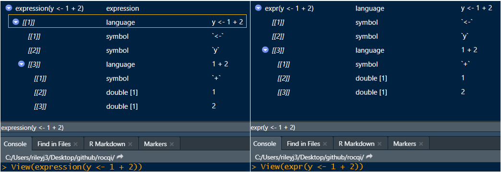
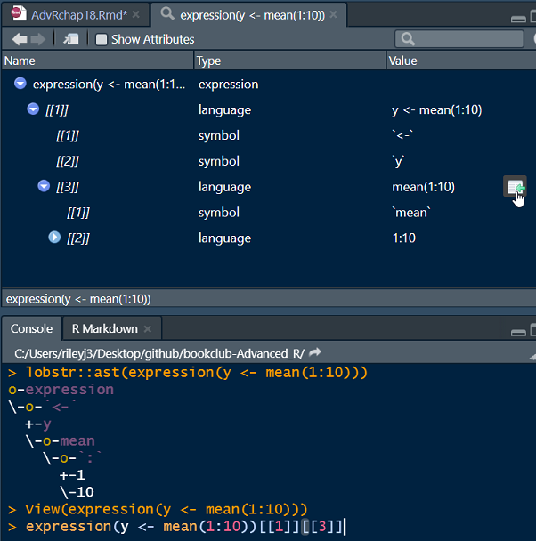

```{css, echo=FALSE}
.remark-code, .remark-inline-code {
    background: #F0F0F0;
}

.remark-code {
    font-size: 12px;
}

.remark-slide-content h1 {
    font-size: 35px;
}

.remark-slide-content {
    font-size: 14px;
}
```


```{r setup, include=FALSE}
knitr::opts_chunk$set(
  echo = TRUE,
  warning = FALSE,
  message = FALSE,
  error = TRUE
)
```


# Chapter 18

metaprogramming: treating code as data

Libraries:

```{r}
library(tidyverse)
library(rlang)
```

Agenda:

- Expressions

- Abstract Syntax Trees (AST)

- Symbols

- Calls

- Parsing

- Live demos


---

# Expressions

If you try to run this in a new session, you will get an error as x isn't defined
```{r}
x * 10
```

As an expression, we can interact with code without running it
```{r}
z <- expr(x * 10)
z
```

The code isn't evaluated until we use `eval()`

```{r}
x <- 4
eval(z)
```
---

# Evaluating multiple expressions

We can write multiple expressions at once & it acts similar to `source()`

`expression()` returns a vector and can be passed to `eval()`  


```{r}
eval(expression(
  x <- 4,
  x * 10
))
```

`exprs()` does not and has to be used in a loop

```{r}
for (i in  exprs(x <- 4,x * 10)) {
  print(i)
  print(eval(i))
}
```

---

# `expression()` vs `expr()`

- `expression()` is ready for evaluation

- `expr()` is ready for manipulation

```{r, echo=FALSE}

```

---

# 18.2.3 Ways to write

- **infix call:** function is between objects, is evaluated

```r
x <- 5 + 10
```

- **prefix call:** function is in front of objects, is evaluated
most common with functions

```r
mean(5:10)
`+`(5, 10)
`<-`(x, `+`(5, 10))
```


- **expression:** the code as written, not evaluated
class = "expression"

```r
expression(x <- 5 + 10)
```


- **call:** uses a named function followed by it's arguments, is not evaluated
class = "language"

```r
call("+", 5, 10)
```


---

# Abstract Syntax Trees

- `lobstr::ast()` is nice but I prefer `View()`


```{r, echo=FALSE, out.height="500px", out.width="500px"}

```

---

# Replacing code

```{r}
z <- expression(mean(1:10))
# View(z)
eval(z)

z[[1]][[1]]

z[[1]][[1]] <- sum

# View(z)
eval(z)
```


---

# 18.3.2 Symbols

**symbol** is the "name" of an object, ex: `mtcars`, `mean`, etc

You can convert a **string to a symbol** with `rlang::sym()`

I use this a lot when debugging tidy evaluation
```r
* x <- rlang::sym("hwy")

head(mpg) %>% 
  select_if(is.numeric) %>% 
* mutate('{{x}}_kpl' := {{x}} * 0.425)
```

```{r, echo=FALSE}
library(kableExtra)
x <- rlang::sym("hwy")

head(mpg) %>% 
  select_if(is.numeric) %>% 
  mutate('{{x}}_kpl' := {{x}} * 0.425) %>% 
  kable() %>% 
  kable_paper() %>% 
  column_spec(column = 6, background = "yellow")
```

You can convert **a symbol to a string** with

`as.character(expression(hwy))`

or `rlang::as_string(rlang::expr(hwy))`

---

# 18.3.3 Standardized Calls

* `call_standardise()` is almost the same as `match_call()` 

```{r, tidy=FALSE}
new_msg <- function(data, digits = 5, ...) {
  message(
    paste(
      match.call()$data, #<<
      "has", 
      nrow(data), 
      "rows"
    )
  )
}
```

```{r, message=TRUE}
new_msg(digits = 3, mpg)
```

```{r}
new_msg(d = mpg)
```

```{r, message=TRUE}
new_msg(da = mpg)
```

Can get a heads up about this with

`options(warnPartialMatchArgs = TRUE)`

---

# 18.4 Parsing

`parse_exprs()` is the same as `parse(text = ...)`

```{r}
x3 <- "a <- 1; a + 1"

parse(text = x3)

as.list(parse(text = x3))

rlang::parse_exprs(x3)
```

You can deparse with `expr_text()`
```{r}
z <- expr(y <- x + 10)
expr_text(z)
```


---

# Conclusion

- `rlang` functions are more "ready to go"

- have protective features to bring back vectors of the same length as the input (`parse_exprs()` vs `deparse()`)


- [shinyobjects](https://rjake.github.io/shinyobjects/articles/how-it-works.html)
