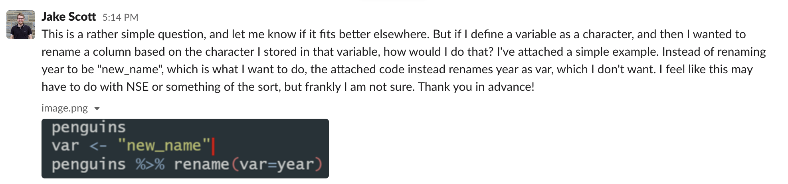
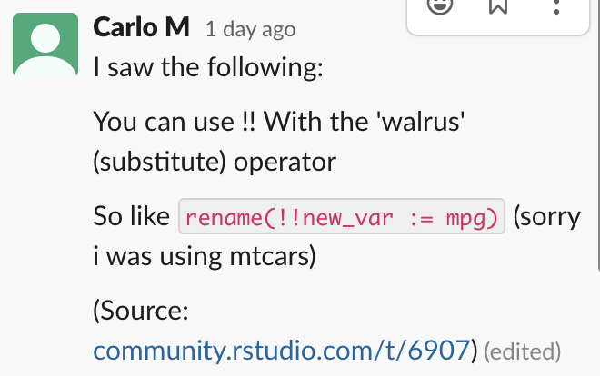

```{r setup, include=FALSE}
library(learnr)
knitr::opts_chunk$set(echo = TRUE)
```


# Chapter 19 - Quasiquotation 
## Introduction
When used alone, quasiquotation is most useful for programming, particularly for generating code. But when it’s combined with the other techniques, tidy evaluation becomes a powerful tool for data analysis.

```{r}
library(rlang)
library(purrr)
library(dplyr)
```

## 19.2 Motivation 

Let's see if Hadley's motivation works for us! 

```{r}
paste("Good", "morning", "Hadley")
paste("Good", "afternoon", "Alice")
```

When using `cement()` every argument is automatically quoted:

```{r}
cement <- function(...) {
  args <- ensyms(...)
  paste(purrr::map(args, as_string), collapse = " ")
}

cement(Good, morning, Hadley)
cement(Good, afternoon, Alice)
```

The problem comes when we want to use variables:

```{r}
name <- "Hadley"
time <- "morning"

paste("Good", time, name)
```


```{r}
cement(Good, time, name)
```

The tool of choice is "unquote" `!!`, pronounced "bang-bang"

```{r}
cement(Good, !!time, !!name)
```

`paste()` evaluates its arguments, so we must quote where needed; `cement()` quotes its arguments, so we must unquote where needed.

## Another motivation 





```{r}
var <- "new_name"
mtcars %>% rename(!!var := mpg) %>% head()
```

> Unfortunately R is very strict about the kind of expressions supported on the LHS of =. This is why rlang interprets the walrus operator := as an alias of =. You can use it to supply names, e.g. a := b is equivalent to a = b. Since its syntax is more flexible you can also force names on its LHS:


## 19.2.1 Vocabulary

- An __evaluated__ argument obeys R’s usual evaluation rules.

- A __quoted__ argument is captured by the function, and is processed in some custom way.


## 19.2.2 Exercises

1. For each function in the following base R code, identify which arguments are quoted and which are evaluated.

```{r 19-2-2-1a, exercise=TRUE}
library(MASS)

mtcars2 <- subset(mtcars, cyl == 4)

with(mtcars2, sum(vs))
sum(mtcars2$am)

rm(mtcars2)
```

## 

1. For each function in the following base R code, identify which arguments are quoted and which are evaluated.

```{r 19-2-2-1b, exercise=TRUE}
library(MASS) # MASS is quoted

mtcars2 <- subset(mtcars, cyl == 4) # mtcars is evaluated, cyl is quoted
mtcars
cyl

with(mtcars2, sum(vs)) # mtcars2 is evaluated, vs is quoted
mtcars2
vs

sum(mtcars2$am) # mtcars2$am is evaluated
mtcars2$am


rm(mtcars2) # mtcars2 is evaluated?? 

```


## 

2. For each function in the following tidyverse code, identify which arguments are quoted and which are evaluated.

```{r 19-2-2-2a, exercise=TRUE}
library(dplyr)
library(ggplot2)

by_cyl <- mtcars %>%
  group_by(cyl) %>%
  summarise(mean = mean(mpg))

ggplot(by_cyl, aes(cyl, mean)) + geom_point()
```


## 

2. For each function in the following tidyverse code, identify which arguments are quoted and which are evaluated.

```{r 19-2-2-2b, exercise=TRUE}
library(dplyr) # dplyr is quoted
dplyr

library(ggplot2) # ggplot2 is quoted

by_cyl <- mtcars %>%
  group_by(cyl) %>%
  summarise(mean = mean(mpg))

# mtcars is evaluated, cyl is quoted, mpg is quoted

ggplot(by_cyl, aes(cyl, mean)) + geom_point()
# by_cyl is evaluated, cyl & mean are quoted
```


## 19.3 Quoting

The first part of quasiquotation is quotation: capturing an expression without evaluating it. 

(`rlang` functions):

__Capturing expressions__ 

```{r}
expr(x + y)
expr(1 / 2 / 3)
```

`expr()`: Capturing an argument exactly as provided.  Not so useful inside of a function: 

```{r}
f1 <- function(x) expr(x)
f1(a + b + c)
```

For that purpose you can use: `enexpr()`:

```{r}
f2 <- function(x) enexpr(x)
f2(a + b + c)
```

To capture multiple arguments in `...` use `enexprs()`:

```{r}
f <- function(...) enexprs(...)
f(x = 1, y = 10 * z)
```


```{r}
exprs(x = x ^ 2, y = y ^ 3, z = z ^ 4)
# shorthand for
# list(x = expr(x ^ 2), y = expr(y ^ 3), z = expr(z ^ 4))
```

__Capturing symbols__

`ensym()` and `ensyms()` check that the captured expression is either a symbol or a string (which is converted to a symbol):

```{r}
f <- function(...) ensyms(...)
f(x)
#> [[1]]
#> x
f("x")
#> [[1]]
#> x
```


## 19.3.5 Summary

The base equivalents do not support unquoting. 

rlang quasiquoting functions: 

|    |Developer	|User|
|----|:----------:|:----:|
|One	|`expr()`	|`enexpr()`|
|Many	|`exprs()`	|`enexprs()`|

base R quoting functions: 

|    |Developer	|User|
|----|:----------:|:----:|
|One	|`quote()`	|`substitute()`|
|Many	|`alist()`	|`as.list(substitute(...()))`|


## 19.3.6 Exercises

1. How is `expr()` implemented? Look at its source code.

##

1. How is `expr()` implemented? Look at its source code.

```{r 19-3-6-1, exercise=TRUE}
expr
```


##

2. Compare and contrast the following two functions. Can you predict the output before running them?

```{r 19-3-6-2, exercise =TRUE}
f1 <- function(x, y) {
  exprs(x = x, y = y)
}
f2 <- function(x, y) {
  enexprs(x = x, y = y)
}
f1(a + b, c + d)
f2(a + b, c + d)
```

## 

3. What happens if you try to use `enexpr()` with an expression (i.e.  `enexpr(x + y)` ? What happens if `enexpr()` is passed a missing argument?

```{r 19-3-6-3a, exercise=TRUE}

```

## 

3. What happens if you try to use `enexpr()` with an expression (i.e.  `enexpr(x + y)` ? What happens if `enexpr()` is passed a missing argument?

```{r, error=TRUE}
enexpr(x + y)
```

arg must be a symbol

```{r, error=TRUE}
enexpr(missing_arg())
is.symbol(missing_arg())
```

##

4. How are `exprs(a)` and `exprs(a = )` different? Think about both the input and the output.

```{r 19-3-6-4, exercise=TRUE}

```

##

4. How are `exprs(a)` and `exprs(a = )` different? Think about both the input and the output.

```{r}
exprs(a)
exprs(a = )
```

`exprs(a)`

input:  symbol

output: list entry value

`exprs(a = )`

input:  name of argument

output: list entry name

##

5. What are other differences between `exprs()` and `alist()`? Read the documentation for the named arguments of `exprs()` to find out.

##

6. The documentation for `substitute()` says:

> Substitution takes place by examining each component of the parse tree as follows:
> 
- If it is not a bound symbol in env, it is unchanged.
- If it is a promise object (i.e., a formal argument to a function) the expression slot of the promise replaces the symbol.
- If it is an ordinary variable, its value is substituted, unless env is .GlobalEnv in which case the symbol is left unchanged.

Create examples that illustrate each of the above cases.

## 19.4 Unquoting

Unquoting is one inverse of quoting. It allows you to selectively evaluate code inside `expr()`, so that `expr(!!x)` is equivalent to `x`. 

__Unqouting one argument__

`!!` works with call objects: 
 
```{r}
x <- expr(-1)
expr(f(!!x, y))
```

```{r}
lobstr::ast(expr(f(!!x, y)))
```

... as well as for symbols and constants: 

```{r}
a <- sym("y")
b <- 1
expr(f(!!a, !!b))
```

```{r}
lobstr::ast(expr(f(!!a, !!b)))
```

You can also use `!!` with function calls. The function call will be evaluated and the result will be inserted: 

```{r}
mean_rm <- function(var) {
  var <- ensym(var)
  expr(mean(!!var, na.rm = TRUE))
}
expr(!!mean_rm(x) + !!mean_rm(y))
```

`!!` preserves operator precedence:

```{r}
x1 <- expr(x + 1)
x2 <- expr(x + 2)

expr(!!x1 / !!x2)
```

```{r}
lobstr::ast(expr(!!x1 / !!x2))
lobstr::ast(expr(x+1/x+2))
```

__Unquoting a function__ 

```{r}
f <- expr(foo)
expr((!!f)(x, y))
lobstr::ast(expr((!!f)(x, y)))
```

Because of the large number of parentheses involved, it can be clearer to use `rlang::call2()`:

```{r}
f <- expr(foo)
call2(f, expr(x), expr(y))
```


__Unquoting a missing argument__ 

We talked about missing arguments in [Section 18.6.2](https://adv-r.hadley.nz/expressions.html#empty-symbol).

```{r, error=TRUE}
arg <- missing_arg()
expr(foo(!!arg, !!arg))
```

Here we can use the helper function `maybe_missing()`:

```{r}
expr(foo(!!maybe_missing(arg), !!maybe_missing(arg)))
```

__Unquoting in special forms__

can be problematic, for example with `$`:

```{r, error=TRUE}
expr(df$!!x)
```

```{r}
x <- expr(x)
expr(`$`(df, !!x))
```

__Unquoting many arguments__

`!!!` (called unquote-splice, pronounced bang-bang-bang) takes a list of expressions and inserts them at the location of the `!!!`:

```{r}
xs <- exprs(1, a, -b)
expr(f(!!!xs, y))
lobstr::ast(f(!!!xs, y))
```

__The polite fiction of `!!`__

When used outside of an expression context `!!` and `!!!` actually just work as repeated application of `!`

```{r}
!!TRUE
!!!TRUE
```

```{r}
bang <- 1000
!!bang
!!!bang
```

That means you can get argument type errors: 

```{r, error=TRUE}
x <- quote(variable)
!!x
!x
```

..or silently incorrect results: 

```{r}
df <- data.frame(x = 1:5)
boom <- 100
with(df, x + !!boom)
!!boom
as.numeric(!!boom)
```

__Non-standard ASs__ or some more things to confuse us: 

For example, if you inline more complex objects, their attributes are not printed. This can lead to confusing output:

```{r}
x1 <- expr(class(!!data.frame(x = 10)))
x1
eval(x1)
```

Two tools to reduce confusion: 

```{r}
expr_print(x1)
lobstr::ast(!!x1)
```

Another example: Inlining integer sequences: 


```{r}
x2 <- expr(f(!!c(1L, 2L, 3L, 4L, 5L)))
x2
expr_print(x2)
lobstr::ast(!!x2)
```

## 19.4.8 Exercises

1. Given the following components:

```{r 19-4-8-1_setup}
xy <- expr(x + y)
xz <- expr(x + z)
yz <- expr(y + z)
abc <- exprs(a, b, c)
```

Use quasiquotation to construct the following calls:

```{r 19-4-8-1, exercise=TRUE, exercise.setup="19-4-8-1_setup"}
(x + y) / (y + z)
-(x + z) ^ (y + z)
(x + y) + (y + z) - (x + y)
atan2(x + y, y + z)
sum(x + y, x + y, y + z)
sum(a, b, c)
mean(c(a, b, c), na.rm = TRUE)
foo(a = x + y, b = y + z)
```


## 

```{r}
xy <- expr(x + y)
xz <- expr(x + z)
yz <- expr(y + z)
abc <- exprs(a, b, c)
```

(x + y) / (y + z)

```{r}
expr(!!xy/!!yz)
```

-(x + z) ^ (y + z)

```{r}
expr(-(!!xz)^(!!yz)) 
```

(x + y) + (y + z) - (x + y) __?__

```{r}
expr(!!xy + !!yz-!!xy)
```

atan2(x + y, y + z)

```{r}
expr(atan2(!!xy, !!yz))
```

sum(x + y, x + y, y + z)

```{r}
expr(sum(!!xy, !!xy, !!yz))
```

mean(c(a, b, c), na.rm = TRUE) __!!!__

```{r}
expr(mean(c(!!!abc), na.rm=TRUE))
```

foo(a = x + y, b = y + z)

```{r}
expr(foo(a=!!xy, b=!!yz))
```

##

2. The following two calls print the same, but are actually different:

```{r 19-4-8-2, exercise=TRUE}
(a <- expr(mean(1:10)))
#> mean(1:10)
(b <- expr(mean(!!(1:10))))
#> mean(1:10)
identical(a, b)
#> [1] FALSE
```

What’s the difference? Which one is more natural?

##

```{r}
(a <- expr(mean(1:10)))
#> mean(1:10)
(b <- expr(mean(!!(1:10))))
#> mean(1:10)
identical(a, b)

expr_print(a)
lobstr::ast(expr(mean(1:10)))

expr_print(b)
lobstr::ast(expr(mean(!!(1:10))))
```

To me personally the first one feels more natural, as it prints the expression that I would normally write. 


## Followup

Tyler Grant Smith provided an answer to our question for exercise 19.4.8.-1.

Given the following components: 

```{r}
xy <- expr(x + y)
xz <- expr(x + z)
yz <- expr(y + z)
```

use quasiquotation to construct the following calls:

(x + y) + (y + z) - (x + y)

```{r}
expr(((!!xy)) + !!yz-!!xy)
```


## 19.5 Non-quoting

There is one quasiquotation couple in base R:

`bquote()`for quoting and `.()` for "unquoting". 

```{r}
xyz <- bquote((x + y + z))
bquote(-.(xyz) / 2)
```

__But__ `bquote()` is rarely used by any other function written in R. 

> Base functions that quote an argument use some other technique to allow indirect specification. Base R approaches selectively turn quoting off, rather than using unquoting, so I call them non-quoting techniques.

There are four basic forms of non-quoting used in base R functions:

1. A pair of quoting/non-quoting __functions__.

quoting `$` - non-quoting `[[]]`:

```{r}
x <- list(var = 1, y = 2)
var <- "y"

x$var # quoted

x[[var]] # takes variable as a string

```

Other examples: `<-`/`assign()` and `::`/`getExportedValue()`


2. A pair of quoting/non-quoting __arguments__

`rm()` allows you to provide bare variable names in `...`, or a character vector of variable names in `list`:

```{r}
x <- 1
rm(x)

y <- 2
vars <- c("y", "vars")
rm(list = vars)
```

Other examples: `data()` and `save()`


3. An __argument that controls__ whether a different argument is quoting or non-quoting.

```{r}
library(MASS)

pkg <- "MASS"
library(pkg, character.only = TRUE)
```

Other examples: `demo()`, `detach()`, `example()`, and `require()`

4. Quoting if evaluation fails

```{r}
# Shows help for var
help(var)

var <- "mean"
# Shows help for mean
help(var)

var <- 10
# Shows help for var
help(var)
```

Other examples: `ls()`, `page()`, and `match.fun()`

## 19.6 `...` (dot-dot-dot)

Motivation! 

- What do we do if we want to `rbind()` a list of data frames together? 

```{r}
dfs <- list(
  a = data.frame(x = 1, y = 2),
  b = data.frame(x = 3, y = 4)
)
```


We could do: `rbind(dfs$a, dfs$b)`

or: 

```{r}
dplyr::bind_rows(!!!dfs)
```

with base R, we can use the `do.call()` function: 

```{r}
do.call("rbind", dfs)
```

- What do we do, if we want to supply an argument name indirectly? 

```{r}
var <- "x"
val <- c(4, 3, 9)
```

We could do: `setNames(data.frame(val), var)`

or: 

```{r}
tibble::tibble(!!var := val)
```

with base R: 

```{r}
args <- list(val)
names(args) <- var

do.call("data.frame", args)
```


> ... Functions that support these tools, without quoting arguments, have __tidy dots__. To gain tidy dots behaviour in your own function, all you need to do is use list2().

`?list2` --> dynamic dots

The `...` syntax of base R allows you to:

- Forward arguments from function to function, matching them along the way to function parameters.
- Collect arguments inside data structures, e.g. with `c()` or `list()`.

Dynamic dots offer a few additional features:

1. You can splice arguments saved in a list with the big bang operator `!!!`.
2. You can unquote names by using the bang bang operator `!!` on the left-hand side of `:=`.
3. Trailing commas are ignored, making it easier to copy and paste lines of arguments.

```{r}
tibble::tibble(
  y = 1:5,
  z = 3:-1,
  x = 5:1,
)
```


__Example__ (how you could use `list2()`)

```{r}
set_attr <- function(.x, ...) {
  attr <- rlang::list2(...)
  attributes(.x) <- attr
  .x
}

attrs <- list(x = 1, y = 2)
attr_name <- "z"

1:10 %>%
  set_attr(w = 0, !!!attrs, !!attr_name := 3) %>% 
  str()
```


__`exec()`__ 

```{r}
# Directly
exec("mean", x = 1:10, na.rm = TRUE, trim = 0.1)

# Indirectly
args <- list(x = 1:10, na.rm = TRUE, trim = 0.1)
exec("mean", !!!args)

# Mixed
params <- list(na.rm = TRUE, trim = 0.1)
exec("mean", x = 1:10, !!!params)
```

```{r, error=TRUE}
mean(!!!args)
```

Supply argument names indirectly: 

```{r}
arg_name <- "na.rm"
arg_val <- TRUE
exec("mean", 1:10, !!arg_name := arg_val)
```

Call multiple functions with the same arguments: 

```{r}
x <- c(runif(10), NA)
funs <- c("mean", "median", "sd")

purrr::map_dbl(funs, exec, x, na.rm = TRUE)
```


## Exercises

1. One way to implement `exec()` is shown below. Describe how it works. What are the key ideas?

```{r}
exec <- function(f, ..., .env = caller_env()) {
  args <- list2(...)
  do.call(f, args, envir = .env)
}
```


adv. R solutions: 

> `exec()` takes a function (`f`), its arguments (`...`) and an environment (`.env`) as input. This allows to construct a call from `f` and `...` and evaluate this call in the supplied environment. As the `...` argument is handled via `list2()`, `exec()` supports tidy dots (quasiquotation), which means that arguments and names (on the left-hand side of `:=`) can be unquoted via `!!` and `!!!`.


##

2. Carefully read the source code for `interaction()`, `expand.grid()`, and `par()`. Compare and contrast the techniques they use for switching between dots and list behaviour.

## 

3. Explain the problem with this definition of `set_attr()`

```{r, error=TRUE}
set_attr <- function(x, ...) {
  attr <- rlang::list2(...)
  attributes(x) <- attr
  x
}
set_attr(1:10, x = 10)
```

## 19.7 Case studies

__`lobstr::ast()`__

```{r}
z <- expr(foo(x, y))
lobstr::ast(z)
```

```{r}
lobstr::ast(!!z)
```


__Map-reduce to generate code__ 

On the example of generating the expression of a linear model with following coefficients.

```{r}
intercept <- 10
coefs <- c(x1 = 5, x2 = -4)
```

```{r}
coef_sym <- syms(names(coefs))
coef_sym
```

```{r}
summands <- map2(coef_sym, coefs, ~ expr((!!.x * !!.y)))
summands
```

```{r}
summands <- c(intercept, summands)
summands
```

```{r}
eq <- reduce(summands, ~ expr(!!.x + !!.y))
eq
```

__Creating functions__ 

```{r}
new_function(
  exprs(x = , y = ), 
  expr({x + y})
)
```


Raise a number to the power of a number:

```{r}
power <- function(exponent) {
  new_function(
    exprs(x = ), 
    expr({
      x ^ !!exponent
    }), 
    caller_env()
  )
}
power(0.5)
```


## 19.7.5 Exercises

1. In the linear-model example, we could replace the `expr()` in `reduce(summands, ~ expr(!!.x + !!.y))` with `call2()`: `reduce(summands, call2, "+")`. Compare and contrast the two approaches. Which do you think is easier to read?

```{r 19-7-5-1, exercise = TRUE}
intercept <- 10
coefs <- c(x1 = 5, x2 = -4)
coef_sym <- syms(names(coefs))
summands <- map2(coef_sym, coefs, ~ expr((!!.x * !!.y)))
summands <- c(intercept, summands)


eq <- reduce(summands, ~ expr(!!.x + !!.y))

eq <- reduce(summands, call2, "+")
```


##

2. Re-implement the Box-Cox transform defined below using unquoting and `new_function()`:

```{r}
bc <- function(lambda) {
  if (lambda == 0) {
    function(x) log(x)
  } else {
    function(x) (x ^ lambda - 1) / lambda
  }
}
```

```{r}
bc <- function(lambda){
  if(lambda==0){
    new_function(exprs(x=),
                 expr(log(x)))
  }else{
    new_function(exprs(x=),
                 expr((x^lambda - 1)/lambda))
  }
}
bc(0)
bc(10)
```

3. Re-implement the simple `compose()` defined below using quasiquotation and `new_function()`:

```{r}
compose <- function(f, g) {
  function(...) f(g(...))
}
```

```{r}
compose <- function(f, g){
  new_function(exprs(...=),
               expr(f(g(...))))
}
```


