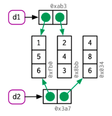
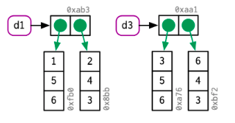
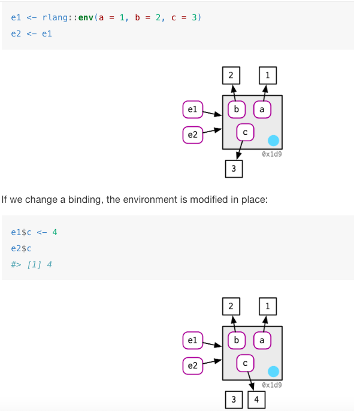

# What's in Chapter 2:

--

- Section 2.2: distinction between names and values

--

- Section 2.3: describes when R makes a copy

--

- Section 2.4: explores how much memory an object occupies 

--

- Section 2.5: describes the two important exceptions to copy-on-modify

--

- Section 2.6: concludes the chapter with a discussion of the garbage collector


--


**Prerequisites**

To understand how R represents objects, we'll need to install the **lobstr** package:

```{r eval=TRUE, tidy=FALSE}
library(lobstr)
```

---


# Binding basics 


How would you read the following?

```{r}
x <- c(1, 2, 3)
```


--

- Create an object named ‘x’, containing the values 1, 2, and 3: `r emo::ji("poop")`

--

- It’s creating an object, a vector of values (1, 2, 3) **and it’s binding that object to a name, x** : `r emo::ji("smile")`

---

# Copy-on-modify

```{r}
x <- c(1, 2, 3)
```

```{r}
x 
```

How can we see what's happening under the hood?


--


You can call `obj_address()` to see this object's identifier:

```{r}
obj_addr(x)
```


--


```{r}
y <- x
```


--


```{r}
obj_addr(y)
```


---

# What happens to `x` when you modify `y` ?

```{r}
y[[3]] <- 4
```


--


```{r}
x
```


--


- Changing `y` did not modify `x`. 


--


- This is due to a behavior called **copy-on-modify**. 


--


```{r}
obj_addr(x)
obj_addr(y)
```


---

# What about functions? 

The same copy-on-modify behavior applies for functions. 


--


We can use `tracemem()` to track when an object gets copied. It allows us to do that because every time an object gets copied, a message containing the address of the object will be printed.


--


```{r}
f <- function(a) {
  a
}
```

```{r}
x <- c(1, 2, 3)
cat(tracemem(x), "\n")
```


--


```{r}
z <- f(x)
```

We got no message here, which means no new copy was generated. 


--


If f did modify x, then a new copy would get generated and thus a message would get printed by `tracemem()`.

---

# Lists

Like vectors, lists also use copy-on-modify behaviour.

--


```{r}
list_1 <- list(1, 2, 3)
```

```{r}
list_2 <- list_1
```


--


```{r}
obj_addr(list_1)
obj_addr(list_2)
```


--


```{r}
list_2[[3]] <- 4
```

```{r}
obj_addr(list_2)
```


---

# Lists (continued)

We can use `lobstr::ref()` to print the memory address of each object along with a local ID so that we can easily cross-reference shared components.


--


```{r}
ref(list_1, list_2)
```

This shows that `list_1` and `list_2` have shared components, namely integers 2 and 3 corresponding to the 2nd and 3rd element in their vectors.

---

# Data Frames

Data frames are lists of vectors. 


--

.pull-left[
- If you modify a **column**: 

  - *only* that column needs to be modified

  - the others will still point to their original references:
  
```{r echo = F, fig.retina = 1.25 }

```
]
  


.pull-left[
- If you modify a **row**:

  - *every* column is modified

  - every column must be copied:

```{r echo = F, fig.retina = 1.25 }

```
]

---

# Character Vectors 

Consider this character vector:
```{r}
x <- c("marco", "polo", "marco", "polo")
```

```{r}
ref(x, character = T)
```

This is called a **global string pool** where each element of a character vector is a pointer to a *unique string* in the pool. This has implications for how much memory a character vector uses. To find out, use `lobstr::obj_size()`

---

# Modify-in-place (1)

Modyfing an R object **usually** creates a copy. Exceptions:


--


- objects with a **single** binding 


--


- **Environments**, a special type of object, are **always** modified in place (more on this in Chapter 7)

---

# Modify-in-place (2)

```{r echo = F, fig.retina=2}

```

Implication: create functions that “remember” their previous state (more on this in Chapter 16)

---

# Unbinding / Garbage collector 


--


- Objects get deleted thanks to the **garbage collector (GC)** 


--


- GC frees up memory by deleting R objects that are no longer used


--


- GC runs automatically whenever R needs more memory to create a new object. 


--


- There is no reason to call `gc()` yourself  unless you *want* to:
  - ask R to return memory to your operating system so other programs can use it, or
  - to know how much memory is currently being used

