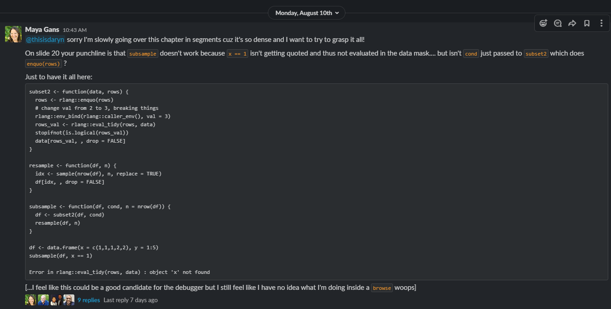

```{r setup, include=FALSE}
knitr::opts_chunk$set(echo = TRUE,
                      warning = FALSE,
                      message = FALSE,
                      comment = "#>")
xaringanExtra::use_tile_view()
xaringanExtra::use_panelset()
xaringanExtra::use_webcam()
xaringanExtra::use_editable()
xaringanExtra::use_extra_styles(
  hover_code_line = TRUE,         
  mute_unhighlighted_code = TRUE  
)

```

## Preface

--

<center> </center>

"Everything I Know Is From Jenny Bryan" 

\- Sharla Gelfand 

--

\- Tan Ho

---

## Preface

There are some excellent talks on debugging (some are better on debugging than Adv R itself!)

- Jenny Bryan's ["Object of type closure is not subsettable"](https://github.com/jennybc/debugging#readme) talk from rstudio::conf 2020
- Jenny Bryan and Jim Hester's book: ["What They Forgot to Teach You About R"](https://rstats.wtf/) Ch11
- Hadley's video on a [minimal reprex for a shiny app](https://www.youtube.com/watch?v=9w8ANOAlWy4) 
--
` <- insanely useful!`

--

and I suggest that you visit these resources later if you're looking for more of a talk or text-based content on debugging.

---

## Today's Plan

We've all "read" the chapter, so I'll (obviously) take the liberty to live-code some debugging. Along the way, we'll try to hit: 

- traceback
- print debugging
- browser()
- debug/debugonce/undebug
- options(error = recover)

by looking through some examples, a few contrived, a few less-contrived, and lastly (possibly?) a Shiny app?

---
## Examples, easy mode

Let's use one of the canned examples from rstats.wtf to get us started.

```{r eval = FALSE}
usethis::use_course("rstd.io/wtf-debugging")
# Example 1: Spartan
```

---
## Examples, AdvR mode

Maya: "How do I debug this"? 
--
(SURPRISE, METAPROGRAMMING REVIEW!)

--



---

Does anyone remember what this problem was [about](https://adv-r.hadley.nz/evaluation.html#tidy-evaluation)?

```{r eval=FALSE}
subset2 <- function(data, rows) {
  rows <- rlang::enquo(rows)
  # change val from 2 to 3, breaking things
  rlang::env_bind(rlang::caller_env(), val = 3)
  rows_val <- rlang::eval_tidy(rows, data)
  stopifnot(is.logical(rows_val))
  data[rows_val, , drop = FALSE]
}

resample <- function(df, n) {
  idx <- sample(nrow(df), n, replace = TRUE)
  df[idx, , drop = FALSE]
}

subsample <- function(df, cond, n = nrow(df)) {
  df <- subset2(df, cond)
  resample(df, n)
}

df <- data.frame(x = c(1,1,1,2,2), y = 1:5)

subsample(df, x == 1)
# Error in rlang::eval_tidy(rows, data) : object 'x' not found
```

---

## Debug a Shiny app?

I can do this too if people are keen!

