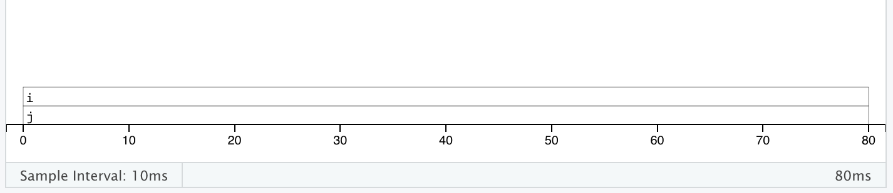
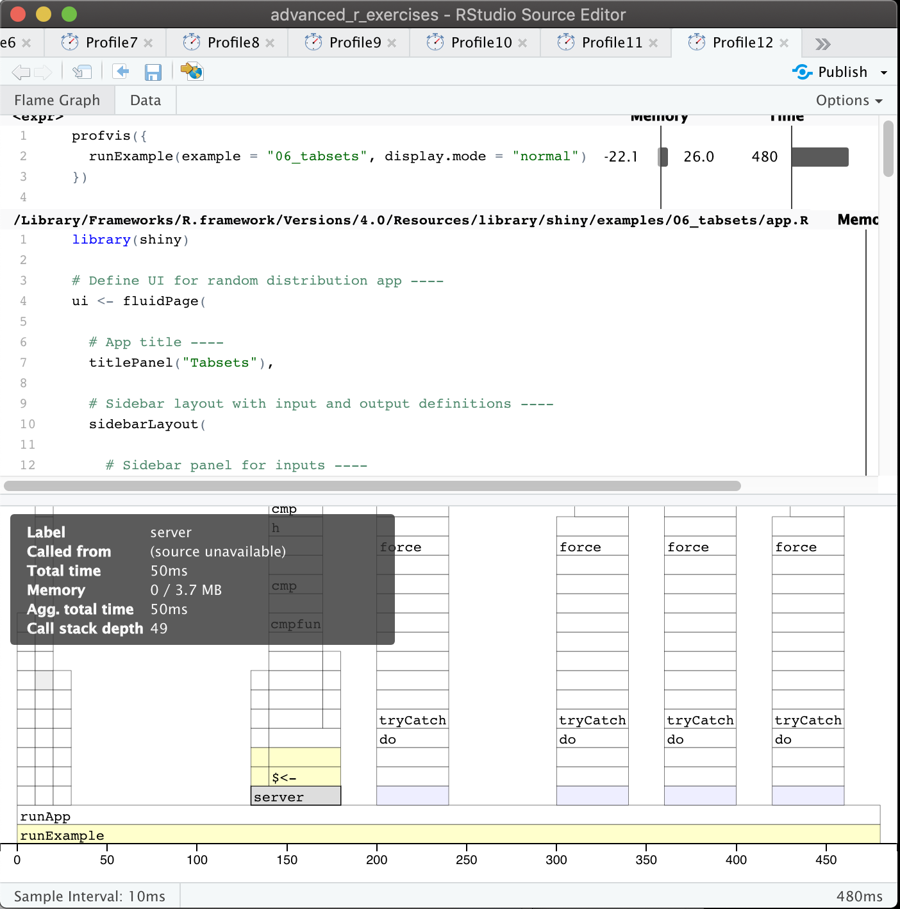
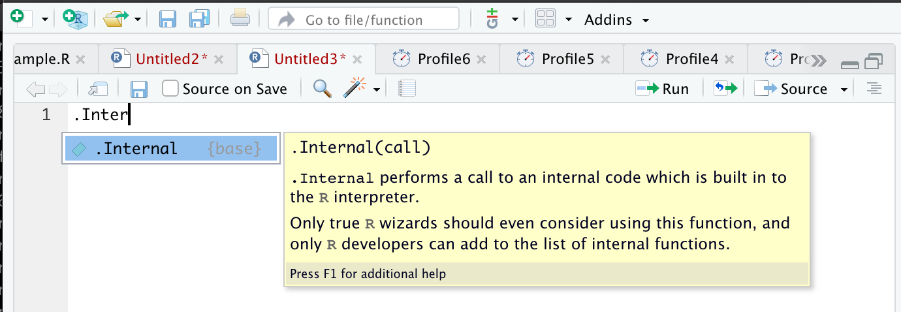

```{r xaringan-themer, include = FALSE}
library(xaringanthemer)
style_mono_light(
  base_color = "#3092FF",
  header_font_google = google_font("Josefin Sans"),
  text_font_google   = google_font("Montserrat", "300", "300i"),
  code_font_google   = google_font("Droid Mono"),
)
```

<style>
.pull-more-left {
  float: left;
  width: 40%;
}
.pull-less-right {
  float: right;
  width: 56%;
}
.pull-less-right ~ * {
  clear: both;
}
.remark-code-line {
  font-size: 0.7em !important;
}
</style>


# How to go fast

- Find out what's making it slow (Chapter 23)
- Experiment with faster alternatives (Chapter 24)

---
# Part 1: What's making it slow?
## Profiling

- Use a profiler: `profvis`
- A sampling/statistical profiler
- Periodically stops execution and looks at the call stack


---
class: hide-logo

.pull-more-left[
```{r, eval=FALSE}
f <- function() {
  pause(0.1)
  g()
  h()
}

g <- function() {
  pause(0.1)
  h()
}

h <- function() {
  pause(0.1)
}
```

```{r, eval=FALSE}
profvis::profvis(f())
```
]


.pull-less-right[

]
<hr>
If you'd like to switch R version:
- Run installer from CRAN
- Use RSwitch utility at [http://r.research.att.com/](http://r.research.att.com/)
  - Bob Rudis has another version of this but I can't get it to work
- Update the `R.framework/Versions/Current` directory alias directly using `ln -s`


---
# Memory profiling
.pull-more-left[
```{r eval=FALSE}
x <- integer()

for(i in 1:1e4) {
  x <- c(x, i)
}
```
]

.pull-less-right[

]
<hr>
This shows that large amounts of memory are being allocated (bar on the right) and freed-up (bar on the left)

---
# Limitations
- Profiling does not extend to C code.
- Using anonymous functions can make profiling difficult. Give them names.
- Lazy evaluation can make things complicated:

.pull-left[
```{r, eval=FALSE}
i <- function() {
  pause(0.1)
  10
}
j <- function(x) {
  x + 10
}
j(i())
```
]

.pull-right[
>"...profiling would make it seem like `i()` was called by `j()` because the argument isn't evaluated until it's needed by `j()`."
]


---
# Profiling Shiny apps

```{r eval=FALSE}
library(shiny)
profvis({
  runExample(example = "06_tabsets", display.mode = "normal")
})
```

---
.center[
```{r, echo = FALSE, out.width = "80%"}

```
]


---
# Part 1: What's making it slow?
## Microbenchmarking
- For very small bits of code
- **Beware of generalising to real code:** higher-order effects may mask the small bits of code
> "a deep understanding of subatomic physics is not very helpful when baking"
- We will use the `bench` package

---
.pull-more-left[
```{r, message=FALSE}
x <- runif(100)
(lb <- bench::mark(
  sqrt(x),
  x ^ 0.5
))
```

]

.footnote[
median is probably the best metric to use
]

---
```{r, message=FALSE}
plot(lb)
```

---
# Part 2: Making it go fast!
"Four" techniques:
1. Organise your code
1. Look for existing solutions
1. The importance of being lazy
1. Vectorise
1. Avoid the perils of copying data


---
## 1. Organise your code
Write a function for each approach:

```{r 02}
mean1 <- function(x) mean(x)
mean2 <- function(x) sum(x)/length(x)
```

Generate representative test cases:

```{r}
x <- runif(1e5)
```

Precisely compare the variants (and include unit tests (not included))

```{r 03}
bench::mark(
  mean1(x),
  mean2(x)
)[c("expression", "min", "median", "itr/sec", "n_gc")]
```

---
## 2. Check for existing solutions
- CRAN task views (http://cran.rstudio.com/web/views/)
- Reverse dependencies of Rcpp (https://cran.r-project.org/web/packages/Rcpp/)
- Go out and talk to people:
  - rseek on Google (http://www.rseek.org/)
  - Stackoverflow with the R tag, `[R]`
  - https://community.rstudio.com/
  - R4DS learning community!!!

---
## 3. Do as little as possible
- Use a function tailered to a more specific type of input or to a more specific problem:
  - `rowSums()`, `colSums()`, `rowMeans()`, and `colMeans()` are faster than equivalent invocations that use `apply()` because they are vectorised 
  - `vapply()` is faster than `sapply()` because it pre-specifies the output type
  - `any(x == 10)` is much faster than `10 %in% x` because testing equality is simpler than testing set inclusion.
- Avoid situations where input data has to be coerced into a different type.
  - Example: giving a data frame to a function that requires a matrix, like `apply()`
- Some other tips:
  - `read.csv()`: specify known column types or use `readr::read_csv()` or `data.table::fread()`
  - `factor()`: specify known levels
  - `cut()`: use `labels = FALSE` or `findInterval()`
  - `unlist(x, use.names = FALSE)` is faster than `unlist(x)`
  - `interaction()`: use `drop = TRUE` if you can


---
### Example: avoiding method dispatch
```{r}
x <- runif(1e2) #<<
bench::mark(
  mean(x),
  mean.default(x)
)[c("expression", "min", "median", "itr/sec", "n_gc")]

x <- runif(1e4) #<<
bench::mark(
  mean(x),
  mean.default(x)
)[c("expression", "min", "median", "itr/sec", "n_gc")]
```

---
### But beware!

```{r, echo = FALSE}

```

---
### Example 2: avoiding input coercion
`as.data.frame()` is slow because it coerces each element into a data frame.  

You could, instead, store you data in a named list of equal-length vectors:
```{r}
quickdf <- function(l) {
  class(l) <- "data.frame"
  attr(l, "row.names") <- .set_row_names(length(l[[1]]))
  l
}

l <- lapply(1:26, function(i) runif(1e3))
names(l) <- letters

dplyr::glimpse(l[1:6])
```


---
```{r}
bench::mark(
  as.data.frame = as.data.frame(l),
  quick_df = quickdf(l)
)[c("expression", "min", "median", "itr/sec", "n_gc")]
```

<hr>

### Caveat:
This approach requires carefully reading through source code!

---
## 4. Vectorise
- Finding the existing R function that is implemented in C and most closely applies to your problem
- Some commonly used functions:
  - `rowSums()`, `colSums()`, `rowMeans()`, and `colMeans()` 
  - Vectorised subsetting (Chapter 4)
  - Use `cut()` and `findInterval()` for converting continuous variables to categorical
  - Be aware of vectorised functions like `cumsum()` and `diff()`
  - Use matrix algebra
- https://www.noamross.net/archives/2014-04-16-vectorization-in-r-why/

---
## 5. Avoid copying
- Often shows up if using `c()`, `append()`, `cbind()`, `rbind()`, `paste()`

```{r, eval=FALSE}
random_string <- function() {
  paste(sample(letters, 50, replace = TRUE), collapse = "")
}
strings10 <- replicate(10, random_string())
strings100 <- replicate(100, random_string())

collapse <- function(xs) {
  out <- ""
  for (x in xs) {
    out <- paste0(out, x)
  }
  out
}

bench::mark(
  loop10  = collapse(strings10),
  loop100 = collapse(strings100),
  vec10   = paste(strings10, collapse = ""),
  vec100  = paste(strings100, collapse = ""),
  check = FALSE
)[c("expression", "min", "median", "itr/sec", "n_gc")]
```


---
```{r, echo=FALSE}
random_string <- function() {
  paste(sample(letters, 50, replace = TRUE), collapse = "")
}
strings10 <- replicate(10, random_string())
strings100 <- replicate(100, random_string())

collapse <- function(xs) {
  out <- ""
  for (x in xs) {
    out <- paste0(out, x)
  }
  out
}
```

```{r}
bench::mark(
  loop10  = collapse(strings10),
  loop100 = collapse(strings100),
  vec10   = paste(strings10, collapse = ""),
  vec100  = paste(strings100, collapse = ""),
  check = FALSE
)[c("expression", "min", "median", "itr/sec", "n_gc")]
```

---
# Case study: t-test

```{r 09}
m <- 1000
n <- 50
X <- matrix(rnorm(m * n, mean = 10, sd = 3), nrow = m)
grp <- rep(1:2, each = n/2)
```
---
# Case study: t-test (cont'd)
Formula interface:
```{r}
system.time(
  for(i in 1:m) {
    t.test(X[i, ] ~ grp)$statistic
  }
)
```
Provide two vectors
```{r}
system.time(
  for(i in 1:m) {
    t.test(X[i, grp == 1], X[i, grp == 2])$statistic
  }
)
```

---
# Case study: t-test (cont'd)
### Add functionality to save the values:
```{r use-map_dbl}
compT <- function(i) {
  t.test(X[i, grp == 1], X[i, grp == 2])$statistic
}
system.time(t1 <- purrr::map_dbl(1:m, compT))
```

---
# Case study: t-test (cont'd)
### Do less work:
```{r}
my_t <- function(x, grp) {
  t_stat <- function(x) {
    m <- mean(x)
    n <- length(x)
    var <- sum((x - m) ^ 2)/(n-1)
    
    list(m = m, n = n, var = var)
  }
  
  g1 <- t_stat(x[grp == 1])
  g2 <- t_stat(x[grp == 2])
  
  se_total <- sqrt(g1$var / g1$n + g2$var / g2$n)
  (g1$m - g2$m) / se_total
}

system.time(t2 <- purrr::map_dbl(1:m, ~ my_t(X[.,], grp)))
stopifnot(all.equal(t1, t2))
```

---
# Case study: t-test (cont'd)
### Vectorise it:
```{r}
rowtstat <- function(X, grp) {
  t_stat <- function(X) {
    m <- rowMeans(X)
    n <- ncol(X)
    var <- rowSums((X - m) ^ 2)/(n - 1)
    
    list(m = m, n = n, var = var)
  }
  
  g1 <- t_stat(X[, grp == 1])
  g2 <- t_stat(X[, grp == 2])
  
  se_total <- sqrt(g1$var/g1$n + g2$var/g2$n)
  (g1$m - g2$m) / se_total
}
system.time(t3 <- rowtstat(X, grp))
stopifnot(all.equal(t1, t3))
```

---
---


# Resources
- [https://github.com/r-prof/jointprof](https://github.com/r-prof/jointprof) (for profiling C code)
- *Evaluating the Design of the R Language* - Morandat et al., 2012
- The R Inferno (http://www.burns-stat.com/pages/Tutor/R_inferno.pdf) - Patrick Burns


---


class: inverse, hide-logo

# Another Slide
This slide doesn't have a logo
