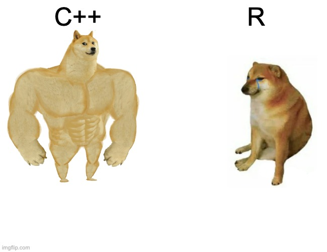

class: left, middle
```{r setup, include=FALSE, warnings=FALSE}
options(htmltools.dir.version = FALSE)
options(crayon.enabled = FALSE)
library(tidyverse)
```
### Why care about C++?

- **Performance**
- Loops: Iterations depend on previous ones
- Millions of Recursive Hell'ish calls (Mandelbrot?)
- Problems that require advanced data structures and algorithms that R doesn’t provide

```{r, echo=FALSE, out.width="50%", fig.cap="", fig.align="center"}

```

---
class: left, top
### Rcpp

Simple connection library between C++ to R. Only prerequisite is a working compiler:

- Windows: **Rtools**
- Mac: **Xcode**
- Linux: `sudo apt-get install r-base-dev`

```{r}
library(Rcpp)
```

```{r}
# Scalar Boolean Input to Character Output
cppFunction(
  'String bool_to_string(bool x) {return x;}'
)
bool_to_string
bool_to_string(TRUE)
```

---
class: left, top
### Main Differences Functions

```{r}
one <- function() 1L
```

```{c++}
int one() {
  return 1;
}
```

- no assignment, you must use **`return`**
- declare type of output returned
- every statement is terminated by a **`;`**

|  R 	| C++ Scalar | C++ Vector |
|---	|---	| ---
| `numeric`   	|  `double` 	| `NumericVector` |
| `integer`  	| `int`  	| `IntegerVector` |
| `character` | `String` | `CharacterVector` |
| `logical` |  `bool` | `LogicalVector` |

---
class: left, top
### Who will win?

```{r}
prodR <- function(x) {
  total <- 1
  for (i in seq_along(x)) {
    total <- total * x[i]
  }
  total
}

cppFunction("
  double prodC(NumericVector x) {
    int n = x.size();
    double total = 1;
    for(int i = 0; i < n; ++i) {
      total *= x[i];
    }
    return total;
  }")
```

- `.size()` C++ method, `=` for assignment, `*=` modify in place
- **IN C++, VECTOR INDICES START AT 0** (and most other languages!)
- `for(init; check; increment)`

---
class: left, top
### Comparisson

Simple C++ Loop is close to the optimized `prod()`

```{r}
  x <- runif(1e3, min = 1, max = 2)
  result <- bench::mark(
    prod = prod(x),
    prodC = prodC(x),
    prodR = prodR(x)
  )
  result[1:6]
```


---
class: left, middle


```{r, echo=FALSE, out.width="80%", fig.cap="", fig.align="center"}

```

---
class: left, top
### Is it worth the hassle?

> The C++ function is about 2.5 times faster, ~2 ms, but assuming it took you 10 minutes to write the C++ function, you’d need to run it ~200,000 times to make rewriting worthwhile.

```{r, messages = FALSE, results=FALSE}
when_is_it_worthwhile <- function(x, y, time_to_copy_stackoverflow = 10){
  diff <- as.double(y) - as.double(x)
  diff <- diff/6e+7 # in minutes
  res_diff <- print(result$median[3]-result$median[2])
  res_times <- print(round(as.double(result$median[3])/as.double(result$median[2])))
  result <- format(time_to_copy_stackoverflow / diff, scientific = FALSE, big.mark   = ",")
  return(c(diff = res_diff, times = res_times, res = result, copy = time_to_copy_stackoverflow))
}
res <- when_is_it_worthwhile(result$median[2], result$median[3])
```

The C++ function is about `r res[["times"]]` times faster, ~`r res[["diff"]]`, but assuming it took you `r res[["copy"]]` minutes to write the C++ function, you’d need to run it ~`r res[["res"]]` times to make rewriting worthwhile.

---
class: left, top
### stand-alone C++

- source C++ files with `sourceCpp()`
- file extension `.cpp`
- prefix functions for export to R with `// [[Rcpp::export]]`
- you can embed R code: `/*** R \n # This is R Code \n */`
- RMarkdown use `Rcpp` in as code block to run C++ engine
  - https://bookdown.org/yihui/rmarkdown/language-engines.html#rcpp

---
class: left, top
### Example, stand-alone C++

- Code Chunk: `Rcpp, cache = TRUE`

```{Rcpp, cache = TRUE, message = TRUE}
#include <Rcpp.h>
using namespace Rcpp;

// [[Rcpp::export]]
NumericVector f5(NumericVector x, NumericVector y) {
  int n = std::max(x.size(), y.size());
  NumericVector x1 = rep_len(x, n);
  NumericVector y1 = rep_len(y, n);

  NumericVector out(n);

  for (int i = 0; i < n; ++i) {
    out[i] = std::min(x1[i], y1[i]);
  }

  return out;
}
/*** R
f5(c(1), c(2,3,4))
*/
```

---
class: left, top
### Result, stand-alone C++

```{r}
f5(c(1), c(2,3,4))
```
#### `std::` C++ Standard Library

> Problems that require advanced data structures and algorithms that R doesn’t provide. Through the standard template library (STL), C++ has efficient implementations of many important data structures, from ordered maps to double-ended queues.

---
class: left, top
### Other classes

**Lists**, **DataFrame**, Environment, DottedPair, Language, Symbol etc.

- Should be used as **output** and not input
  - C++ is type specific you would need to specify each object with its correct data type (Catchcall/type if you don't know `RObject`)
- R Classes are inherited
  - `if (!mod.inherits("lm")) stop("Input must be a linear model");`

### Missing Values

- **Integer** (int), NA will be the smallest integer
  - `evalCpp('NA_INTEGER + 1')` gives -2147483647
- **Doubles** (double), you should use `NaN` (Not a Number)
- **Strings** (String), works because it is introduced by Rcpp package
- **Boolean** (bool), you should use `int`
  - R  (`TRUE`, `FALSE`, `NA`), C++ (`true` or `false`) = missing will coerce to `TRUE`
- **Vectors**: specify type of vector
  - `NA_REAL`, `NA_INTEGER`, `NA_LOGICAL`, `NA_STRING`

---
class: left, top
### Example Data Frame Class

```{Rcpp, chache = TRUE}
#include <Rcpp.h>
using namespace Rcpp;

// [[Rcpp::export]]
DataFrame rowSumC(DataFrame df) {
  int rows = df.nrows();
  int cols = df.size();
  NumericVector result(rows);
  for(int row = 0; row < rows; ++row) {
    double tmp = 0;
    for(int col = 0; col < cols; ++col) {
      NumericVector values = df[col];
      double value = values[row];
      tmp += value;
    }
    result[row] = tmp;
  }
  df.push_back(result, "rowSum"); // will result in list
  return DataFrame(df); // Convert back
}
```

---
class: left, top
### Example Data Frame Class

```{r}
rowSumC(
  tibble(
    a = c(1,3,4),
    b = c(2,4,6)
  )
) %>%  glimpse()
```

---
class: left, top
### Standard Template Library

> The standard template library (STL) provides a set of extremely useful data structures and algorithms.

#### Boost

Boost provides free peer-reviewed portable C++ source libraries.

"Item 55: Familiarize yourself with Boost."
— Scott Meyers, Effective C++, 3rd Ed.

#### C++11 features

```{Rcpp, cache = TRUE, eval = FALSE}
#include <Rcpp.h>
using namespace Rcpp;
// Enable C++11 via this plugin (Rcpp 0.10.3 or later)
// [[Rcpp::plugins(cpp11)]]
```


---
class: left, top
### Boost and Iterators Example

```{Rcpp, chache = TRUE}
#include <boost/algorithm/string.hpp>
#include <Rcpp.h>
using namespace Rcpp;
using namespace boost;
// [[Rcpp::export]]
CharacterVector boostExample(CharacterVector x) {
  CharacterVector::iterator it;
  CharacterVector result;
  for(it = x.begin(); it != x.end(); ++it) {
    std::string fname = Rcpp::as<std::string>(*it); 
    boost::to_upper(fname);
    result.push_back(fname);
  }
    
  return result;
}
```

```{r}
boostExample(letters)
```

---
class: left, top
### STL Algorithms

- written by C++ experts to be extremely efficient
- around for a long time and are well tested

> standard algorithms also makes the intent of your code more clear, helping to make it more readable and more maintainable

https://en.cppreference.com/w/cpp/algorithm

```{Rcpp, chache = TRUE}
#include <algorithm>
#include <Rcpp.h>
using namespace Rcpp;
// [[Rcpp::export]]
IntegerVector findInterval2(NumericVector x, NumericVector breaks) {
  IntegerVector out(x.size());
  NumericVector::iterator it, pos;
  IntegerVector::iterator out_it;
  for(it = x.begin(), out_it = out.begin(); it != x.end(); ++it, ++out_it) {
    pos = std::upper_bound(breaks.begin(), breaks.end(), *it);
    *out_it = std::distance(breaks.begin(), pos);
  }
  return out;
}
```

---
class: left, top
### STL Algorithms

```{r}
(x <- round(runif(10, min = 1, max = 10)))
findInterval2(x, c(1, 4, 5, 10))
```
---
class: left, top
### STL Algorithms

> standard algorithms also makes the **intent of your code more clear**, helping to make it more readable and more maintainable

```{r, echo=FALSE, out.width="45%", fig.cap="", fig.align="center"}

```

---
class: left, top
### STL Data structures

> Rcpp knows how to convert from many STL data structures to their R equivalents, so you can return them from your functions without explicitly converting to R data structures.

https://en.cppreference.com/w/cpp/container

| |
-- | -- |
`vector` | dynamic contiguous array,  |
| like R vectors but grow efficiently |
`unordered_set` | collection of unique keys, hashed by keys |
 | maintain a unique set of values, efficient hash map |
`unordered_map` | collection of key-value pairs, hashed by keys, keys are unique |
 | stores additional data and not presence and absence like the set |

---
class: center, middle
### Case Studies

```{r, echo=FALSE, out.width="45%", fig.cap="", fig.align="center"}

```

---
class: top, left
### Writing a package that uses Rcpp

1. code ready for end-user (w/o C++ compiler)
2. dependencies are handled automatically by R
3. Packages helps with testing, documentation, and consistency

**Setup**: `usethis::use_rcpp()`.

**Help**: `vignette("Rcpp-package")`

> This document provides a short overview of how to use Rcpp (Eddelbuettel et al., 2021a; Eddelbuettel and François, 2011; Eddelbuettel, 2013) when writing an R package. It shows how usage of the function
Rcpp.package.skeleton which creates a complete and self-sufficient example package using Rcpp. All components of the directory tree created by Rcpp.package.skeleton are discussed in detail. This document thereby complements the Writing R Extensions manual (R Core Team, 2018) which is the authoritative source on how to extend R in general.

---
class: top, left
### Learning more

`vignette("Rcpp-quickref")` - Code Snippets

```{Rcpp, eval = FALSE}
// of a given size (filled with 0)
NumericVector xx(10);
// ... with a default for all values
NumericVector xx(10, 2.0);
```

`vignette("Rcpp-faq")`

> **2.9. Can I use Rcpp with Visual Studio.** Not a chance.
And that is not because we are meanies but because R and Visual
Studio simply do not get along. As Rcpp is all about extending R
with C++ interfaces, we are bound by the available toolchain. And
R simply does not compile with Visual Studio. Go complain to its
vendor if you are still upset.

Mentioned follow up reads:

- *Effective C++* and *Effective STL*
- *C++ Annotations*
- *Algorithm Libraries*
- MIT's *Introduction to Algorithms*

---
class: center, middle

```{r, echo=FALSE, out.width="45%", fig.cap="", fig.align="center"}

```
