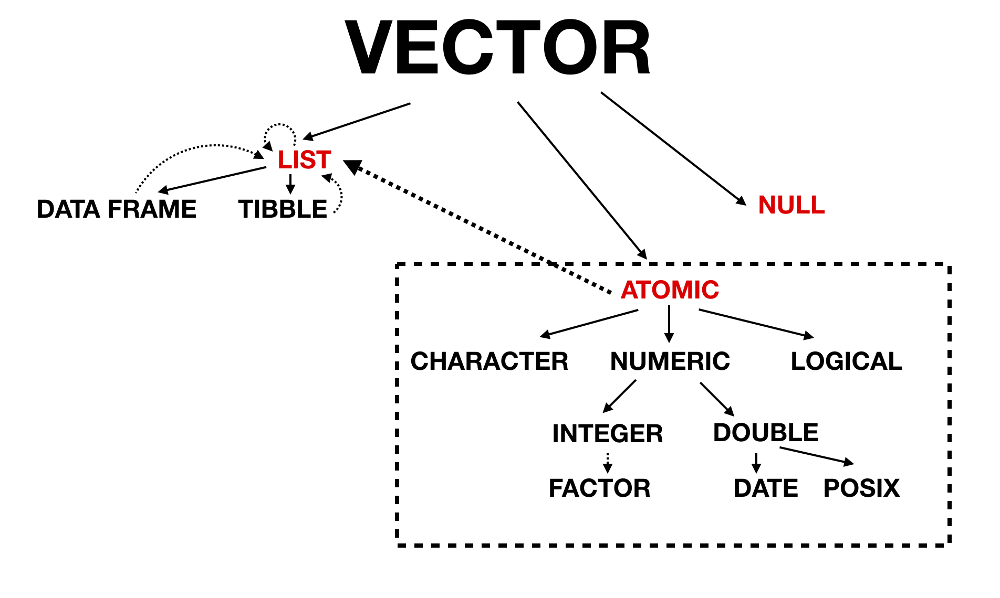

```{r setup, include=FALSE}
knitr::opts_chunk$set(include = TRUE)
```
<style>
img {
  display: block;
  margin: 0 auto;
}
hide {
  display: none;
}
.remark-slide-content h1 {
    font-size: 45px;
}
h1 {
  font-size: 2em;
  margin-block-start: 0.67em;
  margin-block-end: 0.67em;
}
.remark-slide-content {
  font-size: 16px
}
.remark-code {
  font-size: 16px;
}
code.r {
  font-size: 16px;
}
pre {
  margin-top: 0px;
  margin-bottom: 0px;
}
</style>

# What's in Chapter 3

--

<br /><br />

- Section 3.2: atomic vectors

- Section 3.3: attributes

- Section 3.4: "special" vectors (S3 atomic vectors)

- Section 3.5: lists

- Section 3.6: data frames and tibbles

- Section 3.7: `NULL`

--

---

# Vectors

--

+ 2 types: atomic and list

<hide>
The difference is that elements of atomic vectors have the same "type", while the elements of list vectors can be of different types. In general, the word "atomic" describes things that are irreducible units or components of a system. Here, the irreducible units are the data types, and the system is the R programming language. So we can see why its appropriate to call vectors of a single type "atomic". Lists have their own special properties.
</hide>

.pull-left[

atomic

```{r echo=F, include=T, eval=T, out.width='100%'}
knitr::include_graphics('https://d33wubrfki0l68.cloudfront.net/8a3d360c80da1186b1373a0ff0ddf7803b96e20d/254c6/diagrams/vectors/atomic.png')
```

]

.pull-right[

list

```{r echo=F, include=T, eval=T, out.width='100%'}
knitr::include_graphics('https://d33wubrfki0l68.cloudfront.net/9628eed602df6fd55d9bced4fba0a5a85d93db8a/36c16/diagrams/vectors/list.png')
```

]

--

... and there is also `NULL`


<hide>
Bringing `NULL` into the picture, we have our complete set of vector types.
</hide>

```{r echo=F, include=T, eval=T, out.width='40%'}
knitr::include_graphics('https://d33wubrfki0l68.cloudfront.net/2ff3a6cebf1bb80abb2a814ae1cfc67b12817713/ae848/diagrams/vectors/summary-tree.png')
```

---

# Atomic Vectors

--

+ **4** primary types: logical, integer, double, character (i.e. strings)


```{r echo=F, include=T, eval=T, out.width='30%'}
knitr::include_graphics('https://d33wubrfki0l68.cloudfront.net/eb6730b841e32292d9ff36b33a590e24b6221f43/57192/diagrams/vectors/summary-tree-atomic.png')
```

```{r eval=F}
c(TRUE, FALSE, T, F)
c(1234L, 42L)
c(3.14, .314e1, 0xbada55)
c('single quote', "double quote")
```

<hide>
I think everyone is probably familiar with these types, so I won't spend too much time on them.

When we create individual instances of these "types", we have what we call "scalars". In other programming languages, such a form---a single value of a single type---may have different properties. But with R, everything is a vector, even "scalars".
</hide>

--

... also raw and complex

```{r eval=F}
raw(42)
complex(real = 0, imaginary = -1)
```

--

+ Check type with `typeof()`

<hide>
Use `typeof()` to identify the type of a variable.
</hide>

---

#  Coercion

--

+ **Coercion** happens when you attempt to combine vectors with elements of different types

<hide>
Coercion often happens automatically. Most mathematical functions (+, log, abs, etc.) will coerce to numeric.
</hide>

--

+ Coercion order: character → double → integer → logical

```{r eval=T}
c(1, 1.01) # to double
c(1, '1') # to character
c(1, TRUE) # to integer
```

--

+ Explicity coerce with `as.*()` functions

```{r eval=T}
as.integer(c(1, 1.01))
```

--

+ Failed coercion leads to warnings and `NA`

```{r eval=T}
as.integer(c('1', '1.01', 'a'))
```

---

# `NA` and `NULL`

--

.pull-left[

+ `NA` is a "sentinel" value for explicit missingness

+ `NA` can be of any type, e.g. `NA_integer_`, `NA_character_`, etc.

<hide>
Default is logical, which is achieved by just `NA`.
</hide>

+ Calculations involving `NA`s usually result in more `NA`s

```{r eval=T}
1 + NA
```

...although not always

```{r eval=T}
1 | NA
```


+ Test with `is.na()`

]

--

.pull-right[

+ `NULL` is its own vector type

```{r eval=T}
typeof(NULL)
```

+ Zero-length

```{r eval=T}
length(NULL)
```

+ Cannot have attributes

```{r eval=F, error=T}
x <- NULL
attr(x, 'y') <- 1 # error
```

<hide>
A vector with `NA` can have attributes.
</hide>

+ Test with `is.null()`

]

<hide>
Speaking of attributes...
</hide>

---

# Attributes

--

+ Name-value pairs of metadata for R objects

--

+ Get and set a single attribute with `attr()`

```{r eval=T}
x <- 'a'
attr(x, 'what') <- 'apple'
attr(x, 'what')
```

--

+ Get and set multiple attributes with `attributes()` and `structure()`

--

```{r eval=T}
x <- structure('a', what = 'apple', type = 'fruit')
attributes(x)
```

--

+ With the exception of `names()` and `dim()`, most attributes are lost with calculations

```{r eval=T}
attributes(x[1])
```

---

# `names()`

--

+ `names()` can be assigned in multiple ways

```{r eval=T, results='hold'}
x <- c(apple = 'a', banana = 'b') # 1
x
y <- c('a', 'b')
names(y) <- c('apple', 'banana') # 2
y
setNames(y, c('apple', 'banana')) # 3
```

---

# `dim()`

--

+ `dim()` has the capability of turning a 1-d vector into a 2-d matrix or an n-d array

```{r eval=T}
a <- matrix(1:6, nrow = 2, ncol = 3)
a
b <- array(1:6, dim = c(1, 3, 2))
b
```

--

+ Weird things

--

  + 1-d vector without a `dim` attribute has `NULL` dimension 

--

  + Matrices and arrays can be a single column or row vector

---

# S3 atomic vectors

--

+ Objects with a `class` attribute, making them **S3 objects**

<hide>
This means that the vector will behave different with a generic function such as `print()` or even mathematical operators such as `+`
</hide>

--

+ **4** important S3 vector types in base R: `factor` (categorical), `Date` (Date), `POSIXct` (date-time), `duration` (difftime).

```{r echo=F, include=T, eval=T, out.width='30%'}
knitr::include_graphics('https://d33wubrfki0l68.cloudfront.net/baa19d0ebf9b97949a7ad259b29a1c4ae031c8e2/8e9b8/diagrams/vectors/summary-tree-s3-1.png')
```

---

# Factors

--

+ Vector that can only contain pre-defined values

<hide>
Thus, it is commonly used to store categorical data.
</hide>

--

+ Has two attributes: `class` and `levels`

--

+ Built on top of integers, not characters

```{r eval=T}
fruits <- factor(c('banana', 'apple', 'carrot'))
fruits
```
<hide>
Note that it is ordered alphabetically by default.
</hide>

--

+ Variation: **ordered** factors

```{r eval=T}
x <- ordered(c('two', 'three', 'one'), levels = c('one', 'two', 'three'))
x
```

<hide>
[Interesting story about `stringsAsFactors`](https://simplystatistics.org/2015/07/24/stringsasfactors-an-unauthorized-biography/)
</hide>

---

# `Date`, `POSIXct`, and `duration`

--

+ All built on top of doubles

--

+ Dates have `class = "Date"`

--

+ Date-times are trickier...

--

  + Represent seconds since Jan. 1, 1970

--

  + `POSIXct` isn't the only possible class; there's also `POSIXlt`

--

  + Also have a "parent" class of `POSIXt`

--

  + Have a `tzone` attribute


<hide>
c is for "calendar" time and "l" is for local time
</hide>

--

+ Durations have 2 attributes: `class = "difftime"` and `units` corresponding to a temporal unit, e.g. `"day"`

<hide>
This temporal unit is purely for pretty printing.
</hide>

---

# Lists

--

+ Each element can by of any atomic type, or even another list

```{r echo=F, include=T, eval=T, out.width='10%'}
knitr::include_graphics('https://d33wubrfki0l68.cloudfront.net/c13ad724c9a86a01e96519066ce09f7ce361d29c/5cf75/diagrams/vectors/list-recursive.png')
```

<hide>
Lists are sometimes called "recursive" vectors because a list can contain other lists. Atomic vectors don't have the same capability
</hide>

--

+ Each element is really a reference

<hide>
As shown in the last chapter, lists are references. (Pointer may be a more familiar term.) This means that the size of a list does not really scale as you might expect.)
</hide>

```{r eval=T}
x <- 1L
lobstr::obj_size(x)
lobstr::obj_size(rep(x, 3L))
```
--

+ Combining with `c` is different than wrapping with `list()`

<hide>
This follows from the capability of lists to store other lists.
</hide>

```{r eval=T}
x <- list(a = 1, b = 2)
y <- list(c = -1, d = -2)
length(list(x, y))
length(c(x, y))
```

<hide>
--

+ Coercing to a list may not result in what you'd expect

```{r eval=T}
as.list(letters[1:2])
```
</hide>

---

# Data frames

--

+ S3 vectors built on top of lists

```{r echo=F, include=T, eval=T, out.width='15%'}
knitr::include_graphics('https://d33wubrfki0l68.cloudfront.net/9ec5e1f8982238a413847eb5c9bbc5dcf44c9893/bc590/diagrams/vectors/summary-tree-s3-2.png')
```

--

```{r eval=T}
df <- data.frame(col1 = 1:2, col2 = c('a', 'b'))
df
```

--

+ Data frames have some undesireable default behavior

```{r eval=T}
class(df$col2)
```

--

... which spawned tibbles (with the `{tibble}` package)


```{r eval=T}
tbl <- tibble::tibble(col1 = 1:2, col2 = c('a', 'b'))
class(tbl$col2)
```

---

# Data frame vs tibble behavior

--

+ Tibble don't coerce strings to factors by default

--

+ Tibbles discourage rownames, which are generally "bad"

<hide>
Rownames are "bad" because: (1) storing metadata in a different way than the rest of the data is generally not a good idea; (2) only work if a row can be identified by a single string; (3) must be unique.
</hide>

--

+ Tibbles have a "prettier" print method

--

+ Tibbles have stricter subsetting rules

<hide>
tibbles always return a tibble and don't allow partial matching with `$`
</hide>

---

# Non-your-typical column

--

+ Data frame columns can be lists

<hide>
Need to wrap with `I()` here. (`I` is for identity.)
</hide>

```{r eval=T}
data.frame(x = 1:2, y = I(list(1:3, 1:4)))
```
--

+ Easier list-column creation with tibbles

```{r eval=T}
tibble::tibble(x = 1:2, y = list(1:3, 1:4))
```
--

+ Columns can even be matrices and data frames

<hide>
Notably, don't need to wrap with `I()` here.
</hide>


```{r eval=F}
data.frame(x = 1:2, y = matrix(3:6, nrow = 2))
data.frame(x = 1:2, y = data.frame(a = 3:4, b = 5:6))
```

---

# In Review

--

```{r, echo=F, include=T, eval=T, out.width='100%'}

```

