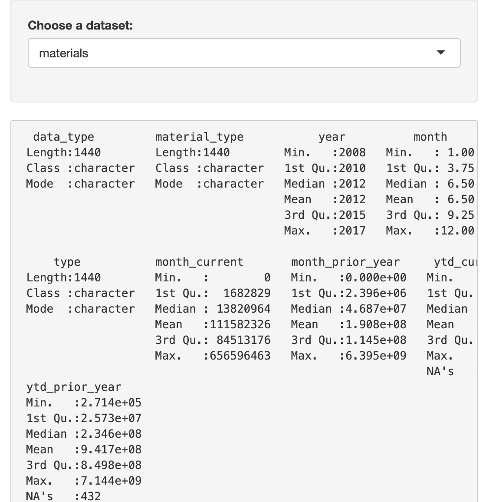
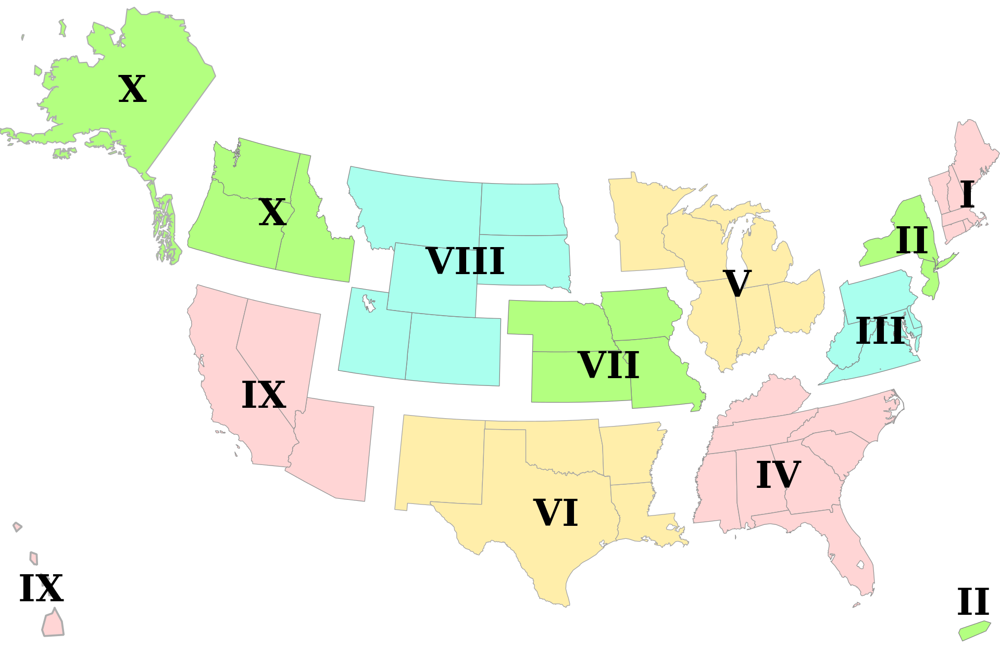
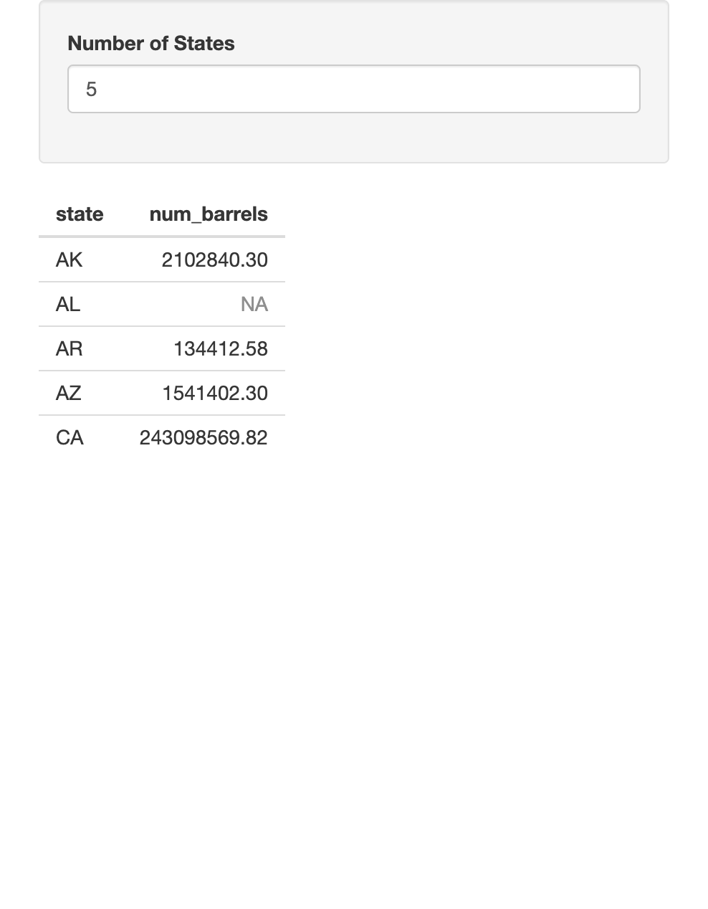
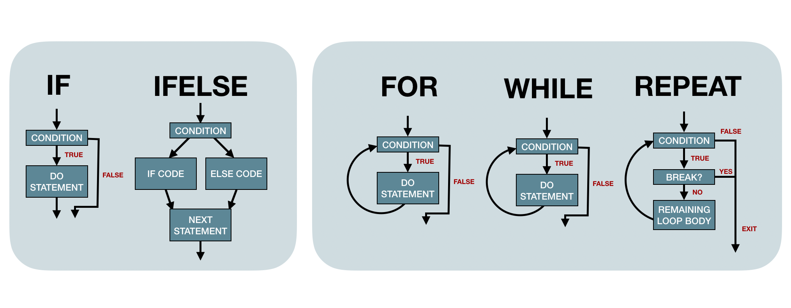

```{r xaringan-themer, include = FALSE}
library(xaringanthemer)
mono_light(
  base_color = "#3092FF",
  header_font_google = google_font("Josefin Sans"),
  text_font_google   = google_font("Montserrat", "300", "300i"),
  code_font_google   = google_font("Droid Mono")
)
library(tidyverse)
```


# CONTROL FLOW

- `if`
- `ifelse`
- `case_when`
- `switch`
- `for`
- `while`
- `repeat`

---
 

# But First... BEER!

- State (abbreviated)
- Year
- Barrels (barrels produced)
- Type (On premise, Bottles/Cans, Kegs/Barrels)

```{r, echo=FALSE, warning=FALSE, message = FALSE}
beer_states <- readr::read_csv('https://raw.githubusercontent.com/rfordatascience/tidytuesday/master/data/2020/2020-03-31/beer_states.csv')

kableExtra::kable(head(beer_states))
```


---

# If and ifelse

*Let's see if a random state in our dataset is my home town, NV*


##### IF 
```{r}
if (sample(beer_states$state, 1) == "NV") print("My Home State")
```

##### IF ELSE
```{r}
if (sample(beer_states$state, 1) == "NV") print("My Home State") else print("Not my home")
```

##### IFELSE
```{r}
ifelse((sample(beer_states$state, 1) == "NV"), print("My Home State"), print("Not my home"))
```


.footnote[
*Why does the `ifelse` statement print "Not my home" twice?*
]
---

# CASE WHEN

*Let's change the barrels column to categorical*


.pull-left[
```{r, eval=FALSE}
beer_states %>%
  mutate(
    barrel_cat = 
      if (barrels >= 100000000) { 
        "A lot" 
      } else if (barrels >= 10000000) {
        "Many"
      } else if (barrels >= 1000000) {
        "A few"
      } else {
        "Not much"
      }
    )
```
]

.pull-right[
```{r, eval=FALSE}
beer_states %>%
  mutate(
    barrel_cat = case_when(
      barrels >= 100000000 ~ "A LOT!",
      barrels >= 10000000 ~ "Many",
      barrels >= 1000000 ~ "A few",
      TRUE ~ "Not much"
    )
  ) 
```
]

```{r, echo=FALSE}
kableExtra::kable(
  beer_states %>%
  mutate(
    barrel_cat = case_when(
      barrels >= 100000000 ~ "A LOT!",
      barrels >= 10000000 ~ "Many",
      barrels >= 1000000 ~ "A few",
      TRUE ~ "Not much"
    )
  )  %>%
  mutate(barrel_cat = factor(barrel_cat, levels = c("A LOT!", "Many", "Not much", "A few"))) %>%
  group_by(barrel_cat) %>%
  count()
)
```

---

# SWITCH

*Let's make a small shiny app to see the number of barrels per state*

.shinyapp[
.pull-left[
```{r, eval=FALSE}
library(shiny)
library(tidyverse)

brewing_materials <- readr::read_csv('https://raw.githubusercontent.com/rfordatascience/tidytuesday/master/data/2020/2020-03-31/brewing_materials.csv')
beer_taxed <- readr::read_csv('https://raw.githubusercontent.com/rfordatascience/tidytuesday/master/data/2020/2020-03-31/beer_taxed.csv')
brewer_size <- readr::read_csv('https://raw.githubusercontent.com/rfordatascience/tidytuesday/master/data/2020/2020-03-31/brewer_size.csv')
beer_states <- readr::read_csv('https://raw.githubusercontent.com/rfordatascience/tidytuesday/master/data/2020/2020-03-31/beer_states.csv')


ui <- fluidPage(
    sidebarLayout(
        sidebarPanel(
            selectInput(inputId = "dataset",
                        label = "Choose a dataset:",
                        choices = c("materials", "size", "states", "taxed"))
        ),
        mainPanel(
            verbatimTextOutput("summary")
        )
    )
)


server <- function(input, output) {
    
    datasetInput <- reactive({
        switch(input$dataset, #<<
               "materials" = brewing_materials, #<<
               "size" = brewer_size, #<<
               "states" = beer_states, #<<
               "taxed" = beer_taxed) #<<
    })

    output$summary <- renderPrint({
        dataset <- datasetInput()
        summary(dataset)
    })
    
}

shinyApp(ui = ui, server = server)
```
]]

.pull-right[
```{r, echo=FALSE}

```
]

.footer[
```{r, eval=FALSE}
runApp("Presentations/Week5/switch_app/app.R", display.mode = "showcase")
```
]

---

# FOR

*Create a "region" column based on each observatation's state*

```{r, include=FALSE}
Region1 <- c("CT", "ME", "MA", "NH", "RI", "VT")
Region2 <- c("NJ", "NY")
Region3 <- c("DE", "DC", "MD", "PA", "VA", "WV")
Region4 <- c("AL", "FL", "GA", "KY", "MS", "NC", "SC")
Region5 <- c("IL", "IN", "MI", "MN", "OH", "WI")
Region6 <- c("AR", "LA", "NM", "OK", "TX")
Region7 <- c("IA", "KS", "MO", "NE")
Region8 <- c("MT", "CO", "ND", "SD", "WY")
Region9 <-  c("AZ", "CA", "HI", "NV")
Region10 <- c("AK", "ID", "OR", "WA")
```

.smaller-pre[
.pull-left[
```{r, warning=FALSE}
for (i in 1:nrow(beer_states)) { #<<
  if (beer_states$state[i] %in% Region1) {
    beer_states$region[i] <- "Region 1"
  } else if (beer_states$state[i] %in% Region2) {
   beer_states$region[i] <- "Region 2"
  } else if (beer_states$state[i] %in% Region3) {
    beer_states$region[i] <- "Region 3"
  } else if (beer_states$state[i] %in% Region4) {
    beer_states$region[i] <- "Region 4"
  } else if (beer_states$state[i] %in% Region5) {
     beer_states$region[i] <- "Region 5"
  } else if (beer_states$state[i] %in% Region6) {
     beer_states$region[i] <- "Region 6"
  } else if (beer_states$state[i] %in% Region7) {
    beer_states$region[i] <- "Region 7"
  } else if (beer_states$state[i] %in% Region8) {
    beer_states$region[i] <- "Region 8"
  } else if (beer_states$state[i] %in% Region9) {
    beer_states$region[i] <- "Region 9"
  } else if (beer_states$state[i] %in% Region10) {
    beer_states$region[i] <- "Region 10"
  } else {
    beer_states$region[i] <- "Missing"
  }
} #<<
```
]]

.pull-right[
```{r, echo=FALSE}

```
]

---

# WHILE

.smaller-pre[
.pull-left[
```{r, eval=FALSE}
library(shiny)

beer_states <- readr::read_csv('https://raw.githubusercontent.com/rfordatascience/tidytuesday/master/data/2020/2020-03-31/beer_states.csv')

ui <- fluidPage(
    sidebarPanel(numericInput('xqty', 'Number of States', 3, 1, 10)),
    mainPanel(tableOutput("while_debug")))

server <- function(input, output, session) {
    
   states <- unique(beer_states$state)
    
   my_vector <- reactive({ #<<
        i <- 0 #<<
        my_vector <- vector() #<<
        while (i <= input$xqty) { #<<
            my_vector[i] <- i #<<
            i = i+1 #<<
        } #<<
        return(my_vector) #<<
    }) #<<
    
    output$while_debug <- renderTable({
        
        beer_states %>%
            filter(state %in% unique(beer_states$state)[my_vector()]) %>%
            filter(state != "total") %>%
            group_by(state) %>%
            summarise(num_barrels = sum(barrels))
    })
}  
shinyApp(ui = ui, server = server)
```
]]

.pull-right[
```{r, echo=FALSE}

```
]

---

# REPEAT

*Let's revist beer in Nevada - rather than take one sample, we can use repeat to continue sampling until we find beer!*

```{r, warning="hide", eval=FALSE}
repeat {   
  if (sample(beer_states$state, 1) == "NV") {
    print("Go grab a beer!");
    break
  } else print("Maya doesn't live here");
}
```

```
[1] "Maya doesn't live here"
[1] "Maya doesn't live here"
[1] "Maya doesn't live here"
[1] "Maya doesn't live here"
[1] "Maya doesn't live here"
[1] "Maya doesn't live here"
[1] "Maya doesn't live here"
[1] "Maya doesn't live here"
[1] "Maya doesn't live here"
[1] "Maya doesn't live here"
[1] "Maya doesn't live here"
[1] "Maya doesn't live here"
[1] "Maya doesn't live here"
[1] "Maya doesn't live here"
[1] "Maya doesn't live here"
[1] "Go grab a beer!"
```


---

# ALL TOGETHER!

*This diagram is incomplete - let's improve it together!*

```{r, echo=FALSE}

```

<style>
pre {
  font-size: 0.7em;
}

.footnote {
  position: fixed;
  bottom: 0;
  right: 0;
}

.shinyapp {
font-size: 0.5em;
}

.smaller-pre {
font-size: 0.9em;
}

.remark-code-line-highlighted {
    background-color: rgba(48,146,255,0.2);
}
</style>
