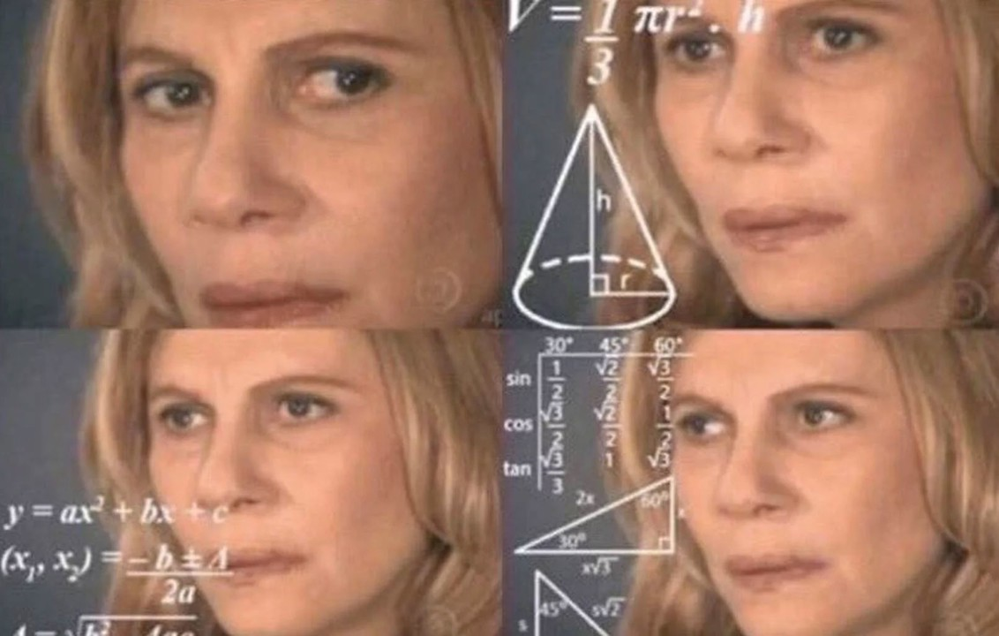

```{r echo = F}
knitr::opts_chunk$set(message = F, warning = F)
```

# Prerequisites 

Packages: 

```{r}
suppressPackageStartupMessages({
library(tidyverse)
library(skimr)})
```

Data: 
```{r}
# data from tidytuesday
# https://github.com/rfordatascience/tidytuesday/blob/master/data/2020/2020-03-31/readme.md

brewing_materials <- readr::read_csv('https://raw.githubusercontent.com/rfordatascience/tidytuesday/master/data/2020/2020-03-31/brewing_materials.csv')
beer_taxed <- readr::read_csv('https://raw.githubusercontent.com/rfordatascience/tidytuesday/master/data/2020/2020-03-31/beer_taxed.csv')
brewer_size <- readr::read_csv('https://raw.githubusercontent.com/rfordatascience/tidytuesday/master/data/2020/2020-03-31/brewer_size.csv')
beer_states <- readr::read_csv('https://raw.githubusercontent.com/rfordatascience/tidytuesday/master/data/2020/2020-03-31/beer_states.csv')

```


---

# Function fundamentals 

- Functions are objects, just as vectors are objects.
- Functions can be broken down into three components: **argument** (plural: formals), **body** (code inside the function), and **environment** (determines how the function finds the values associated the names).
- Arguments and body are always explicitely mentionned, but not the environment (which is implied)

---
  
# Function fundamentals (2)

```{r}
barrels_to_gallons <- function(total_barrels) {
  # A barrel of beer is 31 gallons
  gallons <- total_barrels * 31 
  return(gallons)
}

barrels_to_gallons(3.65)
```

```{r}
formals(barrels_to_gallons)
body(barrels_to_gallons)
```


---

# Function fundamentals (3)

- Recall that functions are objects, therefore they have *attributes*
- Notice that when we called `body()` in the previous slide, it did not contain the commented code chunk. 
- You can use `attr()` to print the function's other attributes. Here, `srcref` prints the source code and other formatting: 

```{r}
attr(barrels_to_gallons, "srcref")
```


---

# Function fundamentals (4)

- You don't have to name a function, especially if it takes too much effort to come up with a name. These are called **anonymous functions**
- You can put functions in a list:

```{r}
funs <- list(
  gallons_est = function(barrels) barrels * 31,
  gallons_real = function(barrels) barrels * 31.657
)

funs$gallons_real(10)

```


---

# Function fundamentals (5)

You can invoke functions if the arguments are contained in the data structure with `do.call()`: 

```{r}
args <- brewer_size %>% 
  select(total_barrels) %>% 
  top_n(3) %>%
  as.list()

do.call(barrels_to_gallons, args)
```

---

# Function composition 

To compose multiple function calls you can:

- Nest functions (hard to read):

```{r eval=F, tidy=FALSE}
x <- runif(100)
sqrt(mean(square(deviation(x))))
```

- Save the intermediate results as variables (annoying): 
```{r eval=F, tidy=FALSE}
out <- deviation(x)
out <- square(out)
out <- mean(out)
out <- sqrt(out)
out
```

- Pipe (the best): 
```{r eval=F, tidy=FALSE}
x %>%
  deviation() %>%
  square() %>%
  mean() %>%
  sqrt()
```

"The focus is on what’s being done (the verbs), rather than on what’s being modified (the nouns)."

---
class: center, middle

# Is R lexically or dynamically scoped?

---

# Lexical vs dynamic scoping 

```{r}
x <- 10
g <- function() {
  x <- 20
  x
}

g()
```

Makes sense. What about?

```{r eval=F, tidy=FALSE}
x <- "IPA's taste and smell like dirty socks"
f <- function() x
g <- function() {
  x <- "I like the taste of dirty socks and therefore IPA's"
  f()
}
g() # what does this return? PS: it's the correct answer
```

---

R is lexically scoped, and therefore returns the correct answer: "IPA's taste and smell like dirty socks".

*What is a scope*? **Scope refers to the places in a program where a variable is visible and can be referenced**.

.pull-left[
- Under dynamic scoping:

  - a variable is bound to the **most recent value assigned to that variable**, i.e. the most recent assignment during the program’s execution.

  - in other words, the program returns the most recent assignment during the program's execution, i.e. "IPA's are the best"

]

.pull-left[
- Under lexical scoping:

  - the scope of a variable is determined by the lexical (i.e. textual) structure of a program.

  - the use of x on line 2 is **"within the scope"** created by the definition on line 1, so the program returns "IPA's taste and smell like dirty socks".
  
  - Most programming languages are lexically scoped

]


---

# Lexical scoping 

- R uses **lexical scoping**: it looks up the values of names based on how a fuction is defined, not how it is called.

- R's lexical scoping follows 4 rules:
  - Name masking
  - Functions versus variables
  - A fresh start
  - Dynamic lookup
  
- Understanding these will help to use more advanced functional programming tools
  
---

# Lexical scoping (1): Name Masking

Names defined **inside** a function **mask** names defined outside a function. 

```{r}
x <- 10
y <- 20

fun <- function() {
  x <- 1
  y <- 2
  c(x, y)
}

fun()

```

- If a name isn’t defined inside a function, R looks one level up.
- The same rules apply if a function is defined inside another function. 
- R will look a "level" up, all the way up to the global environment and finally, the loaded packages

`r emo::ji("house")`: functions help you prevent coding mistakes by having **variables only be valid inside the body of a function** and therefore unaffected by any other variables with the same name outside of the function

---

# Lexical scoping (2): A fresh start

```{r}
a <- 419
fun <- function() {
  if (!exists("a")) {
    a <- 1
  } else {
    a <- a + 1
  }
  a
}

fun()
fun() # every run is a fresh start!

```

We get the same value because each function run is completely independent of the other - functions cannot tell what happened previously. We'll see how to modify this behavior in later chapters

---

# Lexical scoping (3): Dynamic lookup

- R looks for values when the function is run, *not when the function is created*.

- This behavior is, as Hadley calls it, "annoying" because if you make a spelling mistake in your code, you won’t get an error message when you create the function

- You can use `codetools::findGlobals()` which will list any unbounded symbols and then use `emptyenv()` to manually empty out the environment the function is in.

---

# Lazy evaluation (1)

Arguments to functions are evaluated *lazily* so they are evaluated only as needed: 

```{r}
f <- function(a, b) {
        a^2
} 

f(2)
```

This function never actually uses the argument b, so calling f(2) will not produce an error because the 2 gets positionally matched to a.


---

# Lazy evaluation (2)

Another example:

```{r eval=F, tidy=T}
f <- function(a, b) {
  print(a)
  print(b)
}

f(45)
> 45
> Error in print(b) : argument "b" is missing, with no default
```

“45” got printed first before the error was triggered. Why? **because b did not have to be evaluated until after print(a)**. 

Once the function tried to evaluate print(b) it had to throw an error.

---

# Lazy evaluation (2): Promises

Lazy evaluation is powered by a data structure called a **promise** 

A promise has 3 components:

- An expression which gives rise to the **delayed computation**

- **An environment** where the expression should be evaluated, i.e. the environment where the function is called.

- A value, which is computed and cached the first time a promise is accessed when the expression is evaluated in the specified environment. **This ensures that the promise is evaluated at most once**

`r emo::ji("house")`: Lazy evaluation via promises allows you to include intensive computations in function arguments **which will only be evaluated when needed**. 

---

# Lazy evaluation (4): Default arguments 

```{r}
gallons <- function(x, y) {
result <- x*y
print(paste(x,"barrels", "equal", result, "gallons of beer"))
}

gallons(8, 31)
```

The same function, with a default argument:

```{r}
gallons <- function(x, y = 31) {
result <- x*y
print(paste(x,"barrels", "equal", result, "gallons of beer"))
}

gallons(8)
```

Here, `y` argument is optional and will take the default value unless you specify otherwise

---

# Lazy evaluation (5): Default arguments 

Because of lazy evaluation, default values can be defined in terms of:

- other arguments

- or variables defined later in the function

Even though may base packages use default argument, Hadley does not recommend them because:

- they are hard to read

- need to know the order of evaluation to know what will be returned 

---

# Lazy evaluation (6): Missing arguments 

You can use `missing()` to check whether an argument's value comes from the user or the default

```{r}
fun <- function(x = 10) {
  list(missing(x), x)
}

str(fun()) 
```

Returns `TRUE` because the argument's value comes from the default.

```{r}
str(fun(10)) 
```

Returns `FALSE` because the argument's value comes from the user.

---

# dot-dot-dot (1)

```{r fig.height=3}
green.plot <- function(x, y, ...) {
  plot(x, y, col="green", ...)
}

green.plot(1:5, 1:5, xlab="Are Very Useful", ylab="dot-dot-dot")
```

We passed `xlab` and `ylab` thanks to the ellipses even though we didn't define them in the function. 

---

# dot-dot-dot (2)

- Functions can have a special argument `...` and with it it can take any number of additional arguments 

- When is it used?

  - to extend another function when you don't want to copy the entire argument list of the original function:

  - when the number of arguments passed to the function cannot be known in advance.

`r emo::ji("exclamation")`: Any arguments **after** the `...` **must** be named explicitely and cannot be partially matched.

---

# Exiting a function (1)

- Success or failure are the two ways by which a function "exits"
  - Success is when it returns a value
  - Failure is when it throws an error 

- There are many types of return values:
  - Implicit vs explicit
  - visible vs invisible 
  
---

# Return values (1): explicit 

We're being explicit here by using `return()`
```{r}
region_2 <- function(state) {
  
  northeast <- c("NY", "MA", "AL", "VT", "CT")
  
  if (state %in% northeast) {
    return("all good") # explicit because we call return()
  } else {
    return("not in the northeast")
  }
}

region_2("VT")
```

---

# Return values (1): implicit

The last evaluated expression is the return value:
```{r}
region <- function(state) {
  
  northeast <- c("NY", "MA", "AL", "VT", "CT")
  
  if (state %in% northeast) {
    "all good" # implicit because we don't call return()
    
  } else {
    "not in the northeast"
  }
}

region("CA")
```

---

# Visible vs invisible values 

Calling on a function returns the value automatically:

```{r}
fun <- function() 1

fun()
```

But you can prevent that by wrapping the last value in `invisible()`:

```{r eval=F, tidy=T}
fun <- function() invisible(1)
fun()
```

You can always call `print()` or wrap the whole function call in parantheses to verify that it still exists.

---

# Errors

Function to compute the confidence interval for the mean:
```{r eval=F, tidy=F}
d <- rpois(25,8)
d

GetCI <- function(x, level = 0.95) {
  if (level <= 0 || level >= 1) {
    stop("The 'level' argument must be greater than 0 and less than 1")
  }
  if (level < 0.5) {
    warning("Confidence levels are often close to 1, e.g. 0.95") 
  }
  
  m <- mean(x)
  n <- length(x)
  SE <- sd(x)/sqrt(n)
  upper <- 1 - (1-level)/2
  ci <- m + c(-1,1)*qt(upper, n-1)*SE
  return(list(mean=m, se=SE, ci=ci))
}

GetCI(d, 99)

```

---

# Exit handlers

```{r echo=F}

```

Sorry.

---

# Function forms

Not all function calls are the same. There are 4 types:

- **Prefix**: the function name comes before its arguments (the most common)

- **infix**: the function name comes in between its arguments (common in math operators and user-defined functions)

- **replacement**: functions that replace values by assignment, like `names(df) <- c("a", "b", "c").`

- **special**: functions like `[[`, `if`, and `for`. 


`r emo::ji("house")`: there are 4 forms but everything can be written in prefix form.


---

# Infix functions

R comes with a number of built-in infix operators: `:`, `::`, `:::`, `$`, `@`, `^`, `*`, `/`, `+`, `-`, `>`, `>=`, `<`, `<=`, `==`, `!=`, `!`, `&`, `&&`, `|`, `||`, `~`, `<`-, and `<<-`. 

But you can create your own!

```{r}
`%+%` <- function(a, b) paste0(a, b)
"Sour beers " %+% "are elite"
```

---

# Replacement functions

- Act like they modify their arguments in place
- have the special name xxx <- and must have arguments named x and value
- must return the modified object. For example, the following function modifies the second element of a vector:

```{r}
`second<-` <- function(x, value) {
  x[2] <- value
  x
}

```

Replacement functions are used by placing the function call on the left side of `<-`:

```{r}
x <- 1:10
second(x) <- 5L
x

```

---

# Special forms 
# How to rewrite a function in prefix form 

More on this in the book!

---

# Useful references 

- Good introductory overview on functions in R: https://www.stat.berkeley.edu/~statcur/Workshop2/Presentations/functions.pdf

- On lexical scoping in R
  - On scoping in R: http://prl.ccs.neu.edu/blog/2019/09/10/scoping-in-r/
  - Lexical and dynamic scope: http://prl.ccs.neu.edu/blog/2019/09/05/lexical-and-dynamic-scope/
  - 4 kinds of scoping in R: http://prl.ccs.neu.edu/blog/2019/09/10/four-kinds-of-scoping-in-r/
  - How R searches and finds stuff (many diagrams): http://blog.obeautifulcode.com/R/How-R-Searches-And-Finds-Stuff/

---

class: center, middle

# Thank you!

