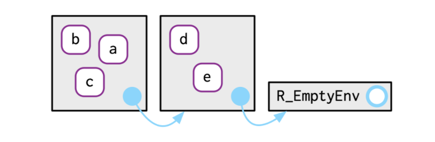
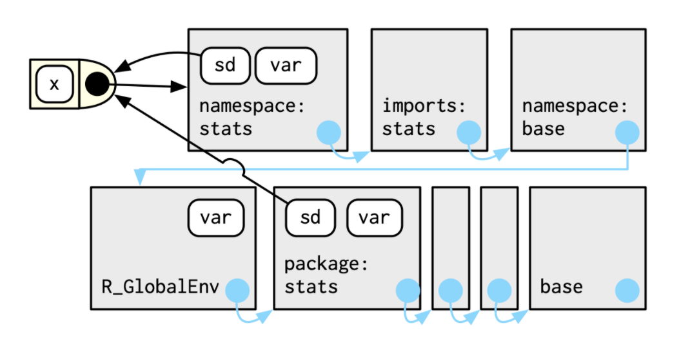

```{r setup, include=FALSE}
options(htmltools.dir.version = FALSE)
knitr::opts_chunk$set(fig.align="center", fig.width=5, fig.height=5, warning = FALSE, message = FALSE)
```

```{r xaringan-themer, include = FALSE}
library(xaringanthemer)
duo_accent(
  primary_color = "ivory",
  secondary_color = "#310A31",
  header_font_google = google_font("Roboto", "400"),
  text_font_google   = google_font("Lato", "300"),
  code_font_family = "Fira Code",
  code_font_url = "https://cdn.rawgit.com/tonsky/FiraCode/1.204/distr/fira_code.css",
  header_color = "#f54278",
  title_slide_text_color = "#354a66"
)
```


## Recall from Chapter 6: R has 4 primary scoping rules
  
  * **Name masking**
    * names defined inside a function mask names outside the function
    
    * if the name can't be found, R looks one level up


  * **Functions versus variables**
  
    * if you use a name in a function call, objects that are not functions get ignored in the search
  

  * **A fresh start**
  
    * every time a function is called, a new **environment** gets created. 
  

  * **Dynamic lookup**
  
    * R looks for values only when it needs them (when the function is run) 
  

---
## The most important things you need to know 


### **An environment's job is to bind a set of names to a set of values**


#### Environments are different from lists in the following ways

  * Every name must be unique.

  * The names in an environment are not ordered.

  * An environment has a parent.

  * Environments are not copied when modified i.e. environments use reference semantics


---
## 7.2.1 Basics

  * You can can create environments using 
    
    * `rlang::env` or 
    
    * `new.env`
    
  * View an environment using:
  
    * `rlang::env_print`: descriptive info about environment elements

    * `rlang::env_names`: to give list of bindings 

    * `names`: gives current bindings using base  
  

```{r envcreation, echo = FALSE}
library(rlang)
e1 <- env(
  a = FALSE,
  b = "a",
  c = 2.3,
  d = 1:3,
)
```


---
### Reading in some data

```{r message = FALSE, warning = FALSE}
brewing_materials = readr::read_csv("https://raw.githubusercontent.com/rfordatascience/tidytuesday/master/data/2020/2020-03-31/brewing_materials.csv")
beer_taxed = readr::read_csv("https://raw.githubusercontent.com/rfordatascience/tidytuesday/master/data/2020/2020-03-31/beer_taxed.csv")
brewer_size = readr::read_csv("https://raw.githubusercontent.com/rfordatascience/tidytuesday/master/data/2020/2020-03-31/brewer_size.csv")
beer_states = readr::read_csv("https://raw.githubusercontent.com/rfordatascience/tidytuesday/master/data/2020/2020-03-31/beer_states.csv")
beer_reviews = readr::read_csv("https://raw.githubusercontent.com/r4ds/bookclub-Advanced_R/master/data/beer_reviews.csv.gz")
```


---
### Creating another environment


```{r}
beer_env <- env(
  brewing_materials = brewing_materials,
  beer_taxed = beer_taxed
)

env_print(beer_env)

```


---
## 7.2.2 Important Environments

Two key environments:

  * current environment: where code is currently executing 
  
  * global environment aka your workspace


These are often the same. 
  
  
`identical` will tell you if two environments are the same
  
```{r compenvs, exercise = TRUE}
identical(global_env(), current_env())
```
  


---
## 7.2.3 Parents 

Every environment has a parent:


  
  * this is where R looks next to find names that are not bound in the current environment 
  
  * the sequence of environments ends with the <b>empty environment</b>
  
  * can be set at the time of creation (first argument of `rlang::env`) . The current environment will be used otherwise.
  
  * You can get an environment's parent using `rlang::env_parent` or `parent.env` or a sequence of parents (ancestors?) using `rlang::env_parents`
  

---
## Creating a new environment with specified parent

```{r newparent}


beer_env2 <- env(beer_env,
                 size = brewer_size,
                 states = beer_states)

env_parent(beer_env2)
parent.env(beer_env2)
```


---
### Getting the sequence of parents for an environment

You can get the sequence of parents of an environment using `rlang::env_parents`

```{r ancestors, exercise = TRUE}
env_parents(beer_env2)
```

--

```{r}
env_parents(beer_env2, last = empty_env()) 
```


---
## A note about the Empty environment

It's empty because it has no names

My previous (incorrect) mental model: an environment is contained within its parent

My new (correct?) mental model: an environment remembers where its parent lives


---
## 7.2.4 Super-assignment 


<b><<-</b> never creates a new variable if the lhs name is not bound: it looks for a variable in a parent environment to modify.


```{r superassignment}

x <- 0
f <- function() {
  x <<- 1
}
f()
x
```


---
## 7.2.5 Getting and setting 


  * `$` and `[[` work similar to with lists
  
  * `[[` cannot be used with numeric indices 
  
  * `[` does not work with environments
  
  * `$` and `[[` return NULL if the binding does not exist
  
  * binding a name to NULL does not remove it 
  

---
### Other functions 

  * `env_poke`: adds a binding using a string and a value
  
  * `env_bind`: binds multiple values to a specified environment
  
  * `env_has`: determines if an environment contains a name (string input) 
  
  * `env_unbind`: unbinds a given name (string input)
  

---
## 7.2.6 Advanced bindings


Two exotic variants of `rlang::env_bind`

  1. **Delayed bindings**: evaluated the first time they are accessed
  
  2. **Active bindings**: recomputed each time they are accessed
  


---
### Delayed binding example 

```{r lazybind}
env_bind_lazy(current_env(), b = {Sys.sleep(1); 1})

system.time(print(b))

system.time(print(b))
```


both calls give the same output though executed at different times 


---
### Active binding example


```{r activebind}
env_bind_active(current_env(), z1 = function(val) runif(1))
z1
z1
```

Each output triggers a call to `runif`


  


---
## 7.3 Recursing Over Environments recursiely


How do we find which environment contains a name?

**Recursive implementation**
```{r}
where <- function(name, env = caller_env()) {
  if (identical(env, empty_env())) {
    # Base case
    stop("Can't find ", name, call. = FALSE)
  } else if (env_has(env, name)) {
    # Success case
    env
  } else {
    # Recursive case
    where(name, env_parent(env))
  }
}
```


---
## 7.3 Recursing Over Environments recursiely


How do we find which environment contains a name?
**Iterative implementation**
```{r iterativewhere, message = FALSE}
where2 <- function(in_name, env = caller_env()) {
  while (!identical(env, empty_env())) {
    if (env_has(env, in_name)) {
      return(env)
    }
    # inspect parent
    env <- env_parent(env)
  }

  return (env)
}
```


---
## 7.4.1 Package environments and the search path

  * Every attached package becomes a parent of the global environment
  
  * the most recently-attached package becomes the immediate parent of the global environment and links to the previous parent as its own parent
  
  * the **search path** is the sequence of environments containing all attached packages and continuing to the empty environment
  
  * the last two packages on the search path are always the `Autoloads` and `base` environments
  
  


---
## 7.4.2 The function environment

  * A function binds the current environment when it is created i.e. this becomes the environment that the function sees


  * A name is typically bound to a function on function creation (I think anonymous functions are going to )


  * The environment in which a name is bound to a function is not necessarily the environment that the function binds.


#### Example of a function binding the global environment while being bound to another environment

```{r}
e <- env()
e$g <- function() 1
```

---
## Accessing the environment of a function

We can use `rlang::fn_env` or `environment` to access the environment of a function: 

```{r functionenv, exercise = TRUE}
y <- 1
f <- function(x) x + y
fn_env(f)
environment(f)
```


---
## 7.4.3 Namespaces

Question: How do we avoid ambiguities caused by varying the order of attaching packages?

Short answer: packages have a different sequence of parents  

Longer answer: Each package has two environments:
  1. The package environment: accessible to the outside world
  
  2. A namespace environment: internal to the package 
    * all bindings in the package environment are also found here 
    
    * may have a few extra names 
    
  3. names are bound to the function in both the package and namespace environments but the function specifically sees the namespace environment


---
### Detailed example of namespaces and parents of namespaces 


Consider `sd`:



**User calls the function via the name in the package environment but the function uses the names defined in the namespace environment.**


---
### What are the parents of the namespace environment? 


  * an `imports` environment: all the functions the package needs
    
  * the `base` environment
  
  * the global environment
  


  
    
---
## 7.4.4 Execution environments

We know about the function environment but there's also the ...

**execution environment** 

  * created fresh when the function is called
  
  * its parent is the function environment
  
  * is ephemeral and will disappear unless you explicitly do something to save it 
  

The following function will return the same result all the time even if called repeatedly: 

```{r}
g <- function(x) {
  if (!env_has(current_env(), "a")) {
    message("Defining a")
    a <- 1
  } else {
    a <- a + 1
  }
  a
}
```


---
## Preserving the execution environment

A few ways to preserve the execution environment

  * return it from the function


```{r}
h2 <- function(x) {
  a <- x * 2
  current_env()
}
```

--

  * return an object with a binding to it e.g. a function created in the function will have the execution environment as its own function environment
  
 

```{r}
plus <- function(x) {
  function(y) x + y
}

plus_one <- plus(1)
plus_one
```


  


---
## 7.5 Call Stacks


Another important environment, the **caller environment**: 
  
  * the environment the function was called from 
  
  * also where function values will be returned to


As functions can call each other, there can be multiple functions whose evaluation is in progress. 

The collection of these caller environments is the call stack. 

Call stacks can be:
  
  * simple (linear)  
  
  * not simple: they may have multiple branches


---
## 7.5.1 Simple Call Stacks


**An example of a simple call stack** 

```{r}
f <- function(x) {
  g(x = 2)
}
g <- function(x) {
  h(x = 3)
}
h <- function(x) {
  stop()
}
```


```{r error = TRUE}
f(x = 1)
```


```{r}
traceback()
```

---
### Another example of a simple call stack

```{r}
h <- function(x) {
  lobstr::cst()
}
f(x = 1)
```

---
## 7.5.2 Lazy Evaluation 

Lazy evaluation can lead to multiple branches of the call stack


Example:

```{r}
a <- function(x) b(x)
b <- function(x) c(x)
c <- function(x) x

a(f())
```


---
### Summarizing call stack on previous slide


We can see from the traceback that

  * the function calls avoided evaluating `f()` all the way down until `c` really needed the value
  
  * came back to the global environment to evaluate `f()` 
  
  * had to evaluate `lobstr::csv`, `h`, and `g` first 
  
  * could then go back to `c`


---
## 7.5.3 Frames

Each tier of the call stack is called a frame i.e. each function in progress corresponds to a frame of the stack.

Each frame is characterized by:
  
  1. An expression, <i>expr</i> describing the function call
  
  2. An environment, <i>env</i>
    
    * usually the execution environment
    
    * the environment of the global frame is the global environment
    
    * using `eval` generates frames where the environment is a wildcard

  3. A parent, the previous call in the stack


---
## 7.5.4 A brief mention of Dynamic Scoping 

  * R does not use dynamic scoping 
  
  * But maybe it does somewhere 
  
  * We'll see when we get to Chapter 20


---
## 7.6 As Data Structure

Some situations that environments are useful 

  1. Avoiding copies of large data sets (because they use reference semantics)

  2. Managing state within a package


  3. As a hashmap: $O(1)$ access guaranteed so use an environment if you don't want to implement your own hash table   


---
## Quiz Questions


  * List at least three ways that an environment differs from a list.
  
  * What is the parent of the global environment? 
  
  * What is the only environment that doesn’t have a parent?

  * What is the enclosing environment of a function? Why is it important?

  * How do you determine the environment from which a function was called?

  * How are <- and <<- different?


