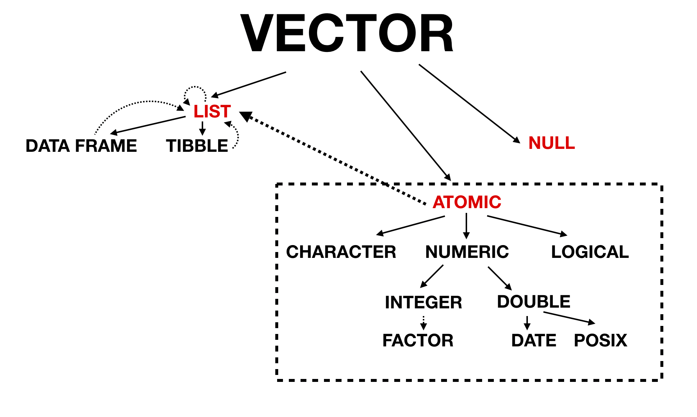

# Vectors

```{r, include=FALSE}
library(tidyverse)
library(kableExtra)
library(lobstr)
```

## 3.2.1 Scalars {-#scalars}

:::question
Can you have `NA` in vector
:::

Hell yeah!

## 3.2.3 Missing values {-#missing-values}

:::question
`NA` is a 'sentinel' value for explicit missingness - what does 'sentinel' mean?
:::

A sentinel value (also referred to as a flag value, trip value, rogue value, signal value, or dummy data) is a special value in the context of an algorithm which uses its presence as a condition of termination. Also worth noting two NAs are not equal to each other! For instance, in C++ there’s a special character to identify the end of a string I think another example of a sentinel value might be in surveys where you sometimes see missing data or N/A coded as 999, or 9999 (or maybe just 9)


Another example of a sentinel value might be in surveys where you sometimes see missing data or `N/A` coded as `999`, or `9999` (or maybe just `9`). The possible values in a column of data might be:

```{r eval=FALSE}
factor(c(1,1,1,1,2,3,3,4,4,9), levels = c(1,2,3,4,9))
```

Sentinels are typically employed in situations where it's easier/preferable to have a collection of values of the same type - represented internally using the same conventions and requiring the same amount of memory - but you also need a way to indicate a special circumstance. So like in the case of survey data you may, for example, see a variable indicating that an individual is `999` years old but the correct way to interpret that is that the data was not collected.

## 3.2.4 Testing and coercion {-#testing-and-coercion}

:::question
Why does the book warn us against using `is.vector()`, `is.atomic()` and `is.numeric()`? [read docs]
:::

- `is.atomic` will also return true if `NULL`
- `is.numeric` tests if integer or double **NOT** factor, Date, POSIXt, difftime
- `is.vector` will return false if it has attributes other than names

## 3.3.1 Setting Attributes {-#setting-attributes}

:::question
Working in the medical field I have to import SAS files a lot where the column names have to adhere to specific abbreviations so they're given a label attribute for their full name. What are some other common uses for attributes?
:::

Hypothesis test attributes!


## 3.3.2 setNames {-#setnames}

:::question
We can use `setNames` to apply different values to each element in a vector. How do we do this for our own custom attribute? The code below does NOT work!

```{r}
my_vector <- c(
  structure(1, x = "firstatt_1"),
  structure(2, x = "firstatt_2"), 
  structure(3, x = "firstatt_3")
)

my_vector <- setNames(my_vector, c("name_1", "name_2", "name_3"))

# mental model: shouldn't this should return $names and $x?
attributes(my_vector)
```
:::

As soon as you instantiate a vector the attributes are lost. BUT we can store it as a list *within* the vector to keep them! We can create a custom attribute function and use that with `map` to add a list inside our dataframe:

```{r}
custom_attr <- function(x, my_attr) {
  attr(x, "x") <- my_attr
  return(x)
}

as_tb <- 
  tibble(
  one = c(1,2,3),
  x = c("att_1", "att_2", "att_3"),
  with_arr = map2(one, x, ~custom_attr(.x, .y))
)

as_tb$with_arr
```

## 3.3.3 Dimensions {-#dimensions}

:::question
Because `NROW` and `NCOL` don't return `NULL` on a one dimensional vector they just seem to me as a more flexible option. When do you *have* to use `ncol` and `nrow`?
:::

It *may* be better practice to always use `NROW` and `NCOL`!

:::question
As long as the number of rows matches the data frame, it’s also possible to have a matrix or array as a column of a data frame. (This requires a slight extension to our definition of a data frame: it’s not the `length()` of each column that must be equal, but the `NROW()`.)

```{r}
df <- data.frame(x = c(1,2,3,4,5),
                 y = c(letters[1:5]))

length(df$y) == NROW(df$y)
```

What's an example of where `length() != NROW()`
:::

The case of a matrix! 

```{r}
my_matrix <- 1:6
dim(my_matrix) <- c(3,2)
my_matrix
length(my_matrix) == NROW(my_matrix) # 6 != 3
length(my_matrix) == NCOL(my_matrix) # 6 != 2
```

The length of the matrix is `6`, and if we manipulate the dimensions of the matrix we see that the NROW is `3` and and NCOL is `2`.

## 3.4 S3 atomic vectors {-#s3-atomic-vectors}

:::question
How is data type `typeof()` different from `class()`?
:::

Classes are built on top of base types - they're like special, more specific kinds of types. In fact, if a class isn't specified then `class()` will default to either the `implicit class` or `typeof`.

So `Date`, `POSIXct`, and `difftime` are specific kinds of doubles, falling under its umbrella.
```{r}
lubridate::is.Date(Sys.Date())
is.double(Sys.Date())

lubridate::is.POSIXct(Sys.time())
is.double(Sys.time())

lubridate::is.difftime(as.difftime(c("0:3:20", "11:23:15")))
is.double(as.difftime(c("0:3:20", "11:23:15")))
```

But then why does `my_factor` fail to be recognized under its more general `integer` umbrella?

```{r}
my_factor <- factor(c("a", "b", "c"))
is.factor(my_factor)
is.integer(my_factor)
```

:::TODO
XXX
:::

## 3.4.2 Dates {-#dates}

:::question
Why are dates calculated from January 1st, 1970?
:::

Unix counts time in seconds since its official "birthday," -- called "epoch" in computing terms -- which is Jan. 1, 1970. [This article](https://www.wired.com/2001/09/unix-tick-tocks-to-a-billion/) explains that the early Unix engineers picked that date arbitrarily, because they needed to set a uniform date for the start of time, and New Year's Day, 1970, seemed most convenient.


## 3.5.1 Lists {-#lists}

:::question
When should you be using `list()` instead of `c()`
:::

It's really contingent on the use case. In the case of adding custom classes it's worth noting that those are lost once you `c()` those objects together!

## 3.6.8 Data frames and tibbles {-#data-frames-and-tibbles}

:::question
What does 'lazy' mean in terms of `as_tibble`?
:::
  
Technically `lazy evaluation` means that expressions are not evaluated when they are bound to variables, but their evaluation is deferred until their results are needed by other computations. In this context though we think Hadley just meant that it's treated as a character if it "looks and smells like a character". 


:::question
The solution manual gives the answer and notes:

```{r}
df_coltypes <- data.frame(
  a = c("a", "b"),
  b = c(TRUE, FALSE),
  c = c(1L, 0L),
  d = c(1.5, 2),
  e = c("one" = 1, "two" = 2),
  g = factor(c("f1", "f2")),
  stringsAsFactors = FALSE
)

as.matrix(df_coltypes)
```

"Note that `format()` is applied to the characters, which gives surprising results: `TRUE` is transformed to `" TRUE"` (starting with a space!)."

...But where is the `format()` call happening? I don't see a space!
:::

After running `debug(as.matrix(df_coltypes))` and going down a rabbit hole we found this is a bug that has been addressed! [See issue here](https://github.com/Tazinho/Advanced-R-Solutions/issues/213)

## Conclusion {-#conclusion}

:::question
How does vectorization make your code faster
:::

Taking the example from [Efficient R Programming](https://csgillespie.github.io/efficientR/programming.html#vectorised-code):

### VECTORIZED: {-#vectorized}
```{r, eval=FALSE}
sum(log(x))
```

### NON-VECTORIZED: {-#non-vectorized}
```{r, eval=FALSE}
s <- 0
for(x0 in x) {
  s <- s + log(x0)
}
```

The vectorized code is faster because it obeys the golden rule of R programming: *"access the underlying C/Fortran routines as quickly as possible; the fewer functions calls required to achieve this, the better"*. 

- Vectorized Version:
  1. `sum` [called once]
  2. `log` [called once]
  
- Non-vectorized:
  1. `+` [called `length(x)` times]
  2. `log` [called `length(x)` times]

In the vectorised version, there are two primitive function calls: one to `log` (which performs `length(x)` steps in the C level) and one to `sum` (which performs `x` updates in the C level). So you end up doing a similar number of operations at C level regardless of the route. 

In the non-vectorised form you are passing the logic back and forth between R and C many many times and this is why the non-vectorised form is much slower.

**A vectorized function calls primitives directly, but a loop calls each function `length(x)` times, and there are `1 + length(x)` assignments to `s`. Theres on the order of 3x primitive function calls in the non-vectorised form!!**

Resources:

- [Check out Jenny Brian's slides](https://speakerdeck.com/jennybc/row-oriented-workflows-in-r-with-the-tidyverse)

- [Great article by Noam Ross](https://www.noamross.net/archives/2014-04-16-vectorization-in-r-why/)

:::question
Putting it all together in a single diagram:
:::

```{r, echo=FALSE}

```
