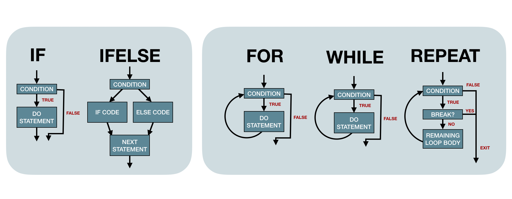

# Control Flow

```{r, include=FALSE}
library(tidyverse)
library(kableExtra)
library(lobstr)
```

## 5.2.3 switch statement {-#switch-statement}

:::question
"Closely related to if is the `switch()` statement. It’s a compact, special purpose equivalent"

What is meant here by "special purpose"? Can we come up with a case where you can't substitute `if` for `switch` or the other way around? Use `switch`. Is it safe to say to `switch` when you have character inputs (as the book suggests) and use `case_when` or `if` for numerics?
:::

:::TODO
XXX
:::

## 5.3.1 common pitfalls {-#common-pitfalls}

:::question
What does the book mean by leveraging `vector` for preallocating the loop output? How is this different from creating an empty list to instantiate the loop? 

```{r}
means <- c(1, 50, 20)

out_vector <- vector("list", length(means))
for (i in 1:length(means)) {
  out_vector[[i]] <- rnorm(10, means[[i]])
}

out_list <- list()
for (i in 1:length(means)) {
  out_list[[i]] <- rnorm(10, means[[i]])
}
```
:::

:::TODO
XXX
:::

:::question
The book warns against using `length(x)` and suggests using `seq_along` instead. Is there any downside to using `seq_along` or a case when you'd prefer `length(x)` over `seq_along(x)`? I can't think of any downsides to using it!
:::

:::TODO
XXX
:::

## 5.3.3.1 Exercises {-#exercise5331}

:::question
```{r}
x <- numeric()
out <- vector("list", length(x))
for (i in 1:length(x)) {
  out[i] <- x[i] ^ 2
}
out
```

I understand that this works because we can count down in a loop - so the first iteration `x[1] == NA`, and the second `x[2] == numeric(0)` but where does this value go? Is it just evaluated but not stored since R counts from 1?
:::

:::TODO
XXX
:::

## Conclusion {-#conclusion_5}

:::question
Can we put these concepts together in diagram form? Let's work on improving these schematics!
:::

```{r, echo=FALSE}

```
