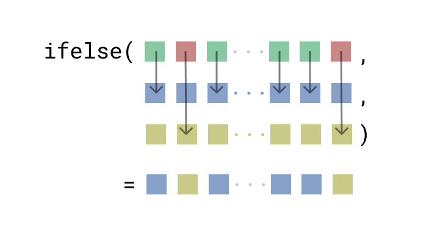
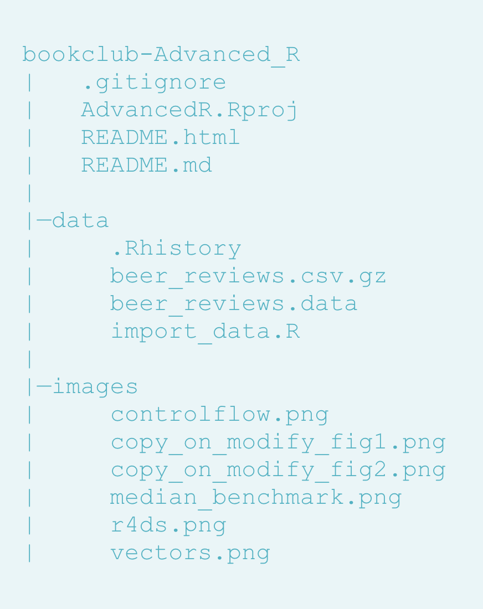
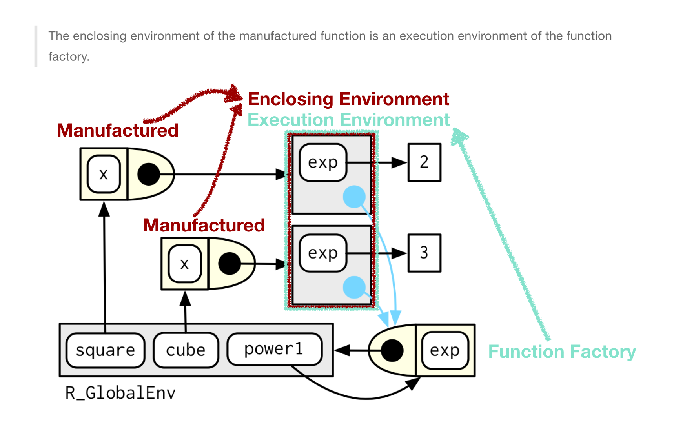
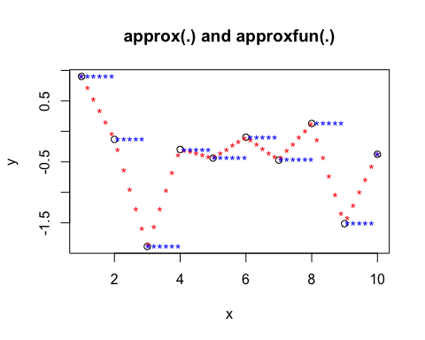
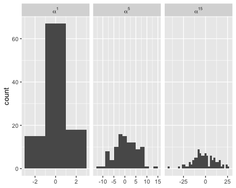
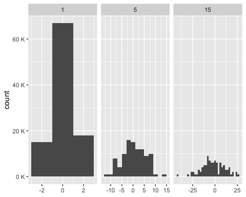

# Welcome

A companion to [Advanced R](https://adv-r.hadley.nz/rcpp.html#acknowledgments) and supplement to [Advanced R Solutions](https://advanced-r-solutions.rbind.io/names-and-values.html#copy-on-modify)

Recordings for the accompanied presentation for each chapter can be seen [here](https://www.youtube.com/watch?v=pQ-xDAPEQaw&list=PL3x6DOfs2NGi9lH7q-phZlPrl6HKXYDbn).

<!--chapter:end:01-preface.Rmd-->

# Names and Values


## 2.2 Binding basics {-}

:::question
Should we care about R internals?
:::

Guided by [this blogpost](https://www.brodieg.com/2019/02/18/an-unofficial-reference-for-internal-inspect/), we can use the `.Internal` function to inspect metadata associated with our objects:


```r
 x <- list(1:5)
.Internal(inspect(x))
# > @0x000001b6a4af9fc8 19 VECSXP g0c1 [NAM(7)] (len=1, tl=0)
# > @0x000001b6a3321d90 13 INTSXP g0c0 [NAM(7)]  1 : 5 (compact)
```

* `@0x000001b6a4af9fc8` -- address (memory location)
* `19 VECSXP` -- type ([full list here](https://cran.r-project.org/doc/manuals/r-release/R-ints.html#SEXPTYPEs))
* `g0` -- garbage collector info token 
* `c1` -- size of object (small vector)
* `NAM(7)` -- named value of the object (if greater than one copy on modify)
* `len=1` -- length of object
* `tl` -- true length of object
* small snippet of the data


```r
{
  x <- list(1:5)
  .Internal(inspect(x))
}
# < @0x000001b6a4b4a3a0 19 VECSXP g0c1 [NAM(1)] (len=1, tl=0)
# < @0x000001b6a3a814d0 13 INTSXP g0c0 [NAM(7)]  1 : 5 (compact)
```

It is of note here that without curly brackets we have to use copy-on-modify, but within curly brackes we can use copy-in-place because `NAM(1)`

## 2.3 Copy-on-modify {-}

:::question
copy-on-modify vs copy-in-place: is one more preferable in certain situations?
:::

modify in place only happens when objects with a single binding get a special performance optimization and to environments.

## 2.2.2 Exercises {-}

:::question
Question 3 digs into the syntactically valid names created when using `read.csv()`, but what is the difference between quotation and backticks? 

If we create an example csv

```r
example2223 <- tibble(
  `if` = c(1,2,3),
  `_1234` = c(4,5,6),
  `column 1` = c(7,8,9)
)

write.csv(example2223, "example2223.csv", row.names = FALSE)
```

Import using adjusted column names to be syntactically valid:

```r
read.csv(file = "example2223.csv",check.names = TRUE)
```

```
##   if. X_1234 column.1
## 1   1      4        7
## 2   2      5        8
## 3   3      6        9
```

Import using non-adjusted column names

```r
read.csv(file = "example2223.csv", check.names = FALSE)
```

```
##   if _1234 column 1
## 1  1     4        7
## 2  2     5        8
## 3  3     6        9
```

Import using the tidyverse where names are not adjusted

```r
df_non_syntactic_name  <- read_csv(file = "example2223.csv")
```

```
## Parsed with column specification:
## cols(
##   `if` = col_double(),
##   `_1234` = col_double(),
##   `column 1` = col_double()
## )
```

However I really don´t understand the difference between backticks and quotation marks. For example when I select a column in the case of non-syntactic in the tidyverse I can use quotation marks or backticks 


```r
df_non_syntactic_name %>% select("if")
```

```
## # A tibble: 3 x 1
##    `if`
##   <dbl>
## 1     1
## 2     2
## 3     3
```


```r
df_non_syntactic_name %>% select(`if`)
```

But in base R, I can do this with quotation marks, but not backticks:


```r
df__non_syntactic_name["if"]
```

```
Error in `[.default`(df__non_syntactic_name, `if`) : invalid subscript type 'special'
```

According to `?Quotes` backticks are used for "non-standard variable names" but why in base R they don´t work to select columns but in the tidyverse they work to select variables?
:::

The easiest way to think about this is that backticks refer to objects while quotation marks refer to strings. `dplyr::select()` accepts object references as well as string references, while base R subsetting is done with a string or integer position.

## 2.3.2 Function calls {-}

:::question
Can we go over and break down figure in 2.3.2
:::

When you create this function:


```r
crazyfunction <- function(eh) {eh}
```

`eh` doesn't exist in memory at this point.


```r
x <- c(1,2,3)
```

x exists in memory.


```r
z <- crazyfunction(x) 
```

`z` now points at `x`, and `eh` still doesn't exist (except metaphorically in Canada). `eh` was created and exists WHILE `crazyfunction()` was being run, but doesn't get saved to the global environment, so after the function is run you can't see its memory reference. 

The round brackets `(eh)` list the arguments, the curly brackets `{eh}` define the operation that it's doing - and you're assigning it to `crazyfunction`. 

**R functions automatically return the result of the last expression** so when you call that object (the argument `eh`) it returns the value of that argument. This is called **implicit returns**

## 2.3.3 Lists {-}

:::question

Checking the address for a list and its copy we see they share the same references:


```r
l1 <- list(1,2,3)
l2 <- l1
identical(lobstr::ref(l1),lobstr::ref(l2))
```

```
## [1] TRUE
```

```r
lobstr::obj_addr(l1[[1]])
```

```
## [1] "0x7ffd8c92f7e0"
```

```r
lobstr::obj_addr(l2[[1]])
```

```
## [1] "0x7ffd8c92f7e0"
```

But why isn't this the case for their subsets? Using `obj_addr` they have different addresses, but when we look at their references they are the same


```r
lobstr::obj_addr(l1[1])
```

```
## [1] "0x7ffd8b499ff8"
```

```r
lobstr::ref(l1[1])
```

```
## █ [1:0x7ffd89efc230] <list> 
## └─[2:0x7ffd8c92f7e0] <dbl>
```

```r
lobstr::obj_addr(l2[1])
```

```
## [1] "0x7ffd89e5c268"
```


```r
identical(lobstr::obj_addr(l1[1]), lobstr::obj_addr(l2[1]))
```

```
## [1] FALSE
```
:::

This is because using singular brackets wraps the value 1 in a new list that is created on the fly which will have a unique address. We can use double brackets to confirm our mental model that the sublists are also identical:


```r
identical(lobstr::obj_addr(l1[[1]]), lobstr::obj_addr(l2[[1]]))
```

```
## [1] TRUE
```


:::question
What's the difference between these 2 addresses `<0x55d53fa975b8>` and `0x55d53fa975b8`?
:::

Nothing - it has to do with the printing method:


```r
x <- c(1, 2, 3)
print(tracemem(x))
```

```
## [1] "<0x7ffd9162b5f8>"
```

```r
cat(tracemem(x))
```

```
## <0x7ffd9162b5f8>
```

```r
lobstr::obj_addr(x)
```

```
## [1] "0x7ffd9162b5f8"
```

:::question
When would you prefer a deep copy of a list to a shallow copy? Is this something to consider when writing functions or package development or is this more something that's optimized behind the scenes?
:::

Automagical!

## 2.3.5 Character vectors {-}


:::question
Is there a way to clear the "global string pool"?
:::

According to [this post](https://community.rstudio.com/t/memory-usage-and-rs-global-string-pool/4762/3) it doesn't look like you can directly, but clearing all references to a string that's in the global string pool clears that string from the pool, eventually

## 2.3.6.2 Exercise {-}

:::question
When we look at `tracemem` when we modify `x` from an integer to numeric, x is assigned to three objects. The first is the integer, and the third numeric - so what's the intermediate type?


```r
x <- c(1L, 2L, 3L)
obj_addr(x)
tracemem(x)
x[[3]] <- 4
```

```
[1] "0x7f84b7fe2c88"
[1] "<0x7f84b7fe2c88>"
tracemem[0x7f84b7fe2c88 -> 0x7f84b7fe5288]: 
tracemem[0x7f84b7fe5288 -> 0x7f84bc0817c8]: 
```

What is `0x7f84b7fe5288` when the intermediate `x <- c(1L, 2L, 4)` is impossible?
:::

When we assign the new value as an integer there is no intermediate step. This probably means `c(1,2, NA)` is the intermediate step; creating an intermediate vector that's the same length of the final product with NA values at all locations that are new or to be changed


```r
x <- c(1L, 2L, 3L)
obj_addr(x)
```

```
## [1] "0x7ffd8a1cba08"
```

```r
tracemem(x)
```

```
## [1] "<0x7ffd8a1cba08>"
```

```r
x[[3]] <- 4L
```

```
## tracemem[0x7ffd8a1cba08 -> 0x7ffd8b451148]: eval eval withVisible withCallingHandlers handle timing_fn evaluate_call <Anonymous> evaluate in_dir block_exec call_block process_group.block process_group withCallingHandlers process_file <Anonymous> <Anonymous> render_cur_session render_book FUN lapply unlist render_book render_book_script in_dir <Anonymous> <Anonymous>
```

You can dig into the C code running this: 


```r
pryr::show_c_source(.Internal("[<-"))
```

## 2.4.1 Object size {-}

:::question
If I have two vectors, one `1:10` and another `c(1:10, 10)`, intuitively, I would expect the size of the second vector to be greater than the size of the first. However, it seems to be the other way round, why?

```r
x1 <- 1:10
x2 <- rep(1:10, 10)
lobstr::obj_size(x1)
```

```
## 680 B
```

```r
lobstr::obj_size(x2)
```

```
## 448 B
```
:::

If we start with the following three vectors:

```r
x1 <- c(1L, 2L, 3L, 4L, 5L, 6L, 7L, 8L, 9L, 10L)
x2 <- 1:10
x3 <- rep(1:10, 10)
lobstr::obj_sizes(x1, x2, x3)
```

```
## *  96 B
## * 680 B
## * 448 B
```

Intuitively, we would have expected `x1` < `x2` < `x3` but this is not the case. It appears that the `rep()` function coerces a double into integer and hence optimizes on space. Using `:`, R internally uses [ALTREP](https://blog.revolutionanalytics.com/2017/09/altrep-preview.html). 

ALTREP would actually be more efficient if the numbers represented were significantly large, say `1e7`.


```r
x4 <- 1:1e7
x5 <- x4
x5[1] <- 1L
lobstr::obj_sizes(x4, x5)
```

```
## *        680 B
## * 40,000,048 B
```

Now, the size of x4  is significantly lower than that of x5 .  This seems to indicate that ALTREP becomes super efficient as the vector size is increased.

## 2.5.1 Modify-in-place {-}

:::question
"When it comes to bindings, R can currently only count 0, 1, or many. That means that if an object has two bindings, and one goes away, the reference count does not go back to 1: one less than many is still many. In turn, this means that R will make copies when it sometimes doesn’t need to."

Can we come up with an example of this? It seems really theoretical right now.
:::

First you need to switch your Environment tab to something other than global in RStudio!

Now we can create a vector:

```r
v <- c(1, 2, 3)
(old_address <- lobstr::obj_addr(v))
```

```
## [1] "0x7ffd8dc3e938"
```

Changing a value within it changes its address:

```r
v[[3]] <- 4
(new_address <- lobstr::obj_addr(v))
```

```
## [1] "0x7ffd8d12c008"
```

```r
old_address == new_address
```

```
## [1] FALSE
```

We can assign the modified vector to a new name, where `y` and `v` point to the same thing.

```r
y <- v
(y_address <- lobstr::obj_addr(y))
```

```
## [1] "0x7ffd8d12c008"
```

```r
(v_address <- lobstr::obj_addr(v))
```

```
## [1] "0x7ffd8d12c008"
```

```r
y_address == v_address
```

```
## [1] TRUE
```

Now if we modify `v` it won't point to the same thing as `y`:

```r
v[[3]] <- 3
(y_address <- lobstr::obj_addr(y))
```

```
## [1] "0x7ffd8d12c008"
```

```r
(v_address <- lobstr::obj_addr(v))
```

```
## [1] "0x7ffd8cf566a8"
```

```r
y_address == v_address
```

```
## [1] FALSE
```

But if we now change `y` to look like `v`, the original address, in theory editing y should occur in place, but it doesn't - the "count does not go back to one"!


```r
y[[3]] <- 3
(new_y_address <- lobstr::obj_addr(y))
```

```
## [1] "0x7ffd8d7140b8"
```

```r
new_y_address == y_address
```

```
## [1] FALSE
```

:::question

Can we break down this code a bit more? I'd like to really understand when and how it's copying three times. **As of R 4.0 it's now copied twice, the 3rd copy that's external to the function is now eliminated!!**


```r
# dataframe of 5 columns of numbers
x <- data.frame(matrix(runif(5 * 1e4), ncol = 5))
# median number for each column
medians <- vapply(x, median, numeric(1))

# subtract the median of each column from each value in the column
for (i in seq_along(medians)) {
  x[[i]] <- x[[i]] - medians[[i]]
}
```
:::


```r
cat(tracemem(x), "\n")
```

```
<0x7fdc99a6f9a8> 
```


```r
for (i in 1:5) {
  x[[i]] <- x[[i]] - medians[[i]]
}
```

```
tracemem[0x7fdc99a6f9a8 -> 0x7fdc9de83e38]: 
tracemem[0x7fdc9de83e38 -> 0x7fdc9de83ea8]: [[<-.data.frame [[<- 
tracemem[0x7fdc9de83ea8 -> 0x7fdc9de83f18]: [[<-.data.frame [[<- 
tracemem[0x7fdc9de83f18 -> 0x7fdc9de83f88]: 
tracemem[0x7fdc9de83f88 -> 0x7fdc9de83ff8]: [[<-.data.frame [[<- 
tracemem[0x7fdc9de83ff8 -> 0x7fdc9de84068]: [[<-.data.frame [[<- 
tracemem[0x7fdc9de84068 -> 0x7fdc9de840d8]: 
tracemem[0x7fdc9de840d8 -> 0x7fdc9de84148]: [[<-.data.frame [[<- 
tracemem[0x7fdc9de84148 -> 0x7fdc9de841b8]: [[<-.data.frame [[<- 
tracemem[0x7fdc9de841b8 -> 0x7fdc9de84228]: 
tracemem[0x7fdc9de84228 -> 0x7fdc9de84298]: [[<-.data.frame [[<- 
tracemem[0x7fdc9de84298 -> 0x7fdc9de84308]: [[<-.data.frame [[<- 
tracemem[0x7fdc9de84308 -> 0x7fdc9de84378]: 
tracemem[0x7fdc9de84378 -> 0x7fdc9de843e8]: [[<-.data.frame [[<- 
tracemem[0x7fdc9de843e8 -> 0x7fdc9de84458]: [[<-.data.frame [[<- 
```

When we run `tracemem` on the for loop above we see each column is copied twice followed by the `[[<-.data.frame [[<- `, the stack trace showing exactly where the duplication occurred.

So what is ``[[<-.data.frame``? It's a function! By looking at `?``[[<-.data.frame`` we see this is used to "extract or replace subsets of data frames."

When we write `x[[i]] <- value`, it's really shorthand for calling the function `[[<-.data.frame` with inputs `x`, `i`, and `value`. 

Now let's step into the call of this base function by running `debug(``[[<-.data.frame``)`:


```r
debug(`[[<-.data.frame`)
```

and once inside, use `tracemem()` to find where the new values are assigned to the column:


```r
function (x, i, j, value) 
{
  if (!all(names(sys.call()) %in% c("", "value"))) 
    warning("named arguments are discouraged")
  cl <- oldClass(x)
  # this is where another copy of x is made!
  class(x) <- NULL
```

```
 # tracemem[0x7fdc9d852a18 -> 0x7fdc9c99cc08]: 
```


```r
nrows <- .row_names_info(x, 2L)
  if (is.atomic(value) && !is.null(names(value))) 
    names(value) <- NULL
  if (nargs() < 4L) {
    nc <- length(x)
    if (!is.null(value)) {
      N <- NROW(value)
      if (N > nrows) 
        stop(sprintf(ngettext(N, "replacement has %d row, data has %d", 
          "replacement has %d rows, data has %d"), N, 
          nrows), domain = NA)
      if (N < nrows) 
        if (N > 0L && (nrows%%N == 0L) && length(dim(value)) <= 
          1L) 
          value <- rep(value, length.out = nrows)
        else stop(sprintf(ngettext(N, "replacement has %d row, data has %d", 
          "replacement has %d rows, data has %d"), N, 
          nrows), domain = NA)
    }
    x[[i]] <- value
    if (length(x) > nc) {
      nc <- length(x)
      if (names(x)[nc] == "") 
        names(x)[nc] <- paste0("V", nc)
      names(x) <- make.unique(names(x))
    }
    class(x) <- cl
    return(x)
  }
  if (missing(i) || missing(j)) 
    stop("only valid calls are x[[j]] <- value or x[[i,j]] <- value")
  rows <- attr(x, "row.names")
  nvars <- length(x)
  if (n <- is.character(i)) {
    ii <- match(i, rows)
    n <- sum(new.rows <- is.na(ii))
    if (n > 0L) {
      ii[new.rows] <- seq.int(from = nrows + 1L, length.out = n)
      new.rows <- i[new.rows]
    }
    i <- ii
  }
  if (all(i >= 0L) && (nn <- max(i)) > nrows) {
    if (n == 0L) {
      nrr <- (nrows + 1L):nn
      if (inherits(value, "data.frame") && (dim(value)[1L]) >= 
        length(nrr)) {
        new.rows <- attr(value, "row.names")[seq_len(nrr)]
        repl <- duplicated(new.rows) | match(new.rows, 
          rows, 0L)
        if (any(repl)) 
          new.rows[repl] <- nrr[repl]
      }
      else new.rows <- nrr
    }
    x <- xpdrows.data.frame(x, rows, new.rows)
    rows <- attr(x, "row.names")
    nrows <- length(rows)
  }
  iseq <- seq_len(nrows)[i]
  if (anyNA(iseq)) 
    stop("non-existent rows not allowed")
  if (is.character(j)) {
    if ("" %in% j) 
      stop("column name \"\" cannot match any column")
    jseq <- match(j, names(x))
    if (anyNA(jseq)) 
      stop(gettextf("replacing element in non-existent column: %s", 
        j[is.na(jseq)]), domain = NA)
  }
  else if (is.logical(j) || min(j) < 0L) 
    jseq <- seq_along(x)[j]
  else {
    jseq <- j
    if (max(jseq) > nvars) 
      stop(gettextf("replacing element in non-existent column: %s", 
        jseq[jseq > nvars]), domain = NA)
  }
  if (length(iseq) > 1L || length(jseq) > 1L) 
    stop("only a single element should be replaced")
  x[[jseq]][[iseq]] <- value
  # here is where x is copied again!
  class(x) <- cl
```

```
# tracemem[0x7fdc992ae9d8 -> 0x7fdc9be55258]: 
```

```r
  x
}
```

Thus seeing exactly where the three **as of R 4.0: two!** copies are happening.

<!--chapter:end:02-names_and_values.Rmd-->

# Vectors


## 3.2.1 Scalars {-}

:::question
Can you have `NA` in vector
:::

Hell yeah!

## 3.2.3 Missing values {-}

:::question
`NA` is a 'sentinel' value for explicit missingness - what does 'sentinel' mean?
:::

A sentinel value (also referred to as a flag value, trip value, rogue value, signal value, or dummy data) is a special value in the context of an algorithm which uses its presence as a condition of termination. Also worth noting two NAs are not equal to each other! For instance, in C++ there’s a special character to identify the end of a string I think another example of a sentinel value might be in surveys where you sometimes see missing data or N/A coded as 999, or 9999 (or maybe just 9)


Another example of a sentinel value might be in surveys where you sometimes see missing data or `N/A` coded as `999`, or `9999` (or maybe just `9`). The possible values in a column of data might be:


```r
factor(c(1,1,1,1,2,3,3,4,4,9), levels = c(1,2,3,4,9))
```

Sentinels are typically employed in situations where it's easier/preferable to have a collection of values of the same type - represented internally using the same conventions and requiring the same amount of memory - but you also need a way to indicate a special circumstance. So like in the case of survey data you may, for example, see a variable indicating that an individual is `999` years old but the correct way to interpret that is that the data was not collected.

## 3.2.4 Testing and coercion {-}

:::question
Why does the book warn us against using `is.vector()`, `is.atomic()` and `is.numeric()`? [read docs]
:::

- `is.atomic` will also return true if `NULL`
- `is.numeric` tests if integer or double **NOT** factor, Date, POSIXt, difftime
- `is.vector` will return false if it has attributes other than names

## 3.3.1 Setting Attributes {-}

:::question
Working in the medical field I have to import SAS files a lot where the column names have to adhere to specific abbreviations so they're given a label attribute for their full name. What are some other common uses for attributes?
:::

Hypothesis test attributes!


## 3.3.2 setNames {-}

:::question
We can use `setNames` to apply different values to each element in a vector. How do we do this for our own custom attribute? The code below does NOT work!


```r
my_vector <- c(
  structure(1, x = "firstatt_1"),
  structure(2, x = "firstatt_2"), 
  structure(3, x = "firstatt_3")
)

my_vector <- setNames(my_vector, c("name_1", "name_2", "name_3"))

# mental model: shouldn't this should return $names and $x?
attributes(my_vector)
```

```
## $names
## [1] "name_1" "name_2" "name_3"
```
:::

As soon as you instantiate a vector the attributes are lost. BUT we can store it as a list *within* the vector to keep them! We can create a custom attribute function and use that with `map` to add a list inside our dataframe:


```r
custom_attr <- function(x, my_attr) {
  attr(x, "x") <- my_attr
  return(x)
}

as_tb <- 
  tibble(
  one = c(1,2,3),
  x = c("att_1", "att_2", "att_3"),
  with_arr = map2(one, x, ~custom_attr(.x, .y))
)

as_tb$with_arr
```

```
## [[1]]
## [1] 1
## attr(,"x")
## [1] "att_1"
## 
## [[2]]
## [1] 2
## attr(,"x")
## [1] "att_2"
## 
## [[3]]
## [1] 3
## attr(,"x")
## [1] "att_3"
```

## 3.3.3 Dimensions {-}

:::question
Because `NROW` and `NCOL` don't return `NULL` on a one dimensional vector they just seem to me as a more flexible option. When do you *have* to use `ncol` and `nrow`?
:::

It *may* be better practice to always use `NROW` and `NCOL`!

:::question
As long as the number of rows matches the data frame, it’s also possible to have a matrix or array as a column of a data frame. (This requires a slight extension to our definition of a data frame: it’s not the `length()` of each column that must be equal, but the `NROW()`.)


```r
df <- data.frame(x = c(1,2,3,4,5),
                 y = c(letters[1:5]))

length(df$y) == NROW(df$y)
```

```
## [1] TRUE
```

What's an example of where `length() != NROW()`
:::

The case of a matrix! 


```r
my_matrix <- 1:6
dim(my_matrix) <- c(3,2)
my_matrix
```

```
##      [,1] [,2]
## [1,]    1    4
## [2,]    2    5
## [3,]    3    6
```

```r
length(my_matrix) == NROW(my_matrix) # 6 != 3
```

```
## [1] FALSE
```

```r
length(my_matrix) == NCOL(my_matrix) # 6 != 2
```

```
## [1] FALSE
```

The length of the matrix is `6`, and if we manipulate the dimensions of the matrix we see that the NROW is `3` and and NCOL is `2`.

## 3.4 S3 atomic vectors {-}

:::question
How is data type `typeof()` different from `class()`?
:::

Classes are built on top of base types - they're like special, more specific kinds of types. In fact, if a class isn't specified then `class()` will default to either the `implicit class` or `typeof`.

So `Date`, `POSIXct`, and `difftime` are specific kinds of doubles, falling under its umbrella.

```r
lubridate::is.Date(Sys.Date())
```

```
## [1] TRUE
```

```r
is.double(Sys.Date())
```

```
## [1] TRUE
```

```r
lubridate::is.POSIXct(Sys.time())
```

```
## [1] TRUE
```

```r
is.double(Sys.time())
```

```
## [1] TRUE
```

```r
lubridate::is.difftime(as.difftime(c("0:3:20", "11:23:15")))
```

```
## [1] TRUE
```

```r
is.double(as.difftime(c("0:3:20", "11:23:15")))
```

```
## [1] TRUE
```

But then why does `my_factor` fail to be recognized under its more general `integer` umbrella?


```r
my_factor <- factor(c("a", "b", "c"))
is.factor(my_factor)
```

```
## [1] TRUE
```

```r
is.integer(my_factor)
```

```
## [1] FALSE
```

:::TODO
XXX
:::

## 3.4.2 Dates {-}

:::question
Why are dates calculated from January 1st, 1970?
:::

Unix counts time in seconds since its official "birthday," -- called "epoch" in computing terms -- which is Jan. 1, 1970. [This article](https://www.wired.com/2001/09/unix-tick-tocks-to-a-billion/) explains that the early Unix engineers picked that date arbitrarily, because they needed to set a uniform date for the start of time, and New Year's Day, 1970, seemed most convenient.


## 3.5.1 Lists {-}

:::question
When should you be using `list()` instead of `c()`
:::

It's really contingent on the use case. In the case of adding custom classes it's worth noting that those are lost once you `c()` those objects together!

## 3.6.8 Data frames and tibbles {-}

:::question
What does 'lazy' mean in terms of `as_tibble`?
:::
  
Technically `lazy evaluation` means that expressions are not evaluated when they are bound to variables, but their evaluation is deferred until their results are needed by other computations. In this context though we think Hadley just meant that it's treated as a character if it "looks and smells like a character". 


:::question
The solution manual gives the answer and notes:


```r
df_coltypes <- data.frame(
  a = c("a", "b"),
  b = c(TRUE, FALSE),
  c = c(1L, 0L),
  d = c(1.5, 2),
  e = c("one" = 1, "two" = 2),
  g = factor(c("f1", "f2")),
  stringsAsFactors = FALSE
)

as.matrix(df_coltypes)
```

```
##     a   b       c   d     e   g   
## one "a" "TRUE"  "1" "1.5" "1" "f1"
## two "b" "FALSE" "0" "2.0" "2" "f2"
```

"Note that `format()` is applied to the characters, which gives surprising results: `TRUE` is transformed to `" TRUE"` (starting with a space!)."

...But where is the `format()` call happening? I don't see a space!
:::

After running `debug(as.matrix(df_coltypes))` and going down a rabbit hole we found this is a bug that has been addressed! [See issue here](https://github.com/Tazinho/Advanced-R-Solutions/issues/213)

## Conclusion {-}

:::question
How does vectorization make your code faster
:::

Taking the example from [Efficient R Programming](https://csgillespie.github.io/efficientR/programming.html#vectorised-code):

### VECTORIZED: {-}

```r
sum(log(x))
```

### NON-VECTORIZED: {-}

```r
s <- 0
for(x0 in x) {
  s <- s + log(x0)
}
```

The vectorized code is faster because it obeys the golden rule of R programming: *"access the underlying C/Fortran routines as quickly as possible; the fewer functions calls required to achieve this, the better"*. 

- Vectorized Version:
  1. `sum` [called once]
  2. `log` [called once]
  
- Non-vectorized:
  1. `+` [called `length(x)` times]
  2. `log` [called `length(x)` times]

In the vectorised version, there are two primitive function calls: one to `log` (which performs `length(x)` steps in the C level) and one to `sum` (which performs `x` updates in the C level). So you end up doing a similar number of operations at C level regardless of the route. 

In the non-vectorised form you are passing the logic back and forth between R and C many many times and this is why the non-vectorised form is much slower.

**A vectorized function calls primitives directly, but a loop calls each function `length(x)` times, and there are `1 + length(x)` assignments to `s`. Theres on the order of 3x primitive function calls in the non-vectorised form!!**

Resources:

- [Check out Jenny Brian's slides](https://speakerdeck.com/jennybc/row-oriented-workflows-in-r-with-the-tidyverse)

- [Great article by Noam Ross](https://www.noamross.net/archives/2014-04-16-vectorization-in-r-why/)

:::question
Putting it all together in a single diagram:
:::


<!--chapter:end:03-vectors.Rmd-->

# Subsetting


## 4.1 Introduction {-}

:::question
"There are three subsetting operators `[`. `[[`, `$`. What is the distinction between an operator and a function? When you look up the help page it brings up the same page for all three extraction methods. What are their distinctions and do their definitions change based on what you're subsetting? Can we make a table? 
:::

<table>
 <thead>
  <tr>
   <th style="text-align:left;">   </th>
   <th style="text-align:left;"> [ </th>
   <th style="text-align:left;"> [[ </th>
   <th style="text-align:left;"> $ </th>
  </tr>
 </thead>
<tbody>
  <tr>
   <td style="text-align:left;"> ATOMIC </td>
   <td style="text-align:left;"> RETURNS VECTOR WITH ONE ELEMENT </td>
   <td style="text-align:left;"> SAME AS [ </td>
   <td style="text-align:left;"> NOPE! </td>
  </tr>
  <tr>
   <td style="text-align:left;"> LIST </td>
   <td style="text-align:left;"> RETURNS A LIST </td>
   <td style="text-align:left;"> RETURNS SINGLE ELEMENT FROM WITHIN LIST </td>
   <td style="text-align:left;"> RETURN SINGLE ELEMENT FROM LIST [CAN ONLY USE WHEN LIST VECTOR HAS A NAME] </td>
  </tr>
  <tr>
   <td style="text-align:left;"> MATRIX </td>
   <td style="text-align:left;"> RETURNS A VECTOR </td>
   <td style="text-align:left;"> RETURNS A VECTOR OR SINGLE VALUE </td>
   <td style="text-align:left;"> NOPE! </td>
  </tr>
  <tr>
   <td style="text-align:left;"> DATA FRAME </td>
   <td style="text-align:left;"> RETURNS A VECTOR OR DATA FRAME </td>
   <td style="text-align:left;"> RETURNS VECTOR/LIST/MATRIX OR SINGLE VALUE </td>
   <td style="text-align:left;"> RETURNS VECTOR/LIST/MATRIX USING COLUMN NAME </td>
  </tr>
  <tr>
   <td style="text-align:left;"> TIBBLE </td>
   <td style="text-align:left;"> RETURNS A TIBBLE </td>
   <td style="text-align:left;"> RETURNS A VECTOR OR SINGLE VALUE </td>
   <td style="text-align:left;"> RETURNS THE STR OF THE COLUMN - TIBBLE/LIST/MATRIX </td>
  </tr>
</tbody>
</table>

If we think of everything as sets (which have the properties of 0,1, or many elements), if the set has 1 element it only contains itself and `NULL` subsets. Before you subset using `[` or `[[` count the elements in the set. If it has zero elements you are done, if it has one element `[` will return itself - to go further you need to use `[[` to return its contents. If there is more than one element in the set then `[` will return those elements. [You can read more about subsetting here](https://bookdown.org/rdpeng/rprogdatascience/subsetting-r-objects.html#subsetting-a-vector)

## 4.2.1 Selecting multiple elements {-}

:::question
Why is `numeric(0)` "helpful for test data?"
:::

This is more of a general comment that one should make sure one's code doesn't crash with vectors of zero length (or data frames with zero rows)

:::question
Why is subsetting with factors "not a good idea"
:::

Hadley's notes seem to say subsetting with factors uses the "integer vector of levels" - and if they all have the same level, it'll just return the first argument. Subsetting a factor vector leaves the factor levels behind unless you explicitly drop the unused levels

## 4.2.2 lists {-}

:::question
We've been talking about `$` as a shorthand for `[[`. Using the example list `x <- list(1:3, "a", 4:6)` can we use `x$1` as shorthand for `x[[1]]`?
:::

The "shorthand" refers to using the name of the vector to extract the vector. If we give `1:3` a name such as test = `1:3`


```r
x <- list(named_vector = 1:3, "a", 4:6)
x[[1]] == x$named_vector
```

```
## [1] TRUE TRUE TRUE
```

As such, `$` is a shorthand for `x[["name_of_vector"]]` and not shorthand for `x[[index]]`

## 4.3.1 `[[` {-}

:::question

The book states: 

*While you must use [[ when working with lists, I’d also recommend using it with atomic vectors whenever you want to extract a single value. For example, instead of writing:*


```r
for (i in 2:length(x)) {
  out[i] <- fun(x[i], out[i - 1])
}
```

*It's better to write*


```r
for (i in 2:length(x)) {
  out[[i]] <- fun(x[[i]], out[[i - 1]])
}
```

Why? Can we see this in action by giving `x`, `out`, and `fun` real life values?
:::

If we have a vector

```r
df_x <- c("Advanced","R","Book","Club")
```

We can use `[` or `[[` to extract the third element of `df_x`

```r
df_x[3]
```

```
## [1] "Book"
```

```r
df_x[[3]]
```

```
## [1] "Book"
```

But in the case where we want to extract an element from a list `[` and `[[` no longer give us the same results

```r
df_x <- list(A = "Advanced", B = "R", C = "Book", D = "Club")

df_x[3]
```

```
## $C
## [1] "Book"
```

```r
df_x[[3]]
```

```
## [1] "Book"
```

Because using `[[` returns "one element of this vector" in both cases, it makes sense to default to `[[` instead of `[` since it will reliably return a single element. 

## 4.3.5 Exercise {-}

:::question
The question asks to describe the `upper.tri` function - let's dig into it!
:::


```r
x <- outer(1:5, 1:5, FUN = "*")
upper.tri(x)
```

```
##       [,1]  [,2]  [,3]  [,4]  [,5]
## [1,] FALSE  TRUE  TRUE  TRUE  TRUE
## [2,] FALSE FALSE  TRUE  TRUE  TRUE
## [3,] FALSE FALSE FALSE  TRUE  TRUE
## [4,] FALSE FALSE FALSE FALSE  TRUE
## [5,] FALSE FALSE FALSE FALSE FALSE
```

We see that it returns the upper triangle of the matrix. But I wanted to walk through how this function actually works and what is meant in the solution manual by leveraging `.row(dim(x)) <= .col(dim(x))`.


```r
# ?upper.tri
function (x, diag = FALSE) 
{
    d <- dim(x)
    # if you have an array thats more than 2 dimension
    # we need to flatten it to a matrix
    if (length(d) != 2L) 
        d <- dim(as.matrix(x))
    if (diag) 
      # this is our subsetting logical!
         .row(d) <= .col(d)
    else .row(d) < .col(d)
}
```

The function `.row()` and `.col()` return a matrix of integers indicating their row number


```r
.row(dim(x))
```

```
##      [,1] [,2] [,3] [,4] [,5]
## [1,]    1    1    1    1    1
## [2,]    2    2    2    2    2
## [3,]    3    3    3    3    3
## [4,]    4    4    4    4    4
## [5,]    5    5    5    5    5
```


```r
.col(dim(x))
```

```
##      [,1] [,2] [,3] [,4] [,5]
## [1,]    1    2    3    4    5
## [2,]    1    2    3    4    5
## [3,]    1    2    3    4    5
## [4,]    1    2    3    4    5
## [5,]    1    2    3    4    5
```


```r
.row(dim(x)) <= .col(dim(x))
```

```
##       [,1]  [,2]  [,3]  [,4] [,5]
## [1,]  TRUE  TRUE  TRUE  TRUE TRUE
## [2,] FALSE  TRUE  TRUE  TRUE TRUE
## [3,] FALSE FALSE  TRUE  TRUE TRUE
## [4,] FALSE FALSE FALSE  TRUE TRUE
## [5,] FALSE FALSE FALSE FALSE TRUE
```


:::question
Is there a high level meaning to a `.` before function? Does this refer to internal functions? [see: ?`row` vs ?`.row`]
:::

Objects in the global environment prefixed with `.` are hidden in the R (and RStudio) environment panes - so functions prefixed as such are not visible unless you do `ls(all=TRUE)`. [Read more here](https://community.rstudio.com/t/function-argument-naming-conventions-x-vs-x/7764) and (here)[https://stackoverflow.com/questions/7526467/what-does-the-dot-mean-in-r-personal-preference-naming-convention-or-more]

## 4.3.3 Missing and OOB {-}

:::question
Let's walk through examples of each
:::

### LOGICAL ATOMIC {-}


```r
c(TRUE, FALSE)[[0]] # zero length
# attempt to select less than one element in get1index <real>
c(TRUE, FALSE)[[4]] # out of bounds
# subscript out of bounds
c(TRUE, FALSE)[[NA]] # missing
# subscript out of bounds
```

### LIST {-}

```r
list(1:3, NULL)[[0]] # zero length
# attempt to select less than one element in get1index <real>
list(1:3, NULL)[[3]] # out of bounds
# subscript out of bounds
list(1:3, NULL)[[NA]] # missing
# NULL
```

### NULL {-}


```r
NULL[[0]] # zero length
# NULL
NULL[[1]] # out of bounds
# NULL
NULL[[NA]] # missing
# NULL
```

## 4.5.8 Logical subsetting {-}

:::question
"Remember to use the vector Boolean operators `&` and `|`, not the short-circuiting scalar operators `&&` and `||`, which are more useful inside if statements." 

Can we go over the difference between `&` and `&&` (and `|` vs `||`) I use brute force to figure out which ones I need...
:::

`&&` and `||` only ever return a single (scalar, length-1 vector) `TRUE` or `FALSE` value, whereas `|` and `&` return a vector after doing element-by-element comparisons.

The only place in R you routinely use a scalar `TRUE`/`FALSE` value is in the conditional of an `if` statement, so you'll often see `&&` or `||` used in idioms like: `if (length(x) > 0 && any(is.na(x))) { do.something() }`

In most other instances you'll be working with vectors and use `&` and `|` instead.

Using `&&` or `||` results in some unexpected behavior - which could be a big performance gain in some cases:

- `||` will not evaluate the second argument when the first is `TRUE`
- `&&` will not evaluate the second argument when the first is `FALSE`


```r
true_one <- function() { print("true_one evaluated."); TRUE}
true_two <- function() { print("true_two evaluated."); TRUE}
# arguments are evaluated lazily.  Unexpected behavior can result:
c(T, true_one()) && c(T, true_two())
```

```
## [1] "true_one evaluated."
## [1] "true_two evaluated."
```

```
## [1] TRUE
```

```r
c(T, true_one()) && c(F, true_two())
```

```
## [1] "true_one evaluated."
## [1] "true_two evaluated."
```

```
## [1] FALSE
```

```r
c(F, true_one()) && c(T, true_two()) 
```

```
## [1] "true_one evaluated."
```

```
## [1] FALSE
```

```r
c(F, true_one()) && c(F, true_two()) 
```

```
## [1] "true_one evaluated."
```

```
## [1] FALSE
```

```r
c(T, true_one()) || c(T, true_two())
```

```
## [1] "true_one evaluated."
```

```
## [1] TRUE
```

```r
c(T, true_one()) || c(F, true_two())
```

```
## [1] "true_one evaluated."
```

```
## [1] TRUE
```

```r
c(F, true_one()) || c(T, true_two()) 
```

```
## [1] "true_one evaluated."
## [1] "true_two evaluated."
```

```
## [1] TRUE
```

```r
c(F, true_one()) || c(F, true_two()) 
```

```
## [1] "true_one evaluated."
## [1] "true_two evaluated."
```

```
## [1] FALSE
```

Read more about [Special Primatives](https://cran.r-project.org/doc/manuals/r-release/R-ints.html#Special-primitives) here

## 4.5.8 Boolean algebra {-}

:::question
The `unwhich()` function takes a boolean and turns it into a numeric - would this ever be useful? How?
:::

:::TODO
XXX
:::

:::question
"`x[-which(y)]` is not equivalent to `x[!y]`: if `y` is all FALSE, `which(y)` will be `integer(0)` and `-integer(0)` is still `integer(0)`, so you’ll get no values, instead of all values."

Can we come up with an example for this plugging in values for `x` and `y`
:::


```r
c(TRUE, FALSE)[-which(FALSE)]
```

```
## logical(0)
```

```r
c(TRUE, FALSE)[!FALSE]
```

```
## [1]  TRUE FALSE
```

<!--chapter:end:04-subsetting.Rmd-->

# Control Flow


## 5.2.2 Vectorised if {-}

:::question
Why does `if` `else` print `"Out of range"` once but `ifelse` prints it twice?


```r
if (sample(1:10, 1) == 1) print("In range") else print("Out of range")
```

```
[1] "Out of range"
```


```r
ifelse((sample(1:10, 1) == 1), print("In range"), print("Out of range"))
```

```
[1] "Out of range"
[1] "Out of range"
```
:::


```r
var <- if (sample(1:10, 1) == 1) print("In range")
var
```

```
NULL
```


```r
var <- ifelse((sample(1:10, 1) == 1), print("In range"), print("Out of range"))
```

```
## [1] "Out of range"
```

```r
var
```

```
## [1] "Out of range"
```

`ifelse` explicitly returns its result, whereas `if` invisibly returns it!


```r
ifelse(c(TRUE, FALSE, TRUE), 1:2, 3)
```

```
## [1] 1 3 1
```

Honestly, `ifelse()` is weird. Try this too:


```r
ifelse(c(TRUE, FALSE, TRUE), 1:10, 3)
```

```
## [1] 1 3 3
```

## 5.3 Loops  {-}

:::question
Can the body of the loop change the set?
:::


```r
my_set <- c(1, 20, 99)

for (i in my_set){
  if (i==1){
    my_set[9]= 20
    }
  print("hello")
  print(my_set)
  }
```

```
## [1] "hello"
## [1]  1 20 99 NA NA NA NA NA 20
## [1] "hello"
## [1]  1 20 99 NA NA NA NA NA 20
## [1] "hello"
## [1]  1 20 99 NA NA NA NA NA 20
```
Looks like you can't!

## 5.2.3 switch statement {-}

:::question
"Closely related to if is the `switch()` statement. It’s a compact, special purpose equivalent"

What is meant here by "special purpose"? Can we come up with a case where you can't substitute `if` for `switch` or the other way around? Use `switch`. Is it safe to say to `switch` when you have character inputs (as the book suggests) and use `case_when` or `if` for numerics?
:::

Switch is special in that only ONE value can be true, as in the case from our presentation the shiny input can only ever be ONE of the strings on the left it cannot be multiple.


```r
datasetInput <- reactive({ 
  switch(input$dataset,
         "materials" = brewing_materials,
         "size" = brewer_size,
         "states" = beer_states,
         "taxed" = beer_taxed)
})
```


## 5.3.1 common pitfalls {-}

:::question
What does the book mean by leveraging `vector` for preallocating the loop output? How is this different from creating an empty list to instantiate the loop? 


```r
means <- c(1, 50, 20)

out_vector <- vector("list", length(means))
for (i in 1:length(means)) {
  out_vector[[i]] <- rnorm(10, means[[i]])
}

out_list <- list()
for (i in 1:length(means)) {
  out_list[[i]] <- rnorm(10, means[[i]])
}
```
:::

By preallocating the length of the `out_vector` we're leveraging `modify-in-place` rather than `copy-on-modify`.

:::question
The book warns against using `length(x)` and suggests using `seq_along` instead. Is there any downside to using `seq_along` or a case when you'd prefer `length(x)` over `seq_along(x)`? I can't think of any downsides to using it!
:::

:::TODO
We have yet to find a downside but should look into this further!
:::

## 5.3.3.1 Exercises {-}

:::question

```r
x <- numeric()
out <- vector("list", length(x))
for (i in 1:length(x)) {
  out[i] <- x[i] ^ 2
}
out
```

```
## [[1]]
## [1] NA
```

I understand that this works because we can count down in a loop - so the first iteration `x[1] == NA`, and the second `x[2] == numeric(0)` but where does this value go? Is it just evaluated but not stored since R counts from 1?
:::

This question is actually the bigger question, "Can you assign something to index 0 in R?" and it doesn't seem that you can.


### Assignment to a valid index {-}


```r
mylist = list()
mylist[1] <- c("something")
mylist[1]
```

```
## [[1]]
## [1] "something"
```

### Assignment to [0] {-}


```r
mylist = list()
mylist[0] <- c("something")
mylist[0]
```

```
## list()
```

It's interesting that it's syntactically correct to assign to `mylist[0]`  but it does nothing!

### Empty index {-}


```r
mylist = list()
mylist[1]
```

```
## [[1]]
## NULL
```

R defaultly accesses the first layer using `[` and says there are no elements in the first layer of `mylist` and returns `NULL`. But when you do `mylist[[1]]` R says `Out of Bounds` because the first layer of `mylist` has been called and there is no layer at all. That's why R throws error in `[[` case.

### Impossible Index `[[` {-}


```r
mylist = list()
mylist[[0]]
```

```
Error in mylist[[0]] : attempt to select less than one element in get1index <real>
```

`[[` isolates one element whereas `[` can be used to get subsets of varying sizes.
`[[` gets precisely one element, no more no less, or it fails. So `[[0]]<-` cannot work because index zero cannot hold a value. 

### Impossible Index `[[<-`  {-}


```r
mylist = list()
mylist[[0]] <- "something"
```

```
Error in mylist[[0]] <- "something" : attempt to select less than one element in integerOneIndex
```

### Undefined name {-}

Selection using an undefined - but possible name - gives NULL


```r
mylist = list()
mylist[["undefined_name"]]
```

### Out of Bounds {-}

Selection using a possible - but not currently allocated - index gives an out of bounds error


```r
mylist = list()
mylist[[10]]
```

```
Error in mylist[[10]] : subscript out of bounds 
```

## Conclusion {-}

:::question
Can we put these concepts together in diagram form? Let's work on improving these schematics!
:::

Let's first put functions into words:


* If condition then run code, else quit
* A vectorized version of: if condition then run code, else run other code
* For every element in list of elements do what is in between the curly braces
* While this condition is true do this
* Repeat this until something tells you to break out


We can visualize how the `ifelse` logic on a single element above will operate on each element within a vector:



For instance if we can run:


```r
ifelse(c(TRUE, FALSE, TRUE), 1:2, 3)
```

```
## [1] 1 3 1
```

Lets break down what's happening:


Create a test answer:

```r
test <- c(TRUE, FALSE, TRUE)
yes <- 1:2
no <- 3
```

which indices in the test are TRUE and which are FALSE

```r
yes_idx <- which(test) # 1,3
no_idx <- which(!test) # 2
```

set up our answer

```r
answer <- test # T, F, T
```

grow the yes and no answers to the length of the test (input)

```r
yes_final <- rep(yes, length.out = length(test))
no_final <- rep(no, length.out = length(test))
```

fill the answer with yes or no from the enlarged yes/no answers

```r
answer[yes_idx] <- yes_final[yes_idx]  # 1,1
answer[no_idx] <- no_final[no_idx]     # 3
```

return our final answer:


```r
answer
```

```
## [1] 1 3 1
```


Another example: we can run 

```r
ifelse(c(TRUE, FALSE, TRUE, FALSE, TRUE, TRUE), 1:10, "FALSE")
```

```
## [1] "1"     "FALSE" "3"     "FALSE" "5"     "6"
```

we can see that ifelse places the numbers in `1:10` based on their index where our condition is to `TRUE` and inserts the string `"FALSE"` whenever the condition is `FALSE`

## Complexity {-}

Cyclomatic complexity is a software metric used to indicate the complexity of a program. It is computed using the control flow graph of the program: the nodes of the graph correspond to indivisible groups of commands of a program, and a directed edge connects two nodes if the second command might be executed immediately after the first command. 

We can use the package `cyclocomp` to look at the cyclomatic complexity of functions. Looking at each function from the Chapter 5 presentation:


```r
controlflow_functions <- list(
  if_func = if_func,
  if_else_func = if_else_func,
  ifelse_func = ifelse_func,
  casewhen_func = casewhen_func,
  switch_func = switch_func, 
  for_func = for_func,
  while_func = while_func,
  repeat_func = repeat_func)

purrr::map_df(controlflow_functions, cyclocomp)
```

```
## # A tibble: 1 x 8
##   if_func if_else_func ifelse_func casewhen_func switch_func for_func while_func
##     <int>        <int>       <int>         <int>       <int>    <int>      <int>
## 1       2            2           1             1           1       23          3
## # … with 1 more variable: repeat_func <int>
```

We see that the `for` loop was our most complex function and `while` had a complexity of 3. The rest of our functions had a complexity of `1`. 

As [Colin Fay states](https://engineering-shiny.org/successfulshinyapp.html): 

"Splitting a complex function into smaller functions is not a magic solution because (A) the global complexity of the app is not lowered by splitting things into pieces (just local complexity), and (B) the deeper the call stack, the harder it can be to debug."

<!--chapter:end:05-control_flow.Rmd-->

# Functions


## 6.2.2 Primitives {-}

:::question
So if you are familiar with C can you just write a function in C *in* R? What does that process look like? I think this is a bigger question of digging into the relationship between C and R.
:::

Primitives are part of R core, and can only be written by the R-core team. At its heart, R *is* the set of primitive C functions underneath it.

You can use Rcpp to include C++ code in your R code, but these aren't Primitives. There are also other techniques which we'll likely see covered in later chapters. Here's an example using Rcpp.


```r
Rcpp::cppFunction('#include<string>
  std::string IPA() {
  std::string val = "IPAs suck";	
  return val;
  }')
val <- IPA()
val
```

```
## [1] "IPAs suck"
```

:::question
Are there any non-base primitives? If so how is that possible!
:::

:::TODO
XXX
:::

## 6.2.5.1 Exercises {-}

:::question
[This question is flagged as "started" let's try to complete it!](https://github.com/Tazinho/Advanced-R-Solutions/blob/5043d9b06c7469a010c568ecb85e12bedca75207/2-06-Functions.Rmd#L9)
:::

1. __[Q]{.Q}__: Given a name, like `"mean"`, `match.fun()` lets you find a function. Given a function, can you find its name? Why doesn't that make sense in R?

    __[A]{.started}__: A name can only point to a single object, but an object can be pointed to by 0, 1, or many names. What are names of the functions in the following block?

    
    ```r
      function(x) sd(x) / mean(x)
    ```
    
    ```
    ## function(x) sd(x) / mean(x)
    ```
    
    ```r
      f1 <- function(x) (x - min(x)) / (max(x) - min(x))
      f2 <- f1
      f3 <- f1
    ```

There isn't a 1 to 1 mapping between functions and names in R. Multiple names may point to the same function as we see for `f1`, `f2`, and `f3`. Also, each function has its own environment so it's possible that two functions might have the same "code" but are not the same because they have different environments (or closures). Lastly, anonymous functions don't have names so we'd have no way to look these up. 

We could find the names of our functions if they are all in the global environment using `body(x) == body(y)`


```r
names(which(sapply(mget(lsf.str()), function(x) body(x) == body(function(x) (x - min(x)) / (max(x) - min(x))))))
```

```
[1] f1  f2  f3
```

But that's just deparsing the body into a string and comparing the values. So if you want to think of two functions as being equal if their deparsed body strings as the same, then that's technically possible but that is just like searching for every variable that has the value of 5 [possible but not efficient].

The main point is that `name -> object` is a one way (non-unique) look up in R. There's no efficient way to go backwards. This is true for all values, not just functions.


## 6.3 Function composition {-}

:::question
When comparing nested, intermediate, and piping functions, it looks like Hadley flips the order of `f()` and `g()` between bullet points
:::

It does look like he does that!


```r
f <- function(z) {
  cat("g is:", z)
}

g <- function(x) {
  x * 2
}
```

### Nested


```r
f(g(2))
```

```
## g is: 4
```

### Intermediate 

This is written in the book as `y <- f(x); g(y)` but should be flipped to `y <- g(x); f(y)` if we are to follow the nested example


```r
y <- g(2)
f(y)
```

```
## g is: 4
```

### Piping

This also needs to be flipped from `x %>% f() %>% g()` to `x %>% g() %>% f()`


```r
2 %>% g() %>% f()
```

```
## g is: 4
```


## 6.4 Lexical scoping {-}

:::question
"The scoping rules use a parse-time, rather than a run-time structure"? What is "parse-time" and "run-time"? How do they differ?
:::

parse-time is when the function gets defined: when the formals and body get set. run-time is when it actually gets called. This function doesn't get past parse-time because of the syntax error


```r
get_state <- function(in_df, state_name){
  out_df % in_df[in_df$state == state_name, ]
  return(out_df)
}
```

```
get_state <- function(in_df, state_name){
  out_df % in_df[in_df$state == state_name, ]

Error: unexpected input in:

"get_state <- function(in_df, state_name){
  out_df % in_df[in_df$state == state_name, ]"
  return(out_df)

Error: object 'out_df' not found
}

Error: unexpected '}' in "}"
```

This function will get parsed successfully but could fail at run at run-time if the input data frame doesn't have a column named state:


```r
get_state <- function(in_df, state_name){
  out_df <- in_df[in_df$state == state_name, ]
  return(out_df)
}  

get_state(iris, 'setosa')
```

```
## [1] Sepal.Length Sepal.Width  Petal.Length Petal.Width  Species     
## <0 rows> (or 0-length row.names)
```

At R's build-time, if you want to run a function from a package that isn't loaded it will not throw an error but at run-time it will if the required package is not loaded:


```r
func_1 <- function(df, x) {
  select({{ df }}, {{ x }})
}

test_tbl <- tibble::tibble(x1 = runif(5),
             x2 = rnorm(5),
             x3 = rpois(5, lambda = 1))
```

Without `dplyr` this will fail

```r
func_1(test_tbl, x1)
```

```
Error in select({: could not find function "select"
```

This will work:

```r
library(dplyr)
#> 
#> Attaching package: 'dplyr'
#> The following objects are masked from 'package:stats':
#> 
#>     filter, lag
#> The following objects are masked from 'package:base':
#> 
#>     intersect, setdiff, setequal, union
func_1(test_tbl, x1)
```

```
## # A tibble: 5 x 1
##      x1
##   <dbl>
## 1 0.862
## 2 0.160
## 3 0.543
## 4 0.112
## 5 0.724
```


## 6.4.3 A fresh start {-}

:::question
How would we change this code so that the second call of `g11()` is 2?


```r
g11 <- function() {
  if (!exists("a")) {
    a <- 1
  } else {
    a <- a + 1
  }
  a
}

g11()
```

```
## [1] 1
```
:::


```r
g11 <- function() {
  if (!exists("a")) {
    a <- 1
  } else {
    a <- a + 1
  }
  a <<- a
  a
}

g11()
```

```
## [1] 1
```


##  6.5 Lazy evaluation {-}

:::question
"This allows you to do things like include potentially expensive computations in function arguments that will only be evaluated if needed"

Does anyone have an example of this? We discussed a function that will only perform expensive tasks given the context of the function perhaps?
:::

Maybe a situation where we can give a function default arguments where `sample`is a stand in for longer expensive functions like different fancy modeling techniques? We can workshop this...


```r
mega_model <- function(values, x = sample(1:100, 10), y = sample(200:300, 10), z = sample(300:400, 10)
) {
  dplyr::case_when(
    is.numeric(values) ~ x,
    is.character(values) ~ y,
    TRUE ~ z
  )
}

mega_model(c("a", "b", "c"))
```

```
##  [1] 281 253 248 224 250 218 265 232 233 231
```


## 6.5.1 Promises {-}

:::question
Can we discuss the order that this happening in? Is it that `Calculating...` is printed, then `x*2` then `x*2` again? I am still reading this as: `h03(double(20), double(20))` which is an incorrect mental model because the message is only printed once...


```r
double <- function(x) { 
  message("Calculating...")
  x * 2
}

h03 <- function(x) {
  c(x, x)
}
```
:::

:::TODO
Explain what's happeining here below in words, and restructure the promise image to make more sense
:::


```r
double <- function(y) {
  message("Calculating...")
  cat("double before\n")
  print(pryr::promise_info(y))
  force(y)
  cat("double after\n")
  print(pryr::promise_info(y))
  y * 2
}
h03 <- function(x) {
  cat(paste0("h03 before\n"))
  print(pryr::promise_info(x))
  force(x)
  cat("h03 after\n")
  print(pryr::promise_info(x))
  c(x, x)
}
double(h03(20))
```

```
## Calculating...
```

```
## double before
## $code
## h03(20)
## 
## $env
## <environment: R_GlobalEnv>
## 
## $evaled
## [1] FALSE
## 
## $value
## NULL
## 
## h03 before
## $code
## [1] 20
## 
## $env
## <environment: R_GlobalEnv>
## 
## $evaled
## [1] FALSE
## 
## $value
## NULL
## 
## h03 after
## $code
## [1] 20
## 
## $env
## NULL
## 
## $evaled
## [1] TRUE
## 
## $value
## [1] 20
## 
## double after
## $code
## h03(20)
## 
## $env
## NULL
## 
## $evaled
## [1] TRUE
## 
## $value
## [1] 20 20
```

```
## [1] 40 40
```


:::question

```r
plop <- function(a, b) a * 10
plop(2, var_doesnt_exist)
```

```
## [1] 20
```

`var_doesnt_exist` is a promise within `g`, we use the promises within `g` when we call `f` but `f` never uses its second argument so this runs without a problem. When would we want to leverage this behavior?
:::

The unevaluated `var_doesnt_exist` doesn’t exist , but we can use `substitute` to to get the expression out of a promise! If we modify our function we can play with the expression contained in b:


```r
plop <- function(a, b) {
  cat("You entered", deparse(substitute(b)), "as `b` \n")
  a * 10
}
plop(a = 2, b = var_doesnt_exist)
```

```
## You entered var_doesnt_exist as `b`
```

```
## [1] 20
```

We can even evaluate `b` and use it to create a `dplyr` like `pull` function:


```r
plop <- function(a, b) {
  eval(substitute(b), envir = a)
}
plop(iris, Species)[1:10]
```

```
##  [1] setosa setosa setosa setosa setosa setosa setosa setosa setosa setosa
## Levels: setosa versicolor virginica
```


## 6.5.2 Default arguments {-}

:::question
I don't quite understand why `x = ls()` is different from `ls()` here; aren't we still assigning `x = ls()` but without specifying x?

```r
h05 <- function(x = ls()) {
  a <- 1
  x
}

# this makes sense to me
h05()
```

```
## [1] "a" "x"
```

```r
# how is this different from above?
h05(ls())
```

```
##  [1] "a"                     "answer"                "as_tb"                
##  [4] "casewhen_func"         "controlflow_functions" "custom_attr"          
##  [7] "df"                    "df_coltypes"           "df_non_syntactic_name"
## [10] "df_x"                  "double"                "example2223"          
## [13] "f"                     "f1"                    "f2"                   
## [16] "f3"                    "for_func"              "func_1"               
## [19] "g"                     "g11"                   "get_state"            
## [22] "h03"                   "h05"                   "i"                    
## [25] "if_else_func"          "if_func"               "ifelse_func"          
## [28] "IPA"                   "l1"                    "l2"                   
## [31] "means"                 "medians"               "mega_model"           
## [34] "my_factor"             "my_matrix"             "my_set"               
## [37] "my_vector"             "mylist"                "new_address"          
## [40] "new_y_address"         "no"                    "no_final"             
## [43] "no_idx"                "old_address"           "out"                  
## [46] "out_list"              "out_vector"            "plop"                 
## [49] "repeat_func"           "subsetting_table"      "switch_func"          
## [52] "test"                  "test_tbl"              "true_one"             
## [55] "true_two"              "v"                     "v_address"            
## [58] "val"                   "var"                   "while_func"           
## [61] "x"                     "x1"                    "x2"                   
## [64] "x3"                    "x4"                    "x5"                   
## [67] "y"                     "y_address"             "yes"                  
## [70] "yes_final"             "yes_idx"
```
:::

The difference is where the promise is created. `ls()` is always evaluated inside `h05` when `x` is evaluated. The difference is the environment. When `ls()` is provided as an explicit parameter, `x` is a promise whose environment is the global environment. When `ls()` is a default parameter, it is evaluated in the local environment where it is used.

Hypothesis: does nesting `ls()` in `h05` first evaluate `ls()` then evaluate `h05()` ?


```r
library(magrittr)
h05 <- function(x = {y <- 4;ls()}) {
   a <- 1
   x
}
```


```r
h05()
```

```
[1] "a" "x" "y"
```


```r
ls()
```

```
[1] "h05"
```


```r
{y <- 4;ls()} %>% h05()
```

```
[1] "h05" "y"  
```


```r
ls()
```

```
[1] "h05" "y" 
```


```r
h05({x <- 5;ls()})
```

```
[1] "h05" "x"   "y" 
```


```r
ls()
```
```
[1] "h05" "x"   "y" 
```

Notice in all of the latter calls, a is not returned - so it's not evaluating `ls()` inside of the function.

## 6.5.4.3 Exercise {-}

:::question

I understand this problem is showing us an example of name masking (the function doesn't need to use the `y = 0` argument because it gets `y` from within the definition of x, but I'm fuzzy on what exactly the `;` does. What does the syntax `{y <- 1; 2}` mean? Could it be read as "Set `y <- 1` and `x <- 2`?


```r
y <- 10
f1 <- function(x = {y <- 1; 2}, y = 0) {
  c(x, y)
}
f1()
```

```
## [1] 2 1
```
:::

The curly brackets are an expression, which can be read as 


```r
{
  y <- 1
  2
}
```

```
## [1] 2
```

This is returning `2` and setting `1` to `y`. The colon can be read as a new line in the expression. `x` is called inside the function and overwrites the argument value of `y`


```r
f1 <- function(x = {y <- 1; 2}, y = 0) {
  # At this point, neither x nor y have been needed or evaluated. This is "lazy".
  cat(y) 
  # "Summon the current state of y". 
  # R looks first in the function env - is there a y there? No
  # R then looks at the arguments - is there a y there? Yes, it's 0 -> print out zero 
  # If R had not found y in the arguments, then it would look in the parent environment of the function - the global env.
  # That's where it would find y = NULL - but since it already found a default arg, it already stopped evaluating. 
  cat(x)
  # "Summon the current state of x"
  # x is an expression that first sets y to equal 1 and then returns the number 2 -> print out 2
  c(x, # "Summon the current state of x" - x is still the expression that sets y to 1 and then x to 2
    y) # "Summon the current state of y" - y was set to 1, so y is 1 here.
}
f1()
```

```
## 02
```

```
## [1] 2 1
```

Compare to:


```r
f1 <- function(x = {y <- 1; 2}, y = 0) {
  c(y, # "Summon the current state of y" - y has not yet been set to anything else, so it returns zero
    x) # "Summon the current state of x" - x is still the expression that sets y to 1 and then x to 2
       # However, y has already been returned - so even though y is now set to 1, it's called after the previous y and does not affect the previous y.
}
x = NULL
y = NULL
f1()
```

```
## [1] 0 2
```

What is happening here:
- The default value of `x` is "assign 1 to y then return 2 implicitly."
- The default value of `y` is `0`.
- `x` and `y` aren't their defaults until they're referenced and there isn't a value, so when you invoke the question `x` is the default, but `y` is never the default.
- When you get to `c(x`, `x` is evaluated. Now the value of  `y` is `1` instead of its default value!
- When you get to `c(x, y)`, `y` is now `1`, so the return is `2` `1`

Using the original `f1` function, if we write `f1(x <- 5)` we get `5` `0`, When you make that call, the function's x argument gets set to x <- 5 (instead of the default). When you get to c(x, the x <- 5 call gets evaluated in the calling environment (global, most likely, unless you're calling it from inside a function or something).

To see where x gets assigned, try this:

```r
f2 <- function(x = {y <- 1; 2}, y = 0) {
  # c(x, y)
  "Nothing to see here."
}
```


```r
f2(x <- 5)
```

```
## [1] "Nothing to see here."
```


```r
x
```

```
## Error: object 'x' not found
```

Since `x` is never used in this version, the `x = {x <- 5}` promise never gets evaluated, so `x` never gets set in the calling environment. But if you do the same thing with `f1`, `x` is now `5` in the calling environment.

Also note that calling the `<-` function returns the value (the second argument) invisibly, so `y <- {x <- 5}` assigns `5` to both `y` and `x`. I wouldn't recommend ever doing this on purpose, but it's useful to know for debugging weird cases.

A piece that **ALMOST** confused me was that the function's default value only ever "exists" in the function's environment, not in the calling environment, so the original case doesn't change `y` to `1` globally. But `f1({y <- 1; 2})` **WILL** change `y` globally... but does not change the value of `y` inside the function.

## 6.5.4.4 Exercise {-}

:::question
I know this isn't exactly needed to answer the question, but how do we access a function that has methods? For instance - here I want to dig into the `hist` function using `hist`


```r
hist
```

```
## function (x, ...) 
## UseMethod("hist")
## <bytecode: 0x7ffd834fbdc8>
## <environment: namespace:graphics>
```
does not give me the actual contents of the actual function....
:::

We need to access is using `hist.<method>`


```r
hist.default
```

## 6.6 dot dot dot {-}

:::question
"(See also `rlang::list2()` to support splicing and to silently ignore trailing commas..." Can we come up with a simple use case for `list2` here? The docs use `list2(a = 1, a = 2, b = 3, b = 4, 5, 6)` but how is this different from `list`?


```r
identical(
  rlang::list2(a = 1, a = 2, b = 3, b = 4, 5, 6) ,
  list(a = 1, a = 2, b = 3, b = 4, 5, 6)
)
```

```
## [1] TRUE
```
:::

`list2` is most helpful when we need to force environment variables with data variables. We can see this by creating a function that takes a variable number of arguments:


```r
library(rlang)

numeric_list <- function(...) {
  dots <- list(...)
  num <- as.numeric(dots)
  set_names(num, names(dots))
}

numeric_list2 <- function(...) {
  dots <- list2(...)
  num <- as.numeric(dots)
  set_names(num, names(dots))
}

numeric_list(1, 2, 3)
```

```
## [1] 1 2 3
```

```r
numeric_list2(1, 2, 3)
```

```
## [1] 1 2 3
```

The main difference with list(...) is that list2(...) enables the `!!!` syntax to splice lists:


```r
x <- list(2, 3)
numeric_list2(1, !!! x, 4)
```

```
## [1] 1 2 3 4
```


```r
numeric_list(1, !!! x, 4)
```

```
Error in !x : invalid argument type
```

:::question
"`lapply()` uses `...` to pass `na.rm` on to `mean()`" Um, how?


```r
x <- list(c(1, 3, NA), c(4, NA, 6))
str(lapply(x, mean, na.rm = TRUE))
```

```
## List of 2
##  $ : num 2
##  $ : num 5
```
:::

An lapply takes on two main arguments: what you want to loop over and the function to apply to each element. By including `...` `lapply` allows you to supply additional arguments which will be passed to the function inside the `lapply`. In this case, `na.rm = TRUE` is being applied to mean every time it's being called in the loop.

## 6.6.1.2 Exercise {-}

:::question
I tried running `browser(plot(1:10, col = "red"))` to peek under the hood but only got `Called from: top level` in the console. What am I missing?
:::

We can use `debugonce`!


```r
debugonce(plot())
```

## 6.7.4 Exit handlers {-}

:::question
"Always set `add = TRUE` when using `on.exit()` If you don’t, each call to `on.exit()` will overwrite the previous exit handler." What does this mean?
:::

`add = TRUE` is important when you have more than one `on.exit` function!


```r
j08 <- function() {
  on.exit(message("a"))
  on.exit(message("b"), add=TRUE)
}

j08()
```

```
## a
```

```
## b
```


:::question
Can we go over this code? How does it not change your working directory after you run the function


```r
cleanup <- function(dir, code) {
  old_dir <- setwd(dir)
  on.exit(setwd(old_dir), add = TRUE)
  
  old_opt <- options(stringsAsFactors = FALSE)
  on.exit(options(old_opt), add = TRUE)
}


cleanup("~")
getwd()
```

```
## [1] "/Users/mayagans/Documents/bookclub-Advanced_R/QandA"
```
:::

The behavior of [`setwd`](https://www.rdocumentation.org/packages/base/versions/3.6.2/topics/getwd) "changing the working directory" is actually a **side effect** of the function - it invisibly returns the previous working directory as the value of the function (potentially for the exact purpose demonstrated). We can use this within our `on.exit` function to change back to the prior working directory! 


:::question
If `on.exit` fails will it continue onto the next `on.exit` so long as `add == TRUE`
?``on.exit fails it'll continue onto the next one
:::


```r
f <- function() {
  on.exit(stop("Error"))
  on.exit(message("yay, still called."), add = TRUE)
}
f()
```

```
Error in f() : Error
yay, still called.
```

## 6.7.5.4 Exercise {-}

:::question
[This question is flagged as "started" let's try to complete it!](https://github.com/Tazinho/Advanced-R-Solutions/blob/5043d9b06c7469a010c568ecb85e12bedca75207/2-06-Functions.Rmd#L350) Hadley comments in the repo: "I think I'm more interested in supplying a path vs. a logical value here".
:::

__[Q]{.Q}__: How does the `chdir` parameter of `source()` compare to `with_dir()`? Why might you prefer one approach to the other?
   The `with_dir()` approach was given in the book as
       

```r
    in_dir <- function(dir, code) {
      old <- setwd(dir)
      on.exit(setwd(old))
      
      force(code)
    }
```
    
   __[A]{.started}__: `with_dir()` takes a path to a working directory as an argument. First the working directory is changed accordingly. `on.exit()` ensures that the modification to the working directory are reset to the initial value when the function exits.

`with_dir` gives you the flexibility to change the path to wherever you want (maybe a parent-level folder) whereas `source(chdir=TRUE)` changes the path to "where that file lives specifically". 

Given the following file structure:




Imagine I want to run `import_data.R`, but it needs to reference `images/controlflow.png`. we can do this by setting the `wd` to `advRbookclub`:


```r
with_dir("/advRbookclub/data/import_data.R","/advRbookclub")
```

Or we can use:


```r
source("/advRbookclub/data/import_data.R", chdir=TRUE)
```

but then, we'd need to include something like `setwd(here::here())` in `import_data.R` so that it goes back to `AdvancedR.Rproj` and sets the working directory there. 

In conclusion: 

- `source` is a base R function so reduces dependencies. Once set, you could use `setwd("..")`assuming you can have some confidence that it's part of a repository or something?

- `with_dir` is exported from the `withr` package but is a more fine-tuned control by passing the specific folder name as opposed to a boolean `TRUE` | `FALSE`. 


## 6.7.5.5 Exercise {-}

:::question
Can we go over the source code of `capture.output` and `capture.output2`? 
:::

There were several new terms here to me when going over this function:

* `stderr` error output
* `stdout` normal output


```r
#!/usr/bin/env Rscript
# redirect.r -- experiments with warning and error messages

# Get any arguments (and ignore them)
arguments <- commandArgs(trailingOnly=TRUE)

# Default
write("1) write() to stderr", stderr())
write("1) write() to stdout", stdout())
warning("1) warning()")

# Ignore all warnings
options(warn = -1)
write("2) write() to stderr", stderr())
write("2) write() to stdout", stdout())
warning("2) warning()")

# Send all STDERR to STDOUT using sink()
options(warn = 0) # default setting
sink(stdout(), type="message")
write("3) write() to stderr", stderr())
write("3) write() to stdout", stdout())
warning("3) warning()")

# Send all STDOUT to STDERR using sink()
sink(NULL, type="message") # default setting
sink(stderr(), type="output")
write("4) write() to stderr", stderr())
write("4) write() to stdout", stdout())
warning("4) warning()")

# Send messages and output to separate files
msg <- file("message.Rout", open="wt")
out <- file("output.Rout", open="wt")
sink(msg, type="message")
sink(out, type="output")
write("5) write() to stderr", stderr())
write("5) write() to stdout", stdout())
warning("5) warning()")
```

* `sink` diverts R output to a connection. 


```r
zz <- file("all.Rout", open = "wt")
sink(zz)
sink(zz, type = "message")
try(log("a"))
## revert output back to the console -- only then access the file!
sink(type = "message")
sink()
file.show("all.Rout")
```

* `textConnection` allows R character vectors to be read as if they were being read from a text file. 
    * They can capture R output to a character vector
    * They can be used to create a new character object or append to an existing one in the user’s workspace. 
    * At all times the complete lines output to the connection are available in the R object. Closing the connection writes any remaining output to a final element of the character vector.


```r
function (..., file = NULL, append = FALSE, type = c("output",
                                                    "message"), split = FALSE)
{
  # Capture dots
  # [-1L] removes the list()
  args <- substitute(list(cat("a", "b", "c", sep = "\n")))[-1L]
  
  # match
  type <- match.arg(type)
  # set default return value
  rval <- NULL
  # set default closer
  closeit <- TRUE
  # if file is null, then
  if (is.null(file))
    # If file is null, then create a write-only text connection object which will
    # save to the variable rval in the execution environment (local = TRUE).
    # see https://biostatmatt.com/R/R-conn-ints.pdf for gritty info on connections (and sinks)
    file <- textConnection("rval", "w", local = TRUE)
  else if (is.character(file))
    # if "file" is a character vector, then interpret it as a filename.  Open a
    # file connection in either append or write mode, depending on the value of
    # "append"
    file <- file(file, if (append)
      "a"
      else "w")
  else if (inherits(file, "connection")) {
    # if "file" is already a connection object, check if it is open.  If not, open it
    # in append mode, if specified, otherwise in write mode.
    # inherits refers to the S3 class system.
    #
    # Browse[2]> class(file)
    # [1] "textConnection" "connection"
    if (!isOpen(file))
      open(file, if (append)
        "a"
        else "w")
    # if the connection is already open, don't close it in this function.
    else closeit <- FALSE
  }
  # if you get here, then you misspecified "file"
  else stop("'file' must be NULL, a character string or a connection")
  # sink all output of type "type" into the connection "file".  If you would like
  # the output to continue to its original source, then "split" it.
  #
  # by default, messages (messages, warnings, errors) go to stderr and
  # everything else to stdout.
  sink(file, type = type, split = split)
  on.exit({
    # on exit, call sink with the same arguments and without "file" being specified.
    # this will cause the sink from the line before to terminate.
    sink(type = type, split = split)
    # Close the connection (always, unless "file" was provided as
    # an already open connection)
    if (closeit) close(file)
  })
  # store the calling environment in pf.  i.e. pf refers to the environment in
  # which capture.output was called.
  pf <- parent.frame()
  # define a local function which will evaluate its sole argument (expr) in the
  # parent frame.
  evalVis <- function(expr) withVisible(eval(expr, pf))
  # for each argument collected in the dot dot dot.
  #
  # use split = TRUE to help you debug at this point.  When you try to poke around
  # with the sink applied, you are rightfully stymied because all output is going
  # to the sink connection!
  for (i in seq_along(args)) {
    # store the argument in expr
    expr <- args[[i]]
    # based on the mode of the expr, evaluate it.
    tmp <- switch(mode(expr),
                  expression = lapply(expr, evalVis),
                  call = ,
                  name = list(evalVis(expr)),
                  stop("bad argument"))
    # print any visible values output during evaluation.
    # This print will be collected by the sink we set up earlier and saved to
    # the file connection.
    for (item in tmp) if (item$visible)
      print(item$value)
  }
  # calling on.exit with no arguments will clear the exit handler.
  # we are doing this because the on.exit was designed to safeguard the sink
  # and files being closed in the case of an exception when evaluating the
  # passed in arguments.
  on.exit()
  # undo the sink
  sink(type = type, split = split)
  # close the file if necessary
  if (closeit)
    close(file)
  # return the captured output or null invisibly otherwise.
  if (is.null(rval))
    invisible(NULL)
  else rval
}
```


```r
capture.output2 <- function(code) {
  temp <- tempfile()
  on.exit(file.remove(temp), add = TRUE)

  sink(temp)
  on.exit(sink(), add = TRUE)

  force(code)
  readLines(temp)
}
```

The second function will always sink output to a temporary file, and then return the results by reading the file back in (and returning a character vector). It uses two exit handlers, one to clean up the temporary file, and one to remove the sink.

## 6.8.4 Replacement functions {-}

:::question
Can we put into words the translation for 


```r
x <- c(a = 1, b = 2, c = 3)
names(x)
```

```
## [1] "a" "b" "c"
```

```r
names(x)[2] <- "two"
names(x)
```

```
## [1] "a"   "two" "c"
```

Being equal to


```r
`*tmp*` <- x
x <- `names<-`(`*tmp*`, `[<-`(names(`*tmp*`), 2, "two"))
rm(`*tmp*`)
```
:::

We can dig into the [source code](https://github.com/wch/r-source/blob/2cdea4811caa2417e2cf32a0c7ad3be70325eec1/src/main/eval.c#L2787), but the jist is that in order to implement these complex assignments:

1. Copy `x` into a temporary variable `*temp*`
2. `[<-(names(*tmp*), 2, "two")` modifies the second element of the names of `*temp*`, 
3. `names<-`(`*tmp*` assigns step 2 to `*temp*` names
4. Clean up by removing the temp variable

## 6.8.6.3 Exercise {-}

:::question
[This question is flagged as "started" let's try to complete it!](https://github.com/Tazinho/Advanced-R-Solutions/blob/5043d9b06c7469a010c568ecb85e12bedca75207/2-06-Functions.Rmd#L433)
:::


__[Q]{.Q}__: Explain why the following code fails:
    
    ```r
    modify(get("x"), 1) <- 10
    #> Error: target of assignment expands to non-language object
    ```
    
__[A]{.started}__: First, let's define `x` and recall the definition of `modify()` from the textbook:
   

```r
    x <- 1:3
    
    `modify<-` <- function(x, position, value) {
      x[position] <- value
      x
    }
```

R internally transforms the code and the transformed code reproduces the error above.
    

```r
get("x") <- `modify<-`(get("x"), 1, 10)
#> Error in get("x") <- `modify<-`(get("x"), 1, 10) : 
#> target of assignment expands to non-language object
```
    
The error occurs during the assignment, because no corresponding replacement function, i.e. `get<-` exists for `get()`. To confirm this we can reproduce the error via the following simple example.
    

```r
get("x") <- 2
#> Error in get("x") <- 2 : target of assignment expands to non-language object
```

:::TODO
I don't really see why this needs to be expanded upon....
:::

<!--chapter:end:06-functions.Rmd-->

# Environments


## 7.2.3 Parents {-}

:::question
What's the relationship between base, empty enviornment, and global enviornment?
:::

The working environment is the environment whose names would currently mask names in any other environment. Note that in the book, the term current environment is used not working environment. At any given time there is an environment that is most immediately-visible i.e. its names will mask the same names in any other environment. This is the current environment. The identity of the current environment can change e.g. when entering a function. It is often the case that the current environment is the global environment i.e. typically when working interactively.

:::question
Are functions the only mechanism for changing the current environment? (I believe the answer is yes.)
:::

Consider the following from the book:

> The current environment, or `current_env()` is the environment in which code is currently executing. When you're experimenting interactively, that's usually the global environment, or `global_env()`. 

The use of the word "usually" in this sentence raises the possibility that there's an exception. That exception could possibly mean 

1. There's a way to change the environment in interactive mode without going into a function
2. You can experiment interactively within a function or 
3. Something I'm ignorant of. 

I know that you can step-through a function in the debug browser so maybe that's what he means?

But then the very next line in the text says:

> The global environment is sometimes called your "workspace", as it's where all interactive (i.e. outside of a function) computation takes place. 

It both i) defines interactive specifically to exclude the inside of a function and ii) makes a stronger claim, "all interactive computation" vs "usually".

If you put a breakpoint or `browser()` call inside a function, then you would be working interactively in a function environment.

:::question
Does hierarchy of environments have a computer science name (linked list?)?
:::

The hierarchy of environments is not a linked list, it is a directed graph.

:::question
Clarification: the global environment's parent is all the packages loaded within the environment, not the empty environment, right? How do we check this? `parent.env(global)`?
:::

Each package becomes a parent to the global environment. We can inspect local enviornments using `search_envs()`


```r
search_envs()
```

```
##  [[1]] $ <env: global>
##  [[2]] $ <env: package:sloop>
##  [[3]] $ <env: package:memoise>
##  [[4]] $ <env: package:gt>
##  [[5]] $ <env: package:openintro>
##  [[6]] $ <env: package:rlang>
##  [[7]] $ <env: package:cyclocomp>
##  [[8]] $ <env: package:lobstr>
##  [[9]] $ <env: package:kableExtra>
## [[10]] $ <env: package:forcats>
## [[11]] $ <env: package:stringr>
## [[12]] $ <env: package:dplyr>
## [[13]] $ <env: package:purrr>
## [[14]] $ <env: package:readr>
## [[15]] $ <env: package:tidyr>
## [[16]] $ <env: package:tibble>
## [[17]] $ <env: package:ggplot2>
## [[18]] $ <env: package:tidyverse>
## [[19]] $ <env: package:stats>
## [[20]] $ <env: package:graphics>
## ... and 6 more environments
```

## 7.2.4 Super assignment {-}

:::question
Let's expand on the concept of super assignment
:::


```r
x <- 0
f <- function() {
  x <- 2
  x <<- 1
  x
}
f()
```

```
## [1] 2
```

```r
x
```

```
## [1] 1
```

Note that the assignment inside `f` is local, but super assignment "never creates a variable in the current environment" so it modifies the global `x` and not the local `x`. 

If you want to break your brain a bit, check out:


```r
x <- 0
f <- function() {
  x <- x
  x <<- x + 1
  x
}
f()
```

```
## [1] 0
```

```r
x
```

```
## [1] 1
```

```r
f()
```

```
## [1] 1
```

```r
x
```

```
## [1] 2
```

```r
f()
```

```
## [1] 2
```

```r
x
```

```
## [1] 3
```
## 7.2.5 Getting and setting {-}

:::question
"But you can’t use `[[` with numeric indices, and you can’t use `[`:"

It makes sense to me that you can't use numeric indexes because objects in an environment aren't ordered, but why can't you use `[`? _The solutions manual states: "The second option would return two objects at the same time. What data structure would they be contained inside?_
:::

`[` returns an object of the same type, if we were to apply this to environments we'd have an environment returning an environment.

## 7.2.6 Advanced bindings {-}

:::question
Hadley mentions delayed bindings are used when autoloading datasets with packages - can we find an example of this? How is this different from including `LazyData: true` in your description file?
:::

The `LazyData: true` entry in `DESCRIPTION` just informs that delayed binding should be used. `autoload` **does** use delayed bindings [from source code: `do.call("delayedAssign", list(name, newcall, .GlobalEnv, .AutoloadEnv))`] but lazydata that gets used by packages is ultimately implemented as an internal function. If you scan through `View(loadNamespace)`:


```r
if (file.exists(paste0(dbbase, ".rdb"))) 
      lazyLoad(dbbase, env)
    dbbase <- file.path(pkgpath, "data", "Rdata")
    if (file.exists(paste0(dbbase, ".rdb"))) 
      lazyLoad(dbbase, .getNamespaceInfo(env, "lazydata"))
```

and `lazyLoad` eventually calls `.Internal(makeLazy(vars, vals, expr, db, envir))` which leads you to https://github.com/wch/r-source/blob/726bce63825844715860d35fdf76539445529f52/src/main/builtin.c#L103
and ultimately the delayed binding is realized as a promise with `defineVar(name, mkPROMISE(expr0, eenv), aenv);`.


## 7.3 Recursing over environments {-}

:::question
How can we re-write `where` so that it returns all functions with the same name?
:::


```r
where2 <- function(in_name, env = caller_env()) {
  
  all_functions <- ""
  index <- 1

  while (!identical(env, empty_env())) {
    # if success
    if (env_has(env, in_name)) {
      all_functions[index] <- env_name(env)
      index <- index + 1
      #return()
    }
    # inspect parent
    env <- env_parent(env)
  }
  # base case - I'm missing this I think
  return(all_functions)
}

# load dplyr so you have two filters
library(dplyr)
where2("filter")
```

```
## [1] "package:dplyr" "package:stats"
```

We can also create a function that emulates `pryr`'s where:


```r
where3 <- function(name, env = parent.frame(), found = character()) {
  if (identical(env, emptyenv()))
    return(found)
  else if (exists(name, env, inherits = FALSE)) {
    Recall(name, parent.env(env), c(found, environmentName(env)))
  } else {
    Recall(name, parent.env(env), found)
  }
}
  
where3("filter")
```

```
## [1] "package:dplyr" "package:stats"
```


## 7.3.1.2 Exercises {-}

:::question
I understood the recursion in the prior example, but what is inherits doing here? Can we go through this line for line and discuss what is happening in this function?


```r
fget <- function(name, env = caller_env(), inherits = TRUE) {
  # Base case
  if (env_has(env, name)) {
    obj <- env_get(env, name)

    if (is.function(obj)) {
      return(obj)
    }
  }

  if (identical(env, emptyenv()) || !inherits) {
    stop("Could not find function called \"", name, "\"", call. = FALSE)
  }

  # Recursive Case
  fget(name, env_parent(env))
}
```


```r
# Test
mean <- 10
fget("mean", inherits = TRUE)
```

```
## function (x, ...) 
## UseMethod("mean")
## <bytecode: 0x7ffd86d0c9b0>
## <environment: namespace:base>
```
:::

Inherits is an argument that stops the function from performing the recursive action of looking into the parent environment for the name. Inherits is acting like a valve. If false, and the name wasnt found in the current environment, then stop because the next expression searches the parent of env. In the case environment is the empty environment then stop because the empty environment doesnt have a parent.

## 7.4.2 Function enviornment {-}

:::question
I found this section a little confusing. Can we go over the second figure in the section? Where does `x` live?  `g` points to x but `x` is in the global enviornment? Can we come up with our own example for a function being bound to the global environment but accessing variables from its own enviornment? (I think this is what the second figure in the section is trying to display)


```r
y <- 1
e <- env()
e$g <- function() 1
e$g
```

```
## function() 1
```
:::

This can be seen in our `where2` example in the recursion section!

## 7.4.3 Namespaces {-}

:::question
"Every binding in the package environment is also found in the namespace environment; this ensures every function can use every other function in the package. But some bindings only occur in the namespace environment. These are known as internal or non-exported objects, which make it possible to hide internal implementation details from the user."

When you’re developing a package does the namespace environment just come with your package for free when you build it or you need to create both your package and its namespace env? 

How do you create functions that exist only in the namespace environment?
:::

When you are building the package, everything in the NAMESPACE file gets generated by `roxygen2`. Attaching a package puts the package in the search path of namespaces. So when you run `library(package)` or `require(package)` it creates the namespace environment. Package developers control what names are available by exporting to namespace (and otherwise you can call non-exported with `:::`).

For example let's say you want to extend `forcats` to use ordered factors to lump the tails.  In order to get it to work, we need to use some forcats helper functions. We could just copy the code for the functions and added them to our scripts, but for prototyping it's easy enough to just use `:::`


```r
fct_lump_ordered <- function(f, n, prop, q, w = NULL,
                             other_level_low = "Other Low",
                             other_level_high = "Other High",
                             ties.method = c("min", "average", "first", "last", "random", "max")) {
  f <- check_ordered(f)
  w <- forcats:::check_weights(w, length(f))
  ties.method <- match.arg(ties.method)
  levels <- levels(f)
  if (is.null(w)) {
    count <- as.vector(table(f))
    total <- length(f)
  } else {
    count <- as.vector(tapply(w, f, FUN = sum))
    total <- sum(w)
  }
  if (all(missing(n), missing(prop), missing(q))) {
    lump <- forcats:::in_smallest(count)
    lump <- lump_range(!lump)
    new_levels <- ifelse(lump == -1L,other_level_low, ifelse(lump == 1L, other_level_high, levels))
  } else if (!missing(n) ) {
    if (n < 0) {
      rank <- rank(count, ties = ties.method)
      n <- -n
    } else {
      rank <- rank(-count, ties = ties.method)
    }
    if (sum(rank > n) <= 1) {
      return(f)
    }
    lump <- lump_range(rank <= n)
    new_levels <- ifelse(lump == -1L, other_level_low, ifelse(lump == 1L, other_level_high, levels))
  } else if (!missing(prop)) {
    prop_n <- count/total
    if(prop < 0) {
      lump <- lump_range(prop_n <= -prop)
      new_levels <- ifelse(lump == -1L, other_level_low, ifelse(lump == 1L, other_level_high, levels))
    } else {
      if (sum(prop_n <= prop) <= 1) {
        return(f)
      }
      lump <- lump_range(prop_n >= prop)
      new_levels <- ifelse(lump == -1L, other_level_low, ifelse(lump == 1L, other_level_high, levels))
    }
  } else if (!missing(q)) {
    cdf <- cumsum(count)/sum(count)
    lump <- lump_range(cdf >= q[1] & cdf <= q[2])
    new_levels <- ifelse(lump == -1L, other_level_low, ifelse(lump == 1L, other_level_high, levels))
  }
  if (other_level_low %in% new_levels && other_level_high %in% new_levels) {
    f <- forcats::lvls_revalue(f, new_levels)
    forcats::fct_relevel(f, other_level_low)
    forcats::fct_relevel(f, other_level_high, after = Inf)
  } else if (other_level_low %in% new_levels) {
    f <- forcats::lvls_revalue(f, new_levels)
    forcats::fct_relevel(f, other_level_low)
  } else if (other_level_high %in% new_levels) {
    f <- forcats::lvls_revalue(f, new_levels)
    forcats::fct_relevel(f, other_level_high, after = Inf)
  }
  else {
    f
  }
```

:::question
How do conflicted packages identify duplicate function names and print them out
:::

We can use `conflict_scout`!


```r
conflicted::conflict_scout
```

```
## function (pkgs = NULL) 
## {
##     pkgs <- pkgs %||% pkgs_attached()
##     objs <- lapply(pkgs, pkg_ls)
##     names(objs) <- pkgs
##     index <- invert(objs)
##     potential <- Filter(function(x) length(x) > 1, index)
##     unique <- Map(unique_obj, names(potential), potential)
##     conflicts <- Filter(function(x) length(x) > 1, unique)
##     conflicts <- map2(names(conflicts), conflicts, superset_principle)
##     conflicts <- map2(names(conflicts), conflicts, drop_moved)
##     for (fun in ls(prefs)) {
##         if (!has_name(conflicts, fun)) 
##             next
##         conflicts[[fun]] <- prefs_resolve(fun, conflicts[[fun]])
##     }
##     conflicts <- compact(conflicts)
##     new_conflict_report(conflicts)
## }
## <bytecode: 0x7ffd8c069af0>
## <environment: namespace:conflicted>
```


## 7.5 Call stacks {-}

:::question
What exactly is a frame?
:::

A frame is a singular step within the CST - in thr following example, `f`, `g`, and `h` are each frames


```r
f <- function(x) {
  g(x = 2)
}
g <- function(x) {
  h(x = 3)
}
h <- function(x) {
  stop()
}
```

## 7.6 Data Structures {-}

:::question
Can we discuss what's happening in this function? Since it's similar to the `setwd` function from last week could we build on this function to include `on.exit()`?


```r
my_env <- new.env(parent = emptyenv())
my_env$a <- 1

get_a <- function() {
  my_env$a
}

set_a <- function(value) {
  old <- my_env$a
  my_env$a <- value
  invisible(old)
}
```
:::

We can use those two functions like we did getting and setting the work directory inside another function - using the old value within `on.exit` to reset `my_env$a` outside of the function: Hadley suggests returning invisible old so that you don't need to explicitly call `get_a`, you can just assign the output of `set_a`


```r
set_a <- function(value) {
  old <- my_env$a
  my_env$a <- value
  invisible(old)
}

do_thing_where_env_a_is_value(value, code) {
  myoldenv <- set_a(value) # sets a to the NEW value and returns the OLD value for storage
  on.exit(set_a(myoldenv), add=TRUE)
  force(code)
} 
```

:::question
The bullet point mentions hashmaps but I'm still really unclear on what that is. What are hash tables and are they related?
:::

They are sort of like fast look-up tables! It may be impossible to show with a small example. To demonstrate that the lookup is fast you'd need to store a lot of stuff in it first. You'd also probably need an alternative implementation of a lookup table to compare it to. We could probably implement a hash table relatively easily* using environments. Demonstrating that using environments is a good way to do it seems difficult.

* looking at a data structures textbook (Cormen, Lieserson & Rivest), a hash table is expected to provide users with fast functions for insert, search, and delete.

<!--chapter:end:07-enviornments.Rmd-->

# Conditions


## 8.3 Ignoring conditions {-}

:::question
I can't quite think of a time where `try` is more appropriate than `tryCatch` - does anyone have an example?
:::

It seems that try is just a wrapper for `tryCatch` and you can use it whenever you'd use `try`

:::question
When would you actually use `suppressWarning`? Maybe when loading libraries? I created an example for `suppressMessages`, but does someone have a better, practical use case?
:::

As a function user, it's common to suppress warnings when loading in data and using `readr` and `dplyr` - but not so much as a function creator

## 8.4.2 Exiting handlers {-}

:::question

```r
tryCatch(
  message = function(cnd) "There",
  {
    message("Here")
    stop("This code is never run!")
  }
)
#> [1] "There"
```

> The protected code is evaluated in the environment of `tryCatch()`, but the handler code is not, because the handlers are functions.

Clarification question what is the "handler code" and "protected code"?
:::

The protected code is inside the `{}` and the handler code is `message = function(cnd) "There"`

:::question
In the tryCatch example where we have `finally` print "Thank God for Beer" I find it interesting that this is printed **before** the code inside the tryCatch. Can anyone explain why?
:::

From the help it's, "expression to be evaluated before returning or exiting." That means it's the final thing that happens inside the `tryCatch`, but it happens before the return (of NA or the string), so it happens first.

## 8.4.3 Calling handlers {-}

:::question
How would you define bubbling up?
:::

**Bubbling up:** By default, a condition will continue to propagate to parent handlers, all the way up to the default handler (or an exiting handler, if provided)

I would consider what is being described there "bubbling up".

:::question
Why is this message executed once per message in the function?


```r
withCallingHandlers(
  message = function(cnd) cat("Caught a message!\n"), 
  {
    message("Someone there?")
    message("Why, yes!")
  }
)
```

```
#> Caught a message!
#> Someone there?
#> Caught a message!
#> Why, yes!
```
:::


`withCallingHandlers` could be understood as: "for each {message}, do x"

The following prints the message once:


```r
withCallingHandlers(
  message = function(cnd) cat("Caught a message!\n"), 
  {
    warning("Someone there?")
    message("Why, yes!")
  }
)
```

```
## Warning in withCallingHandlers(message = function(cnd) cat("Caught a message!
## \n"), : Someone there?
```

```
## Caught a message!
```

```
## Why, yes!
```

and it comes in the warning message, so it's not really a "direct" print

:::TODO
Oh wait, the handler code is named `message`, so is it possible that the two message calls in the protected block are actually calling both `base::message` and the message - named handler?
:::

:::question
> The return value of a calling handler is ignored because the code continues to execute after the handler completes; where would the return value go? That means that calling handlers are only useful for their side-effects.

Can we come up with an example for this masking? I think seeing it will help me understand...
:::

This just means that you cannot capture the return value of your handler (but you sort of can)


```r
f <- function() {
  my_lovin <- NULL
  withCallingHandlers(
    message = function(cnd) {my_lovin <<- "not this time"},
    {
      never_ever_gunna_get_it = message("No, you're never gonna get it")
    }
  )
  my_lovin
}
f()
```

```
## No, you're never gonna get it
```

```
## [1] "not this time"
```

:::question
How does muffling differ from `suppressWarnings`?
:::

muffling allows for an over-ride/replacement of messages, while suppress just quiets everything:


```r
fn <- function() {
  inform("Beware!", "my_particular_msg")
  inform("On your guard!")
  "foobar"
}
```

Now we can use a new definition of `my_particular_msg` to replace "Beware"


```r
with_handlers(fn(),
  my_particular_msg = calling(function(cnd) {
    inform("Dealt with this particular message")
    cnd_muffle(cnd)
  })
)
```

```
## Dealt with this particular message
```

```
## On your guard!
```

```
## [1] "foobar"
```
whereas suppressMessages just returns foobar:


```r
suppressMessages(fn())
```

```
## [1] "foobar"
```

## 8.4.5.2 Exercises {-}

:::question
In the example 


```r
show_condition <- function(code) {
  tryCatch(
    error = function(cnd) "error",
    warning = function(cnd) "warning",
    message = function(cnd) "message",
    {
      code
      NULL
    }
  )
}
```

The first three calls to `show_condition` make sense to me, and I even understand that the first time the code is evaluated inside a `tryCatch` it exists (that's why it returns `message`) but how are you supplying `3` arguments to a function that just takes on one argument, `code`? Is that what the `{}` are for?


```r
show_condition({
  10
  message("?")
  warning("?!")
})
```
:::

`{}` let us execute multiple lines of code!

## 8.4.5.3 Exercises {-}

:::question
I couldn't follow the manual's answer for what's happening here, can we come up with our own answer for what's happening here in words?
:::


```r
withCallingHandlers(
  message = function(cnd) message("b"),
  withCallingHandlers(
    message = function(cnd) message("a"),
    message("c")
  )
)
```

```
## b
```

```
## a
```

```
## b
```

```
## c
```

The first call to `withcallinghandlers` adds a condition handler for conditions with class "message" to the handler stack (not sure if its actually a stack?)  and then executes the second `withcallinghandlers` which adds another condition handler for conditions with class "message" to the handler stack (see above), and then executes the code `message("c")`.

What happens next is a chain reaction of handlers. The call `message("c")` is handled by the inner handler, which then calls `message("a")`, but `message("a")` is caught by the outer handler, and so it outputs `b` first.  

Then the inner handler resolves itself and outputs `a` and then that condition (having not been muffled) "bubbles up" to the outer handler, which calls `message("b")` again producing the second `b` and again since the message wasn't muffled, the original condition `message("c")` "bubbles up" to the top where it is evaluated producing the output `c`

:::question
Another exercise: Guess the output of these two functions:
:::


```r
i <- 1
withCallingHandlers(
  message = function(cnd) {message(paste0(i, ". b")); i <<- i+1},
  withCallingHandlers(
    message = function(cnd) {message(paste0(i, ". a")); i <<- i+1},
    {message(paste0(i, ". c"))}
  )
)
```

```
## 1. b
```

```
## 1. a
```

```
## 3. b
```

```
## 1. c
```


```r
i <- 1
withCallingHandlers(
  message = function(cnd) {i <<- i+1; message(paste0(i, ". b"))},
  withCallingHandlers(
    message = function(cnd) {i <<- i+1; message(paste0(i, ". a"))},
    {message(paste0(i, ". c"))}
  )
)
```

```
## 3. b
```

```
## 2. a
```

```
## 4. b
```

```
## 1. c
```


## 8.6.3 Resignal {-}

:::question
Can we go over what is happening here?


```r
warning2error <- function(expr) {
  withCallingHandlers(
    warning = function(cnd) abort(conditionMessage(cnd)),
    expr
  )
}

warning2error({
  x <- 2 ^ 4
  warn("Hello")
})
```

```
Error: Hello
```
:::

The function `warning2error` captures an expression which is evaluated by `withCallingHandlers` where you have defined a handler for warning conditions. The handler captures the condition cnd raised by warn which is `structure(list(message = "Hello"), class = c("warning", "condition")`

The function `conditionMessage` is an s3 generic which evaluates to `conditionMessage.condition` which simply accesses `cnd$message` this is then the input to abort which raises an error with the message `"Hello"`

## 8.6.4 Record {-}

:::question
Why are we using `cnd_muffle` here?


```r
catch_cnds <- function(expr) {
  conds <- list()
  add_cond <- function(cnd) {
    conds <<- append(conds, list(cnd))
    cnd_muffle(cnd)
  }
  
  withCallingHandlers(
    message = add_cond,
    warning = add_cond,
    expr
  )
  
  conds
}

catch_cnds({
  inform("a")
  warn("b")
  inform("c")
})
```
:::

If we remove `cnd_muffle` we see that `a`, `b`, and `c` are printed to the console prior to getting the `conds` output. 

:::question
Would it be possible in the second Record example to create a function that doesn't require us to put the `abort` statement at the end, just ignoring it? Or because `abort` is an exiting handler it needs to be last?
:::


```r
catch_cnds <- function(expr) {
  conds <- list()
  add_cond <- function(cnd) {
    conds <<- append(conds, list(cnd))
    cnd_muffle(cnd)
  }
  
  tryCatch(
    error = function(cnd) {
      conds <<- append(conds, list(cnd))
    },
    withCallingHandlers(
      message = add_cond,
      warning = add_cond,
      expr
    )
  )
  
  conds
}

catch_cnds({
  abort("a")
  inform("b")
  warn("c")
})
```

I'm not positive, but I don't think so without mucking around in the C code. You "can" using try instead of `tryCatch`, but I can't think of a way to have it let you try each line in your passed in expression for example

:::question
What is `signal` and what is it doing here?


```r
log <- function(message, level = c("info", "error", "fatal")) {
  # if we remove match.arg and just use level
  # the signal returns infoerrorfatal as a single string
  # we need match.arg to find the selected level
  # and it defaults to the first if none are selected
  level <- match.arg(level)
  signal(message, "log", level = level)
}
```
:::

Signal is a general function that calls abort, inform  or warn. It has the same signature as those functions except for the class argument that is necessary for signal but NULL by default for each of the others


```r
signal <- function(message, class, ..., .subclass) {
  if (!missing(.subclass)) {
    deprecate_subclass(.subclass)
  }
  message <- collapse_cnd_message(message)
  cnd <- cnd(class, ..., message = message)
  cnd_signal(cnd)
}
```

:::question
> If you create a condition object by hand, and signal it with signalCondition(), cnd_muffle() will not work. Instead you need to call it with a muffle restart defined, like this: `withRestarts(signalCondition(cond), muffle = function() NULL)`

Where does this code go given the prior example? 
:::

We would replace the code `cnd_muffle(cnd)`:


```r
ignore_log_levels <- function(expr, levels) {
  withCallingHandlers(
    log = function(cnd) {
      if (cnd$level %in% levels) {
        # cnd_muffle(cnd)
        withRestarts(signalCondition(cnd), muffle = function() NULL)
      }
    },
    expr
  )
}

record_log(ignore_log_levels(log("Hello"), "warning"))
```

```
[info] "Hello"
```


## 8.6.6.2 Exercises {-}

:::question
> Calling handlers are called in the context of the call that signaled the condition. Exiting handlers are called in the context of the call to tryCatch().

What exactly does this mean? tryCatch evaluates what we were calling the protected code first and calling handlers execute the handling code first? Can we make a simple example?
:::

- `tryCatch` is a project manager who oversees everything and then personally hands over the end product
- `withCallingHandlers` writes some procedures/guidelines and assumes everyone has enough information to get their jobs done

Comparing:


```r
f <- function() g()
g <- function() h()
h <- function() message("!")

withCallingHandlers(f(), message = function(cnd) {
  lobstr::cst()
  cnd_muffle(cnd)
})
```

```
##      █
##   1. ├─base::withCallingHandlers(...)
##   2. ├─global::f()
##   3. │ └─global::g()
##   4. │   └─global::h()
##   5. │     └─base::message("!")
##   6. │       ├─base::withRestarts(...)
##   7. │       │ └─base:::withOneRestart(expr, restarts[[1L]])
##   8. │       │   └─base:::doWithOneRestart(return(expr), restart)
##   9. │       └─base::signalCondition(cond)
##  10. └─(function (cnd) ...
##  11.   └─lobstr::cst()
```

`withCallingHandlers` is run to completion before `f` is called/put onto the stack. While `f` is in progress, `g` needs to be called so `g` is put on top of the stack, then `h` etc. Eventually they're all completed and taken off the stack (in reverse order). Then the handler `(function (cnd) ...` is called

While


```r
tryCatch(f(), message = function(cnd) lobstr::cst())
```

```
##     █
##  1. └─base::tryCatch(f(), message = function(cnd) lobstr::cst())
##  2.   └─base:::tryCatchList(expr, classes, parentenv, handlers)
##  3.     └─base:::tryCatchOne(expr, names, parentenv, handlers[[1L]])
##  4.       └─value[[3L]](cond)
##  5.         └─lobstr::cst()
```

`tryCatch` is still on the stack when the handler is called i.e. value, `tryCatchOne`, `tryCatchList` and `tryCatch` are all still in line to be completed


Calling handlers are called in the context of the call that signaled the condition, in this case,`f()`. So the message handler returns a value to the environment where `f()` is a meaningful call. Exiting handlers are called in the context of the call to `tryCatch()`. The exiting handler returns to an ongoing `tryCatch()` so it can do whatever it needs to do.

## 8.6.6.4 Exercises {-}

:::question
> There’s no way to break out of the function because we’re capturing the interrupt that you’d usually use!

What does this mean? You can't stop the function if you set an `interrupt` argument inside a `tryCatch`?
:::

That's exactly it - this was a warning not to use `inturrupt` in your functions!ß

## Slides {-}

:::question
What environment(s) these restarts are called within, or if that even applies or matters
:::

Note: for this example I set my Environment panel in Rstudio to "Manual Refresh Only" (the curly arrow menu) while running this to make sure it wasn't doing anything to confuse me.


```r
expensive_function <- function(x,
                               # warning print the warning and send us to browser
                               warning = function(w) { print(paste('warning:', w ));  browser() },
                               # error print the error and send us to browser
                               error=function(e) { print(paste('e:',e )); browser()} ) {
  print(paste("big expensive step we don't want to repeat for x:",x))
  z <- x  # the "expensive operation"
  print("Main function caller_env:")
  print(rlang::caller_env())
  print("Main function current_env:")
  print(rlang::current_env())
  print("Main function parent:")
  print(rlang::env_parent(rlang::current_env(), 1))
  repeat
  # second function on z that isn't expensive but could potentially error
  withRestarts(
    withRestarts(
      withCallingHandlers(
        {
          print("withCallingHandlers caller_env:")
          print(rlang::caller_env())
          print("withCallingHandlers current_env:")
          print(rlang::current_env())
          print("withCallingHandlers parent:")
          print(rlang::env_parent(rlang::current_env(), 1))
          print(paste("attempt cheap operation for z:",z))
          return(log(z))
        },
        warning = warning,
        error = error
      ),
      force_positive = function() {
        z <<- -z
        print("force_positive caller_env:")
        print(rlang::caller_env())
        print("force_positive current_env:")
        print(rlang::current_env())
        print("force_positive parent:")
        print(rlang::env_parent(rlang::current_env(), 1))
      }
    ),
    set_to_one = function() {z <<- 1}
  )
}
expensive_function(-1)
```

You can run it yourself (and then `invokeRestart("force_positive")`) to see the results, but to summarize:

- The `withCallingHandlers` part is executing in exactly the same environment as the function.
- The `force_positive` restart is executing in its own new environment. 
- The parent of that environment is the execution environment of the main function.

:::TODO
The `caller_env` for `force_positive`, though, is still a bit of a mystery. Some further poking found that its grandparent is the base package's namespace, but I don't grok why. Maybe because it's the `browser()` environment? Is that a thing?
:::

:::question
Are there any default restarts include in base R so that you could `invokeRestart("XXX")` or is the restart always user defined?
:::

From the warning documentation: 

> While a warning is being processed, a `muffleWarning` restart is available. If this restart is invoked with `invokeRestart`, then warning returns immediately.

We can also use the `computeRestarts` function which lists all available "default" restart functions:


```r
computeRestarts()
```

```
[[1]]
<restart: abort >
```

It seems `computeRestarts()` is able to find `abort` even without `{rlang}` attached! Which means it surely would be able to find some function from the base packages if one existed. But it does not, so that leads me to believe that they aren't any beyond `muffleWarning`. it seems, in general, you need to specify a function name for `invokeRestart()`

:::question
What environment(s) these restarts are called within, or if that even applies or matters
:::

Given this little example:


```r
# low level function
# if text isn't correct then abort with class malformed_text
is_correct <- function(text) {
  print('parent in low: '); print(env_parent())
  print('current in low: '); print(env_parent())
  if (text != "CORRECT") {
    msg <- paste0(text, " needs to be 'CORRECT'")
    abort(
      "malformed_text",
      message = msg,
      text = text
    )
  }
  return(text)
}
# medium level function
# apply low level function to all text in a list
# if it doesn't pass give it the restart skip_text
# which will change that entry to NA
replace_not_correct <- function(all_text) {
  # f <- function(x) { print(current_env()); is_correct(x) }
  lapply(all_text, function(text) {
    withRestarts(
      # f(text),
      { print('parent in mid: ') ; print(env_parent()); print('current in mid: '); print(current_env()); is_correct(text) },
      skip_text = function(e){ NA;  print('parent in mid skip: '); print(env_parent()); print('current in mid skip: '); print(current_env())}
    )
  })
}
# res <- replace_not_correct(list('A', 'B', 'C'))
# res <- replace_not_correct(list('CORRECT', 'A'))
# res
# high level function
# if you have an error of type malformed_text, 
# use the restart from the midlevel function
analyze_text <- function(all_text) {
  withCallingHandlers(
    malformed_text = function(e) invokeRestart("skip_text"),
    lapply(all_text, replace_not_correct)
  )
}
analyze_text(list("CORRECT", "NOT", "CORRECT"))
```

```
## [1] "parent in mid: "
## <environment: 0x7ffd8d10c2f0>
## [1] "current in mid: "
## <environment: 0x7ffd8d10bb10>
## [1] "parent in low: "
## <environment: R_GlobalEnv>
## [1] "current in low: "
## <environment: R_GlobalEnv>
## [1] "parent in mid: "
## <environment: 0x7ffd8d118bf8>
## [1] "current in mid: "
## <environment: 0x7ffd8d4fd130>
## [1] "parent in low: "
## <environment: R_GlobalEnv>
## [1] "current in low: "
## <environment: R_GlobalEnv>
## [1] "parent in mid skip: "
## <environment: 0x7ffd8d4fd130>
## [1] "current in mid skip: "
## <environment: 0x7ffd8db53800>
## [1] "parent in mid: "
## <environment: 0x7ffd8db59bb8>
## [1] "current in mid: "
## <environment: 0x7ffd8db5d2b0>
## [1] "parent in low: "
## <environment: R_GlobalEnv>
## [1] "current in low: "
## <environment: R_GlobalEnv>
```

```
## [[1]]
## [[1]][[1]]
## [1] "CORRECT"
## 
## 
## [[2]]
## [[2]][[1]]
## <environment: 0x7ffd8db53800>
## 
## 
## [[3]]
## [[3]][[1]]
## [1] "CORRECT"
```

So, the parent environment of the handler (is that the right term?) called skip_text in the mid-level function is the environment of the expr part of withRestarts (i.e. the first parameter), also in the mid-level function.

:::question
Are there any default restarts include in base R so that you could `invokeRestart("XXX")` or is the restart always user defined?
:::

From the warning documentation: 

> While a warning is being processed, a `muffleWarning` restart is available. If this restart is invoked with `invokeRestart`, then warning returns immediately.

We can also use the `computeRestarts` function which lists all available "default" restart functions:


```r
computeRestarts()
```

```
[[1]]
<restart: abort >
```

It seems `computeRestarts()` is able to find `abort` even without `{rlang}` attached! Which means it surely would be able to find some function from the base packages if one existed. But it does not, so that leads me to believe that they aren't any beyond `muffleWarning`. it seems, in general, you need to specify a function name for `invokeRestart()`

:::question
Let's revisit my example from the talk: can we build on this to use tidyeval so that the user can write `beer_states %>% beer_mean(state)` [I think we need to use `.data` and note how state is given as an object so we need to use tidyeval to suppress it's evaluation...]
:::


```r
beer_states <- readr::read_csv(
  'https://raw.githubusercontent.com/rfordatascience/tidytuesday/master/data/2020/2020-03-31/beer_states.csv')

beer_mean <- function(.data, x) {
  
  column_name <- deparse(substitute(x))

  msg <- glue::glue("Can't calculate mean, {column_name} is not numeric")
  
  if (!is.numeric(.data[[column_name]])) {
    abort(
      message = msg,
      arg = column_name,
      data = .data
    )
  } else {
    mean(which(!is.na(.data[[column_name]])[.data[[column_name]]]))
  }
}

beer_states %>% beer_mean(barrels)
```

```
[1] 806.4551
```

<!--chapter:end:08-conditions.Rmd-->

# Functionals


## 9.2.2 Anonymous functions and shortcuts {-}

:::question
We saw you'll get an error if you try to map over elements that don't exist, and can use `.default` to override that. Is this related to `tryCatch` in some way? Can we look at the `map` source code for `.default?` And how would we overcome this error if we were to use base R's `lapply(x, 'two')`


```r
x <- list(
  list(one = "a"),
  list(two = "b"),
  list(three = "c")
)

map_chr(x, 'two', .default = NA)
```

```
## [1] NA  "b" NA
```


```r
lapply(x, 'two')
```

```
Error in get(as.character(FUN), mode = "function", envir = envir) : object 'two' of mode 'function' was not found
```
:::


Within `purrr` [there's the function](https://github.com/tidyverse/purrr/blob/7104367bb6599f13e56c554bd07488b508a8a02b/R/as_mapper.R#L98)


```r
find_extract_default <- function(.null, .default) {
  if (!missing(.null)) {
    .null
  } else {
    .default
  }
}
```

So it doesn't seem to be a conditional, but rather a way to deal with missing errors


```r
as.character(lapply(x,`[[`,"two"))
```

```
[1] "NULL" "b" "NULL"
```

## 9.2.6.4 Exercise {-}

:::question
In order to extract p-values the solution manual suggests using `map_dbl` but could we use `pluck` to get these values? If so how?
:::


```r
trials <- map(1:100, ~ t.test(rpois(10, 10), rpois(10, 7)))
# tibble(p_value = map_dbl(trials, "p.value"))
map_dbl(trials, pluck, "p.value")
```

```
##   [1] 1.690044e-02 6.327028e-03 1.455957e-03 8.667634e-03 1.912030e-02
##   [6] 7.570702e-02 7.351444e-05 7.727504e-01 1.905382e-03 5.550183e-01
##  [11] 2.691871e-01 5.478927e-04 4.102873e-01 7.274343e-03 1.439311e-01
##  [16] 2.979621e-02 1.410821e-03 2.395683e-01 6.530463e-01 6.030377e-03
##  [21] 4.231217e-01 2.707204e-03 6.270338e-02 1.118235e-02 2.257190e-01
##  [26] 8.969649e-02 1.820452e-02 2.191743e-01 3.721563e-03 1.884446e-01
##  [31] 9.329826e-02 1.270884e-01 2.302501e-01 8.565501e-01 1.601996e-03
##  [36] 3.980157e-02 1.004907e-01 4.189038e-02 3.984781e-02 7.265042e-02
##  [41] 1.479271e-02 1.701063e-02 8.224926e-03 3.445298e-01 2.004144e-01
##  [46] 9.713112e-02 5.723036e-03 3.802336e-02 1.282017e-02 2.281190e-02
##  [51] 1.706656e-02 2.184040e-03 5.937994e-02 6.985041e-03 2.822351e-02
##  [56] 1.842541e-02 1.625930e-02 1.383806e-01 4.570901e-01 1.393438e-03
##  [61] 4.069554e-02 4.127336e-02 1.417460e-01 2.116198e-03 5.979425e-04
##  [66] 1.122266e-02 1.288385e-02 4.115799e-02 1.675128e-02 7.657478e-02
##  [71] 8.227186e-02 1.363866e-02 3.603734e-02 1.398938e-02 1.360715e-02
##  [76] 1.443681e-02 4.138395e-02 4.679622e-02 4.089479e-03 7.393333e-02
##  [81] 1.368552e-01 4.821838e-02 1.729180e-02 1.408439e-02 2.119074e-01
##  [86] 1.152864e-03 1.340793e-02 1.448175e-02 5.086904e-02 3.444397e-02
##  [91] 1.041851e-02 4.796871e-01 2.065786e-01 4.580118e-03 2.312934e-01
##  [96] 3.747018e-03 2.487939e-03 7.733654e-01 7.033186e-01 1.145583e-02
```

## 9.2.6.5 Exercise {-}

:::question
Can we make this work?


```r
x <- list(
  list(1, c(3, 9)),
  list(c(3, 6), 7, c(4, 7, 6))
)

triple <- function(x) x * 3
# map(x, map, .f = triple)
```
:::

Specifying `.f` there replaces the second argument of the top level map function, so you'd be doing `map(.x = x, .f = triple, map)` which is not what you mean. What you want here is:


```r
map_depth(x, 2, triple)
```

```
## [[1]]
## [[1]][[1]]
## [1] 3
## 
## [[1]][[2]]
## [1]  9 27
## 
## 
## [[2]]
## [[2]][[1]]
## [1]  9 18
## 
## [[2]][[2]]
## [1] 21
## 
## [[2]][[3]]
## [1] 12 21 18
```

## 9.4.1 Same type of output as input: `modify()` {-}

When using modify we now get the warning:`Warning message: `modify()` is deprecated as of rlang 0.4.0. Vector tools are now out of scope for rlang to make it a more focused package.`

How should we rewrite this example?


```r
data.frame(
  x = 1:3,
  y = 6:4
) %>% 
  modify( ~ .x * 2)
```
:::

`rlang::modify` != `purrr::modify()`

## 9.4.5 Any number of inputs: pmap() and friends {-}

:::question
I want to use pmap to map over a vector, but the metadata for the functions other arguments is elsewhere - how would I combine these using `pmap`? The book says to name the metadata columns the same name as your function which I did but this still doesn't work?
:::


```r
my_data <- 1:3

metadata <- tribble(
  ~id, ~mult, ~adder,
  "one",   2,      5,
  "two",   3,      6,
  "three", 4,      7
)

the_function <- function(vec, id, mult, adder) {
  glue::glue("{id} is now {vec * mult + adder}")
}

# my_data doesn't change but we want to map over the metadata
# x = string
# y = multiplier
# z = adder
# pmap(list(metadata), ~the_function(vec = my_data))
```


```r
pmap(c(list(my_data), metadata), the_function)
```

```
## [[1]]
## one is now 7
## 
## [[2]]
## two is now 12
## 
## [[3]]
## three is now 19
```

## 9.4.6.2 Exercise {-}

:::question
I see how we can use `iwalk` and `walk2` for writing to multiple files, but the question asks about disadvantages to this - what would they be?
:::


```r
cyls <- split(mtcars, mtcars$cyl)
paths <- file.path(temp, paste0("cyl-", names(cyls), ".csv"))
walk2(cyls, paths, write.csv)

mtcars %>% 
  split(mtcars$cyl) %>% 
  set_names(~ file.path(temp, paste0("cyl-", .x, ".csv"))) %>% 
  iwalk(~ write.csv(.x, .y))
```

A readability problem mostly, as well as implicitly using `names(cyls)` as opposed to explicitly like it's used in paths


## 9.5.4 Multiple inputs {-}

:::question
Can we think of a simple example for `reduce()`?
:::

A Fibonacci function! 


```r
n <- 10
purrr::accumulate( .init = c(0L,1L),            # Starting with (0,1)
                   rep(0,n),                    # Accumulate n times
                   ~c(.x,sum(.x))[2:3]          # (x,y) -> (x, y, x+y)[2:3]
                 ) %>% 
    purrr::map_int( `[`, 1 ) 
```

```
##  [1]  0  1  1  2  3  5  8 13 21 34 55
```


## 9.6.3.2 Exercise {-}

:::question
I understand that `if (length(x) == 1L) return(x[[1L]])` covers the case like `simple_reduce(1, +)` but what's the deal with `if (length(x) == 0L) return(default)` and what exactly is `default`?
:::


```r
simple_reduce <- function(x, f, default) {
  # when would you use reduce on something length 0?
  if (length(x) == 0L) return(default)
  if (length(x) == 1L) return(x[[1L]])

  out <- x[[1]]
  for (i in seq(2, length(x))) {
    out <- f(out, x[[i]])
  }
  out
}
```

Default is the user supplied second number to add by, and we can use `integer(0)` to work with a `length(0)` vector.


```r
simple_reduce(integer(0), `+`, default = 0L)
```

```
## [1] 0
```

You would want to make sure your reduce is covered in the case of length zero so that your program doesn't crash when a user passes in an empty vector.

## 9.7.1 Matrices and arrays {-}

:::question
How would you tidyverse the `rowSums` function?


```r
x <- tribble(
  ~x, ~y,
  1, 1,
  2, 2,
  3, 3
)

apply(x, 1, function(x) sum(x>2))
```

```
## [1] 0 0 2
```
:::


```r
pmap_dbl(x, ~sum(c(...) > 2))
```

```
## [1] 0 0 2
```


:::question
I'm not quite sure what idempotent means but Hadley warns that `a2d` and `a1` aren't the same, but isn't that just because we're using `1` which is row wise, and not `2`? What is the warning he is heeding us against here?
:::


```r
a2d <- matrix(1:20, nrow = 5)
a1 <- apply(a2d, 1, identity)
identical(a2d, a1)
```

```
## [1] FALSE
```


I think he is just trying to drive home the idea that you might expect no change by apply-ing an operator like identity which leaves its input unchanged, however what it instead returns is the transpose.  So perhaps it would have been better to more specifically say that `apply(..., MARGIN = 1)` isn't idempotent.

## 9.7.3.2 Exercise {-}

:::question
What's an example of using `eapply` (iterates over the (named) elements of an environment)?
:::


```r
baseenv() %>% eapply(is.primitive) %>% unlist %>% which %>% names
```

:::question
Can we come up with an example for `rapply` allowing us to apply a function to only a specified class? Does something like this exist within `purrr`?
:::

Answer from [this community post](https://community.rstudio.com/t/recursive-purrr-mutate-if/16638/7):

#### rapply


```r
x <- list(list(a = as.character(1), b = as.double(2)), 
          c = as.character(3), 
          d = as.double(4))

as_integer_rapply <- function(x) {
  rapply(
    x,
    as.integer,
    "character",
    how = "replace"
  )
}

x %>% as_integer_rapply() %>% str()
```

```
## List of 3
##  $  :List of 2
##   ..$ a: int 1
##   ..$ b: num 2
##  $ c: int 3
##  $ d: num 4
```

#### map


```r
as_integer_recursive_map <- function(x) {
  x %>%
    map_if(is.character, as.integer) %>%
    map_if(is.list, as_integer_recursive_map)
}
x %>% as_integer_recursive_map() %>% str()
```

```
## List of 3
##  $  :List of 2
##   ..$ a: int 1
##   ..$ b: num 2
##  $ c: int 3
##  $ d: num 4
```

#### Comparing the two:


```r
microbenchmark::microbenchmark(
  as_integer_rapply(x),
  as_integer_recursive_map(x),
  times = 100
)
```

```
## Unit: microseconds
##                         expr      min        lq       mean    median        uq
##         as_integer_rapply(x)   10.875   14.0845   36.54432   20.9915   24.0795
##  as_integer_recursive_map(x) 1070.705 1108.6695 1339.22856 1148.6305 1333.3195
##       max neval
##  1559.171   100
##  3522.526   100
```


```r
as_integer_safe <- function(y) {
  if (is.character(y) && all(grepl("^\\d+$", y))) {
    as.integer(y)
  } else {
    y
  }
}

x[[1]][[3]] <- "dog"

rapply(x, f = as_integer_safe, how = "replace")
```

```
## [[1]]
## [[1]]$a
## [1] 1
## 
## [[1]]$b
## [1] 2
## 
## [[1]][[3]]
## [1] "dog"
## 
## 
## $c
## [1] 3
## 
## $d
## [1] 4
```


<!--chapter:end:09-functionals.Rmd-->

# Function factories

## 10.2 Factory fundamentals {-}

:::question
Let's really solidify this statement in our own words using the `power1` and `square`/`cube` example:

> The enclosing environment of the manufactured function is an execution environment of the function factory.

:::



* enclosing environment (this is the function environment - like `square` and `cube`) [in red]
* execution environment (this is the same environment as above but from the "perspective" of `power1`) [in green]

`square` and `cube` have their own enclosing environments where `x` is different for each function - but their parent, the environment of `power1`, is the same. 

Because `power1` is a function, it has its own execution environment which is usually ephemeral but in this case it is the environment of both `square` and `cube` -- and that is how the manufactured functions have access to `exp`.

## 10.2.3 Forcing evaluation {-}

:::question
I think this force section is trying to convey how we should use force on every argument in the factory's execution environment (here just `exp`) because you want to avoid lazy eval in the manufactured function's enclosing environment (like how we want to `force(exp = 2)` for `square`) but how does it not just become `force(exp = 3)` when we set `x <- 3`?
:::

## WITHOUT FORCE

Without `force`, `exp` doesn't get evaluated when `power` is called. `square` is a promise to create a function to raise its input to the `exp`'th power. Once `square` is called, the promise evaluates, and `square` becomes a function to raise its input to whatever `exp` was that first time `square` was called. That's what makes it dangerous; what `square` does depends on the order in which things are called. Dangers and confusions like this are part of why function factories don't get used that much, despite the fact that they're really quite cool.


```r
suppressMessages(requireNamespace("pryr"))

# make sure this isn't already defined
rm(x)

power2 <- function(exp) {
  cat(paste0("outer execution environment: ", capture.output(environment()), "\n"))
  cat(paste0("outer enclosure: ", capture.output(parent.env(environment())), "\n"))
  cat(paste0("exp promise info: \n", paste0("\t", capture.output(pryr::promise_info(exp)), collapse = "\n")))
  out <- function(x_) {
    cat(paste0("inner execution environment: ", capture.output(environment()), "\n"))
    cat(paste0("inner enclosure: ", capture.output(parent.env(environment())), "\n"))
    cat(paste0("exp promise info: \n", paste0("\t", capture.output(pryr::promise_info(exp)), collapse = "\n")))
    x_ ^ exp
  }
}

square <- power2(x)
```

```
#> outer execution environment: <environment: 0x0000000015812568>
#> outer enclosure: <environment: R_GlobalEnv>
#> exp promise info: 
#>  $code
#>  x
#>  
#>  $env
#>  <environment: R_GlobalEnv>
#>  
#>  $evaled
#>  [1] FALSE
#>  
#>  $value
#>  NULL
#>  
```


```r
square(4)
```

```
#> inner execution environment: <environment: 0x0000000012aee2a8>
#> inner enclosure: <environment: 0x0000000015812568>
#> exp promise info: 
#>  $code
#>  x
#>  
#>  $env
#>  <environment: R_GlobalEnv>
#>  
#>  $evaled
#>  [1] FALSE
#>  
#>  $value
#>  NULL
#>  
#> Error in square(4): object 'x' not found
```

The `exp` promise is looking for `x` in the enclosure of `power2` (global) and can't find it.


```r
x <- 2
square(4)
```

```
#> inner execution environment: <environment: 0x0000000017c915d0>
#> inner enclosure: <environment: 0x0000000015812568>
#> exp promise info: 
#>  $code
#>  x
#>  
#>  $env
#>  <environment: R_GlobalEnv>
#>  
#>  $evaled
#>  [1] FALSE
#>  
#>  $value
#>  NULL
#>  
#> Warning in square(4): restarting interrupted promise evaluation
#> [1] 16
```

Notice, that the `exp` promise still wasn't evaled until the last line, `x_ ^ exp`. The warning is caused by our previous failed attempt to evaluate the promise.


```r
x <- 3
square(5)
```

```
#> inner execution environment: <environment: 0x0000000017d9b270>
#> inner enclosure: <environment: 0x0000000015812568>
#> exp promise info: 
#>  $code
#>  x
#>  
#>  $env
#>  NULL
#>  
#>  $evaled
#>  [1] TRUE
#>  
#>  $value
#>  [1] 2
#>  
#> [1] 25
# exp was evaled already, so no further warning is produced, and our change to x has no effect.
```


```r
rm(x)
square <- power2(x)
```

```
#> outer execution environment: <environment: 0x0000000017e96e78>
#> outer enclosure: <environment: R_GlobalEnv>
#> exp promise info: 
#>  $code
#>  x
#>  
#>  $env
#>  <environment: R_GlobalEnv>
#>  
#>  $evaled
#>  [1] FALSE
#>  
#>  $value
#>  NULL
#>  
```

```r
environment(square)$x <- 2
square(6)
```

```
#> inner execution environment: <environment: 0x0000000017f8a530>
#> inner enclosure: <environment: 0x0000000017e96e78>
#> exp promise info: 
#>  $code
#>  x
#>  
#>  $env
#>  <environment: R_GlobalEnv>
#>  
#>  $evaled
#>  [1] FALSE
#>  
#>  $value
#>  NULL
#>  
#> Error in square(6): object 'x' not found
```

Defining `x` in the function environment doesn't work, because the promise isn't looking for `x` there


```r
power2 <- function(exp) function(x_) x_ ^ exp
# wasn't sure this would work without braces...neat
square <- power2(x)
environment(square)$exp <- 2
square(6)
```

```
[1] 36
```


```r
square <- power2(x)
exp <- 2
square(6)
```

```
Error in square(6): object 'x' not found
```

This doesn't work because we need to define x within `environment(power2)$exp <- 2`

### USING FORCE


```r
rm(exp)
rm(x, power2, square)

power2 <- function(exp) {
  cat(paste0("outer execution environment: ", capture.output(environment()), "\n"))
  cat(paste0("outer enclosure: ", capture.output(parent.env(environment())), "\n"))
  cat(paste0("exp promise info before: \n", paste0("\t", capture.output(pryr::promise_info(exp)), collapse = "\n")))
  force(exp)
  cat(paste0("exp promise info after: \n", paste0("\t", capture.output(pryr::promise_info(exp)), collapse = "\n")))
  out <- function(x_) {
    cat(paste0("inner execution environment: ", capture.output(environment()), "\n"))
    cat(paste0("inner enclosure: ", capture.output(parent.env(environment())), "\n"))
    cat(paste0("exp promise info: \n", paste0("\t", capture.output(pryr::promise_info(exp)), collapse = "\n")))
    x_ ^ exp
  }
}

square <- power2(x)
```

```
#> outer execution environment: <environment: 0x00000000184e4e90>
#> outer enclosure: <environment: R_GlobalEnv>
#> exp promise info before: 
#>  $code
#>  x
#>  
#>  $env
#>  <environment: R_GlobalEnv>
#>  
#>  $evaled
#>  [1] FALSE
#>  
#>  $value
#>  NULL
#>  
#> Error in force(exp): object 'x' not found
# error because x isn't defined
```


```r
x <- 2
square <- power2(x)
```

```
#> outer execution environment: <environment: 0x0000000018cafaf8>
#> outer enclosure: <environment: R_GlobalEnv>
#> exp promise info before: 
#>  $code
#>  x
#>  
#>  $env
#>  <environment: R_GlobalEnv>
#>  
#>  $evaled
#>  [1] FALSE
#>  
#>  $value
#>  NULL
#>  exp promise info after: 
#>  $code
#>  x
#>  
#>  $env
#>  NULL
#>  
#>  $evaled
#>  [1] TRUE
#>  
#>  $value
#>  [1] 2
#>  
```


```r
square(4)
```

```
#> inner execution environment: <environment: 0x0000000018d55b48>
#> inner enclosure: <environment: 0x0000000018cafaf8>
#> exp promise info: 
#>  $code
#>  x
#>  
#>  $env
#>  NULL
#>  
#>  $evaled
#>  [1] TRUE
#>  
#>  $value
#>  [1] 2
#>  
#> [1] 16
```


```r
x <- 3
square(4)
```

## 10.2.5 garbage collection {-}

:::question
Does {factory} handle the issue of temporary objects in the manufactured function not getting garbage collected?
:::

We don't need to use `rm` because the execution environment of the factory remains ephemeral (like any other function call).Rather than returning a function wrapped in the execution environment, it returns a function in the caller environment, allowing normal garbage collection to clean up the temporary objects created during creation of the manufactured functions.

## 10.2.6.2 Exercise {-}

:::question
Base R contains two function factories, `approxfun()` and `ecdf()`. Read their documentation and experiment to figure out what the functions do and what they return.
:::

#### approxfun {-}

`approxfun` creates a function (i.e. mathematical formula) that can be used to find the linear interpolation for any given point, based on the data that was passed into the factory-function at the time it was passed into the function 


```r
dat <- data.frame(x=1:10, y=(1:10)^2)
dat
```

```
##     x   y
## 1   1   1
## 2   2   4
## 3   3   9
## 4   4  16
## 5   5  25
## 6   6  36
## 7   7  49
## 8   8  64
## 9   9  81
## 10 10 100
```

```r
fn <- approxfun(dat$x,dat$y)
fn(4.5)
```

```
## [1] 20.5
```


```r
x <- 1:10
y <- rnorm(10)
plot(x, y, main = "approx(.) and approxfun(.)")
points(approx(x, y), col = 2, pch = "*")
points(approx(x, y, method = "constant"), col = 4, pch = "*")
```

<!-- -->

#### ECDF {-}


```r
x <- rnorm(3) # 3 random numbers
Fn <- ecdf(x) # create distribution function for each x
Fn(x) # apply the distribution function to each number
```

```
## [1] 0.3333333 1.0000000 0.6666667
```

## 10.2.6.3 Exercise {-}

:::question
How would we make this function using {factory}


```r
pick <- function(i) {
  force(i)
  function(x) x[[i]]
}
```
:::


```r
library(factory)
pick <- build_factory(
  .factory_fun = function(x) x[[i]],
  i
)
```

## 10.3.1 Labelling {-}

:::question
What is the "factory" happening here? That we're supplying a function as the `label` argument? Is `summarize` also a factory then?
:::

It isn't that the `ggplot2` functions are factories, it's that they're a great place to use factories. They're actually functionals when you pass in a function, since they're using a function as an argument!

## 10.3.4 Exercises {-}

:::question
Can we use code to answer the question: compare and contrast ggplot2::label_bquote() with scales::number_format()
:::

:::TODO

Data:


```r
sd <- c(1, 5, 15)
n <- 100
df <- data.frame(x = rnorm(3 * n, sd = sd), sd = rep(sd, n))
```

Using `label_bquote` using `plotMath` explanation......


```r
ggplot(df, aes(x)) + 
  geom_histogram(binwidth = 2) + 
  facet_wrap(~ sd, scales = "free_x", labeller = label_bquote(alpha ^ .(sd))) + 
  labs(x = NULL) 
```

<!-- -->

Using `number_format` will `force` the computation of the parameters, formatting numbers explanation......


```r
ggplot(df, aes(x)) + 
  geom_histogram(binwidth = 2) + 
  facet_wrap(~ sd, scales = "free_x") + 
  labs(x = NULL) +
  scale_y_continuous(
  labels = scales::number_format(scale = 1, suffix = " K") 
)
```

<!-- -->
:::

## 10.5 factories and functionals


:::question
Can we {factory} this? 


```r
names <- list(
  square = 2, 
  cube = 3, 
  root = 1/2, 
  cuberoot = 1/3, 
  reciprocal = -1
)
funs <- purrr::map(names, power1)
```
:::


```r
power4 <- build_factory(
  fun = function(x) {
    x ^ exponent
  },
  exponent
)
power_names <- list(
  square = 2,
  cube = 3,
  root = 1/2,
  cuberoot = 1/3,
  reciprocal = -1
)
powers <- purrr::map(power_names, power4)
```

<!--chapter:end:10-function_factories.Rmd-->

# Function operators


## 11.1 Introduction {-}

:::question
> A function operator is a function that takes one (or more) functions as input and returns a function as output

...How exactly does this definition differ from a function factory?
:::

<!--html_preserve--><style>html {
  font-family: -apple-system, BlinkMacSystemFont, 'Segoe UI', Roboto, Oxygen, Ubuntu, Cantarell, 'Helvetica Neue', 'Fira Sans', 'Droid Sans', Arial, sans-serif;
}

#zlyyyfllzv .gt_table {
  display: table;
  border-collapse: collapse;
  margin-left: auto;
  margin-right: auto;
  color: #333333;
  font-size: 16px;
  background-color: #FFFFFF;
  width: auto;
  border-top-style: solid;
  border-top-width: 2px;
  border-top-color: #A8A8A8;
  border-right-style: none;
  border-right-width: 2px;
  border-right-color: #D3D3D3;
  border-bottom-style: solid;
  border-bottom-width: 2px;
  border-bottom-color: #A8A8A8;
  border-left-style: none;
  border-left-width: 2px;
  border-left-color: #D3D3D3;
}

#zlyyyfllzv .gt_heading {
  background-color: #FFFFFF;
  text-align: center;
  border-bottom-color: #FFFFFF;
  border-left-style: none;
  border-left-width: 1px;
  border-left-color: #D3D3D3;
  border-right-style: none;
  border-right-width: 1px;
  border-right-color: #D3D3D3;
}

#zlyyyfllzv .gt_title {
  color: #333333;
  font-size: 125%;
  font-weight: initial;
  padding-top: 4px;
  padding-bottom: 4px;
  border-bottom-color: #FFFFFF;
  border-bottom-width: 0;
}

#zlyyyfllzv .gt_subtitle {
  color: #333333;
  font-size: 85%;
  font-weight: initial;
  padding-top: 0;
  padding-bottom: 4px;
  border-top-color: #FFFFFF;
  border-top-width: 0;
}

#zlyyyfllzv .gt_bottom_border {
  border-bottom-style: solid;
  border-bottom-width: 2px;
  border-bottom-color: #D3D3D3;
}

#zlyyyfllzv .gt_col_headings {
  border-top-style: solid;
  border-top-width: 2px;
  border-top-color: #D3D3D3;
  border-bottom-style: solid;
  border-bottom-width: 2px;
  border-bottom-color: #D3D3D3;
  border-left-style: none;
  border-left-width: 1px;
  border-left-color: #D3D3D3;
  border-right-style: none;
  border-right-width: 1px;
  border-right-color: #D3D3D3;
}

#zlyyyfllzv .gt_col_heading {
  color: #333333;
  background-color: #FFFFFF;
  font-size: 100%;
  font-weight: normal;
  text-transform: inherit;
  border-left-style: none;
  border-left-width: 1px;
  border-left-color: #D3D3D3;
  border-right-style: none;
  border-right-width: 1px;
  border-right-color: #D3D3D3;
  vertical-align: bottom;
  padding-top: 5px;
  padding-bottom: 6px;
  padding-left: 5px;
  padding-right: 5px;
  overflow-x: hidden;
}

#zlyyyfllzv .gt_column_spanner_outer {
  color: #333333;
  background-color: #FFFFFF;
  font-size: 100%;
  font-weight: normal;
  text-transform: inherit;
  padding-top: 0;
  padding-bottom: 0;
  padding-left: 4px;
  padding-right: 4px;
}

#zlyyyfllzv .gt_column_spanner_outer:first-child {
  padding-left: 0;
}

#zlyyyfllzv .gt_column_spanner_outer:last-child {
  padding-right: 0;
}

#zlyyyfllzv .gt_column_spanner {
  border-bottom-style: solid;
  border-bottom-width: 2px;
  border-bottom-color: #D3D3D3;
  vertical-align: bottom;
  padding-top: 5px;
  padding-bottom: 6px;
  overflow-x: hidden;
  display: inline-block;
  width: 100%;
}

#zlyyyfllzv .gt_group_heading {
  padding: 8px;
  color: #333333;
  background-color: #FFFFFF;
  font-size: 100%;
  font-weight: initial;
  text-transform: inherit;
  border-top-style: solid;
  border-top-width: 2px;
  border-top-color: #D3D3D3;
  border-bottom-style: solid;
  border-bottom-width: 2px;
  border-bottom-color: #D3D3D3;
  border-left-style: none;
  border-left-width: 1px;
  border-left-color: #D3D3D3;
  border-right-style: none;
  border-right-width: 1px;
  border-right-color: #D3D3D3;
  vertical-align: middle;
}

#zlyyyfllzv .gt_empty_group_heading {
  padding: 0.5px;
  color: #333333;
  background-color: #FFFFFF;
  font-size: 100%;
  font-weight: initial;
  border-top-style: solid;
  border-top-width: 2px;
  border-top-color: #D3D3D3;
  border-bottom-style: solid;
  border-bottom-width: 2px;
  border-bottom-color: #D3D3D3;
  vertical-align: middle;
}

#zlyyyfllzv .gt_striped {
  background-color: rgba(128, 128, 128, 0.05);
}

#zlyyyfllzv .gt_from_md > :first-child {
  margin-top: 0;
}

#zlyyyfllzv .gt_from_md > :last-child {
  margin-bottom: 0;
}

#zlyyyfllzv .gt_row {
  padding-top: 8px;
  padding-bottom: 8px;
  padding-left: 5px;
  padding-right: 5px;
  margin: 10px;
  border-top-style: solid;
  border-top-width: 1px;
  border-top-color: #D3D3D3;
  border-left-style: none;
  border-left-width: 1px;
  border-left-color: #D3D3D3;
  border-right-style: none;
  border-right-width: 1px;
  border-right-color: #D3D3D3;
  vertical-align: middle;
  overflow-x: hidden;
}

#zlyyyfllzv .gt_stub {
  color: #333333;
  background-color: #FFFFFF;
  font-size: 100%;
  font-weight: initial;
  text-transform: inherit;
  border-right-style: solid;
  border-right-width: 2px;
  border-right-color: #D3D3D3;
  padding-left: 12px;
}

#zlyyyfllzv .gt_summary_row {
  color: #333333;
  background-color: #FFFFFF;
  text-transform: inherit;
  padding-top: 8px;
  padding-bottom: 8px;
  padding-left: 5px;
  padding-right: 5px;
}

#zlyyyfllzv .gt_first_summary_row {
  padding-top: 8px;
  padding-bottom: 8px;
  padding-left: 5px;
  padding-right: 5px;
  border-top-style: solid;
  border-top-width: 2px;
  border-top-color: #D3D3D3;
}

#zlyyyfllzv .gt_grand_summary_row {
  color: #333333;
  background-color: #FFFFFF;
  text-transform: inherit;
  padding-top: 8px;
  padding-bottom: 8px;
  padding-left: 5px;
  padding-right: 5px;
}

#zlyyyfllzv .gt_first_grand_summary_row {
  padding-top: 8px;
  padding-bottom: 8px;
  padding-left: 5px;
  padding-right: 5px;
  border-top-style: double;
  border-top-width: 6px;
  border-top-color: #D3D3D3;
}

#zlyyyfllzv .gt_table_body {
  border-top-style: solid;
  border-top-width: 2px;
  border-top-color: #D3D3D3;
  border-bottom-style: solid;
  border-bottom-width: 2px;
  border-bottom-color: #D3D3D3;
}

#zlyyyfllzv .gt_footnotes {
  color: #333333;
  background-color: #FFFFFF;
  border-bottom-style: none;
  border-bottom-width: 2px;
  border-bottom-color: #D3D3D3;
  border-left-style: none;
  border-left-width: 2px;
  border-left-color: #D3D3D3;
  border-right-style: none;
  border-right-width: 2px;
  border-right-color: #D3D3D3;
}

#zlyyyfllzv .gt_footnote {
  margin: 0px;
  font-size: 90%;
  padding: 4px;
}

#zlyyyfllzv .gt_sourcenotes {
  color: #333333;
  background-color: #FFFFFF;
  border-bottom-style: none;
  border-bottom-width: 2px;
  border-bottom-color: #D3D3D3;
  border-left-style: none;
  border-left-width: 2px;
  border-left-color: #D3D3D3;
  border-right-style: none;
  border-right-width: 2px;
  border-right-color: #D3D3D3;
}

#zlyyyfllzv .gt_sourcenote {
  font-size: 90%;
  padding: 4px;
}

#zlyyyfllzv .gt_left {
  text-align: left;
}

#zlyyyfllzv .gt_center {
  text-align: center;
}

#zlyyyfllzv .gt_right {
  text-align: right;
  font-variant-numeric: tabular-nums;
}

#zlyyyfllzv .gt_font_normal {
  font-weight: normal;
}

#zlyyyfllzv .gt_font_bold {
  font-weight: bold;
}

#zlyyyfllzv .gt_font_italic {
  font-style: italic;
}

#zlyyyfllzv .gt_super {
  font-size: 65%;
}

#zlyyyfllzv .gt_footnote_marks {
  font-style: italic;
  font-size: 65%;
}
</style>
<div id="zlyyyfllzv" style="overflow-x:auto;overflow-y:auto;width:auto;height:auto;"><table class="gt_table">
  
  <thead class="gt_col_headings">
    <tr>
      <th class="gt_col_heading gt_columns_bottom_border gt_left" rowspan="1" colspan="1">Term</th>
      <th class="gt_col_heading gt_columns_bottom_border gt_left" rowspan="1" colspan="1">Required Input</th>
      <th class="gt_col_heading gt_columns_bottom_border gt_left" rowspan="1" colspan="1">Optional Output</th>
      <th class="gt_col_heading gt_columns_bottom_border gt_left" rowspan="1" colspan="1">Output</th>
    </tr>
  </thead>
  <tbody class="gt_table_body">
    <tr>
      <td class="gt_row gt_left">Functionals</td>
      <td class="gt_row gt_left">Function</td>
      <td class="gt_row gt_left">Vector</td>
      <td class="gt_row gt_left">Vector</td>
    </tr>
    <tr>
      <td class="gt_row gt_left">Function Factory</td>
      <td class="gt_row gt_left">NA</td>
      <td class="gt_row gt_left">Vector,Function</td>
      <td class="gt_row gt_left">Function</td>
    </tr>
    <tr>
      <td class="gt_row gt_left">Function Operator</td>
      <td class="gt_row gt_left">Function</td>
      <td class="gt_row gt_left">Function</td>
      <td class="gt_row gt_left">Function</td>
    </tr>
  </tbody>
  
  
</table></div><!--/html_preserve-->

> Function operators are closely related to function factories; indeed they’re just a function factory that takes a function as input

:::question
Can anyone confirm that, by definition, function operators can only take functions as inputs (and not any kind of vector)? Book quote: "A function operator is a function that takes one (or more) functions as input and returns a function as output." If this is true, then something like the following would only be a function factory, not both a function factory and a function operator:


```r
sleepy <- function(f, n){
  force(f)
  function(...){
    cat(
      glue::glue('Sleeping for {n} second{ifelse(n != 1, "s", "")}.'), 
      sep = '\n'
    )
    Sys.sleep(n)
    f(...)
  }
}

sleepy_print <- sleepy(print, 1.5)
sleepy_print('hello world')
```

```
## Sleeping for 1.5 seconds.
## [1] "hello world"
```
:::


Function factories are “any function that returns a function” and Hadley uses “simple” examples where you pass in a numeric or character to get back a customized function (pass a number to a power function to get a function dedicated to cubes)

Function operators are factories where you pass in a function and modify its behaviour a little, without actually building up the logic for a function from scratch. The operator does not supply the actual meat of the logic.
examples: `safely`, `silently`, `rate-limity` etc


## 11.2.1 purrr::safely {-}

:::question
It seems like safely is a condition wrapper - are all conditions a kind of function operator?
:::

`safely`/`possibly`/`quietly` are function operators that are condition-wrappers, but `tryCatch`/`withCallingHandlers` are not function operators (they catch the outputs and do X thing but don't actually return a function)

:::question
How would we apply `safely` to find which dataframe in a list of dataframes is causing an error?
:::


```r
library(tidyverse)

random_starwars <- function() { 
  starwars %>%
    sample_n(50) %>%
    select(name, height,mass)
}
	
broken_starwars <- function(){ 
  starwars %>%
  sample_n(50) %>%
  select(name, height,mass) %>% 
  mutate(height = as.character(height))
}
  
list_data <- list(a = random_starwars(),
                  b = random_starwars(),
                  c = broken_starwars(),
                  d = random_starwars())

map_dfr_safely <- function(.x, .f, ... ) {
  results <- map(.x, safely(.f), ...)
  list(result = bind_rows(!!!map(results, "result")), error = map(results, "error"))
}    

map_dfr_safely(list_data, semi_join, filter_starwars, by = c("name", "height"))
```

```
## Warning in tbl_vars_dispatch(x): restarting interrupted promise evaluation

## Warning in tbl_vars_dispatch(x): restarting interrupted promise evaluation

## Warning in tbl_vars_dispatch(x): restarting interrupted promise evaluation
```

```
## $result
## # A tibble: 0 x 0
## 
## $error
## $error$a
## <simpleError in tbl_vars_dispatch(x): object 'filter_starwars' not found>
## 
## $error$b
## <simpleError in tbl_vars_dispatch(x): object 'filter_starwars' not found>
## 
## $error$c
## <simpleError in tbl_vars_dispatch(x): object 'filter_starwars' not found>
## 
## $error$d
## <simpleError in tbl_vars_dispatch(x): object 'filter_starwars' not found>
```

## 11.2.2 memoise {-}

How do you check how much memory is allocated to memoise's caching? 


```r
random_starwars <- function(...){ 
  starwars %>%
    sample_n(3) %>%
    select(name)}
memoised_starwars <- memoise(random_starwars)
a <- random_starwars()
b <- memoised_starwars(1)
c <- memoised_starwars(2)
d <- memoised_starwars(3)

lobstr::obj_size(get("_cache",environment(memoised_starwars)))
```

```
## 16,232 B
```

:::question
Could we create a memoise wrapper that clears the cache when that's a certain number?
:::


```r
random_starwars <- function(...){ 
  dplyr::starwars %>%
    dplyr::sample_n(3) %>%
    dplyr::select(name)
  }
cache_memory_size <- function(f) {
  cache <- get("_cache", environment(f))
  lobstr::obj_size(cache)
}
capped_memoise <- function(..., .cache_size) {
  force(.cache_size)
  .self_ref <- memoise::memoise(...)
  f <- function(...) {
    env <- parent.env(environment())
    cache_size <- cache_memory_size(env[["_self_ref"]])
    if (cache_size > env[["_cache_size"]]) {
      message(paste0("Clearing cache [@",cache_size,"]\n"))
      memoise::forget(env[["_self_ref"]])
    }
    env[["_self_ref"]](...)
  }
  assign("_cache_size", .cache_size, environment(.self_ref))
  assign("_self_ref", .self_ref, environment(.self_ref))
  environment(f) <- environment(.self_ref)
  f
}
capped_memoised_starwars <- capped_memoise(random_starwars, .cache_size = 30000)
for (i in 1:100) {
  capped_memoised_starwars(i)
  print(cache_memory_size(capped_memoised_starwars))
}
```

```
## 14,432 B
## 15,328 B
## 16,224 B
## 17,128 B
## 18,016 B
## 18,904 B
## 19,728 B
## 20,568 B
## 21,464 B
## 22,368 B
## 23,272 B
## 24,096 B
## 24,992 B
## 25,704 B
## 26,560 B
## 27,328 B
## 28,160 B
## 29,000 B
## 29,776 B
## 30,552 B
```

```
## Clearing cache [@30552]
```

```
## 14,440 B
## 15,336 B
## 16,240 B
## 17,136 B
## 17,976 B
## 18,896 B
## 19,672 B
## 20,568 B
## 21,400 B
## 22,232 B
## 23,072 B
## 23,912 B
## 24,744 B
## 25,584 B
## 26,504 B
## 27,344 B
## 28,256 B
## 29,032 B
## 29,952 B
## 30,784 B
```

```
## Clearing cache [@30784]
```

```
## 14,416 B
## 15,304 B
## 16,208 B
## 17,104 B
## 17,944 B
## 18,864 B
## 19,632 B
## 20,552 B
## 21,408 B
## 22,184 B
## 23,104 B
## 23,944 B
## 24,712 B
## 25,488 B
## 26,264 B
## 27,096 B
## 28,008 B
## 28,904 B
## 29,760 B
## 30,528 B
```

```
## Clearing cache [@30528]
```

```
## 14,432 B
## 15,264 B
## 16,168 B
## 17,072 B
## 17,904 B
## 18,808 B
## 19,640 B
## 20,496 B
## 21,336 B
## 22,208 B
## 23,048 B
## 23,888 B
## 24,792 B
## 25,680 B
## 26,392 B
## 27,168 B
## 27,944 B
## 28,776 B
## 29,696 B
## 30,472 B
```

```
## Clearing cache [@30472]
```

```
## 14,448 B
## 15,376 B
## 16,280 B
## 17,184 B
## 18,024 B
## 18,912 B
## 19,808 B
## 20,576 B
## 21,472 B
## 22,312 B
## 23,216 B
## 23,992 B
## 24,760 B
## 25,528 B
## 26,304 B
## 27,136 B
## 27,912 B
## 28,744 B
## 29,648 B
## 30,480 B
```

:::question
Can we come up with simple example for these function operators?
:::


```r
x <- list(
  c(0.512, 0.165, 0.717),
  c(0.064, 0.781, 0.427),
  c(0.890, 0.785, 0.495),
  "oops"
)

f <- function(...) {sum(...)}
```

#### possibly {-}


```r
map_dbl(x, possibly(f, NA))
```

```
## [1] 1.394 1.272 2.170    NA
```

#### quietly {-}

Quetly doesn't work on errors, only warnings:


```r
map(x, quietly(function(x) tryCatch(f(x), error = function(e) warning(e)))
```

#### auto_browser {-}


```r
map_dbl(x, auto_browse(f))
```

## 11.2.3.1 Exercises {-}

:::question
> Vectorize() provides a convenient and concise notation to iterate over multiple arguments, but has some major drawbacks that mean you generally shouldn’t use it.

What are these drawbacks the solution manual is referring to?
:::


#### [Dean's Way](https://deanattali.com/blog/mutate-non-vectorized/)


```r
library(tidyverse)
patient_name <- function(path) {
  path_list <- str_split(path, "/") %>% unlist()
  paste(path_list[length(path_list) - 1], path_list[length(path_list)], sep = "_")
}

# Vectorize it with Vectorize
patient_name_v <- Vectorize(patient_name)
patient_name_v(path = c("some/path/abc/001.txt", "another/directory/xyz/002.txt"))
```

```
##         some/path/abc/001.txt another/directory/xyz/002.txt 
##                 "abc_001.txt"                 "xyz_002.txt"
```

#### [Jim's Way](https://www.jimhester.com/post/2018-04-12-vectorize/)


```r
patient_name_best <- function(path) {
  paste0(basename(dirname(path)), "_", basename(path))
}
```


1. `SIMPLIFY` logical or character string; attempt to reduce the result to a vector, matrix or higher dimensional array; see the simplify argument of sapply. **This means the type of the function output depends on the input.**


```r
patient_name_v("some/path/abc/001.txt")
```

```
## some/path/abc/001.txt 
##         "abc_001.txt"
```

```r
patient_name_v(character())
```

```
## named list()
```

```r
patient_name_v(NULL)
```

```
## list()
```

2. Vectorize does not generate functions with easily inspect-able code
3. Vectorize functions use `do.call()`, which can have unexpected performance consequences
4. Vectorize does not actually make your code execute faster


<!--chapter:end:11-function_operators.Rmd-->

# Base Types

## Introduction {-}

:::question
> encapsulation: the user doesn’t need to worry about details of an object because they are encapsulated behind a standard interface.

What is meant here by encapsulation?
:::

Random forests, glm, neural nets are implemented differently internally. But to predict the class for a new sample based on a fitted model, you just use the 'predict' generic. You don't need to know how prediction is performed, just that 'predict(my_fit)' makes it happen

:::question
> This makes [RC] harder to reason about, but allows them to solve problems that are difficult to solve in the functional OOP style of S3 and S4.

Maybe this question is better answered when we finish this section but what are these scenarios in which RC is a better choice than S3 and S4?
:::

:::TODO
:::

## 12.3 Base types {-}

:::question
What is a symbol? How is this different from a character?


```r
typeof(quote(a))
```

```
## [1] "symbol"
```
:::

symbol is the difference between: `"a"` and `a`. One is a string and the other represents an object in the environment. **A quoted object is not the same as a string**


<!--chapter:end:12-base_types.Rmd-->

# S3


## 13.2 Basics {-}

:::question
What's a real use case for `unclass`?
:::

I wanted to pass a paletteer palette to `leaflet::colorNumeric` which ends up calling the S3 method `leaflet:::toPaletteFunc` but that only has methods defined for character function and matrix . The paletteer output is a character vector with class color and so `colorNumeric(palette, domain)` failed. Simple solution: `colorNumeric(unclass(palette), domain)`


## 13.3 Classes {-}

:::question
Can we come up with a simple example for a `constructor`, `validator`, and `helper`?
:::

#### IPA Constructor {-}

Create the custom class


```r
new_ipa <- function(x = double()) {
  structure(x, class = "ipa")
}
```

#### IPA Validator {-}

Function to make sure you can use your custom class


```r
validate_ipa <- function(x = double()) {
  stopifnot(is.numeric(x))
  # has to be at least 15 bitterness
  stopifnot(x >= 15)
  x
}
```

### IPA Helper {-}

Calls both the validator and the constructor


```r
ipa <- function(x) {
  x <- as.numeric(x)
  # Both helper and valditor
  x <- new_ipa(x)
  res <- validate_ipa(x)
  res
}
```

#### Test it out!

Fails as expected:


```r
ipa(5)
```

```
Error in validate_ipa(x) : x >= 15 is not TRUE
```

But this works!


```r
ipa(50)
```

```
## [1] 50
## attr(,"class")
## [1] "ipa"
```

## 13.3.4.3 Exercises {-}

:::question
Can we go over the factor source code, commenting it line for line?
:::


```r
# using the example:
x <- c("one", "two", "three", "one")

factor <- function (x = character(), levels, labels = levels, exclude = NA, ordered = is.ordered(x), nmax = NA) {
 
   # if character vector is null set to character()
  if (is.null(x)) 
      x <- character()
  # nx - names of x
  # in our case NULL
    nx <- names(x)
    # we didn't supply levels so it's missing
    if (missing(levels)) {
      # set y to the unique names found in the vector
      # nmax by default is NA but this is an argument
      # for unique setting the max number of unique values
        y <- unique(x, nmax = nmax)
        # get the order of the unique values
        # defaults to alphabetical
        ind <- order(y)
        # put our vector in order using only unique values
        levels <- unique(as.character(y)[ind])
    }
    # because the function arg is a promise 
    # we need to eval now to use it? I think?
    force(ordered) # FALSE
    # if x isn't a character string make it one
    if (!is.character(x)) 
        x <- as.character(x)
    # match the number of levels with NAs
    # then if they are NA it will resolve to TRUE
    # only return the TRUE levels
    # this is how we get rid of NAs!
    levels <- levels[is.na(match(levels, exclude))]
    # get the ordered levels
    f <- match(x, levels)
    # if the names aren't null give f those names
    if (!is.null(nx)) 
        names(f) <- nx
    # if missing levels make levels back into a character string?
    # why?
    if (missing(labels)) {
        levels(f) <- as.character(levels)
    }
    # otherwise get the legenth of your labels
    # if its the same as the levels
    else {
        nlab <- length(labels)
        if (nlab == length(levels)) {
            # xlevls is labels as character
            # then we get the unique values of that
            # and set that to xlevs
            nlevs <- unique(xlevs <- as.character(labels))
            # this is null
            at <- attributes(f)
            # attr levels
            at$levels <- nlevs
            # match the levels with ordered levels
            # and put the levels back in numeric order?
            # I think?
            f <- match(xlevs, nlevs)[f]
            # now set the attributes to the numeric levels
            attributes(f) <- at
        }
        # if you only have one lavel
        else if (nlab == 1L) 
            # add numerics to the end of the label?
            levels(f) <- paste0(labels, seq_along(levels))
            # otherwise invalid length
        else stop(gettextf("invalid 'labels'; length %d should be 1 or %d", 
            nlab, length(levels)), domain = NA)
    }
    # add ordered and factor to f's class list
    class(f) <- c(if (ordered) "ordered", "factor")
    f
}

factor(x)
```

## 13.3.4.4 Exercises {-}

:::question
Now that we've gone through the source code, I don't see where the contrasts attibute comes into play? We can look at the `C()` function but where is this used within `factor()`?
:::

It is a little misleading to say that factors "have an ... attribute", where I really think he means that "some functions might check if that attribute has been assigned".

## 13.4.1 Generics {-}

:::question
In the example: 


```r
my_new_generic <- function(x) {
  UseMethod("my_new_generic")
}
```

The book states: "If you wonder why we have to repeat my_new_generic twice, think back to Section 6.2.3"

Can we go over why?
:::

I think he’s referring to the fact that you have to use a string representation inside the UseMethod call.

I'm guessing part of the answer to this is baked into this warning on the UseMethod function docs:

> Warning: Prior to R 2.1.0 UseMethod accepted a call with no arguments and tried to deduce the generic from the context.

Basically, you're specifying the name of the function and then telling R to go find this generic function's methods. You can't self-reference the name of the generic after it's been assigned to itself?

Maybe the name doesn't exist!


```r
test.default <- function() {
  "test"
}

# not sure why you would want to do this, but you can
(function() {
  UseMethod("test")
})()
```

```
## [1] "test"
```

Also because you might have assigned your generic to a new name, how would it know to use the true "generic" name.


```r
superuglygenericfunction <- function() {
  UseMethod("superuglygenericfunction")
}

superuglygenericfunction.default <- function() {
  "ugh"
}

nice <- function() {
  UseMethod("superuglygenericfunction")
}

nice()
```

```
## [1] "ugh"
```

```r
#> [1] "ugh"
```


## 13.4.4.5 Exercises {-}

:::question
Can we explain what's happening here in our own words I was a little confused with the solutions manual? `g(x)` uses 1 from the `.default` method but `10` from the generic? Why?
:::


```r
g <- function(x) {
  x <- 10
  y <- 10
  UseMethod("g")
}

g.default <- function(x) c(x = x, y = y)

x <- 1
y <- 1
g(x)
```

```
 x  y 
 1 10 
```

UseMethod creates a new function call with arguments matched as they came in to the generic. Any local variables defined before the call to `UseMethod` are retained (unlike S).

When you call `g(x)` even though you appear to be ignoring it in your definition of `g` and assigning `x <- 10`, when you call `UseMethod` it will basically match the `x` in the `g.default` formals to the `x` that was passed in. The `y` isn't matched to any argument and is retained.

Tyler Grant Smith:m:  13 minutes ago
 r
g <- function(x) {
  x <- 10
  y <- 10
  UseMethod("g")
}
g.default <- function(x = NULL) c(x = x, y = y)
x <- 1
y <- 1
# this is interesting behavior
g()
#>  y 
#> 10
g(x)
#>  x  y 
#>  1 10

## 13.5 Object styles {-}

:::question
> Unfortunately, describing the appropriate use of each of these object styles is beyond the scope of this book. 

Can we use the `vctrs` package in a concrete example to address some of these fringe cases and reasons why `length(x)` is causing an issue?
:::

An object style is a pattern for structuring your class. You can use any structure you want but these 4 patterns get used very often. Date and factor are both vector style for example: the core data for objects of both types are stored in a single vector. And there are some other context-appropriate things denoted by attributes in each case.

I don't think length is an issue but when you move away from the vanilla vector style object then the meaning changes. For example, under the hood, a data frame is really a list of vectors. Each of the vectors (columns) has the same length. So if you take the length of a data frame you get the length of the list i.e. the number of columns.


```r
length(mtcars)
```

```
## [1] 11
```

The result of calling `length` on a data.frame isn't necessarily intuitive: most people would probably say that the number of rows is a more natural value for the length of a data frame.

This is the same for dates: which are actually of length `3` when classes and `9` when unclassed.


```r
x <- as.POSIXlt(ISOdatetime(2020, 1, 1, 0, 0, 1:3))
length(x)
```

```
## [1] 3
```

```r
length(unclass(x))
```

```
## [1] 11
```

## 13.6 Inheritance {-}

:::question
Can we make our own example of a method with inheritance?
:::

Creating an IBU calculator for beer, we can use the `.ipa` method for a beer of class `.wipa`:


```r
library(sloop)

# IBUs are calculated as onces x alpha acid x boil time / constant
# we're going to use a different constant for IPAs and Stouts


# generic
IBU_calculator <- function(x) {
  UseMethod("IBU_calculator")
}

# default
IBU_calculator.default <- function(x){
  stop("Can only calculate IBU for beers, not ",class(x))
}

# ipa
IBU_calculator.ipa <- function(x) {
  1 * x * 30 / 7.25
}

# stout
IBU_calculator.stout <- function(x) {
  1.5 * x * 30 / 6
}

#### some beers ####
ipa_1 <- structure(
  15, class = c("ipa","beer")
)

# define a wine to see default dispatch
wine_1 <- structure(3,class = c("pinot","wine"))

# wipa "inherits" class ipa so we can use that method!
wipa_1 <- structure(20, class = c("wipa","ipa","beer"))

s3_dispatch(IBU_calculator(ipa_1))
```

```
## => IBU_calculator.ipa
##    IBU_calculator.beer
##  * IBU_calculator.default
```

```r
s3_dispatch(IBU_calculator(wipa_1))
```

```
##    IBU_calculator.wipa
## => IBU_calculator.ipa
##    IBU_calculator.beer
##  * IBU_calculator.default
```

```r
s3_dispatch(IBU_calculator(wine_1))
```

```
##    IBU_calculator.pinot
##    IBU_calculator.wine
## => IBU_calculator.default
```

## 13.4.3.3

:::question
Can we go over why this doesn't return `a1`? 
:::


```r
generic2 <- function(x) UseMethod("generic2")
generic2.a1 <- function(x) "a1"
generic2.a2 <- function(x) "a2"
generic2.b <- function(x) {
  class(x) <- "a1"
  NextMethod()
}

generic2(structure(list(), class = c("b", "a2")))
```

```
[1] "a2"
```


```r
generic2 <- function(x) UseMethod("generic2")
generic2.a1 <- function(x) { cat("generic2.a1\n"); cat(class(x)) }
generic2.a2 <- function(x) { cat("generic2.a2\n"); cat(class(x)) }
generic2.b <- function(x) {
  cat("generic2.b\n")
  cat("Regardless of what we do, NextMethod will search for the following", 
      "classes:\n", paste0(.Class, collapse = ", "), "\n")
  class(x) <- "a1"
  NextMethod()
}

x <- structure(1:1e8, class = c("b", "a2"))
generic2(x)
```

```
## generic2.b
## Regardless of what we do, NextMethod will search for the following classes:
##  b, a2 
## generic2.a2
## a1
```


## 13.7.1 S3 and Base Types {-}

:::question
WHY isn't the dispatch of mean(x1) determined by its type???
:::


```r
x1 <- 1:5
class(x1)
```

```
[1] "integer"
```


```r
s3_dispatch(mean(x1))
```

```
   mean.integer
   mean.numeric
=> mean.default
```


```r
methods(mean)
```

```
## [1] mean.Date        mean.default     mean.difftime    mean.POSIXct    
## [5] mean.POSIXlt     mean.quosure*    mean.vctrs_vctr*
## see '?methods' for accessing help and source code
```

mean doesn't actually have a specific method defined in base R for int or numeric. the default method handles all base types, type checking along the way:


```r
mean.default
```

```
## function (x, trim = 0, na.rm = FALSE, ...) 
## {
##     if (!is.numeric(x) && !is.complex(x) && !is.logical(x)) {
##         warning("argument is not numeric or logical: returning NA")
##         return(NA_real_)
##     }
##     if (na.rm) 
##         x <- x[!is.na(x)]
##     if (!is.numeric(trim) || length(trim) != 1L) 
##         stop("'trim' must be numeric of length one")
##     n <- length(x)
##     if (trim > 0 && n) {
##         if (is.complex(x)) 
##             stop("trimmed means are not defined for complex data")
##         if (anyNA(x)) 
##             return(NA_real_)
##         if (trim >= 0.5) 
##             return(stats::median(x, na.rm = FALSE))
##         lo <- floor(n * trim) + 1
##         hi <- n + 1 - lo
##         x <- sort.int(x, partial = unique(c(lo, hi)))[lo:hi]
##     }
##     .Internal(mean(x))
## }
## <bytecode: 0x7ffd8b1ec9a8>
## <environment: namespace:base>
```


## 13.7.3 Internal Generics {-}

:::question
> Defining a single group generic for your class overrides the default behaviour for all of the members of the group.

Does this mean that if I define abs for my class it overrides the behaviour of sign, sqrt and all the others in the Math group?
:::

Essentially, these are all (loosely) math-related functions, so R understands how to do these for anything it can understand as a numeric (somehow). If you're adding a class that isn't handled in one of these numeric-ish ways, you'll need to tell R how to handle the mathematics. You can't make a group like "Math", "Ops", "Summary", or "Complex" and expect R to know what it's doing.

If you define `abs` for your class it won't know how to do the other things. Suppose you defined your own `min.POSIXct` then when you call `min(Sys.time())` it will encounter your function, evaluate, and then that is the end.  Otherwise, min would call the min Primitive which is implemented in C [as found here](https://github.com/wch/r-source/blob/bf4cf8912596162a3ae5a2b7da1a74220105b172/src/main/summary.c#L520) and if you trace through that you will see that is where the `GroupDispatch` is called.

## 13.7.4 Double Dispatch {-}

:::question
What is happening here:

```r
Ops.foo <- function(...)  print("Called twice for some reason?")
x <- structure(2, class = "foo")
x > 0
```

```
[1] "Called twice for some reason?"
[1] "Called twice for some reason?"
```
:::

Double dispatch -- where it’s calling the same method on x and zero. The inequality needs to convert both to the same class.

:::question
The book mentions that we can use `vctrs::vec_arith` to avoid the aboce, but does that pertain to this case? I tried: `vctrs::vec_arith(">", x, 0)` But I think my understanding is still off...
:::

The `vec_arith` generic will first dispatch on `class(x)` So, in this case it tries to find `vec_arith.foo` but we haven't defined that yet, so it instead finds `vec_arith.default` which signals the error.


```r
x <- structure(2, class = "foo")
x > 0
```

```
[1] TRUE
```


```r
vec_arith(">", x, 0) 
```

```
Error: <foo> > <double> is not permitted
vec_arith will dispatch to this first, because it finds the "foo" generic
```


```r
vec_arith.foo <- function(op, x, y, ...) {
  # now it will dispath on y, which in this case is a numeric.
  UseMethod("vec_arith.foo", y)
}
vec_arith(">", x, 0) 
```

```
Error in UseMethod("vec_arith.foo", y): no applicable method for 'vec_arith.foo' applied to an object of class "c('double', 'numeric')"
```

Uh oh another error, and this is super confusing because none of our objects are class double.  (typeof(x) is "double"). The problem is that vec_arith.foo further dispatches on the second argument and it is looking for `vec_arith.numeric` or `vec_arith.default`, but we haven't defined that yet.


```r
vec_arith.foo.numeric <- function(op, x, y, ...) {
  vctrs::vec_arith_base(op, x, y, ...)
}
vec_arith(">", x, 0)
```

```
[1] TRUE
```


```r
vec_arith(">", 0, x)
```

```
Error: <double> > <foo> is not permitted
```

now vec_arith will first dispatch on the 0 and scope to vec_arith.numeric which will then try to dispatch to vec_arith.numeric.foo which we havent defined yet.


```r
vec_arith.numeric.foo <- function(op, x, y, ...) {
  vctrs::vec_arith_base(op, x, y, ...) 
}
vec_arith(">", 0, x)
```

```
[1] FALSE
```

:::question
What is happening here?!
:::


```r
Math.bar <- function(x) {
  print("Math bar")
  NextMethod(.Generic)
}

Math.foo <- function(x) {
  print("Math foo")
  NextMethod(.Generic)
}

x <- 1
class(x) <- c("foo", "bar", class(x))
abs(x)

`abs.foo` <- function(x) {
  print("Generic foo")
  NextMethod()
}
abs(x)

`abs.bar` <- function(x) {
  print("Generic bar")
  NextMethod()
}

abs(x)
rm(abs.foo)
# infinite recursion continually calling abs.bar, only calling Math.foo once
abs(x)
rm(Math.foo)
# back to working
abs(x)
```

:::TODO
:::

<!--chapter:end:13-S3.Rmd-->

--- 
title: "Advanced R Companion"
author: "R4DS Reading Group"
date: "2020-06-19"
site: bookdown::bookdown_site
output: bookdown::gitbook
documentclass: book
bibliography: [book.bib, packages.bib]
biblio-style: apalike
link-citations: yes
github-repo: rstudio/bookdown-demo
description: "This is a companion to Advanced R and supplement to Advanced R Solutions."
---

<!--chapter:end:Index.Rmd-->

