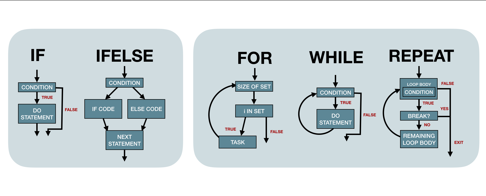

A companion to [Advanced R](https://adv-r.hadley.nz/rcpp.html#acknowledgments) and supplement to [Advanced R Solutions](https://advanced-r-solutions.rbind.io/names-and-values.html#copy-on-modify)


```{r, include=FALSE}
library(tidyverse)
library(kableExtra)
library(lobstr)
```

# Chapter 2 

## 2.3 Copy-on-modify 

:::question
copy-on-modify vs copy-in-place: is one more preferable in certain situations?
:::

modify in place only happens when objects with a single binding get a special performance optimization and to environments.

## 2.2.2 Exercises

:::question
Question 3 digs into the syntactically valid names created when using `read.csv()`, but what is the difference between quotation and backticks? 

If we create an example csv
```{r}
example2223 <- tibble(
  `if` = c(1,2,3),
  `_1234` = c(4,5,6),
  `column 1` = c(7,8,9)
)

write.csv(example2223, "example2223.csv", row.names = FALSE)
```

Import using adjusted column names to be syntactically valid:
```{r}
read.csv(file = "example2223.csv",check.names = TRUE)
```

Import using non-adjusted column names
```{r}
read.csv(file = "example2223.csv", check.names = FALSE)
```

Import using the tidyverse where names are not adjusted
```{r}
df_non_syntactic_name  <- read_csv(file = "example2223.csv")
```

However I really don´t understand the difference between backticks and quotation marks. For example when I select a column in the case of non-syntactic in the tidyverse I can use quotation marks or backticks 

```{r}
df_non_syntactic_name %>% select("if")
```

```{r, eval=FALSE}
df_non_syntactic_name %>% select(`if`)
```

But in base R, I can do this with quotation marks, but not backticks:

```{r, eval=FALSE}
df__non_syntactic_name["if"]
```

```
Error in `[.default`(df__non_syntactic_name, `if`) : invalid subscript type 'special'
```

According to `?Quotes` backticks are used for "non-standard variable names" but why in base R they don´t work to select columns but in the tidyverse they work to select variables?
:::

The easiest way to think about this is that backticks refer to objects while quotation marks refer to strings. `dplyr::select()` accepts object references as well as string references, while base R subsetting is done with a string or integer position.

## 2.3.2 Function calls

:::question
Can we go over and break down figure in 2.3.2
:::

When you create this function:

```{r, eval=FALSE}
crazyfunction <- function(eh) {eh}
```

`eh` doesn't exist in memory at this point.

```{r, eval=FALSE}
x <- c(1,2,3)
```

x exists in memory.

```{r, eval=FALSE}
z <- crazyfunction(x) 
```

`z` now points at `x`, and `eh` still doesn't exist (except metaphorically in Canada). `eh` was created and exists WHILE `crazyfunction()` was being run, but doesn't get saved to the global environment, so after the function is run you can't see its memory reference. 

The round brackets `(eh)` list the arguments, the curly brackets `{eh}` define the operation that it's doing - and you're assigning it to `crazyfunction`. 

**R functions automatically return the result of the last expression** so when you call that object (the argument `eh`) it returns the value of that argument. This is called **implicit returns**

## 2.3.3 Lists

:::question

Checking the address for a list and its copy we see they share the same references:

```{r}
l1 <- list(1,2,3)
l2 <- l1
identical(lobstr::ref(l1),lobstr::ref(l2))
lobstr::obj_addr(l1[[1]])
lobstr::obj_addr(l2[[1]])
```

But why isn't this the case for their subsets? Using `obj_addr` they have different addresses, but when we look at their references they are the same

```{r}
lobstr::obj_addr(l1[1])
lobstr::ref(l1[1])
lobstr::obj_addr(l2[1])
```


```{r}
identical(lobstr::obj_addr(l1[1]), lobstr::obj_addr(l2[1]))
```
:::

This is because using singular brackets wraps the value 1 in a new list that is created on the fly which will have a unique address. We can use double brackets to confirm our mental model that the sublists are also identical:

```{r}
identical(lobstr::obj_addr(l1[[1]]), lobstr::obj_addr(l2[[1]]))
```


:::question
What's the difference between these 2 addresses `<0x55d53fa975b8>` and `0x55d53fa975b8`?
:::

Nothing - it has to do with the printing method:

```{r}
x <- c(1, 2, 3)
print(tracemem(x))
cat(tracemem(x))
lobstr::obj_addr(x)
```

:::question
When would you prefer a deep copy of a list to a shallow copy? Is this something to consider when writing functions or package development or is this more something that's optimized behind the scenes?
:::

Automagical!

## 2.3.5 Character vectors


:::question
Is there a way to clear the "global string pool"?
:::

According to [this post](https://community.rstudio.com/t/memory-usage-and-rs-global-string-pool/4762/3) it doesn't look like you can directly, but clearing all references to a string that's in the global string pool clears that string from the pool, eventually

## 2.3.6.2 Exercise

:::question
When we look at `tracemem` when we modify `x` from an integer to numeric, x is assigned to three objects. The first is the integer, and the third numeric - so what's the intermediate type?

```{r, eval=FALSE}
x <- c(1L, 2L, 3L)
obj_addr(x)
tracemem(x)
x[[3]] <- 4
```

```
[1] "0x7f84b7fe2c88"
[1] "<0x7f84b7fe2c88>"
tracemem[0x7f84b7fe2c88 -> 0x7f84b7fe5288]: 
tracemem[0x7f84b7fe5288 -> 0x7f84bc0817c8]: 
```

What is `0x7f84b7fe5288` when the intermediate `x <- c(1L, 2L, 4)` is impossible?
:::

When we assign the new value as an integer there is no intermediate step. This probably means `c(1,2, NA)` is the intermediate step; creating an intermediate vector that's the same length of the final product with NA values at all locations that are new or to be changed

```{r}
x <- c(1L, 2L, 3L)
obj_addr(x)
tracemem(x)
x[[3]] <- 4L
```

You can dig into the C code running this: 

```{r, eval=FALSE}
pryr::show_c_source(.Internal("[<-"))
```

## 2.4.1 Object size

:::question
If I have two vectors, one `1:10` and another `c(1:10, 10)`, intuitively, I would expect the size of the second vector to be greater than the size of the first. However, it seems to be the other way round, why?
```{r}
x1 <- 1:10
x2 <- rep(1:10, 10)
lobstr::obj_size(x1)
lobstr::obj_size(x2)
```
:::

If we start with the following three vectors:
```{r}
x1 <- c(1L, 2L, 3L, 4L, 5L, 6L, 7L, 8L, 9L, 10L)
x2 <- 1:10
x3 <- rep(1:10, 10)
lobstr::obj_sizes(x1, x2, x3)
```

Intuitively, we would have expected `x1` < `x2` < `x3` but this is not the case. It appears that the `rep()` function coerces a double into integer and hence optimizes on space. Using `:`, R internally uses [ALTREP](https://blog.revolutionanalytics.com/2017/09/altrep-preview.html). 

ALTREP would actually be more efficient if the numbers represented were significantly large, say `1e7`.

```{r}
x4 <- 1:1e7
x5 <- x4
x5[1] <- 1L
lobstr::obj_sizes(x4, x5)
```

Now, the size of x4  is significantly lower than that of x5 .  This seems to indicate that ALTREP becomes super efficient as the vector size is increased.

## 2.5.1 Modify-in-place

:::question
"When it comes to bindings, R can currently only count 0, 1, or many. That means that if an object has two bindings, and one goes away, the reference count does not go back to 1: one less than many is still many. In turn, this means that R will make copies when it sometimes doesn’t need to."

Can we come up with an example of this? It seems really theoretical right now.
:::

First you need to switch your Environment tab to something other than global in RStudio!

Now we can create a vector:
```{r}
v <- c(1, 2, 3)
(old_address <- lobstr::obj_addr(v))
```

Changing a value within it changes its address:
```{r}
v[[3]] <- 4
(new_address <- lobstr::obj_addr(v))
old_address == new_address
```

We can assign the modified vector to a new name, where `y` and `v` point to the same thing.
```{r}
y <- v
(y_address <- lobstr::obj_addr(y))
(v_address <- lobstr::obj_addr(v))
y_address == v_address
```

Now if we modify `v` it won't point to the same thing as `y`:
```{r}
v[[3]] <- 3
(y_address <- lobstr::obj_addr(y))
(v_address <- lobstr::obj_addr(v))
y_address == v_address
```

But if we now change `y` to look like `v`, the original address, in theory editing y should occur in place, but it doesn't - the "count does not go back to one"!

```{r}
y[[3]] <- 3
(new_y_address <- lobstr::obj_addr(y))
new_y_address == y_address
```

:::question

Can we break down this code a bit more? I'd like to really understand when and how it's copying three times.

```{r}
# dataframe of 5 columns of numbers
x <- data.frame(matrix(runif(5 * 1e4), ncol = 5))
# median number for each column
medians <- vapply(x, median, numeric(1))

# subtract the median of each column from each value in the column
for (i in seq_along(medians)) {
  x[[i]] <- x[[i]] - medians[[i]]
}
```
:::


```{r, eval=FALSE}
cat(tracemem(x), "\n")
```

```
<0x7fdc99a6f9a8> 
```

```{r, eval=FALSE}
for (i in 1:5) {
  x[[i]] <- x[[i]] - medians[[i]]
}
```

```
tracemem[0x7fdc99a6f9a8 -> 0x7fdc9de83e38]: 
tracemem[0x7fdc9de83e38 -> 0x7fdc9de83ea8]: [[<-.data.frame [[<- 
tracemem[0x7fdc9de83ea8 -> 0x7fdc9de83f18]: [[<-.data.frame [[<- 
tracemem[0x7fdc9de83f18 -> 0x7fdc9de83f88]: 
tracemem[0x7fdc9de83f88 -> 0x7fdc9de83ff8]: [[<-.data.frame [[<- 
tracemem[0x7fdc9de83ff8 -> 0x7fdc9de84068]: [[<-.data.frame [[<- 
tracemem[0x7fdc9de84068 -> 0x7fdc9de840d8]: 
tracemem[0x7fdc9de840d8 -> 0x7fdc9de84148]: [[<-.data.frame [[<- 
tracemem[0x7fdc9de84148 -> 0x7fdc9de841b8]: [[<-.data.frame [[<- 
tracemem[0x7fdc9de841b8 -> 0x7fdc9de84228]: 
tracemem[0x7fdc9de84228 -> 0x7fdc9de84298]: [[<-.data.frame [[<- 
tracemem[0x7fdc9de84298 -> 0x7fdc9de84308]: [[<-.data.frame [[<- 
tracemem[0x7fdc9de84308 -> 0x7fdc9de84378]: 
tracemem[0x7fdc9de84378 -> 0x7fdc9de843e8]: [[<-.data.frame [[<- 
tracemem[0x7fdc9de843e8 -> 0x7fdc9de84458]: [[<-.data.frame [[<- 
```

When we run `tracemem` on the for loop above we see each column is copied twice followed by the `[[<-.data.frame [[<- `, the stack trace showing exactly where the duplication occurred.

So what is ``[[<-.data.frame``? It's a function! By looking at `?``[[<-.data.frame`` we see this is used to "extract or replace subsets of data frames."

When we write `x[[i]] <- value`, it's really shorthand for calling the function `[[<-.data.frame` with inputs `x`, `i`, and `value`. 

Now let's step into the call of this base function by running `debug(``[[<-.data.frame``)`:

```{r, eval=FALSE}
debug(`[[<-.data.frame`)
```

and once inside, use `tracemem()` to find where the new values are assigned to the column:

```{r eval=FALSE}
function (x, i, j, value) 
{
  if (!all(names(sys.call()) %in% c("", "value"))) 
    warning("named arguments are discouraged")
  cl <- oldClass(x)
  # this is where another copy of x is made!
  class(x) <- NULL
```

```
 # tracemem[0x7fdc9d852a18 -> 0x7fdc9c99cc08]: 
```

```{r, eval = FALSE}
nrows <- .row_names_info(x, 2L)
  if (is.atomic(value) && !is.null(names(value))) 
    names(value) <- NULL
  if (nargs() < 4L) {
    nc <- length(x)
    if (!is.null(value)) {
      N <- NROW(value)
      if (N > nrows) 
        stop(sprintf(ngettext(N, "replacement has %d row, data has %d", 
          "replacement has %d rows, data has %d"), N, 
          nrows), domain = NA)
      if (N < nrows) 
        if (N > 0L && (nrows%%N == 0L) && length(dim(value)) <= 
          1L) 
          value <- rep(value, length.out = nrows)
        else stop(sprintf(ngettext(N, "replacement has %d row, data has %d", 
          "replacement has %d rows, data has %d"), N, 
          nrows), domain = NA)
    }
    x[[i]] <- value
    if (length(x) > nc) {
      nc <- length(x)
      if (names(x)[nc] == "") 
        names(x)[nc] <- paste0("V", nc)
      names(x) <- make.unique(names(x))
    }
    class(x) <- cl
    return(x)
  }
  if (missing(i) || missing(j)) 
    stop("only valid calls are x[[j]] <- value or x[[i,j]] <- value")
  rows <- attr(x, "row.names")
  nvars <- length(x)
  if (n <- is.character(i)) {
    ii <- match(i, rows)
    n <- sum(new.rows <- is.na(ii))
    if (n > 0L) {
      ii[new.rows] <- seq.int(from = nrows + 1L, length.out = n)
      new.rows <- i[new.rows]
    }
    i <- ii
  }
  if (all(i >= 0L) && (nn <- max(i)) > nrows) {
    if (n == 0L) {
      nrr <- (nrows + 1L):nn
      if (inherits(value, "data.frame") && (dim(value)[1L]) >= 
        length(nrr)) {
        new.rows <- attr(value, "row.names")[seq_len(nrr)]
        repl <- duplicated(new.rows) | match(new.rows, 
          rows, 0L)
        if (any(repl)) 
          new.rows[repl] <- nrr[repl]
      }
      else new.rows <- nrr
    }
    x <- xpdrows.data.frame(x, rows, new.rows)
    rows <- attr(x, "row.names")
    nrows <- length(rows)
  }
  iseq <- seq_len(nrows)[i]
  if (anyNA(iseq)) 
    stop("non-existent rows not allowed")
  if (is.character(j)) {
    if ("" %in% j) 
      stop("column name \"\" cannot match any column")
    jseq <- match(j, names(x))
    if (anyNA(jseq)) 
      stop(gettextf("replacing element in non-existent column: %s", 
        j[is.na(jseq)]), domain = NA)
  }
  else if (is.logical(j) || min(j) < 0L) 
    jseq <- seq_along(x)[j]
  else {
    jseq <- j
    if (max(jseq) > nvars) 
      stop(gettextf("replacing element in non-existent column: %s", 
        jseq[jseq > nvars]), domain = NA)
  }
  if (length(iseq) > 1L || length(jseq) > 1L) 
    stop("only a single element should be replaced")
  x[[jseq]][[iseq]] <- value
  # here is where x is copied again!
  class(x) <- cl
```

```
# tracemem[0x7fdc992ae9d8 -> 0x7fdc9be55258]: 
```
```{r, eval=FALSE} 
  x
}
```

Thus seeing exactly where the three copies are happening!

# Chapter 3

## 3.2.1 Scalars

:::question
Can you have `NA` in vector
:::

Hell yeah!

## 3.2.3 Missing values

:::question
`NA` is a 'sentinel' value for explicit missingness - what does 'sentinel' mean?
:::

A sentinel value (also referred to as a flag value, trip value, rogue value, signal value, or dummy data) is a special value in the context of an algorithm which uses its presence as a condition of termination. Also worth noting two NAs are not equal to each other! For instance, in C++ there’s a special character to identify the end of a string I think another example of a sentinel value might be in surveys where you sometimes see missing data or N/A coded as 999, or 9999 (or maybe just 9)


Another example of a sentinel value might be in surveys where you sometimes see missing data or `N/A` coded as `999`, or `9999` (or maybe just `9`). The possible values in a column of data might be:

```{r eval=FALSE}
factor(c(1,1,1,1,2,3,3,4,4,9), levels = c(1,2,3,4,9))
```

Sentinels are typically employed in situations where it's easier/preferable to have a collection of values of the same type - represented internally using the same conventions and requiring the same amount of memory - but you also need a way to indicate a special circumstance. So like in the case of survey data you may, for example, see a variable indicating that an individual is `999` years old but the correct way to interpret that is that the data was not collected.

## 3.2.4 Testing and coercion

:::question
Why does the book warn us against using `is.vector()`, `is.atomic()` and `is.numeric()`? [read docs]
:::

- `is.atomic` will also return true if `NULL`
- `is.numeric` tests if integer or double **NOT** factor, Date, POSIXt, difftime
- `is.vector` will return false if it has attributes other than names

## 3.3.1 Setting Attributes 

:::question
Working in the medical field I have to import SAS files a lot where the column names have to adhere to specific abbreviations so they're given a label attribute for their full name. What are some other common uses for attributes?
:::

Hypothesis test attributes!


## 3.3.2 setNames

:::question
We can use `setNames` to apply different values to each element in a vector. How do we do this for our own custom attribute? The code below does NOT work!

```{r}
my_vector <- c(
  structure(1, x = "firstatt_1"),
  structure(2, x = "firstatt_2"), 
  structure(3, x = "firstatt_3")
)

my_vector <- setNames(my_vector, c("name_1", "name_2", "name_3"))

# mental model: shouldn't this should return $names and $x?
attributes(my_vector)
```
:::

As soon as you instantiate a vector the attributes are lost. BUT we can store it as a list *within* the vector to keep them! We can create a custom attribute function and use that with `map` to add a list inside our dataframe:

```{r}
custom_attr <- function(x, my_attr) {
  attr(x, "x") <- my_attr
  return(x)
}

as_tb <- 
  tibble(
  one = c(1,2,3),
  x = c("att_1", "att_2", "att_3"),
  with_arr = map2(one, x, ~custom_attr(.x, .y))
)

as_tb$with_arr
```

## 3.3.3 Dimensions

:::question
Because `NROW` and `NCOL` don't return `NULL` on a one dimensional vector they just seem to me as a more flexible option. When do you *have* to use `ncol` and `nrow`?
:::

It *may* be better practice to always use `NROW` and `NCOL`!

:::question
As long as the number of rows matches the data frame, it’s also possible to have a matrix or array as a column of a data frame. (This requires a slight extension to our definition of a data frame: it’s not the `length()` of each column that must be equal, but the `NROW()`.)

```{r}
df <- data.frame(x = c(1,2,3,4,5),
                 y = c(letters[1:5]))

length(df$y) == NROW(df$y)
```

What's an example of where `length() != NROW()`
:::

The case of a matrix! 

```{r}
my_matrix <- 1:6
dim(my_matrix) <- c(3,2)
my_matrix
length(my_matrix) == NROW(my_matrix) # 6 != 3
length(my_matrix) == NCOL(my_matrix) # 6 != 2
```

The length of the matrix is `6`, and if we manipulate the dimensions of the matrix we see that the NROW is `3` and and NCOL is `2`.

## 3.4 S3 atomic vectors

:::question
How is data type `typeof()` different from `class()`?
:::

Classes are built on top of base types - they're like special, more specific kinds of types. In fact, if a class isn't specified then `class()` will default to either the `implicit class` or `typeof`.

So `Date`, `POSIXct`, and `difftime` are specific kinds of doubles, falling under its umbrella.
```{r}
lubridate::is.Date(Sys.Date())
is.double(Sys.Date())

lubridate::is.POSIXct(Sys.time())
is.double(Sys.time())

lubridate::is.difftime(as.difftime(c("0:3:20", "11:23:15")))
is.double(as.difftime(c("0:3:20", "11:23:15")))
```

But then why does `my_factor` fail to be recognized under its more general `integer` umbrella?

```{r}
my_factor <- factor(c("a", "b", "c"))
is.factor(my_factor)
is.integer(my_factor)
```


## 3.4.2 Dates

:::question
Why are dates calculated from January 1st, 1970?
:::

Unix counts time in seconds since its official "birthday," -- called "epoch" in computing terms -- which is Jan. 1, 1970. [This article](https://www.wired.com/2001/09/unix-tick-tocks-to-a-billion/) explains that the early Unix engineers picked that date arbitrarily, because they needed to set a uniform date for the start of time, and New Year's Day, 1970, seemed most convenient.

## 3.5.1 Lists

:::question

The length of the matrix is `6`, and if we manipulate the dimensions of the matrix we see that the NROW is `3` and and NCOL is `2`.

## 3.4 S3 atomic vectors

:::question
How is data type `typeof()` different from `class()`?
:::

Classes are built on top of base types - they're like special, more specific kinds of types. In fact, if a class isn't specified then `class()` will default to either the `implicit class` or `typeof`.

So `Date`, `POSIXct`, and `difftime` are specific kinds of doubles, falling under its umbrella.
```{r}
lubridate::is.Date(Sys.Date())
is.double(Sys.Date())

lubridate::is.POSIXct(Sys.time())
is.double(Sys.time())

lubridate::is.difftime(as.difftime(c("0:3:20", "11:23:15")))
is.double(as.difftime(c("0:3:20", "11:23:15")))
```

But then why does `my_factor` fail to be recognized under its more general `integer` umbrella?

```{r}
my_factor <- factor(c("a", "b", "c"))
is.factor(my_factor)
is.integer(my_factor)
```


## 3.4.2 Dates

:::question
Why are dates calculated from January 1st, 1970?
:::

Unix counts time in seconds since its official "birthday," -- called "epoch" in computing terms -- which is Jan. 1, 1970. [This article](https://www.wired.com/2001/09/unix-tick-tocks-to-a-billion/) explains that the early Unix engineers picked that date arbitrarily, because they needed to set a uniform date for the start of time, and New Year's Day, 1970, seemed most convenient.

## 3.5.1 Lists

:::question
When should you be using `list()` instead of `c()`
:::

It's really contingent on the use case. In the case of adding custom classes it's worth noting that those are lost once you `c()` those objects together!

## 3.6.8 Data frames and tibbles

:::question
What does 'lazy' mean in terms of `as_tibble`?
:::
  
Technically `lazy evaluation` means that expressions are not evaluated when they are bound to variables, but their evaluation is deferred until their results are needed by other computations. In this context though we think Hadley just meant that it's treated as a character if it "looks and smells like a character". 


:::question
The solution manual gives the answer and notes:

```{r}
df_coltypes <- data.frame(
  a = c("a", "b"),
  b = c(TRUE, FALSE),
  c = c(1L, 0L),
  d = c(1.5, 2),
  e = c("one" = 1, "two" = 2),
  g = factor(c("f1", "f2")),
  stringsAsFactors = FALSE
)

as.matrix(df_coltypes)
```

"Note that `format()` is applied to the characters, which gives surprising results: `TRUE` is transformed to `" TRUE"` (starting with a space!)."

...But where is the `format()` call happening? I don't see a space!
:::

After running `debug(as.matrix(df_coltypes))` and going down a rabbit hole we found this is a bug that has been addressed! [See issue here](https://github.com/Tazinho/Advanced-R-Solutions/issues/213)

## Conclusion 

:::question
How does vectorization make your code faster
:::

Taking the example from [Efficient R Programming](https://csgillespie.github.io/efficientR/programming.html#vectorised-code):

### VECTORIZED: 
```{r, eval=FALSE}
sum(log(x))
```

### NON-VECTORIZED:
```{r, eval=FALSE}
s <- 0
for(x0 in x) {
  s <- s + log(x0)
}
```

The vectorized code is faster because it obeys the golden rule of R programming: *"access the underlying C/Fortran routines as quickly as possible; the fewer functions calls required to achieve this, the better"*. 

- Vectorized Version:
  1. `sum` [called once]
  2. `log` [called once]
  
- Non-vectorized:
  1. `+` [called `length(x)` times]
  2. `log` [called `length(x)` times]

In the vectorised version, there are two primitive function calls: one to `log` (which performs `length(x)` steps in the C level) and one to `sum` (which performs `x` updates in the C level). So you end up doing a similar number of operations at C level regardless of the route. 

In the non-vectorised form you are passing the logic back and forth between R and C many many times and this is why the non-vectorised form is much slower.

**A vectorized function calls primitives directly, but a loop calls each function `length(x)` times, and there are `1 + length(x)` assignments to `s`. Theres on the order of 3x primitive function calls in the non-vectorised form!!**

Resources:

- [Check out Jenny Brian's slides](https://speakerdeck.com/jennybc/row-oriented-workflows-in-r-with-the-tidyverse)

- [Great article by Noam Ross](https://www.noamross.net/archives/2014-04-16-vectorization-in-r-why/)

:::question
Putting it all together in a single diagram:
:::

```{r, echo=FALSE}
knitr::include_graphics("../images/vectors.png")
```

# Chapter 4

## 4.1 Introduction

:::question
"There are three subsetting operators `[`. `[[`, `$`. What is the distinction between an operator and a function? When you look up the help page it brings up the same page for all three extraction methods. What are their distinctions and do their definitions change based on what you're subsetting? Can we make a table? 
:::

```{r, echo=FALSE}
subsetting_table <- tibble(
  names = c("ATOMIC", "LIST", "MATRIX", "DATA FRAME", "TIBBLE"),
  
  `[` = c("RETURNS VECTOR WITH ONE ELEMENT",
          "RETURNS A LIST",
          "RETURNS A VECTOR",
          "RETURNS A VECTOR OR DATA FRAME",
          "RETURNS A TIBBLE"
   ),
  
  `[[` = c("SAME AS [", 
           "RETURNS SINGLE ELEMENT FROM WITHIN LIST",
           "RETURNS A VECTOR OR SINGLE VALUE",
           "RETURNS VECTOR/LIST/MATRIX OR SINGLE VALUE",
           "RETURNS A VECTOR OR SINGLE VALUE"
    
  ),
  
  `$` = c(
    "NOPE!",
    "RETURN SINGLE ELEMENT FROM LIST [CAN ONLY USE WHEN LIST VECTOR HAS A NAME]",
    "NOPE!",
    "RETURNS VECTOR/LIST/MATRIX USING COLUMN NAME",
    "RETURNS THE STR OF THE COLUMN - TIBBLE/LIST/MATRIX"
  )
) %>%
  column_to_rownames("names")

kable(subsetting_table) %>% 
  kable_styling("striped") %>%
  column_spec(1, bold = T, border_right = T)
```


## 4.2.1 Selecting multiple elements

:::question
Why is `numeric(0)` "helpful for test data?"
:::

This is more of a general comment that one should make sure one's code doesn't crash with vectors of zero length (or data frames with zero rows)

:::question
Why is subsetting with factors "not a good idea"
:::

Hadley's notes seem to say subsetting with factors uses the "integer vector of levels" - and if they all have the same level, it'll just return the first argument. Subsetting a factor vector leaves the factor levels behind unless you explicitly drop the unused levels

## 4.2.2 lists

:::question
We've been talking about `$` as a shorthand for `[[`. Using the example list `x <- list(1:3, "a", 4:6)` can we use `x$1` as shorthand for `x[[1]]`?
:::

The "shorthand" refers to using the name of the vector to extract the vector. If we give `1:3` a name such as test = `1:3`

```{r}
x <- list(named_vector = 1:3, "a", 4:6)
x[[1]] == x$named_vector
```

As such, `$` is a shorthand for `x[["name_of_vector"]]` and not shorthand for `x[[index]]`

## 4.3.1 `[[`

:::question

The book states: 

*While you must use [[ when working with lists, I’d also recommend using it with atomic vectors whenever you want to extract a single value. For example, instead of writing:*

```{r, eval=FALSE}
for (i in 2:length(x)) {
  out[i] <- fun(x[i], out[i - 1])
}
```

*It's better to write*

```{r, eval=FALSE}
for (i in 2:length(x)) {
  out[[i]] <- fun(x[[i]], out[[i - 1]])
}
```

Why? Can we see this in action by giving `x`, `out`, and `fun` real life values?
:::

If we have a vector
```{r}
df_x <- c("Advanced","R","Book","Club")
```

We can use `[` or `[[` to extract the third element of `df_x`
```{r}
df_x[3]
df_x[[3]]
```

But in the case where we want to extract an element from a list `[` and `[[` no longer give us the same results
```{r}
df_x <- list(A = "Advanced", B = "R", C = "Book", D = "Club")

df_x[3]
df_x[[3]]
```

Because using `[[` returns "one element of this vector" in both cases, it makes sense to default to `[[` instead of `[` since it will reliably return a single element. 

## 4.3.5 Exercise

:::question
The question asks to describe the `upper.tri` function - let's dig into it!
:::

```{r}
x <- outer(1:5, 1:5, FUN = "*")
upper.tri(x)
```

We see that it returns the upper triangle of the matrix. But I wanted to walk through how this function actually works and what is meant in the solution manual by leveraging `.row(dim(x)) <= .col(dim(x))`.

```{r, eval=FALSE}
# ?upper.tri
function (x, diag = FALSE) 
{
    d <- dim(x)
    # if you have an array thats more than 2 dimension
    # we need to flatten it to a matrix
    if (length(d) != 2L) 
        d <- dim(as.matrix(x))
    if (diag) 
      # this is our subsetting logical!
         .row(d) <= .col(d)
    else .row(d) < .col(d)
}
```

The function `.row()` and `.col()` return a matrix of integers indicating their row number

```{r}
.row(dim(x))
```

```{r}
.col(dim(x))
```

```{r}
.row(dim(x)) <= .col(dim(x))
```


:::question
Is there a high level meaning to a `.` before function? Does this refer to internal functions? [see: ?`row` vs ?`.row`]
:::

Objects in the global environment prefixed with `.` are hidden in the R (and RStudio) environment panes - so functions prefixed as such are not visible unless you do `ls(all=TRUE)`. [Read more here](https://community.rstudio.com/t/function-argument-naming-conventions-x-vs-x/7764) and (here)[https://stackoverflow.com/questions/7526467/what-does-the-dot-mean-in-r-personal-preference-naming-convention-or-more]

## 4.3.3 Missing and OOB

:::question
Let's walk through examples of each
:::

### LOGICAL ATOMIC

```{r, eval=FALSE}
c(TRUE, FALSE)[[0]] # zero length
# attempt to select less than one element in get1index <real>
c(TRUE, FALSE)[[4]] # out of bounds
# subscript out of bounds
c(TRUE, FALSE)[[NA]] # missing
# subscript out of bounds
```

### LIST 
```{r, eval=FALSE}
list(1:3, NULL)[[0]] # zero length
# attempt to select less than one element in get1index <real>
list(1:3, NULL)[[3]] # out of bounds
# subscript out of bounds
list(1:3, NULL)[[NA]] # missing
# NULL
```

### NULL

```{r, eval=FALSE}
NULL[[0]] # zero length
# NULL
NULL[[1]] # out of bounds
# NULL
NULL[[NA]] # missing
# NULL
```

## 4.5.8 Logical subsetting

:::question
"Remember to use the vector Boolean operators `&` and `|`, not the short-circuiting scalar operators `&&` and `||`, which are more useful inside if statements." 

Can we go over the difference between `&` and `&&` (and `|` vs `||`) I use brute force to figure out which ones I need...
:::

`&&` and `||` only ever return a single (scalar, length-1 vector) `TRUE` or `FALSE` value, whereas `|` and `&` return a vector after doing element-by-element comparisons.

The only place in R you routinely use a scalar `TRUE`/`FALSE` value is in the conditional of an `if` statement, so you'll often see `&&` or `||` used in idioms like: `if (length(x) > 0 && any(is.na(x))) { do.something() }`

In most other instances you'll be working with vectors and use `&` and `|` instead.

Using `&&` or `||` results in some unexpected behavior - which could be a big performance gain in some cases:

- `||` will not evaluate the second argument when the first is `TRUE`
- `&&` will not evaluate the second argument when the first is `FALSE`

```{r}
true_one <- function() { print("true_one evaluated."); TRUE}
true_two <- function() { print("true_two evaluated."); TRUE}
# arguments are evaluated lazily.  Unexpected behavior can result:
c(T, true_one()) && c(T, true_two())
c(T, true_one()) && c(F, true_two())
c(F, true_one()) && c(T, true_two()) 
c(F, true_one()) && c(F, true_two()) 
c(T, true_one()) || c(T, true_two())
c(T, true_one()) || c(F, true_two())
c(F, true_one()) || c(T, true_two()) 
c(F, true_one()) || c(F, true_two()) 
```

Read more about [Special Primatives](https://cran.r-project.org/doc/manuals/r-release/R-ints.html#Special-primitives) here

## 4.5.8 Boolean algebra

:::question
The `unwhich()` function takes a boolean and turns it into a numeric - would this ever be useful? How?
:::

:::TODO
XXX
:::

:::question
"`x[-which(y)]` is not equivalent to `x[!y]`: if `y` is all FALSE, `which(y)` will be `integer(0)` and `-integer(0)` is still `integer(0)`, so you’ll get no values, instead of all values."

Can we come up with an example for this plugging in values for `x` and `y`
:::

```{r}
c(TRUE, FALSE)[-which(FALSE)]
c(TRUE, FALSE)[!FALSE]
```


# Chapter 5

## 5.2.3 switch statement

:::question
"Closely related to if is the `switch()` statement. It’s a compact, special purpose equivalent"

What is meant here by "special purpose"? Can we come up with a case where you can't substitute `if` for `switch` or the other way around? Use `switch`. Is it safe to say to `switch` when you have character inputs (as the book suggests) and use `case_when` or `if` for numerics?
:::

:::TODO
XXX
:::

## 5.3.1 common pitfalls

:::question
What does the book mean by leveraging `vector` for preallocating the loop output? How is this different from creating an empty list to instantiate the loop? 

```{r}
means <- c(1, 50, 20)

out_vector <- vector("list", length(means))
for (i in 1:length(means)) {
  out_vector[[i]] <- rnorm(10, means[[i]])
}

out_list <- list()
for (i in 1:length(means)) {
  out_list[[i]] <- rnorm(10, means[[i]])
}
```
:::

:::TODO
XXX
:::

:::question
The book warns against using `length(x)` and suggests using `seq_along` instead. Is there any downside to using `seq_along` or a case when you'd prefer `length(x)` over `seq_along(x)`? I can't think of any downsides to using it!
:::

:::TODO
XXX
:::

## 5.3.3.1 Exercises

:::question
```{r}
x <- numeric()
out <- vector("list", length(x))
for (i in 1:length(x)) {
  out[i] <- x[i] ^ 2
}
out
```

I understand that this works because we can count down in a loop - so the first iteration `x[1] == NA`, and the second `x[2] == numeric(0)` but where does this value go? Is it just evaluated but not stored since R counts from 1?
:::

:::TODO
XXX
:::

## Conclusion

:::question
Can we put these concepts together in diagram form? Let's work on improving these schematics!
:::

```{r, echo=FALSE}

```
