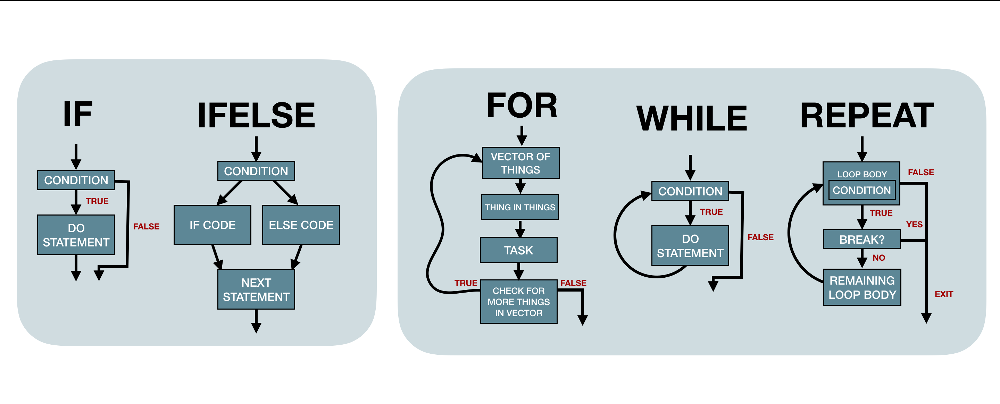

# Control Flow


## 5.2.2 Vectorised if {-}

:::question
Why does `if` `else` print `"Out of range"` once but `ifelse` prints it twice?


```r
if (sample(1:10, 1) == 1) print("In range") else print("Out of range")
```

```
[1] "Out of range"
```


```r
ifelse((sample(1:10, 1) == 1), print("In range"), print("Out of range"))
```

```
[1] "Out of range"
[1] "Out of range"
```
:::


```r
var <- if (sample(1:10, 1) == 1) print("In range")
var
```

```
NULL
```


```r
var <- ifelse((sample(1:10, 1) == 1), print("In range"), print("Out of range"))
```

```
## [1] "Out of range"
```

```r
var
```

```
## [1] "Out of range"
```

`ifelse` explicitly returns its result, whereas `if` invisibly returns it!


```r
ifelse(c(TRUE, FALSE, TRUE), 1:2, 3)
```

```
## [1] 1 3 1
```

Honestly, `ifelse()` is weird. Try this too:


```r
ifelse(c(TRUE, FALSE, TRUE), 1:10, 3)
```

```
## [1] 1 3 3
```

## 5.3 Loops  {-}

:::question
Can the body of the loop change the set?
:::


```r
my_set <- c(1, 20, 99)

for (i in my_set){
  if (i==1){
    my_set[9]= 20
    }
  print("hello")
  print(my_set)
  }
```

```
## [1] "hello"
## [1]  1 20 99 NA NA NA NA NA 20
## [1] "hello"
## [1]  1 20 99 NA NA NA NA NA 20
## [1] "hello"
## [1]  1 20 99 NA NA NA NA NA 20
```
Looks like you can't!

## 5.2.3 switch statement {-}

:::question
"Closely related to if is the `switch()` statement. It’s a compact, special purpose equivalent"

What is meant here by "special purpose"? Can we come up with a case where you can't substitute `if` for `switch` or the other way around? Use `switch`. Is it safe to say to `switch` when you have character inputs (as the book suggests) and use `case_when` or `if` for numerics?
:::

Switch is special in that only ONE value can be true, as in the case from our presentation the shiny input can only ever be ONE of the strings on the left it cannot be multiple.


```r
datasetInput <- reactive({ 
  switch(input$dataset,
         "materials" = brewing_materials,
         "size" = brewer_size,
         "states" = beer_states,
         "taxed" = beer_taxed)
})
```


## 5.3.1 common pitfalls {-}

:::question
What does the book mean by leveraging `vector` for preallocating the loop output? How is this different from creating an empty list to instantiate the loop? 


```r
means <- c(1, 50, 20)

out_vector <- vector("list", length(means))
for (i in 1:length(means)) {
  out_vector[[i]] <- rnorm(10, means[[i]])
}

out_list <- list()
for (i in 1:length(means)) {
  out_list[[i]] <- rnorm(10, means[[i]])
}
```
:::

By preallocating the length of the `out_vector` we're leveraging `modify-in-place` rather than `copy-on-modify`.

:::question
The book warns against using `length(x)` and suggests using `seq_along` instead. Is there any downside to using `seq_along` or a case when you'd prefer `length(x)` over `seq_along(x)`? I can't think of any downsides to using it!
:::

:::TODO
We have yet to find a downside but should look into this further!
:::

## 5.3.3.1 Exercises {-}

:::question

```r
x <- numeric()
out <- vector("list", length(x))
for (i in 1:length(x)) {
  out[i] <- x[i] ^ 2
}
out
```

```
## [[1]]
## [1] NA
```

I understand that this works because we can count down in a loop - so the first iteration `x[1] == NA`, and the second `x[2] == numeric(0)` but where does this value go? Is it just evaluated but not stored since R counts from 1?
:::

This question is actually the bigger question, "Can you assign something to index 0 in R?" and it doesn't seem that you can.


### Assignment to a valid index {-}


```r
mylist = list()
mylist[1] <- c("something")
mylist[1]
```

```
## [[1]]
## [1] "something"
```

### Assignment to [0] {-}


```r
mylist = list()
mylist[0] <- c("something")
mylist[0]
```

```
## list()
```

It's interesting that it's syntactically correct to assign to `mylist[0]`  but it does nothing!

### Empty index {-}


```r
mylist = list()
mylist[1]
```

```
## [[1]]
## NULL
```

R defaultly accesses the first layer using `[` and says there are no elements in the first layer of `mylist` and returns `NULL`. But when you do `mylist[[1]]` R says `Out of Bounds` because the first layer of `mylist` has been called and there is no layer at all. That's why R throws error in `[[` case.

### Impossible Index `[[` {-}


```r
mylist = list()
mylist[[0]]
```

```
Error in mylist[[0]] : attempt to select less than one element in get1index <real>
```

`[[` isolates one element whereas `[` can be used to get subsets of varying sizes.
`[[` gets precisely one element, no more no less, or it fails. So `[[0]]<-` cannot work because index zero cannot hold a value. 

### Impossible Index `[[<-`  {-}


```r
mylist = list()
mylist[[0]] <- "something"
```

```
Error in mylist[[0]] <- "something" : attempt to select less than one element in integerOneIndex
```

### Undefined name {-}

Selection using an undefined - but possible name - gives NULL


```r
mylist = list()
mylist[["undefined_name"]]
```

### Out of Bounds {-}

Selection using a possible - but not currently allocated - index gives an out of bounds error


```r
mylist = list()
mylist[[10]]
```

```
Error in mylist[[10]] : subscript out of bounds 
```

## Conclusion {-}

:::question
Can we put these concepts together in diagram form? Let's work on improving these schematics!
:::

Let's first put functions into words:


* If condition then run code, else quit
* A vectorized version of: if condition then run code, else run other code
* For every element in list of elements do what is in between the curly braces
* While this condition is true do this
* Repeat this until something tells you to break out



We can visualize how the `ifelse` logic on a single element above will operate on each element within a vector:


For instance if we can run:


```r
ifelse(c(TRUE, FALSE, TRUE), 1:2, 3)
```

```
## [1] 1 3 1
```

Lets break down what's happening:


Create a test answer:

```r
test <- c(TRUE, FALSE, TRUE)
yes <- 1:2
no <- 3
```

which indices in the test are TRUE and which are FALSE

```r
yes_idx <- which(test) # 1,3
no_idx <- which(!test) # 2
```

set up our answer

```r
answer <- test # T, F, T
```

grow the yes and no answers to the length of the test (input)

```r
yes_final <- rep(yes, length.out = length(test))
no_final <- rep(no, length.out = length(test))
```

fill the answer with yes or no from the enlarged yes/no answers

```r
answer[yes_idx] <- yes_final[yes_idx]  # 1,1
answer[no_idx] <- no_final[no_idx]     # 3
```

return our final answer:


```r
answer
```

```
## [1] 1 3 1
```


Another example: we can run 

```r
ifelse(c(TRUE, FALSE, TRUE, FALSE, TRUE, TRUE), 1:10, "FALSE")
```

```
## [1] "1"     "FALSE" "3"     "FALSE" "5"     "6"
```

we can see that ifelse places the numbers in `1:10` based on their index where our condition is to `TRUE` and inserts the string `"FALSE"` whenever the condition is `FALSE`

## Complexity {-}

Cyclomatic complexity is a software metric used to indicate the complexity of a program. It is computed using the control flow graph of the program: the nodes of the graph correspond to indivisible groups of commands of a program, and a directed edge connects two nodes if the second command might be executed immediately after the first command. 

We can use the package `cyclocomp` to look at the cyclomatic complexity of functions. Looking at each function from the Chapter 5 presentation:


```r
controlflow_functions <- list(
  if_func = if_func,
  if_else_func = if_else_func,
  ifelse_func = ifelse_func,
  casewhen_func = casewhen_func,
  switch_func = switch_func, 
  for_func = for_func,
  while_func = while_func,
  repeat_func = repeat_func)

purrr::map_df(controlflow_functions, cyclocomp)
```

```
## # A tibble: 1 x 8
##   if_func if_else_func ifelse_func casewhen_func switch_func for_func while_func
##     <int>        <int>       <int>         <int>       <int>    <int>      <int>
## 1       2            2           1             1           1       23          3
## # … with 1 more variable: repeat_func <int>
```

We see that the `for` loop was our most complex function and `while` had a complexity of 3. The rest of our functions had a complexity of `1`. 

As [Colin Fay states](https://engineering-shiny.org/successfulshinyapp.html): 

"Splitting a complex function into smaller functions is not a magic solution because (A) the global complexity of the app is not lowered by splitting things into pieces (just local complexity), and (B) the deeper the call stack, the harder it can be to debug."
