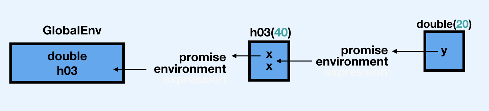
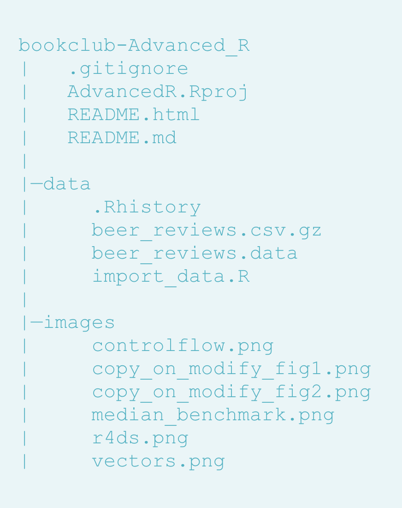

# Functions


## 6.2.2 Primitives {-}

:::question
So if you are familiar with C can you just write a function in C *in* R? What does that process look like? I think this is a bigger question of digging into the relationship between C and R.
:::

Primitives are part of R core, and can only be written by the R-core team. At its heart, R *is* the set of primitive C functions underneath it.

You can use Rcpp to include C++ code in your R code, but these aren't Primitives. There are also other techniques which we'll likely see covered in later chapters. Here's an example using Rcpp.


```r
Rcpp::cppFunction('#include<string>
  std::string IPA() {
  std::string val = "IPAs suck";	
  return val;
  }')
val <- IPA()
val
```
```
[1] "IPAs suck"
```

:::question
Are there any non-base primitives? If so how is that possible!
:::

:::TODO
XXX
:::

## 6.2.5.1 Exercises {-}

:::question
[This question is flagged as "started" let's try to complete it!](https://github.com/Tazinho/Advanced-R-Solutions/blob/5043d9b06c7469a010c568ecb85e12bedca75207/2-06-Functions.Rmd#L9)
:::

1. __[Q]{.Q}__: Given a name, like `"mean"`, `match.fun()` lets you find a function. Given a function, can you find its name? Why doesn't that make sense in R?

    __[A]{.started}__: A name can only point to a single object, but an object can be pointed to by 0, 1, or many names. What are names of the functions in the following block?

    
    ```r
      function(x) sd(x) / mean(x)
    ```
    
    ```
    ## function(x) sd(x) / mean(x)
    ```
    
    ```r
      f1 <- function(x) (x - min(x)) / (max(x) - min(x))
      f2 <- f1
      f3 <- f1
    ```

There isn't a 1 to 1 mapping between functions and names in R. Multiple names may point to the same function as we see for `f1`, `f2`, and `f3`. Also, each function has its own environment so it's possible that two functions might have the same "code" but are not the same because they have different environments (or closures). Lastly, anonymous functions don't have names so we'd have no way to look these up. 

We could find the names of our functions if they are all in the global environment using `body(x) == body(y)`


```r
names(which(sapply(mget(lsf.str()), function(x) body(x) == body(function(x) (x - min(x)) / (max(x) - min(x))))))
```

```
[1] f1  f2  f3
```

But that's just deparsing the body into a string and comparing the values. So if you want to think of two functions as being equal if their deparsed body strings as the same, then that's technically possible but that is just like searching for every variable that has the value of 5 [possible but not efficient].

The main point is that `name -> object` is a one way (non-unique) look up in R. There's no efficient way to go backwards. This is true for all values, not just functions.


## 6.3 Function composition {-}

:::question
When comparing nested, intermediate, and piping functions, it looks like Hadley flips the order of `f()` and `g()` between bullet points
:::

It does look like he does that!


```r
f <- function(z) {
  cat("g is:", z)
}

g <- function(x) {
  x * 2
}
```

### Nested


```r
f(g(2))
```

```
## g is: 4
```

### Intermediate 

This is written in the book as `y <- f(x); g(y)` but should be flipped to `y <- g(x); f(y)` if we are to follow the nested example


```r
y <- g(2)
f(y)
```

```
## g is: 4
```

### Piping

This also needs to be flipped from `x %>% f() %>% g()` to `x %>% g() %>% f()`


```r
2 %>% g() %>% f()
```

```
## g is: 4
```


## 6.4 Lexical scoping {-}

:::question
"The scoping rules use a parse-time, rather than a run-time structure"? What is "parse-time" and "run-time"? How do they differ?
:::

parse-time is when the function gets defined: when the formals and body get set. run-time is when it actually gets called. This function doesn't get past parse-time because of the syntax error


```r
get_state <- function(in_df, state_name){
  out_df % in_df[in_df$state == state_name, ]
  return(out_df)
}
```

```
get_state <- function(in_df, state_name){
  out_df % in_df[in_df$state == state_name, ]

Error: unexpected input in:

"get_state <- function(in_df, state_name){
  out_df % in_df[in_df$state == state_name, ]"
  return(out_df)

Error: object 'out_df' not found
}

Error: unexpected '}' in "}"
```

This function will get parsed successfully but could fail at run at run-time if the input data frame doesn't have a column named state:


```r
get_state <- function(in_df, state_name){
  out_df <- in_df[in_df$state == state_name, ]
  return(out_df)
}  

get_state(iris, 'setosa')
```

```
## [1] Sepal.Length Sepal.Width  Petal.Length Petal.Width  Species     
## <0 rows> (or 0-length row.names)
```

At R's build-time, if you want to run a function from a package that isn't loaded it will not throw an error but at run-time it will if the required package is not loaded:


```r
func_1 <- function(df, x) {
  select({{ df }}, {{ x }})
}

test_tbl <- tibble::tibble(x1 = runif(5),
             x2 = rnorm(5),
             x3 = rpois(5, lambda = 1))
```

Without `dplyr` this will fail

```r
func_1(test_tbl, x1)
```

```
Error in select({: could not find function "select"
```

This will work:

```r
library(dplyr)
#> 
#> Attaching package: 'dplyr'
#> The following objects are masked from 'package:stats':
#> 
#>     filter, lag
#> The following objects are masked from 'package:base':
#> 
#>     intersect, setdiff, setequal, union
func_1(test_tbl, x1)
```

```
## # A tibble: 5 x 1
##       x1
##    <dbl>
## 1 0.0291
## 2 0.713 
## 3 0.831 
## 4 0.340 
## 5 0.484
```


## 6.4.3 A fresh start {-}

:::question
How would we change this code so that the second call of `g11()` is 2?


```r
g11 <- function() {
  if (!exists("a")) {
    a <- 1
  } else {
    a <- a + 1
  }
  a
}

g11()
```

```
## [1] 1
```
:::


```r
g11 <- function() {
  if (!exists("a")) {
    a <- 1
  } else {
    a <- a + 1
  }
  a <<- a
  a
}

g11()
```

```
## [1] 1
```


##  6.5 Lazy evaluation {-}

:::question
"This allows you to do things like include potentially expensive computations in function arguments that will only be evaluated if needed"

Does anyone have an example of this? We discussed a function that will only perform expensive tasks given the context of the function perhaps?
:::

Maybe a situation where we can give a function default arguments where `sample`is a stand in for longer expensive functions like different fancy modeling techniques? We can workshop this...


```r
mega_model <- function(values, x = sample(1:100, 10), y = sample(200:300, 10), z = sample(300:400, 10)
) {
  dplyr::case_when(
    is.numeric(values) ~ x,
    is.character(values) ~ y,
    TRUE ~ z
  )
}

mega_model(c("a", "b", "c"))
```

```
##  [1] 299 217 253 269 247 222 250 242 274 260
```


## 6.5.1 Promises {-}

:::question
Can we discuss the order that this happening in? Is it that `Calculating...` is printed, then `x*2` then `x*2` again? I am still reading this as: `h03(double(20), double(20))` which is an incorrect mental model because the message is only printed once...


```r
double <- function(x) { 
  message("Calculating...")
  x * 2
}

h03 <- function(x) {
  c(x, x)
}
```
:::

:::TODO
Explain what's happeining here below in words, and restructure the promise image to make more sense
:::


```r
double <- function(y) {
  message("Calculating...")
  cat("double before\n")
  print(pryr::promise_info(y))
  force(y)
  cat("double after\n")
  print(pryr::promise_info(y))
  y * 2
}
h03 <- function(x) {
  cat(paste0("h03 before\n"))
  print(pryr::promise_info(x))
  force(x)
  cat("h03 after\n")
  print(pryr::promise_info(x))
  c(x, x)
}
double(h03(20))
```

```
## Calculating...
```

```
## double before
```

```
## Registered S3 method overwritten by 'pryr':
##   method      from
##   print.bytes Rcpp
```

```
## $code
## h03(20)
## 
## $env
## <environment: R_GlobalEnv>
## 
## $evaled
## [1] FALSE
## 
## $value
## NULL
## 
## h03 before
## $code
## [1] 20
## 
## $env
## <environment: R_GlobalEnv>
## 
## $evaled
## [1] FALSE
## 
## $value
## NULL
## 
## h03 after
## $code
## [1] 20
## 
## $env
## NULL
## 
## $evaled
## [1] TRUE
## 
## $value
## [1] 20
## 
## double after
## $code
## h03(20)
## 
## $env
## NULL
## 
## $evaled
## [1] TRUE
## 
## $value
## [1] 20 20
```

```
## [1] 40 40
```




:::question

```r
plop <- function(a, b) a * 10
plop(2, var_doesnt_exist)
```

```
## [1] 20
```

`var_doesnt_exist` is a promise within `g`, we use the promises within `g` when we call `f` but `f` never uses its second argument so this runs without a problem. When would we want to leverage this behavior?
:::

The unevaluated `var_doesnt_exist` doesn’t exist , but we can use `substitute` to to get the expression out of a promise! If we modify our function we can play with the expression contained in b:


```r
plop <- function(a, b) {
  cat("You entered", deparse(substitute(b)), "as `b` \n")
  a * 10
}
plop(a = 2, b = var_doesnt_exist)
```

```
## You entered var_doesnt_exist as `b`
```

```
## [1] 20
```

We can even evaluate `b` and use it to create a `dplyr` like `pull` function:


```r
plop <- function(a, b) {
  eval(substitute(b), envir = a)
}
plop(iris, Species)[1:10]
```

```
##  [1] setosa setosa setosa setosa setosa setosa setosa setosa setosa setosa
## Levels: setosa versicolor virginica
```


## 6.5.2 Default arguments {-}

:::question
I don't quite understand why `x = ls()` is different from `ls()` here; aren't we still assigning `x = ls()` but without specifying x?

```r
h05 <- function(x = ls()) {
  a <- 1
  x
}

# this makes sense to me
h05()
```

```
## [1] "a" "x"
```

```r
# how is this different from above?
h05(ls())
```

```
##  [1] "a"          "double"     "f"          "f1"         "f2"        
##  [6] "f3"         "func_1"     "g"          "g11"        "get_state" 
## [11] "h03"        "h05"        "mega_model" "plop"       "test_tbl"  
## [16] "y"
```
:::

The difference is where the promise is created. `ls()` is always evaluated inside `h05` when `x` is evaluated. The difference is the environment. When `ls()` is provided as an explicit parameter, `x` is a promise whose environment is the global environment. When `ls()` is a default parameter, it is evaluated in the local environment where it is used.

Hypothesis: does nesting `ls()` in `h05` first evaluate `ls()` then evaluate `h05()` ?


```r
library(magrittr)
h05 <- function(x = {y <- 4;ls()}) {
   a <- 1
   x
}
```


```r
h05()
```

```
[1] "a" "x" "y"
```


```r
ls()
```

```
[1] "h05"
```


```r
{y <- 4;ls()} %>% h05()
```

```
[1] "h05" "y"  
```


```r
ls()
```

```
[1] "h05" "y" 
```


```r
h05({x <- 5;ls()})
```

```
[1] "h05" "x"   "y" 
```


```r
ls()
```
```
[1] "h05" "x"   "y" 
```

Notice in all of the latter calls, a is not returned - so it's not evaluating `ls()` inside of the function.

## 6.5.4.3 Exercise {-}

:::question

I understand this problem is showing us an example of name masking (the function doesn't need to use the `y = 0` argument because it gets `y` from within the definition of x, but I'm fuzzy on what exactly the `;` does. What does the syntax `{y <- 1; 2}` mean? Could it be read as "Set `y <- 1` and `x <- 2`?


```r
y <- 10
f1 <- function(x = {y <- 1; 2}, y = 0) {
  c(x, y)
}
f1()
```

```
## [1] 2 1
```
:::

The curly brackets are an expression, which can be read as 


```r
{
  y <- 1
  2
}
```

```
## [1] 2
```

This is returning `2` and setting `1` to `y`. The colon can be read as a new line in the expression. `x` is called inside the function and overwrites the argument value of `y`


```r
f1 <- function(x = {y <- 1; 2}, y = 0) {
  # At this point, neither x nor y have been needed or evaluated. This is "lazy".
  cat(y) 
  # "Summon the current state of y". 
  # R looks first in the function env - is there a y there? No
  # R then looks at the arguments - is there a y there? Yes, it's 0 -> print out zero 
  # If R had not found y in the arguments, then it would look in the parent environment of the function - the global env.
  # That's where it would find y = NULL - but since it already found a default arg, it already stopped evaluating. 
  cat(x)
  # "Summon the current state of x"
  # x is an expression that first sets y to equal 1 and then returns the number 2 -> print out 2
  c(x, # "Summon the current state of x" - x is still the expression that sets y to 1 and then x to 2
    y) # "Summon the current state of y" - y was set to 1, so y is 1 here.
}
f1()
```

```
## 02
```

```
## [1] 2 1
```

Compare to:


```r
f1 <- function(x = {y <- 1; 2}, y = 0) {
  c(y, # "Summon the current state of y" - y has not yet been set to anything else, so it returns zero
    x) # "Summon the current state of x" - x is still the expression that sets y to 1 and then x to 2
       # However, y has already been returned - so even though y is now set to 1, it's called after the previous y and does not affect the previous y.
}
x = NULL
y = NULL
f1()
```

```
## [1] 0 2
```

What is happening here:
- The default value of `x` is "assign 1 to y then return 2 implicitly."
- The default value of `y` is `0`.
- `x` and `y` aren't their defaults until they're referenced and there isn't a value, so when you invoke the question `x` is the default, but `y` is never the default.
- When you get to `c(x`, `x` is evaluated. Now the value of  `y` is `1` instead of its default value!
- When you get to `c(x, y)`, `y` is now `1`, so the return is `2` `1`

Using the original `f1` function, if we write `f1(x <- 5)` we get `5` `0`, When you make that call, the function's x argument gets set to x <- 5 (instead of the default). When you get to c(x, the x <- 5 call gets evaluated in the calling environment (global, most likely, unless you're calling it from inside a function or something).

To see where x gets assigned, try this:

```r
f2 <- function(x = {y <- 1; 2}, y = 0) {
  # c(x, y)
  "Nothing to see here."
}
```


```r
f2(x <- 5)
```

```
## [1] "Nothing to see here."
```


```r
x
```

```
## Error: object 'x' not found
```

Since `x` is never used in this version, the `x = {x <- 5}` promise never gets evaluated, so `x` never gets set in the calling environment. But if you do the same thing with `f1`, `x` is now `5` in the calling environment.

Also note that calling the `<-` function returns the value (the second argument) invisibly, so `y <- {x <- 5}` assigns `5` to both `y` and `x`. I wouldn't recommend ever doing this on purpose, but it's useful to know for debugging weird cases.

A piece that **ALMOST** confused me was that the function's default value only ever "exists" in the function's environment, not in the calling environment, so the original case doesn't change `y` to `1` globally. But `f1({y <- 1; 2})` **WILL** change `y` globally... but does not change the value of `y` inside the function.

## 6.5.4.4 Exercise {-}

:::question
I know this isn't exactly needed to answer the question, but how do we access a function that has methods? For instance - here I want to dig into the `hist` function using `hist`


```r
hist
```

```
## function (x, ...) 
## UseMethod("hist")
## <bytecode: 0x7faed327d6d0>
## <environment: namespace:graphics>
```
does not give me the actual contents of the actual function....
:::

We need to access is using `hist.<method>`


```r
hist.default
```

## 6.6 dot dot dot {-}

:::question
"(See also `rlang::list2()` to support splicing and to silently ignore trailing commas..." Can we come up with a simple use case for `list2` here? The docs use `list2(a = 1, a = 2, b = 3, b = 4, 5, 6)` but how is this different from `list`?


```r
identical(
  rlang::list2(a = 1, a = 2, b = 3, b = 4, 5, 6) ,
  list(a = 1, a = 2, b = 3, b = 4, 5, 6)
)
```

```
## [1] TRUE
```
:::

`list2` is most helpful when we need to force environment variables with data variables. We can see this by creating a function that takes a variable number of arguments:


```r
library(rlang)

numeric_list <- function(...) {
  dots <- list(...)
  num <- as.numeric(dots)
  set_names(num, names(dots))
}

numeric_list2 <- function(...) {
  dots <- list2(...)
  num <- as.numeric(dots)
  set_names(num, names(dots))
}

numeric_list(1, 2, 3)
```

```
## [1] 1 2 3
```

```r
numeric_list2(1, 2, 3)
```

```
## [1] 1 2 3
```

The main difference with list(...) is that list2(...) enables the `!!!` syntax to splice lists:


```r
x <- list(2, 3)
numeric_list2(1, !!! x, 4)
```

```
## [1] 1 2 3 4
```


```r
numeric_list(1, !!! x, 4)
```

```
Error in !x : invalid argument type
```

:::question
"`lapply()` uses `...` to pass `na.rm` on to `mean()`" Um, how?


```r
x <- list(c(1, 3, NA), c(4, NA, 6))
str(lapply(x, mean, na.rm = TRUE))
```

```
## List of 2
##  $ : num 2
##  $ : num 5
```
:::

An lapply takes on two main arguments: what you want to loop over and the function to apply to each element. By including `...` `lapply` allows you to supply additional arguments which will be passed to the function inside the `lapply`. In this case, `na.rm = TRUE` is being applied to mean every time it's being called in the loop.

## 6.6.1.2 Exercise {-}

:::question
I tried running `browser(plot(1:10, col = "red"))` to peek under the hood but only got `Called from: top level` in the console. What am I missing?
:::

We can use `debugonce`!


```r
debugonce(plot())
```

## 6.7.4 Exit handlers {-}

:::question
"Always set `add = TRUE` when using `on.exit()` If you don’t, each call to `on.exit()` will overwrite the previous exit handler." What does this mean?
:::

`add = TRUE` is important when you have more than one `on.exit` function!


```r
j08 <- function() {
  on.exit(message("a"))
  on.exit(message("b"), add=TRUE)
}

j08()
```

```
## a
```

```
## b
```


:::question
Can we go over this code? How does it not change your working directory after you run the function


```r
cleanup <- function(dir, code) {
  old_dir <- setwd(dir)
  on.exit(setwd(old_dir), add = TRUE)
  
  old_opt <- options(stringsAsFactors = FALSE)
  on.exit(options(old_opt), add = TRUE)
}


cleanup("~")
getwd()
```

```
## [1] "/Users/mayagans/Documents/bookclub-Advanced_R/QandA"
```
:::

The behavior of [`setwd`](https://www.rdocumentation.org/packages/base/versions/3.6.2/topics/getwd) "changing the working directory" is actually a **side effect** of the function - it invisibly returns the previous working directory as the value of the function (potentially for the exact purpose demonstrated). We can use this within our `on.exit` function to change back to the prior working directory! 


:::question
If `on.exit` fails will it continue onto the next `on.exit` so long as `add == TRUE`
?``on.exit fails it'll continue onto the next one
:::


```r
f <- function() {
  on.exit(stop("Error"))
  on.exit(message("yay, still called."), add = TRUE)
}
f()
```

```
Error in f() : Error
yay, still called.
```

## 6.7.5.4 Exercise {-}

:::question
[This question is flagged as "started" let's try to complete it!](https://github.com/Tazinho/Advanced-R-Solutions/blob/5043d9b06c7469a010c568ecb85e12bedca75207/2-06-Functions.Rmd#L350) Hadley comments in the repo: "I think I'm more interested in supplying a path vs. a logical value here".
:::

__[Q]{.Q}__: How does the `chdir` parameter of `source()` compare to `with_dir()`? Why might you prefer one approach to the other?
   The `with_dir()` approach was given in the book as
       

```r
    in_dir <- function(dir, code) {
      old <- setwd(dir)
      on.exit(setwd(old))
      
      force(code)
    }
```
    
   __[A]{.started}__: `with_dir()` takes a path to a working directory as an argument. First the working directory is changed accordingly. `on.exit()` ensures that the modification to the working directory are reset to the initial value when the function exits.

`with_dir` gives you the flexibility to change the path to wherever you want (maybe a parent-level folder) whereas `source(chdir=TRUE)` changes the path to "where that file lives specifically". 

Given the following file structure:




Imagine I want to run `import_data.R`, but it needs to reference `images/controlflow.png`. we can do this by setting the `wd` to `advRbookclub`:


```r
with_dir("/advRbookclub/data/import_data.R","/advRbookclub")
```

Or we can use:


```r
source("/advRbookclub/data/import_data.R", chdir=TRUE)
```

but then, we'd need to include something like `setwd(here::here())` in `import_data.R` so that it goes back to `AdvancedR.Rproj` and sets the working directory there. 

In conclusion: 

- `source` is a base R function so reduces dependencies. Once set, you could use `setwd("..")`assuming you can have some confidence that it's part of a repository or something?

- `with_dir` is exported from the `withr` package but is a more fine-tuned control by passing the specific folder name as opposed to a boolean `TRUE` | `FALSE`. 


## 6.7.5.5 Exercise {-}

:::question
Can we go over the source code of `capture.output` and `capture.output2`? 
:::

There were several new terms here to me when going over this function:

* `stderr` error output
* `stdout` normal output


```r
#!/usr/bin/env Rscript
# redirect.r -- experiments with warning and error messages

# Get any arguments (and ignore them)
arguments <- commandArgs(trailingOnly=TRUE)

# Default
write("1) write() to stderr", stderr())
write("1) write() to stdout", stdout())
warning("1) warning()")

# Ignore all warnings
options(warn = -1)
write("2) write() to stderr", stderr())
write("2) write() to stdout", stdout())
warning("2) warning()")

# Send all STDERR to STDOUT using sink()
options(warn = 0) # default setting
sink(stdout(), type="message")
write("3) write() to stderr", stderr())
write("3) write() to stdout", stdout())
warning("3) warning()")

# Send all STDOUT to STDERR using sink()
sink(NULL, type="message") # default setting
sink(stderr(), type="output")
write("4) write() to stderr", stderr())
write("4) write() to stdout", stdout())
warning("4) warning()")

# Send messages and output to separate files
msg <- file("message.Rout", open="wt")
out <- file("output.Rout", open="wt")
sink(msg, type="message")
sink(out, type="output")
write("5) write() to stderr", stderr())
write("5) write() to stdout", stdout())
warning("5) warning()")
```

* `sink` diverts R output to a connection. 


```r
zz <- file("all.Rout", open = "wt")
sink(zz)
sink(zz, type = "message")
try(log("a"))
## revert output back to the console -- only then access the file!
sink(type = "message")
sink()
file.show("all.Rout")
```

* `textConnection` allows R character vectors to be read as if they were being read from a text file. 
    * They can capture R output to a character vector
    * They can be used to create a new character object or append to an existing one in the user’s workspace. 
    * At all times the complete lines output to the connection are available in the R object. Closing the connection writes any remaining output to a final element of the character vector.


```r
function (..., file = NULL, append = FALSE, type = c("output",
                                                    "message"), split = FALSE)
{
  # Capture dots
  # [-1L] removes the list()
  args <- substitute(list(cat("a", "b", "c", sep = "\n")))[-1L]
  
  # match
  type <- match.arg(type)
  # set default return value
  rval <- NULL
  # set default closer
  closeit <- TRUE
  # if file is null, then
  if (is.null(file))
    # If file is null, then create a write-only text connection object which will
    # save to the variable rval in the execution environment (local = TRUE).
    # see https://biostatmatt.com/R/R-conn-ints.pdf for gritty info on connections (and sinks)
    file <- textConnection("rval", "w", local = TRUE)
  else if (is.character(file))
    # if "file" is a character vector, then interpret it as a filename.  Open a
    # file connection in either append or write mode, depending on the value of
    # "append"
    file <- file(file, if (append)
      "a"
      else "w")
  else if (inherits(file, "connection")) {
    # if "file" is already a connection object, check if it is open.  If not, open it
    # in append mode, if specified, otherwise in write mode.
    # inherits refers to the S3 class system.
    #
    # Browse[2]> class(file)
    # [1] "textConnection" "connection"
    if (!isOpen(file))
      open(file, if (append)
        "a"
        else "w")
    # if the connection is already open, don't close it in this function.
    else closeit <- FALSE
  }
  # if you get here, then you misspecified "file"
  else stop("'file' must be NULL, a character string or a connection")
  # sink all output of type "type" into the connection "file".  If you would like
  # the output to continue to its original source, then "split" it.
  #
  # by default, messages (messages, warnings, errors) go to stderr and
  # everything else to stdout.
  sink(file, type = type, split = split)
  on.exit({
    # on exit, call sink with the same arguments and without "file" being specified.
    # this will cause the sink from the line before to terminate.
    sink(type = type, split = split)
    # Close the connection (always, unless "file" was provided as
    # an already open connection)
    if (closeit) close(file)
  })
  # store the calling environment in pf.  i.e. pf refers to the environment in
  # which capture.output was called.
  pf <- parent.frame()
  # define a local function which will evaluate its sole argument (expr) in the
  # parent frame.
  evalVis <- function(expr) withVisible(eval(expr, pf))
  # for each argument collected in the dot dot dot.
  #
  # use split = TRUE to help you debug at this point.  When you try to poke around
  # with the sink applied, you are rightfully stymied because all output is going
  # to the sink connection!
  for (i in seq_along(args)) {
    # store the argument in expr
    expr <- args[[i]]
    # based on the mode of the expr, evaluate it.
    tmp <- switch(mode(expr),
                  expression = lapply(expr, evalVis),
                  call = ,
                  name = list(evalVis(expr)),
                  stop("bad argument"))
    # print any visible values output during evaluation.
    # This print will be collected by the sink we set up earlier and saved to
    # the file connection.
    for (item in tmp) if (item$visible)
      print(item$value)
  }
  # calling on.exit with no arguments will clear the exit handler.
  # we are doing this because the on.exit was designed to safeguard the sink
  # and files being closed in the case of an exception when evaluating the
  # passed in arguments.
  on.exit()
  # undo the sink
  sink(type = type, split = split)
  # close the file if necessary
  if (closeit)
    close(file)
  # return the captured output or null invisibly otherwise.
  if (is.null(rval))
    invisible(NULL)
  else rval
}
```


```r
capture.output2 <- function(code) {
  temp <- tempfile()
  on.exit(file.remove(temp), add = TRUE)

  sink(temp)
  on.exit(sink(), add = TRUE)

  force(code)
  readLines(temp)
}
```

The second function will always sink output to a temporary file, and then return the results by reading the file back in (and returning a character vector). It uses two exit handlers, one to clean up the temporary file, and one to remove the sink.

## 6.8.4 Replacement functions {-}

:::question
Can we put into words the translation for 


```r
x <- c(a = 1, b = 2, c = 3)
names(x)
```

```
## [1] "a" "b" "c"
```

```r
names(x)[2] <- "two"
names(x)
```

```
## [1] "a"   "two" "c"
```

Being equal to


```r
`*tmp*` <- x
x <- `names<-`(`*tmp*`, `[<-`(names(`*tmp*`), 2, "two"))
rm(`*tmp*`)
```
:::

We can dig into the [source code](https://github.com/wch/r-source/blob/2cdea4811caa2417e2cf32a0c7ad3be70325eec1/src/main/eval.c#L2787), but the jist is that in order to implement these complex assignments:

1. Copy `x` into a temporary variable `*temp*`
2. `[<-(names(*tmp*), 2, "two")` modifies the second element of the names of `*temp*`, 
3. `names<-`(`*tmp*` assigns step 2 to `*temp*` names
4. Clean up by removing the temp variable

## 6.8.6.3 Exercise {-}

:::question
[This question is flagged as "started" let's try to complete it!](https://github.com/Tazinho/Advanced-R-Solutions/blob/5043d9b06c7469a010c568ecb85e12bedca75207/2-06-Functions.Rmd#L433)
:::


__[Q]{.Q}__: Explain why the following code fails:
    
    ```r
    modify(get("x"), 1) <- 10
    #> Error: target of assignment expands to non-language object
    ```
    
__[A]{.started}__: First, let's define `x` and recall the definition of `modify()` from the textbook:
   

```r
    x <- 1:3
    
    `modify<-` <- function(x, position, value) {
      x[position] <- value
      x
    }
```

R internally transforms the code and the transformed code reproduces the error above.
    

```r
get("x") <- `modify<-`(get("x"), 1, 10)
#> Error in get("x") <- `modify<-`(get("x"), 1, 10) : 
#> target of assignment expands to non-language object
```
    
The error occurs during the assignment, because no corresponding replacement function, i.e. `get<-` exists for `get()`. To confirm this we can reproduce the error via the following simple example.
    

```r
get("x") <- 2
#> Error in get("x") <- 2 : target of assignment expands to non-language object
```

:::TODO
I don't really see why this needs to be expanded upon....
:::
