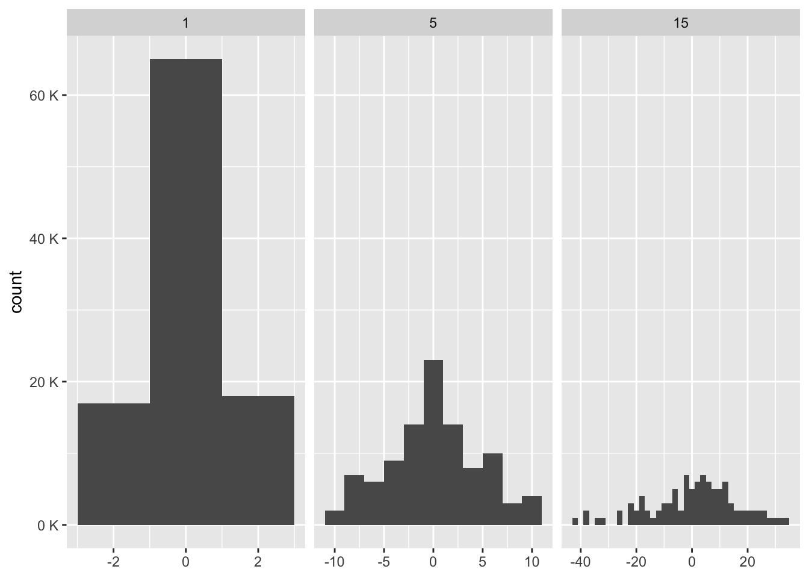

# Function factories


## 10.2 Factory fundamentals {-}

:::question
Let's really solidify this statement in our own words using the `power1` and `square`/`cube` example:

> The enclosing environment of the manufactured function is an execution environment of the function factory.

:::


* enclosing environment (this is the function environment - like `square` and `cube`) [in red]
* execution environment (this is the same environment as above but from the "perspective" of `power1`) [in green]

`square` and `cube` have their own enclosing environments where `x` is different for each function - but their parent, the environment of `power1`, is the same. 

Because `power1` is a function, it has its own execution environment which is usually ephemeral but in this case it is the environment of both `square` and `cube` -- and that is how the manufactured functions have access to `exp`.

## 10.2.3 Forcing evaluation {-}

:::question
I think this force section is trying to convey how we should use force on every argument in the factory's execution environment (here just `exp`) because you want to avoid lazy eval in the manufactured function's enclosing environment (like how we want to `force(exp = 2)` for `square`) but how does it not just become `force(exp = 3)` when we set `x <- 3`?
:::

## WITHOUT FORCE

Without `force`, `exp` doesn't get evaluated when `power` is called. `square` is a promise to create a function to raise its input to the `exp`'th power. Once `square` is called, the promise evaluates, and `square` becomes a function to raise its input to whatever `exp` was that first time `square` was called. That's what makes it dangerous; what `square` does depends on the order in which things are called. Dangers and confusions like this are part of why function factories don't get used that much, despite the fact that they're really quite cool.


```r
suppressMessages(requireNamespace("pryr"))

# make sure this isn't already defined
rm(x)

power2 <- function(exp) {
  cat(paste0("outer execution environment: ", capture.output(environment()), "\n"))
  cat(paste0("outer enclosure: ", capture.output(parent.env(environment())), "\n"))
  cat(paste0("exp promise info: \n", paste0("\t", capture.output(pryr::promise_info(exp)), collapse = "\n")))
  out <- function(x_) {
    cat(paste0("inner execution environment: ", capture.output(environment()), "\n"))
    cat(paste0("inner enclosure: ", capture.output(parent.env(environment())), "\n"))
    cat(paste0("exp promise info: \n", paste0("\t", capture.output(pryr::promise_info(exp)), collapse = "\n")))
    x_ ^ exp
  }
}

square <- power2(x)
```

```
#> outer execution environment: <environment: 0x0000000015812568>
#> outer enclosure: <environment: R_GlobalEnv>
#> exp promise info: 
#>  $code
#>  x
#>  
#>  $env
#>  <environment: R_GlobalEnv>
#>  
#>  $evaled
#>  [1] FALSE
#>  
#>  $value
#>  NULL
#>  
```


```r
square(4)
```

```
#> inner execution environment: <environment: 0x0000000012aee2a8>
#> inner enclosure: <environment: 0x0000000015812568>
#> exp promise info: 
#>  $code
#>  x
#>  
#>  $env
#>  <environment: R_GlobalEnv>
#>  
#>  $evaled
#>  [1] FALSE
#>  
#>  $value
#>  NULL
#>  
#> Error in square(4): object 'x' not found
```

The `exp` promise is looking for `x` in the enclosure of `power2` (global) and can't find it.


```r
x <- 2
square(4)
```

```
#> inner execution environment: <environment: 0x0000000017c915d0>
#> inner enclosure: <environment: 0x0000000015812568>
#> exp promise info: 
#>  $code
#>  x
#>  
#>  $env
#>  <environment: R_GlobalEnv>
#>  
#>  $evaled
#>  [1] FALSE
#>  
#>  $value
#>  NULL
#>  
#> Warning in square(4): restarting interrupted promise evaluation
#> [1] 16
```

Notice, that the `exp` promise still wasn't evaled until the last line, `x_ ^ exp`. The warning is caused by our previous failed attempt to evaluate the promise.


```r
x <- 3
square(5)
```

```
#> inner execution environment: <environment: 0x0000000017d9b270>
#> inner enclosure: <environment: 0x0000000015812568>
#> exp promise info: 
#>  $code
#>  x
#>  
#>  $env
#>  NULL
#>  
#>  $evaled
#>  [1] TRUE
#>  
#>  $value
#>  [1] 2
#>  
#> [1] 25
# exp was evaled already, so no further warning is produced, and our change to x has no effect.
```


```r
rm(x)
square <- power2(x)
```

```
#> outer execution environment: <environment: 0x0000000017e96e78>
#> outer enclosure: <environment: R_GlobalEnv>
#> exp promise info: 
#>  $code
#>  x
#>  
#>  $env
#>  <environment: R_GlobalEnv>
#>  
#>  $evaled
#>  [1] FALSE
#>  
#>  $value
#>  NULL
#>  
```

```r
environment(square)$x <- 2
square(6)
```

```
#> inner execution environment: <environment: 0x0000000017f8a530>
#> inner enclosure: <environment: 0x0000000017e96e78>
#> exp promise info: 
#>  $code
#>  x
#>  
#>  $env
#>  <environment: R_GlobalEnv>
#>  
#>  $evaled
#>  [1] FALSE
#>  
#>  $value
#>  NULL
#>  
#> Error in square(6): object 'x' not found
```

Defining `x` in the function environment doesn't work, because the promise isn't looking for `x` there


```r
power2 <- function(exp) function(x_) x_ ^ exp
# wasn't sure this would work without braces...neat
square <- power2(x)
environment(square)$exp <- 2
square(6)
```

```
[1] 36
```


```r
square <- power2(x)
exp <- 2
square(6)
```

```
Error in square(6): object 'x' not found
```

This doesn't work because we need to define x within `environment(power2)$exp <- 2`

### USING FORCE


```r
rm(exp)
rm(x, power2, square)

power2 <- function(exp) {
  cat(paste0("outer execution environment: ", capture.output(environment()), "\n"))
  cat(paste0("outer enclosure: ", capture.output(parent.env(environment())), "\n"))
  cat(paste0("exp promise info before: \n", paste0("\t", capture.output(pryr::promise_info(exp)), collapse = "\n")))
  force(exp)
  cat(paste0("exp promise info after: \n", paste0("\t", capture.output(pryr::promise_info(exp)), collapse = "\n")))
  out <- function(x_) {
    cat(paste0("inner execution environment: ", capture.output(environment()), "\n"))
    cat(paste0("inner enclosure: ", capture.output(parent.env(environment())), "\n"))
    cat(paste0("exp promise info: \n", paste0("\t", capture.output(pryr::promise_info(exp)), collapse = "\n")))
    x_ ^ exp
  }
}

square <- power2(x)
```

```
#> outer execution environment: <environment: 0x00000000184e4e90>
#> outer enclosure: <environment: R_GlobalEnv>
#> exp promise info before: 
#>  $code
#>  x
#>  
#>  $env
#>  <environment: R_GlobalEnv>
#>  
#>  $evaled
#>  [1] FALSE
#>  
#>  $value
#>  NULL
#>  
#> Error in force(exp): object 'x' not found
# error because x isn't defined
```


```r
x <- 2
square <- power2(x)
```

```
#> outer execution environment: <environment: 0x0000000018cafaf8>
#> outer enclosure: <environment: R_GlobalEnv>
#> exp promise info before: 
#>  $code
#>  x
#>  
#>  $env
#>  <environment: R_GlobalEnv>
#>  
#>  $evaled
#>  [1] FALSE
#>  
#>  $value
#>  NULL
#>  exp promise info after: 
#>  $code
#>  x
#>  
#>  $env
#>  NULL
#>  
#>  $evaled
#>  [1] TRUE
#>  
#>  $value
#>  [1] 2
#>  
```


```r
square(4)
```

```
#> inner execution environment: <environment: 0x0000000018d55b48>
#> inner enclosure: <environment: 0x0000000018cafaf8>
#> exp promise info: 
#>  $code
#>  x
#>  
#>  $env
#>  NULL
#>  
#>  $evaled
#>  [1] TRUE
#>  
#>  $value
#>  [1] 2
#>  
#> [1] 16
```


```r
x <- 3
square(4)
```

## 10.2.5 garbage collection {-}

:::question
Does {factory} handle the issue of temporary objects in the manufactured function not getting garbage collected?
:::

We don't need to use `rm` because the execution environment of the factory remains ephemeral (like any other function call).Rather than returning a function wrapped in the execution environment, it returns a function in the caller environment, allowing normal garbage collection to clean up the temporary objects created during creation of the manufactured functions.

## 10.2.6.2 Exercise {-}

:::question
Base R contains two function factories, `approxfun()` and `ecdf()`. Read their documentation and experiment to figure out what the functions do and what they return.
:::

#### approxfun {-}

`approxfun` creates a function (i.e. mathematical formula) that can be used to find the linear interpolation for any given point, based on the data that was passed into the factory-function at the time it was passed into the function 


```r
dat <- data.frame(x=1:10, y=(1:10)^2)
dat
```

```
##     x   y
## 1   1   1
## 2   2   4
## 3   3   9
## 4   4  16
## 5   5  25
## 6   6  36
## 7   7  49
## 8   8  64
## 9   9  81
## 10 10 100
```

```r
fn <- approxfun(dat$x,dat$y)
fn(4.5)
```

```
## [1] 20.5
```


```r
x <- 1:10
y <- rnorm(10)
plot(x, y, main = "approx(.) and approxfun(.)")
points(approx(x, y), col = 2, pch = "*")
points(approx(x, y, method = "constant"), col = 4, pch = "*")
```


#### ECDF {-}


```r
x <- rnorm(3) # 3 random numbers
Fn <- ecdf(x) # create distribution function for each x
Fn(x) # apply the distribution function to each number
```

```
## [1] 0.3333333 1.0000000 0.6666667
```

## 10.2.6.3 Exercise {-}

:::question
How would we make this function using {factory}


```r
pick <- function(i) {
  force(i)
  function(x) x[[i]]
}
```
:::


```r
library(factory)
pick <- build_factory(
  .factory_fun = function(x) x[[i]],
  i
)
```

## 10.3.1 Labelling {-}

:::question
What is the "factory" happening here? That we're supplying a function as the `label` argument? Is `summarize` also a factory then?
:::

It isn't that the `ggplot2` functions are factories, it's that they're a great place to use factories. They're actually functionals when you pass in a function, since they're using a function as an argument!

## 10.3.4 Exercises {-}

:::question
Can we use code to answer the question: compare and contrast ggplot2::label_bquote() with scales::number_format()
:::

:::TODO

Data:


```r
sd <- c(1, 5, 15)
n <- 100
df <- data.frame(x = rnorm(3 * n, sd = sd), sd = rep(sd, n))
```

Using `label_bquote` using `plotMath` explanation......


```r
ggplot(df, aes(x)) + 
  geom_histogram(binwidth = 2) + 
  facet_wrap(~ sd, scales = "free_x", labeller = label_bquote(alpha ^ .(sd))) + 
  labs(x = NULL) 
```


Using `number_format` will `force` the computation of the parameters, formatting numbers explanation......


```r
ggplot(df, aes(x)) + 
  geom_histogram(binwidth = 2) + 
  facet_wrap(~ sd, scales = "free_x") + 
  labs(x = NULL) +
  scale_y_continuous(
  labels = scales::number_format(scale = 1, suffix = " K") 
)
```


:::

## 10.5 factories and functionals


:::question
Can we {factory} this? 


```r
names <- list(
  square = 2, 
  cube = 3, 
  root = 1/2, 
  cuberoot = 1/3, 
  reciprocal = -1
)
funs <- purrr::map(names, power1)
```
:::


```r
power4 <- build_factory(
  fun = function(x) {
    x ^ exponent
  },
  exponent
)
power_names <- list(
  square = 2,
  cube = 3,
  root = 1/2,
  cuberoot = 1/3,
  reciprocal = -1
)
powers <- purrr::map(power_names, power4)
```
